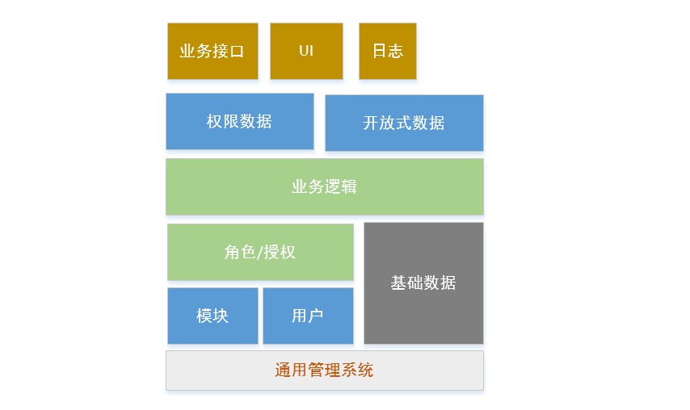

# general System Design Method

> 日期： 2019年8月14日 星期三
>
> 作者：Joshua Conero
>
> 状态：未完成、待实现

*通用系统设计方法*

## 概述

理论化的系统设计方法，主要包含：用户认证、角色和授权、用户基本信息等；其主要实现在数据库的层上。该设计方案测试环境为 WEB，从理论上出发使用去其他包含用户管理的软件系统中；数据库环境为 MySQL 中。

- 相关环境
  - WEB+
  - MySQL
    - 设计工具【PowerDesign】
    - 表字段的备注信息： `{name}; {describe}` 含有多个描述时的处理方案，即系统可以自动根据格式解析字段中文名称。

通用设计结构图：

用户可设计为单独的表，亦可考虑划分为普通用户表和管理员表；此文档倾向于单独的表，设计内容如下：

| Name         | Code        | Data Type   |
| ------------ | ----------- | ----------- |
| 数据id       | id          | int         |
| 账户名称$    | account     | varchar(45) |
| 账户密码     | password    | varchar(50) |
| 状态         | status      | char(2)     |
| 注册时间     | mtime       | datetime    |
| 注册ip       | ip          | varchar(20) |
| 最近登录时间 | last_mtime  | datetime    |
| 累计登录次数 | login_count | int         |

**用户的可追溯性**

​		用户表为最底层的数据表，因为所有的操作都需要记录操作者，区别之一是强关联适用于约束性强的系列表，必须保证数据的可追溯性和真实性，此情景适用于数据业务表。而弱关联适用于底层基础表，即开发上采用理论关联的方法，如统一名称 `muid`。

​		对于十分基础的数据表，或者操作不可见的情形下可以忽略 `muid`, `muid` 默认为 `0` 表示系统操作，类似 `mtime` 为修改的时间。

​		

**数据表设计**

​		主表和明细表，使用 `{name}` 和 `{name}_subset`命名规范。

## 设计

### 多项目

概念类似于微服务，或者当前微信、支付宝等，只需要一次登录并可在进入权限允许模块。数据库层面上可能不同的应用独享不同的数据库，但是用户认证上有使用共享的模块。或者在相同的数据库中，划分为不同的模块；模块概念上通过接口交织。

可考虑系统设计为多项目式，因此该设计或多或少具有中心式的理念。或者以`WEB` 的应用为中心，而外部接口为扩展程序。

### oAuth2

