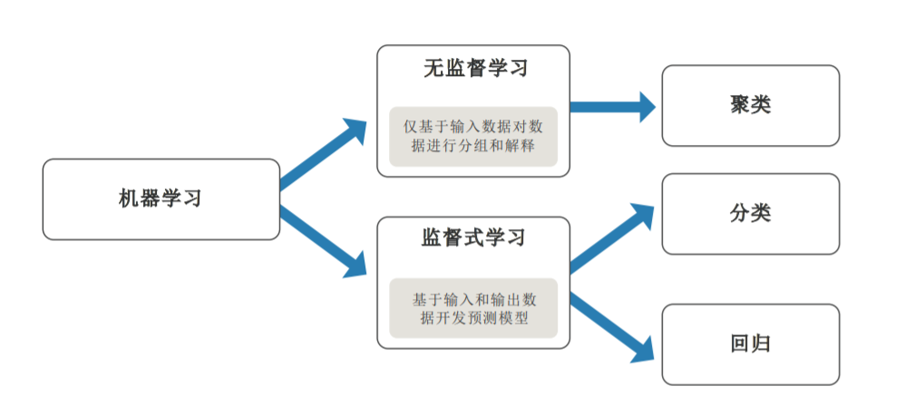

# TensorFlow

> 2018年8月2日 星期四
>
> Joshua Conero


## 简介

TensorFlow™ 是一个开放源代码软件库，用于进行高性能数值计算。借助其灵活的架构，用户可以轻松地将计算工作部署到多种平台（CPU、GPU、TPU）和设备（桌面设备、服务器集群、移动设备、边缘设备等）。TensorFlow™ 最初是由 Google Brain 团队（隶属于 Google 的 AI 部门）中的研究人员和工程师开发的，可为机器学习和深度学习提供强力支持，并且其灵活的数值计算核心广泛应用于许多其他科学领域。 


_Tensor的意思是张量，代表N维数组；Flow的意思是流，代表基于数据流图的计算。把N维数字从流图的一端流动到另一端的过程，就是人工智能神经网络进行分析和处理的过程。_


//@TODO  [《使用 Python 进行深度学习》(中文)](https://github.com/cnbeining/deep-learning-with-python-cn)

//@TODO 阅读 [机器学习速成课程
使用 TensorFlow API](https://developers.google.cn/machine-learning/crash-course/)


### 教程

```powershell
# 安装 tensorflow
pip install tensorflow
```


### 机器学习

*机器学习教计算机执行人和动物与生俱来的活动：<span style="color: red; font-size: 1.2em;">从经验中学习</span>。机器学习算法使用计算方法直接从数据中“学习”信息，而不依赖于预定方程模型。当可用于学习的样本数量增加时，这些算法可自适应提高性能。*

*机器学习算法可从能够带来洞察力的数据中发现自然模式，帮助您更好地制定决策和做出预测。*


*当您遇到涉及大量数据和许多变量的复杂任务或问题，但没有现成的处理公式或方程式时，可以考虑使用机器学习。*


*机器学习采用两种类型的技术：监督式学习和无监督学习。监督式学习根据已知的输入和输出训练模型，让模型能够预测未来输出；无监督学习从输入数据中找出隐藏模式或内在结构。*




#### 监督式学习

*监督式机器学习旨在构建能够根据存在不确定性的证据做出预测的模型。监督式学习算法接受已知的输入数据集和对数据的已知响应（输出），然后训练模型，让模型能够为新输入数据的响应生成合理的预测。*

*监督式学习采用分类和回归技术开发预测模型。*

- 分类技术可预测离散的响应
- 回归技术可预测连续的响应


#### 无监督学习

*无监督学习可发现数据中隐藏的模式或内在结构。这种技术可根据包含未标记响应的输入数据的数据集执行推理。*

*聚类是一种最常用的无监督学习技术。这种技术可通过探索性数据分析发现数据中隐藏的模式或分组。*

*聚类的应用包括基因序列分析、市场调查和对象识别。*


//@TODO  ~conero\docs-era\matlab之于人工智能 **93116v00_machine_learning_section3_ebook_v05**


> *机器学习的挑战*

- 数据会以各种形式和大小出现(如离散之类)
- 预处理数据需要掌握专业的知识和工具
- 找到拟合数据的最佳模型需要时间


> *反复尝试和出错才是机器学习的核心*


## Keras

- [中文文档](https://keras.io/zh/)


## TensorFlow.js

> javascript 版 TensorFlow 库，可用于浏览器(Browser)或NodeJs中

- 网站： [https://js.tensorflow.org/](https://js.tensorflow.org/)


### 起始

1. `npm install @tensorflow/tfjs`   *安装纯 js 版本TensorFlow* (<font style="color:red;">NodeJs/Browser</font>)

2. `npm install @tensorflow/tfjs-node`  *安装原生 C++ 绑定的TensorFlow* (<font style="color:red;">NodeJs</font>)


## 参考

- [https://tensorflow.google.cn/](https://tensorflow.google.cn/)   谷歌开发者
- [Tensorflow 中文网](http://www.tensorfly.cn/)

