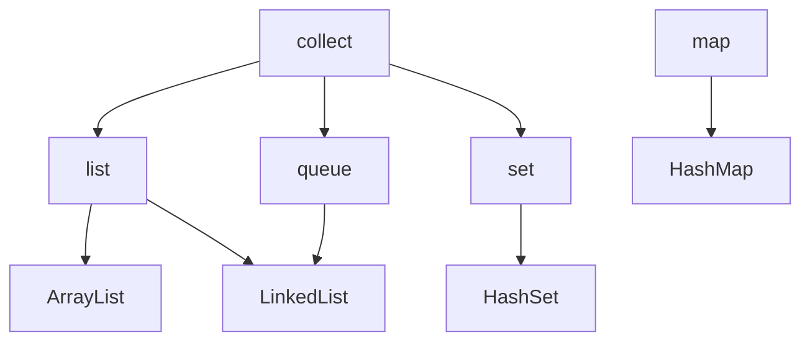

# Java Visual  Machine(JVM)

> 2018年10月16日 星期二

## Java

LTS 版本有 8(14-22/30), 11(18-23/26), 17(21-26/29). 主要发布历史

| 版本      | GA     | 功能维护 | 安全维护 | 备注     |
| --------- | ------ | -------- | -------- | -------- |
| 7**LTS**  | 2011-7 | 2019-7   | 2022-7   |          |
| 8**LTS**  | 2014-3 | 2022-3   | 2030-12  | 应用最广 |
| 9         | 2017-9 | 2018-3   |          |          |
| 10        | 2018-3 | 2018-9   |          |          |
| 11**LTS** | 2018-9 | 2023-9   | 2026-9   |          |
| 12        | 2019-3 | 2019-9   |          |          |
| 13        | 2019-9 | 2020-3   |          |          |
| 14        | 2020-3 | 2020-9   |          |          |
| 15        | 2020-9 | 2021-3   |          |          |
| 16        | 2021-3 | 2022-9   |          |          |
| 17**LTS** | 2021-9 | 2026-9   | 2029-9   |          |
| 18        | 2022-3 | 2022-9   |          |          |
| 19        | 2022-9 | 2023-3   |          |          |
| 20        | 2023-3 | 2023-9   |          |          |
| 21**LTS** | 2023-9 | 2028-9   | 2021-9   |          |


### 基础

主要特性

- 面向对象
- 与平台无关，有底层 jvm支持。java jvm 实现不同平台的支持，与php、js、python等解析器相似
- 支持多进程
- 静态化语言


java版本以 11 版本作为标准。


java 代码编译以及运行

```powershell
# 运行 java 文件
java $file.java

# 将文件编译为 .class 文件（字节码） =》 面向虚拟机
javac $file.java
# 指定文件编码
javac -encoding UTF-8 $file.java

# 指定类所在目录，并执行对应的类
# 执行> ./m1/Simple.class 类
# cp 即 classpath
java -cp ./m1/ Simple
```


#### JDK

- jdk        Java Development Kit，java 开发工具集
- jre        Java Runtime Environment，Java 运行时环境


jdk 下载地址：

- openjdk
  - [adoptium.net](https://adoptium.net/zh-CN/temurin/releases/) 可下载 jre/jdk等


#### 项目结构

- projectTop
  - src/main/java            java 源代码
  - src/main/resource   资源文件
  - /src/main/webapp/WEB-INF        web 项目资源
  - src/test/java              测试源代码
  - src/text/resource     测试资源文件
  - target                        打包输出文件、
  - target/classes          编译出的class文件


#### 起步

- 思想：一切皆是对象。


java 程序无全局变量，其全部由类构成。其应用程序入口为类的 `main` 函数：

源码示例： [Simple.java](https://gitee.com/conero/lang/blob/hi-lang/hi-java/learning/Simple.java)

```java
// SimpleTest.java
class SimpleTest{
    // 静态代码块
    static {
        System.out.println("mian before. ");
    }

    // 程序入口文件
    public static void main(String[] args){
        System.out.println(" >> Hello World!");

        // for 循环
        for(var s: args){
            System.out.println("  ..."+s);
        }
    }
}
```

执行java即可：

```shell
# 执行文件
java .\SimapleTest.java  Hacker-Conero

#输入如下：
#mian before.
# >> Hello World!
#  ...Hacker-Conero

# 编译为 <.class> 文件
javac .\SimapleTest.java

# 指定 .class 所在目录进行 jar 打包
jar -cvf SimpleTest.jar .\SimapleTest.class

# 执行 jar, 需指定类路径
java -cp SimpleTest.jar SimpleTest
```


#### 类型

Object 作为所有java类的根，所有类型同样也都继承于它。

类型分为：基本类型、集合（复合）类型。如下

- 基本类型
  - 字符：char(16)
  - 布尔：boolean(1)
  - 数值(数据容量：`[0, (2^bit)-1]`, 有符号: `[-2^(bit-1), 2^(bit-1)-1]` )
    - 整数(位)：byte(8), short(16), int(32), long(64),
    - 浮点数：float(32), double(64)
- 引用类型：String, list, map
  - 容器（集合）：list,queue,set,map





> 基本类型位数/占用空间

- 整形
  - byte    1字节/8       默认 `= 0`
  - short  2字节/16      `= 0`
  - int       4字节/32      `= 0`
  - long    8字节/64      `= 0L`
- 浮点型
  - float        4字节/32      `= 0.0f`
  - double    8字节/64      `= 0.0d`
- 字符型
  - char        2字节/16
- 布尔
  - boolean 1字节/8


基本类型基于**值**，对象类型基于**引用**；基本类型的取值范围是固定，不会根据计算机的环境而变化。引用类型分为：强引用、软引用、弱引用、虚引用。


> Java中定义的简单类型、占用二进制位数及对应的封装器类。

| 简单类型   | boolean | byte | char      | short | Int     | long | float | double | void |
| ---------- | ------- | ---- | --------- | ----- | ------- | ---- | ----- | ------ | ---- |
| 二进制位数 | 1       | 8    | 16        | 16    | 32      | 64   | 32    | 64     | --   |
| 封装器类   | Boolean | Byte | Character | Short | Integer | Long | Float | Double | Void |


Java基本类型存储在栈中，因此它们的存取速度要快于存储在堆中的对应包装类的实例对象；其数据存储相对简单，运算效率比较高。


##### 常量

源码示例： [VariableConst.java](https://gitee.com/conero/lang/blob/hi-lang/hi-java/learning/VariableConst.java)

```java
class VariableConst{
    public static final double PI = 3.1415926535898;	// 静态类常量
    final int Index = 220303; // 类成员常量
    
    public static void main(String[] args){
        // 局部常量
        final int V16 = 0xff;   // 0x/0X  16 进制
        final byte V8 = 013;     // 8进制
        final long vLong = 12L;

        // 自动推断
        var f16 = 3.51f;
    }
}
```


##### 类型转换

- 自动类型转换：小字节(存储)自动转化为大字节（反之存在值截断，精度丢失）。`byte -> char(short) -> int > long -> float -> double`
- 强制类型转化：大字节强制转化为小字节，存在精度丢失的现象。


#### 语句

主要流程控制，if/switch/while/do-while/for 等，其语法与 js 等对应的语法一致。


#### 对象

java 顶级对象为 `java.lang.Object`.


#### 辅助

##### vm参数

如本机运行时可以限制java vm运行堆栈以减少内存消耗。开发环境下

```shell
# 如设置 vm 的内存大小
java -Xms256m -Xmx512m
#
java -Xms128m -Xmx256m

# 设置文件编码 -Dfile.encoding=utf-8
java -Xms256m -Xmx512m '-Dfile.encoding=utf-8' -jar .\target\pm-admin.jar
```


#### 命令

java 常用命令

```shell
# 执行 jar 包执行 
java -jar ./target/appdemo.jar

# 执行 war 包执行 
java -jar ./target/webdemo.war

# 执行命令并通过 -D$key=$value 设置系统属性
java '-Dserver.port=7480' -jar .\target\cas.war
```


### java 安装

#### linux 安装java


Anolis OS 8.9 安装 java8

```shell
# 使用 dnf 查询java
dnf search java|grep jdk

# 安装openjdk java8
dnf install java-1.8.0-openjdk
```


### 框架及应用

- web框架
  - activej          https://github.com/activej/activej ，简洁快速web开发架构
  - play              https://github.com/playframework/playframework ，java&scala web框架
  - spring-boot https://github.com/spring-projects/spring-boot.git   spring web框
  - solon            https://gitee.com/noear/solon ，国产web全栈框架，与spring boot相比更小
- 数据库
  - MyBatis    https://github.com/mybatis/mybatis-3，[中文文档](https://mybatis.org/mybatis-3/zh_CN/index.html)。流行、轻量级的Java持久层框架，半自动 ORM框架，与spring集成，支持手写SQL语句
  - mybatis-plus  https://gitee.com/baomidou/mybatis-plus，Mybatis 增强工具包 - 只做增强不做改变，简化`CRUD`操作
  - Hibernate   https://github.com/hibernate/hibernate-orm，orm 数据库

- 其他
  - Shiro   https://github.com/apache/shiro， https://shiro.apache.org/ （用户登陆），  Java 安全框架，它专注于简化身份验证、授权、加密和会话管理等安全相关的任务。
  - Sentinel   流量控制框架选型
  - Seata 分布式事务选型
  - Spring Cloud    


spring 框架应用封装

- RuoYi
  - https://gitee.com/y_project/RuoYi-Cloud  微服务式版本
  - https://gitee.com/y_project/RuoYi    单一集中式版本
- ruoyi-vue-pro  
  - https://gitee.com/zhijiantianya/ruoyi-vue-pro    https://doc.iocoder.cn/ 
- RuoYi-Cloud-Plus  https://gitee.com/dromara/RuoYi-Cloud-Plus 微服务管理系统 重写RuoYi-Cloud所有功能 整合，多租户
- jeecg-boot   https://gitee.com/jeecg/jeecg-boot    「企业级低代码平台」前后端分离架构
- 小诺   
  - https://gitee.com/xiaonuobase/snowy-cloud   微服务版本
  - https://gitee.com/xiaonuobase/snowy   单一集中版本


## 应用工具

### Java 构建工具

- [mvnrepository 仓库搜索地址](https://mvnrepository.com/)
- [maven 搜索网站](https://search.maven.org/) ，相同网站 https://central.sonatype.com/


#### Ant, Maven, Gradle

如使用 https://start.spring.io/ 生成不同构建工具的java项目；使用 https://solon.noear.org/start/ 生成 solon 框架项目脚手架。


> Ant - 2000 年/ 格式-XML

*Ant是第一个“现代”构建工具，在很多方面它有些像Make。Ant的主要优点在于对构建过程的控制上*


> Maven - 2004 年/  格式-XML

*目的是解决码农使用Ant所带来的一些问题。*

*Maven具备从网络上自动下载依赖的能力（Ant后来通过Ivy也具备了这个功能），这一点革命性地改变了我们开发软件的方式。*


> Gradle - 2012 年/ DSL

*Gradle结合了前两者的优点，在此基础之上做了很多改进。它具有Ant的强大和灵活，又有Maven的生命周期管理且易于使用。*


#### Maven

github 地址： https://github.com/apache/maven

maven 仓库有：本地-local、中央-center、远程-remote，拉取包顺序LCR。


本地仓库默认位置：*${user.home}/.m2/repository*，也可通过 setting.xml 的 *localRepository* 进行修改。

将jar安装到本地仓库：

```powershell
# 实际测试，执行命令后jar未真正转移
mvn install:install-file `
    -Dfile=E:/conero/x/Dm8JdbcDriver230624-dm8.jar `
    -DgroupId=com.dm `
    -DartifactId=Dm8JdbcDriver230624 `
    -version=dm8 `
    -Dpackaging=jar
```


一个依赖申明含 groupId 组织标识（包名），artifactId 项目名称，version 版本号。如包*v4.4.0 版本 java-jwt* 依赖：

```xml
<dependencies>
    <dependency>
        <groupId>com.auth0</groupId>
        <artifactId>java-jwt</artifactId>
        <version>4.4.0</version>
    </dependency>
</dependencies>
```


生命周期 lifecycle

- clean             项目编译清除，删除target目录
- validate        
- compile        项目编译，将java源代码编译成class字节码文件
- test                项目测试用例运行
- package        项目打包，生成 jar 或 war包
- verify             对测试结果等进行测试
- install            （Maven特定的概念）将打包得到的文件复制到“仓库”中的指定位置
- site
- deploy            将动态Web工程生成的war包复制到Servlet容器下，使其可以运行


maven 命令

```powershell
# 查看版本信息
mvn -v

# 当前配置信息查看
mvn 'help:effective-settings'

# 生成项目骨架类似 - [npm init]
mvn 'archetype:generate'

# 执行集成测试、验证包的完整性和质量
mvn verify

# 查看依赖树
mvn dependency:tree

# 编译项目
mvn compile

# 项目打包
mvn package

# mvn clean xxx  执行清理后再在执行 xxx
# 表示先运行清理之后运行编译，会将代码编译到target文件夹中。
mvn clean compile
mvn clean test
# 运行清理和打包
mvn clean package
# 加入 -e 查看详细错误信息；-X 查看调试信息
mvn clean package -e
# 运行清理和发布（发布到私服上面）
mvn clean deploy
# 运行清理和安装，会将打好的包安装到本地仓库中，以便其他的项目可以调用。
# 多级项下指定编译子项目，"zhuo-upms-server",并同步编译所需依赖
mvn clean install -pl ':zhuo-upms-server' -am '-Dmaven.test.skip=true'
```


mvn 本地仓库地址配置

```xml
<localRepository>E:/AppData/.m2/repository</localRepository>
```


##### pom.xml

pom （Project Object Model，项目对象模型）是 Maven 的基本组件，它是以 xml 文件的形式存放在项目的根目录下，名称为 pom.xml。


基本配置信息，详细实例如 [pom.xml](./data/jvm/pom.xml)

```xml
<project xmlns="http://maven.apache.org/POM/4.0.0"
  xmlns:xsi="http://www.w3.org/2001/XMLSchema-instance" xsi:schemaLocation="http://maven.apache.org/POM/4.0.0 https://maven.apache.org/xsd/maven-4.0.0.xsd">
  <modelVersion>4.0.0</modelVersion>

  <!-- The Basics -->
  <groupId>项目组名</groupId>
  <artifactId>项目名称</artifactId>
  <version>项目当前版本号</version>
  <packaging>项目产生的构件类型，如 jar/war/pom之类</packaging>
  <!-- 项目依赖清单 -->
  <dependencies>
    <dependency>
      <groupId>依赖项目名称</groupId>
      <artifactId>依赖项目项目</artifactId>
      <version>依赖项目版本号</version>
      <type>依赖类型，默认：jar，其他支持war，ejb-client和test-jar</type>
      <scope>
      使用范围如：compile（默认）、provide、runtime、test、system。compile 编译时使用，provide 同于编译，但支持jdk或者容器提供，类似于classpath，runtime 运行时使用，test 测试时使用，system 需要外在提供相应的元素通过systemPath来取得。
      </scope>
      <!-- 可选依赖，用于阻断依赖的传递性。如果在项目B中把C依赖声明为可选，那么依赖B的项目中无法使用C依赖 -->
      <optional>true</optional>
      <!-- scope=system 时，指定 systemPath -->
      <systemPath>${project.basedir}/lib/xxxxx.jar</systemPath>
    </dependency>
  </dependencies>
  <!--父级项目信息-->
  <parent>...</parent>
  <!--项目分发信息，在执行mvn deploy后表示要发布的位置。用于把网站部署到远程服务器或者把构件部署到远程仓库 -->
  <dependencyManagement>...</dependencyManagement>
  <modules>
    <!-- 包含的子模块 -->
    <module>child_pkg_name</module>
  </modules>
  <properties>...</properties>

  <!-- Build Settings -->
  <build>...</build>
  <reporting>
    不赞成使用. 现在Maven忽略该元素
  </reporting>

  <!-- More Project Information -->
  <name>...</name>
  <description>...</description>
  <url>...</url>
  <inceptionYear>...</inceptionYear>
  <licenses>...</licenses>
  <organization>...</organization>
  <developers>...</developers>
  <contributors>...</contributors>

  <!-- Environment Settings -->
  <issueManagement>...</issueManagement>
  <ciManagement>...</ciManagement>
  <mailingLists>...</mailingLists>
  <scm>...</scm>
  <prerequisites>...</prerequisites>
  <repositories>...</repositories>
  <pluginRepositories>...</pluginRepositories>
  <distributionManagement>...</distributionManagement>
  <profiles>...</profiles>
</project>
```


**Maven 相关变量如内置变量等**

```shell
1. Maven内置常量:
${project.basedir}: 项目的根目录。
${project.build.directory}: 构建输出目录，通常为target。
${project.version}: 项目的版本号。
${project.name}: 项目的名称。
${project.groupId}: 项目的groupId。
${project.artifactId}: 项目的artifactId。
${project.parent.version}: 如果项目有父项目，这是父项目的版本号。
${basedir}: 这是${project.basedir}的同义词。
${user.home}: 用户的主目录。
${java.home}: Java安装目录。
${java.class.version}: 当前JDK的class文件格式版本。

2. 环境变量:
Maven可以引用操作系统的环境变量，例如${env.PATH}或${env.HOME}。在Windows中，你也可以引用${env.USERPROFILE}。

3. Java系统属性:
Maven可以引用任何Java系统属性，例如${java.version}或${file.encoding}。这些属性可以通过-D选项在Maven命令行中设置，例如mvn clean install -Dfile.encoding=UTF-8。
```


##### 国内镜像

- 阿里镜像     https://developer.aliyun.com/mvn/guide


#### Gradle

官网地址 https://gradle.org/ ，常用在Android app上。

使用基于Groovy或Kotlin的构建脚本，这种脚本语言的特性让构建脚本更像是程序代码，提供了更高的灵活性和可编程性，但也可能对初学者来说门槛较高。

基于有向无环图（DAG）的构建逻辑，允许定义任务间的依赖关系，提供更高的并行性和可优化性，通常在大型项目中性能更优，支持并行构建和缓存机制。


下载镜像：

- 官网地址：https://services.gradle.org/distributions/
- 腾讯镜像 Gradle下载地址：https://mirrors.cloud.tencent.com/gradle/
- 阿里云镜像 Gradle下载地址：https://mirrors.aliyun.com/macports/distfiles/gradle/


> 使用镜像下载

```shell
#
# 如文件 config.properties 配置文件替换下载文件镜像
#distributionUrl=https\://services.gradle.org/distributions/gradle-8.5-bin.zip
distributionUrl=https\://mirrors.aliyun.com/macports/distfiles/gradle/gradle-8.5-bin.zip
```


**特性**：支持增量构建、构建缓存、gradle 守护进程。


常用命令

```shell
# 版本信息查看
gradle -v

# 清空所有编译、打包生成的文件(即：清空build目录) 
gradle clean

# 构建
gradle build


# 跳过测试构建
gradle build -x test
```


##### 依赖文件

Maven 项目的依赖配置文件是 pom.xml，而 Gradle 项目的依赖文件是 settings.gradle 和 build.gradle。

- build.gradle

- settings.gradle

- kotlin 版本

  - build.gradle.kts
  - settings.gradle.kts

  

settings.gradle 文件是 gradle 项目的总体配置文件，一般会把子项目中通用的一些配置放在这个文件中，有点类似于 maven 的 parent pom 文件；而 build.gradle 文件则是针对单个项目的具体配置，我们主要使用的是 build.gradle 文件。


如[spring start](https://start.spring.io/) 生成的初始代码。


使用Gradle时，无论是Groovy还是Kotlin的构建脚本，都不需要用户单独安装这些语言的环境。

###### Gradle - Groovy

**build.gradle**

```groovy
plugins {
	id 'java'
	id 'org.springframework.boot' version '3.3.0'
	id 'io.spring.dependency-management' version '1.1.5'
}

// 项目组名称
group = 'com.example'
// 当前项目版本号
version = '0.0.1-SNAPSHOT'

// java 版本信息
java {
	sourceCompatibility = '17'
}

// 仓库地址
repositories {
    // 配置阿里进行
    mavenLocal()
    maven {
        url 'https://maven.aliyun.com/repository/public'
    }
	mavenCentral()
}

// 项目依赖
dependencies {
	implementation 'org.springframework.boot:spring-boot-starter'
    // https://mvnrepository.com/artifact/com.alibaba.fastjson2/fastjson2
	implementation group: 'com.alibaba.fastjson2', name: 'fastjson2', version: '2.0.50'
    
	testImplementation 'org.springframework.boot:spring-boot-starter-test'
	testRuntimeOnly 'org.junit.platform:junit-platform-launcher'
}

tasks.named('test') {
	useJUnitPlatform()
}
```


**settings.gradle**

```groovy
// 根项目目录
rootProject.name = 'demo'
```


###### Gradle - Kotlin

**build.gradle.kts**

```kotlin
// build.gradle.kts
plugins {
	java
	id("org.springframework.boot") version "3.3.0"
	id("io.spring.dependency-management") version "1.1.5"
}

// 项目分组信息
group = "com.example"
version = "0.0.1-SNAPSHOT"

// java 版本信息
java {
	sourceCompatibility = JavaVersion.VERSION_17
}

// 仓库地址
repositories {
    // 配置阿里镜像
    maven {
        url = uri("https://maven.aliyun.com/repository/public")
    }
    
	mavenCentral()
}

// 项目依赖
dependencies {
	implementation("org.springframework.boot:spring-boot-starter")
    // https://mvnrepository.com/artifact/com.alibaba.fastjson2/fastjson2
	implementation("com.alibaba.fastjson2:fastjson2:2.0.50")
	testImplementation("org.springframework.boot:spring-boot-starter-test")
	testRuntimeOnly("org.junit.platform:junit-platform-launcher")
}

tasks.withType<Test> {
	useJUnitPlatform()
}
```


**settings.gradle.kts**

```kotlin
rootProject.name = "demo"
```


### IntelliJ IDEA

> 2024年11月5日

适合idea 2023.1.1 的java项目热编译，参考：https://www.cnblogs.com/taoA/p/18223076


## 附录

### 参考

- [java 基本类型](https://www.cnblogs.com/doit8791/archive/2012/05/25/2517448.html)
- [廖雪峰java教程](https://www.liaoxuefeng.com/wiki/1252599548343744)
- [java四种引用类型](https://www.cnblogs.com/liyutian/p/9690974.html)
- [oracle 公布的java语言标准](https://docs.oracle.com/javase/specs/)
- maven 项目
  - [maven 项目官网](https://maven.apache.org)
    - [pom 文档](https://maven.apache.org/pom.html)
    - [Maven核心配置文件（Pom.xml）详细](https://blog.csdn.net/qq_45305209/article/details/130361246)
  - [从青铜到王者，Maven全了解](https://baijiahao.baidu.com/s?id=1700978540465382123)
- [Java基础常见面试题总结(上)](https://javaguide.cn/java/basis/java-basic-questions-01.html)
