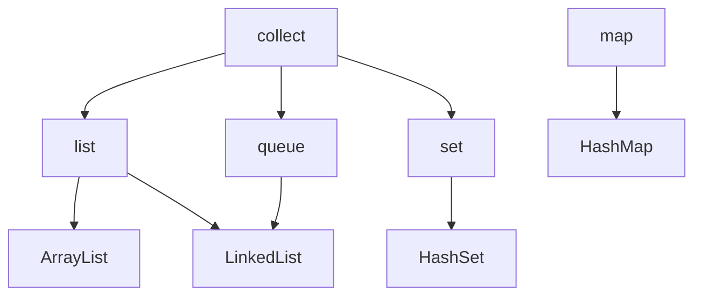

# Java Visual  Machine(JVM)

> 2018年10月16日 星期二

## Java

LTS 版本有 8(14-22/30), 11(18-23/26), 17(21-26/29). 主要发布历史

| 版本      | GA     | 功能维护 | 安全维护 | 备注     |
| --------- | ------ | -------- | -------- | -------- |
| 7**LTS**  | 2011-7 | 2019-7   | 2022-7   |          |
| 8**LTS**  | 2014-3 | 2022-3   | 2030-12  | 应用最广 |
| 9         | 2017-9 | 2018-3   |          |          |
| 10        | 2018-3 | 2018-9   |          |          |
| 11**LTS** | 2018-9 | 2023-9   | 2026-9   |          |
| 12        | 2019-3 | 2019-9   |          |          |
| 13        | 2019-9 | 2020-3   |          |          |
| 14        | 2020-3 | 2020-9   |          |          |
| 15        | 2020-9 | 2021-3   |          |          |
| 16        | 2021-3 | 2022-9   |          |          |
| 17**LTS** | 2021-9 | 2026-9   | 2029-9   |          |
| 18        | 2022-3 | 2022-9   |          |          |
| 19        | 2022-9 | 2023-3   |          |          |
| 20        | 2023-3 | 2023-9   |          |          |
| 21**LTS** | 2023-9 | 2028-9   | 2021-9   |          |


### 基础

主要特性

- 面向对象
- 与平台无关，有底层 jvm支持。java jvm 实现不同平台的支持，与php、js、python等解析器相似
- 支持多进程
- 静态化语言


java版本以 11 版本作为标准。


java 代码编译以及运行

```powershell
# 运行 java 文件
java $file.java

# 将文件编译为 .class 文件（字节码） =》 面向虚拟机
javac $file.java
# 指定文件编码
javac -encoding UTF-8 $file.java

# 指定类所在目录，并执行对应的类
# 执行> ./m1/Simple.class 类
# cp 即 classpath
java -cp ./m1/ Simple
```


#### JDK

- jdk        Java Development Kit，java 开发工具集
- jre        Java Runtime Environment，Java 运行时环境


#### 起步

- 思想：一切皆是对象。


java 程序无全局变量，其全部由类构成。其应用程序入口为类的 `main` 函数：

源码示例： [Simple.java](https://gitee.com/conero/lang/blob/hi-lang/hi-java/learning/Simple.java)

```java
// SimpleTest.java
class SimpleTest{
    // 静态代码块
    static {
        System.out.println("mian before. ");
    }

    // 程序入口文件
    public static void main(String[] args){
        System.out.println(" >> Hello World!");

        // for 循环
        for(var s: args){
            System.out.println("  ..."+s);
        }
    }
}
```

执行java即可：

```shell
# 执行文件
java .\SimapleTest.java  Hacker-Conero

#输入如下：
#mian before.
# >> Hello World!
#  ...Hacker-Conero

# 编译为 <.class> 文件
javac .\SimapleTest.java

# 指定 .class 所在目录进行 jar 打包
jar -cvf SimpleTest.jar .\SimapleTest.class

# 执行 jar, 需指定类路径
java -cp SimpleTest.jar SimpleTest
```


#### 类型

类型分为：基本类型、集合（复合）类型。如下

- 基本类型
  - 字符：char(16)
  - 布尔：boolean(1)
  - 数值(数据容量：`[0, (2^bit)-1]`, 有符号: `[-2^(bit-1), 2^(bit-1)-1]` )
    - 整数(位)：byte(8), short(16), int(32), long(64),
    - 浮点数：float(32), double(64)
- 引用类型：String, list, map
  - 容器（集合）：list,queue,set,map





> 基本类型位数/占用空间

- 整形
  - byte    1字节/8       默认 `= 0`
  - short  2字节/16      `= 0`
  - int       4字节/32      `= 0`
  - long    8字节/64      `= 0L`
- 浮点型
  - float        4字节/32      `= 0.0f`
  - double    8字节/64      `= 0.0d`
- 字符型
  - char        2字节/16
- 布尔
  - boolean 1字节/8


基本类型基于**值**，对象类型基于**引用**；基本类型的取值范围是固定，不会根据计算机的环境而变化。引用类型分为：强引用、软引用、弱引用、虚引用。


> Java中定义的简单类型、占用二进制位数及对应的封装器类。

| 简单类型   | boolean | byte | char      | short | Int     | long | float | double | void |
| ---------- | ------- | ---- | --------- | ----- | ------- | ---- | ----- | ------ | ---- |
| 二进制位数 | 1       | 8    | 16        | 16    | 32      | 64   | 32    | 64     | --   |
| 封装器类   | Boolean | Byte | Character | Short | Integer | Long | Float | Double | Void |


Java基本类型存储在栈中，因此它们的存取速度要快于存储在堆中的对应包装类的实例对象；其数据存储相对简单，运算效率比较高。


##### 常量

源码示例： [VariableConst.java](https://gitee.com/conero/lang/blob/hi-lang/hi-java/learning/VariableConst.java)

```java
class VariableConst{
    public static final double PI = 3.1415926535898;	// 静态类常量
    final int Index = 220303; // 类成员常量
    
    public static void main(String[] args){
        // 局部常量
        final int V16 = 0xff;   // 0x/0X  16 进制
        final byte V8 = 013;     // 8进制
        final long vLong = 12L;

        // 自动推断
        var f16 = 3.51f;
    }
}
```


##### 类型转换

- 自动类型转换：小字节(存储)自动转化为大字节（反之存在值截断，精度丢失）。`byte -> char(short) -> int > long -> float -> double`
- 强制类型转化：大字节强制转化为小字节，存在精度丢失的现象。


#### 语句

主要流程控制，if/switch/while/do-while/for 等，其语法与 js 等对应的语法一致。


#### 对象

java 顶级对象为 `java.lang.Object`.


### 框架及应用

- web框架
  - activej          https://github.com/activej/activej ，简洁快速web开发架构
  - play              https://github.com/playframework/playframework ，java&scala web框架
  - spring-boot https://github.com/spring-projects/spring-boot.git   spring web框
  - solon            https://gitee.com/noear/solon ，国产web全栈框架，与spring boot相比更小


## 应用工具

### Java 构建工具

#### Ant, Maven, Gradle

> Ant - 2000 年/ 格式-XML

*Ant是第一个“现代”构建工具，在很多方面它有些像Make。Ant的主要优点在于对构建过程的控制上*


> Maven - 2004 年/  格式-XML

*目的是解决码农使用Ant所带来的一些问题。*

*Maven具备从网络上自动下载依赖的能力（Ant后来通过Ivy也具备了这个功能），这一点革命性地改变了我们开发软件的方式。*


> Gradle - 2012 年/ DSL

*Gradle结合了前两者的优点，在此基础之上做了很多改进。它具有Ant的强大和灵活，又有Maven的生命周期管理且易于使用。*


#### Maven

maven 仓库有：本地-local、中央-center、远程-remote，拉取包顺序LCR。

一个依赖申明含 groupId 组织标识（包名），artifactId 项目名称，version 版本号。如包*v4.4.0 版本 java-jwt* 依赖：

```xml
<dependencies>
    <dependency>
        <groupId>com.auth0</groupId>
        <artifactId>java-jwt</artifactId>
        <version>4.4.0</version>
    </dependency>
</dependencies>
```


生命周期 lifecycle

- clean             项目编译清除
- validate        
- compile        项目编译，将java源代码编译成class字节码文件
- test                项目测试用例运行
- package        项目打包，生成 jar 或 war包
- verify             对测试结果等进行测试
- install            （Maven特定的概念）将打包得到的文件复制到“仓库”中的指定位置
- site
- deploy            将动态Web工程生成的war包复制到Servlet容器下，使其可以运行


maven 命令

```powershell
# 查看版本信息
mvn -v

# 查看依赖树
mvn dependency:tree

# 编译项目
mvn compile

# 项目打包
mvn package

# 多级项下指定编译子项目，"zhuo-upms-server",并同步编译所需依赖
mvn clean install -pl ':zhuo-upms-server' -am '-Dmaven.test.skip=true'
```


## 附录

### 参考

- [java 基本类型](https://www.cnblogs.com/doit8791/archive/2012/05/25/2517448.html)
- [廖雪峰java教程](https://www.liaoxuefeng.com/wiki/1252599548343744)
- [java四种引用类型](https://www.cnblogs.com/liyutian/p/9690974.html)
- [oracle 公布的java语言标准](https://docs.oracle.com/javase/specs/)
- maven 项目
  - [maven 项目官网](https://maven.apache.org)
  - [从青铜到王者，Maven全了解](https://baijiahao.baidu.com/s?id=1700978540465382123)
- [Java基础常见面试题总结(上)](https://javaguide.cn/java/basis/java-basic-questions-01.html)
