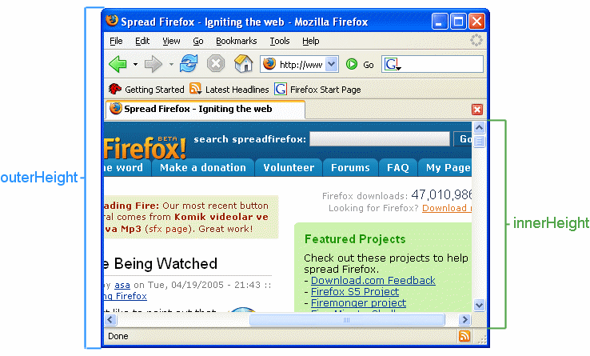

# JS
- 2017年11月8日 星期三

## 基础

### 进制转换

```javascript
// x进制  => 10 进制
// parseInt(数字, 进制(2/36));	
parseInt(1101, 2);		// x2 => 10		13
parseInt(1101, 8);		// x8 => 10		5777
parseInt(1101, 36);		// x16 => 10		47953


// 10 => x 进制
// 使用 number 对象，toString 进行进制切换
var t = 147852.4755;
console.log(t.toString(16));
```


### async/await

*ES7(ES2017) 中提出的前端异步特性。*

*async顾名思义是“异步”的意思，async用于声明一个函数是异步的。而await从字面意思上是“等待”的意思，就是用于等待异步完成。并且await只能在async函数中使用。*


*`await`  操作符用于等待一个 `Promise`对象。它只能在异步函数  `async function` 中使用。*


## 工具

### npm

**主要命令介绍**

[参照](https://docs.npmjs.com/cli-documentation/cli)

```powershell
# 根据默认初始化库
npm init -y
# 交互式初始化
npm init

# npm install <tarball url>
# https://github.com/<user>/<project>.git#<branch>
#   [options]
#	--save-dev     已开发的模式保存

# 查看全局安装的 npm 包
npm list -g --depth 0
```


### [jest](https://jestjs.io)

*js 测试框架*

> https://github.com/facebook/jest


## Browser

- 创立时间   _**1990**_
- 创始人    _**蒂姆·伯纳斯-李**_


### MouseEvent

*坐标点：* 


```js
clientX, clientY    // 鼠标指针向对于浏览器页面（当前窗口）的坐标
					// 客户端区域


layerX, layerY		//

movementX, movementY

offsetX,offsetY

pageX, pageY		// 文档坐标而非窗口坐标,这2个属性不是标准属性，但得到了广泛支持。
					// IE事件中没有这2个属性

x, y
    
screenX, screenY	//	screen 屏幕坐标系
```


### clientWidth/clientHeight

> `Element` 元素


### window

```javascript
// 屏幕可到达高度
网页可见区域宽：document.body.clientWidth 
网页可见区域高：document.body.clientHeight 
网页可见区域宽：document.body.offsetWidth (包括边线的宽) 
网页可见区域高：document.body.offsetHeight (包括边线的宽) 
网页正文全文宽：document.body.scrollWidth 
网页正文全文高：document.body.scrollHeight 
网页被卷去的高：document.body.scrollTop 
网页被卷去的左：document.body.scrollLeft 
网页正文部分上：window.screenTop 
网页正文部分左：window.screenLeft 
屏幕分辨率的高：window.screen.height 
屏幕分辨率的宽：window.screen.width 
屏幕可用工作区高度：window.screen.availHeight 
屏幕可用工作区宽度：window.screen.availWidth 
```


> outerHeight / innerHeight




## MVVM


## jQuery


## ReactJs

*React is a declarative, efficient, and flexible JavaScript library for building user interfaces. It lets you compose complex UIs from small and isolated pieces of code called “components”.*


- A JavaScript library for building user interfaces (*用于构建用户界面的JavaScript库*)
    - facebook
- jsx   javascript xml， XML-like syntax called JSX 
- 自定义类型，必须以大写开头，否则将视作 html 文档格式
- React.Component 组件
    - this.props 传入的属性值 如： <React.Component title="85"> => this.props.title == '85'
    - this.props 属性，通过 ``render()`` 函数渲染
    - this.state 状态值
      - this.setstate 设置状态值


### Component 组件

*组件接受称为属性(`props` properties 的简称)的参数，通过方法`render` 渲染为一个有层次化(结构)的视图。*

- 函数式 ``const element = () => <h1>标题</h1>``

  ```jsx
  function Welcome(props) {
    return <h1>Hello, {props.name}</h1>;
  }
  const element = <Welcome name="Sara" />;
  ReactDOM.render(
    element,
    document.getElementById('root')
  );
  ```

- 类式   ``extends React.Component``


## AngularJS


## VueJs

- 20170717
>
>   author: Evan You
>   the progressive javascript framework (渐进式javascript框架)

### 简介

    Vue 采用自底向上增量开发的设计
    -> 视图层
    -> 能为复杂的单页应用程序提供驱动
    -> 虚拟 DOM 原理
    -> 类 MVVM 框架
    -> 20kB min+gzip 运行大小

### 笔记    
- 字符串模板语法， 支持： mustache 模板语法
- HTML 原始属性，通常以 ***v-*** 打头，也有相应的简写方法
    - v-bind    数据绑定
        - v-bind:id = "idx"     => :id = "idx"
        - v-bind:href = "xf"    => :href = "xf"
    - v-html    原始 HTML
    - v-on      事件绑定
        - v-on:click    => @click
    - v-model   表单语法, 表单控件元素上创建双向数据绑定
    - v-if/v-for 条件等语句判断    
- template 组件，通过浏览器编译 js, ***.vue*** 视图文件
    - 组件组合:     prop 向下传递，事件向上传递
    - 注册全局组件:   Vue.component(tagName, options)
    - 局部组件:
```javascript
    var Child = {
        template: '<div>A custom component!</div>'
    }
    new Vue({
    // ...
    components: {
        // <my-component> 将只在父组件模板中可用
        'my-component': Child
        }
    })
```
- vue 实例生成周期
    - 

### 组件组合
- 在 Vue 中，父子组件的关系可以总结为 *** prop 向下传递，事件向上传递 ***。父组件通过 prop 给子组件下发数据，子组件通过事件给父组件发送消息。
    - 


# _WebGL<small>(Web Graphics Library)</small>_

常见图形化库：

- [three.js](https://threejs.org/)
- [p5.js](https://p5js.org/)
- [D3.js](https://d3js.org/)


## SVG

> *Scalable Vector Graphics*

*基于XML的矢量图*

- `<svg>`     *画布*
- **viewBox**    画布可视范围


## Canvas

> *画布，位图*


### ThreeJs

> - [官网资源](https://threejs.org)
>
> - [mrdoob/*three.js*](https://github.com/mrdoob/three.js)


*为了真正能够让你的场景借助 three.js 来进行显示，我们需要以下几个对象：场景、相机和渲染器，这样我们就能透过摄像机渲染出场景。*


*Threejs使用的是右手坐标系，这源于opengl默认情况下，也是右手坐标系。*


#### 名词解释

- *FOV - 视野角度*       就是无论在什么时候，你所能在显示器上看到的场景的范围，它的值是一个角度。
- *aspect ratio - 长宽比*     也就是你用一个物体的宽除以它的高的比值。比如说，当你在一个宽屏电视上播放老电影时，可以看到图像仿佛是被压扁的
- vertice 顶点
- face       面
- mesh     网格
- scene     场景
- animate   动画渲染
- ployfills   填充物


> 几何体

- **BoxGeometry**			立方体几何
- **BoxBufferGeometry**	    立方缓冲几何体
- **CircleBufferGeometry**	圆形缓冲几何体
- **CircleGeometry**		圆形几何体
- **ConeBufferGeometry**	圆锥缓冲几何体
- **ConeGeometry**			圆锥几何体
- **CylinderGeometry**		圆柱几何体
- **DodecahedronGeometry**	十二面几何体
- **EdgesGeometry**			边缘几何体
- **ExtrudeGeometry**		挤压几何体
- **IcosahedronGeometry**	二十面几何体
- **LatheGeometry**			车削几何体
- **OctahedronGeometry**	八面几何体
- **ParametricGeometry**	参数化几何体
- **PlaneGeometry**			平面几何体
- **RingGeometry**			圆环几何体
- **ShapeGeometry**			形状几何体
- **SphereGeometry**		球几何体
- **TetrahedronGeometry**	四面几何体
- **TextGeometry**			文本几何体
- **TorusGeometry**			圆环几何体
- **TorusKnotGeometry**		圆环扭结几何体
- **TubeGeometry**			管道几何体
- **WireframeGeometry**		网格几何体


> 3D 模型格式

- gltf    Graphics Language Transmission Format（图形语言传输格式）


# NodeJs


## 收藏

- [*node-ffi nodejs 调用 dll库*](https://www.npmjs.com/package/ffi)

