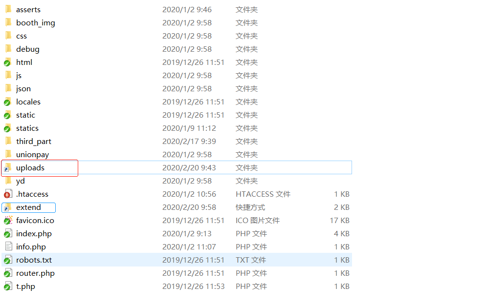
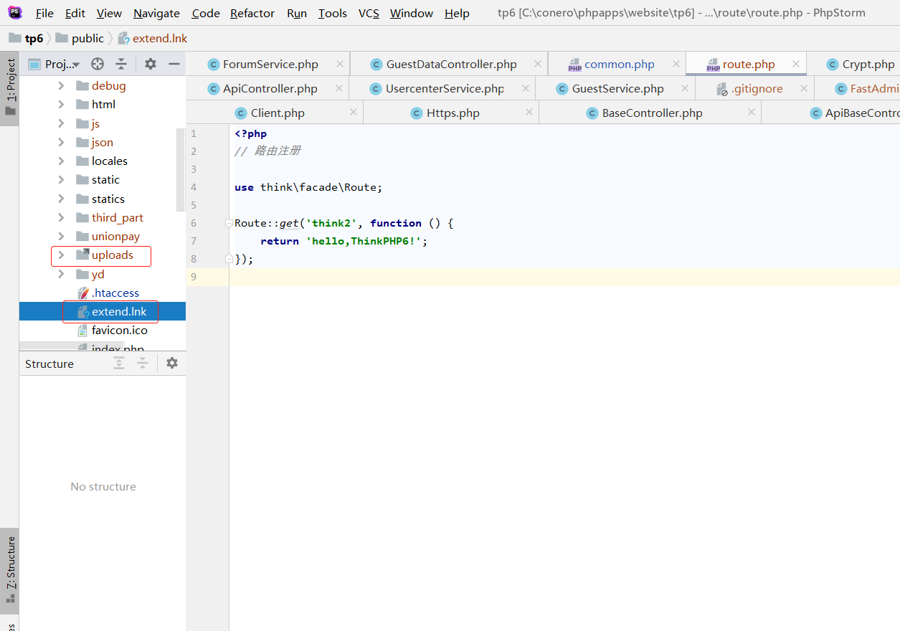

# 解决方案

> 2019年4月10日 星期三


## Windows OS

### 文件操作提示“文件或文件夹正在使用”的错误

参考： https://zhidao.baidu.com/question/1500683749523466899.html


**查看或解除** *依次进入【任务管理器(K) 】》【打开资源监视器】》【CPU、关联的句柄】 。在“关联的句柄”中搜索找出并继续操作即可*


### 设备相连

*两台设备相连可通过`Internet` 、`内部局域网` 、`网线直连`等方式实现。*

**网线直连**   需要手动配置IP地址后接口连接，执行 `mstsc` (*Microsoft terminal services client*) 命令接口打开远程连接端口。


### FTP

*Windows 下可以使用 `文件资源管理器`，来读取资源以及基本的操作。*


### 软链接与Linux `ln -s` 类似

*使用 windows 系统下的 `linkd` 进行设置，其形式与快捷方式一样。只是前者可实现程序正常读取，与 linux下的`ln -s` 一致。*


如果命令不存在，需要下载windows 资源工具集(Resource Kit Tools)，安装即可，如目录 [Windows Server 2003 Resource Kit Tools](https://www.microsoft.com/en-us/download/details.aspx?id=17657) 。

```powershell
# 此方法编写的软链接可供程序使用
linkd <Source> <Destination>
# 如下图示意图，再当前目录下生成“../uploads”的软链接地址
linkd uploads-rename ../uploads

# 手动创建的快捷文件无法被访问（程序）
```







## 内网穿透，外部网络访问本地网站

### natapp

> *使用简单，外网访问本地网页(web) 的解决方案。*
>
> [详见官网](https://natapp.cn/)


### ngrok

> 反向代理，[网站](https://ngrok.com/)


## 正则表达式

```javascript
/^\s*\n/				// 空行
```


## 微信

> *微信内部调试地址*

- <http://debugtbs.qq.com/>
- http://debugx5.qq.com/


## markdown

### markdown 中的流程图

*[mermaid](https://github.com/knsv/mermaid)*  可以实现 markdown 中的流程图


## 跨平台方案

### Windows&Linux

#### 脚本语言

*通常情况下，脚本语言都具有跨平台性。处理语言上的区别，如python2 与 python3.*


#### 编译型

*由于部分网络安全机制的限制，可能系统无法联网。因此在离线情况下，还有**脚本程序**如 python 版本不兼容的情况；或者考虑到软件的性能，而采用**编译型**语言。可选择方案如下：*

- *jvm 系列*            通过JVM上的语言，将程序编译为二进制的**jar**，**war**包实现
- *golang*               通过go编译器，在Windows下交叉编译程序实现的方法


## 网站资源

### google.cn 系列网站

- [谷歌开发中心]()
- [golang](https://golang.google.cn/)
- [TensorFlow](https://tensorflow.google.cn)


#### 谷歌开发中心


https://developers.google.cn/


#### golang


### 国内镜像

#### 大学

- [清华](https://mirrors.tuna.tsinghua.edu.cn/)
- [中国科技大学](http://mirrors.ustc.edu.cn/)
- [北理工](http://mirror.bit.edu.cn/)


#### 企业

- [搜狐](http://mirrors.sohu.com/)
- [163](http://mirrors.163.com/)
- [阿里云](https://opsx.alibaba.com/mirror)
- [腾讯](https://mirrors.tencent.com/)


#### 具体应用

- [tortoisesvn](https://mirrors.tuna.tsinghua.edu.cn/osdn/storage/g/t/to/tortoisesvn/)  svn 下载镜像


### 其他

#### 多媒体

#### 在线文件转换 

地址 https://convertio.co/ 


#### 随机生成器

1. **头像生成**


2. **随机图像**

   


## 工具

### 编程

#### Jenkins 

*Jenkins是开源CI&CD软件领导者， 提供超过1000个插件来支持构建、部署、自动化， 满足任何项目的需要。*


### 网络

#### 代理服务器

*如由于网络的限制，部分计算机无法上网；此此时可以通过代理服务器进行代理上网。*


##### CCProxy

[网站](http://www.ccproxy.com/)


**相关帮助链接**

1. [启用后无法上网](http://www.ccproxy.com/support_c01.htm)
2. 下载，[以及使用方法介绍](https://www.onlinedown.net/soft/4156.htm)

