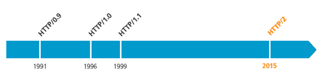
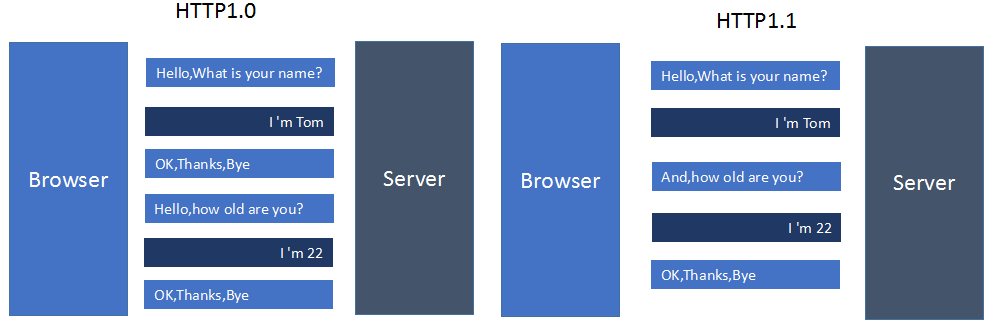
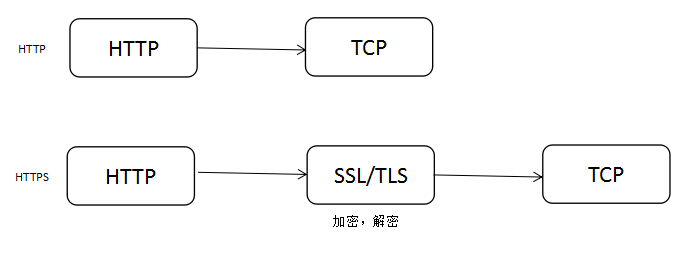
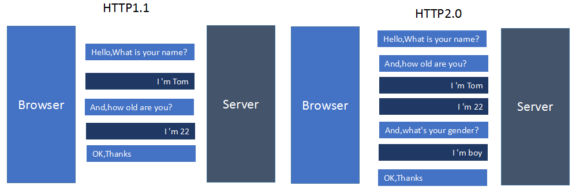

# WEB

> 万维网(World Wide Web/全球广域网)学习
>
> 2019年1月8日 星期二

## 概述

- 发明者: *Tim Berners-Lee*
- 表现形式: 
  - *超文本(Hyper text)*
  - *超媒体(Hyper Media)*
  - *超文本传输协议(HyperText Transfer Protocol)*
  - *超文本标记语言(Hyper Text Markup Language，HTML)*

> _**W3C**_

*World Wide Web Consortium*

- 相关协议
  - *HTTP*
    - *HTTP/1.0*
    - *HTTP/1.1*
    - *HTTP/2*
  - *SOAP*

## HTTP

*超文本传输协议(HyperText Transfer Protocol) 伴随着计算机网络和浏览器的诞生，HTTP1.0也随之而来，处于计算机网络中的应用层，HTTP是建立在TCP协议之上*

*影响一个HTTP网络请求的因素主要有两个：__带宽__ 和 __延迟__。*

*HTTP1.0最早在网页中使用是在1996年，那个时候只是使用一些较为简单的网页上和网络请求上，而HTTP1.1则在1999年才开始广泛应用于现在的各大浏览器网络请求中，同时HTTP1.1也是当前使用最为广泛的HTTP协议。*

### HTTPS

*为了解决以上问题，网景在1994年创建了HTTPS，并应用在网景导航者浏览器中。 最初，HTTPS是与[SSL](https://zh.wikipedia.org/wiki/%E5%82%B3%E8%BC%B8%E5%B1%A4%E5%AE%89%E5%85%A8%E5%8D%94%E8%AD%B0)一起使用的；在SSL逐渐演变到[TLS](https://zh.wikipedia.org/wiki/%E5%82%B3%E8%BC%B8%E5%B1%A4%E5%AE%89%E5%85%A8%E5%8D%94%E8%AD%B0#TLS_1.0)时（其实两个是一个东西，只是名字不同而已），最新的HTTPS也由在2000年五月公布的RFC 2818正式确定下来。简单来说，HTTPS就是安全版的HTTP，并且由于当今时代对安全性要求更高，chrome和firefox都大力支持网站使用HTTPS，苹果也在ios 10系统中强制app使用HTTPS来传输数据，由此可见HTTPS势在必行。*

**HTTPS与HTTP的一些区别**

1. HTTPS协议需要到CA申请证书，一般免费证书很少，需要交费。
2. HTTP协议运行在TCP之上，所有传输的内容都是明文，HTTPS运行在SSL/TLS之上，SSL/TLS运行在TCP之上，所有传输的内容都经过加密的。
3. HTTP和HTTPS使用的是完全不同的连接方式，用的端口也不一样，前者是80，后者是443。
4. HTTPS可以有效的防止运营商劫持，解决了防劫持的一个大问题。

### HTTP/2

> [版本协议状态](https://datatracker.ietf.org/doc/rfc7540/)

- 协议代码
  - http:  
  - https:  **TLS(_Transport Layer Security_)**

*参考* __SPDY/2__

**主要新特性**

- *新的二进制格式*
- *多路复用*
- *header 压缩*
- *服务端推送*

*HTTP2.0可以说是SPDY的升级版（其实原本也是基于SPDY设计的），但是，HTTP2.0 跟 SPDY 仍有不同的地方，主要是以下两点：*

- *HTTP2.0 支持明文 HTTP 传输，而 SPDY 强制使用 HTTPS*
- *HTTP2.0 消息头的压缩算法采用 [HPACK](http://http2.github.io/http2-spec/compression.html)，而非 SPDY 采用的 [DEFLATE*](http://zh.wikipedia.org/wiki/DEFLATE)

## 附录

### 名称解释

- 数据交换格式
  - [*__XML__*](https://www.w3.org/XML/)     *eXtensible Markup Language, 可扩展标记语言, https://www.w3.org/TR/xml11/*
  - [*__JSON__*](https://www.json.org/)   *JavaScript Object Notation*
  - [__*Toml*__](https://github.com/toml-lang/toml)  *Tom's Obvious, Minimal Language.*
  - [__*YAML*__](https://yaml.org/)  *YAML Ain't Markup Language*
  - [__*Protocol Buffers*__](https://github.com/protocolbuffers/protobuf)

### 参考

- [HTTPWG](https://httpwg.org/)
- [IETF](https://www.ietf.org/)
  - *文档索引：https://www.ietf.org/download/rfc-index.txt*
  - 文档类型： (`$index = INDEX`)
    - pdf https://tools.ietf.org/pdf/rfc-INDEX.pdf
    - html  https://tools.ietf.org/html/rfc-INDEX
    - text https://tools.ietf.org/rfc/rfc-INDEX.txt
    - https://datatracker.ietf.org/doc/rfc-INDEX/ 
    - https://www.rfc-editor.org/info/rfc-INDEX
- [RFC-Editor](https://www.rfc-editor.org/)
- [ISO](https://www.iso.org/home.html)  *the International Organization for Standardization*

#### 网络链接

- [HTTP,HTTP2.0,SPDY,HTTPS你应该知道的一些事（伯乐在线）](http://web.jobbole.com/87695/)
- [淘宝HTTPS探索](http://velocity.oreilly.com.cn/2015/ppts/lizhenyu.pdf)
- [NGINX白皮书](https://www.nginx.com/wp-content/uploads/2015/09/NGINX_HTTP2_White_Paper_v4.pdf)
- [NGINX配置HTTP2.0官方指南](https://www.nginx.com/blog/nginx-1-9-5/)

