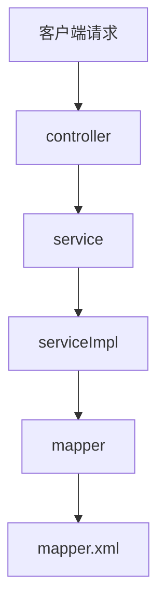

# Spring

> 2021年11月12日 星期五
>
> Joshua Conero


## 简介

诞生于：2003年，Spring 在起源可追溯到 Rod Johnson 于2002年出版的《Expert One-to-One J2EE Design and Development》一书。前身 interface21 框架，为框架的基础。首个正式版本 v1.0 发布于 2004-03-24，Spring 是指一个用于构造 Java 应用程序的**轻量级框架**。

- 首先，你可以采用 Spring 来构造任何程序，这和Apache Struts 这样的框架不同，仅仅被限定于WEB 应用
- 其次，“轻量级”并不意味着类的数量很少，或者发行包尺寸很小。实际上，指的是Spring哲学原则——最少的侵入。


Spring 项目主要子项目。

- [spring boot](https://github.com/spring-projects/spring-boot)
- [spring framework](https://github.com/spring-projects/spring-framework)(springMvc)


> 关系

- Spring 是一个“引擎”

- SpringMVC 是基于Spring的一个 MVC 框架 

- SpringBoot 是基于Spring4的条件注册的一套快速开发整合包。实现了自动配置，降低了项目搭建的复杂度，开箱即用

包含关系 `spring mvc  < spring <springboot`


> 主要特性

- 开源框架
- 简化企业级开发而生
- 一个IOC(DI)和AOP容器框架
- 优良特性
  - 非侵入式
  - 控制反转
  - 依赖注入（DI）
  - 面向切面编程（AOP）
  - 容器：组件化、一站式


### spring boot

SpringBoot是简化Spring开发的开源框架，利用自动配置、起步依赖等特性减少配置工作。其底层原理包括自动配置Bean、条件化Bean、外部化配置和监控诊断等，提供高效、灵活的开发体验。

核心特性：自动配置、起步依赖、内嵌服务器、无代码生成、约定大于配置、条件化Bean、监控和诊断功能。


框架中的分层概念

- model(entity)            **模型** 类似命名：domain、pojo. 存放实体类与并数据库表字段保持一致，一般一张表对应一个类。提供get/set/toString方法。
  - vo                       view object/视图层，用于展示层。它的作用是把某个指定页面（或组件）的所有数据封装起来
  - dto                     data Transfer object/数据传输层
  - bo                       business object/业务对象，即封装为业务对象
  - do                       domain object/领域对象，从现实世界中抽象出来的有形或无形的业务实体

- dao(mapper)             **持久层 **  dao层的作用为访问数据库，向数据库发送sql语句，完成数据的增删改查任务。 数据持久化操作就是指，把数据放到持久化的介质中，同时提供增删改查操作，比如数据通过hibernate插入到数据库中。
- service                        **业务逻辑层**   完成功能的设计 和dao层一样都是先设计接口，再创建要实现的类，然后在配置文件中进行配置其实现的关联。接下来就可以在service层调用dao层的接口进行业务逻辑应用的处理。 service的impl是把mapper和service进行整合的文件 封装Service层的业务逻辑有利于业务逻辑的独立性和重复利用性。
- controller                   **控制层**  业务逻辑控制层，直接与客户端请求交互。通过调用 service层实现具体的业务。


> 处理流程




项目主要依赖

- spring-boot-maven-plugin                     将系统打包为一个 jar 包


#### 映射层

常见的映射层有

- JPA                         Spring-data-jpa
- mybatis


#### v2.x

测试版本为 v2.2.x，v3等需验证是否正常。


使用 jvm 参数指定程序命令行参数

```shell
java -Xms256m -Xmx512m '-Dserver.port=18083' '-Dfile.encoding=utf-8' -jar .\ruoyi-gateway-2.1.0.jar
```


### spring Cloud

Spring Cloud 本身并不是一个开箱即用的框架，它是一套微服务规范，共有两代实现。

- Spring Cloud Netflix（*停更*） 是 Spring Cloud 的第一代实现，主要由 Eureka/服务发现、Ribbon/负载均衡、Feign/服务调用、Hystrix/熔断器等组件组成。最早期的微服务框架（鼻祖）
- Spring Cloud Alibaba 是 Spring Cloud 的第二代实现，主要由 Nacos/负载均衡-服务发现/配置中心、Sentinel/熔断限流、Seata/分布式事务 Dubbo/服务调用等组件组成。

| 组件       | Spring Cloud Official                       | Spring Cloud Alibaba | Spring Cloud Netflix |
| ---------- | ------------------------------------------- | -------------------- | -------------------- |
| 配置中心   | Spring Cloud Config / Spring Cloud Consul   | Nacos                | -                    |
| 服务注册   | Spring Cloud Consul                         | Nacos                | Eureka               |
| 路由管理   | Spring Cloud Gateway                        | -                    | Zuul                 |
| 服务调用   | Spring Cloud OpenFeign                      | Dubbo                | Feign                |
| 负载均衡   | Spring Cloud LoadBalancer                   | Dubbo LB             | Ribbon               |
| 熔断器     | Spring Cloud Circuit Breaker - Resilience4J | Sentinel             | Hystrix              |
| 分布式事务 | -                                           | Seata                | -                    |


**其他中间件**

中间件框架

Dubbo , RocketMQ , seata , druid

大数据组件

zookeeper , Hadoop , hive , spark

消息队列：Kafka、RocketMQ、Nats

指标监控：Micrometer、Prometheus

链路追踪：Spring Cloud Sleuth、Zipkin

日志采集：ELK 技术栈、FileBeat


[OpenSergo](https://opensergo.io/zh-cn/docs/what-is-opensergo/intro/) 是开放通用的，覆盖微服务及上下游关联组件的微服务治理项目


**Spring Cloud Alibaba**

- 官网 https://sca.aliyun.com/
- github https://github.com/alibaba/spring-cloud-alibaba


## 附录

### servlet 容器

servlet 容器（Web 容器），管理 servlet 的工具作为 servlet 代码的运行环境（运行时）。

web 容器常自带Web 服务器模块，提供基本的http服务。其相关关系如：$$Web 容器 = Web 服务器 + Servlet 容器$$。

常用java web容器有：

- [Apache tomcat ](https://tomcat.apache.org/index.html)   https://github.com/apache/tomcat 开源的Servlet容器，同时也支持JSP和WebSocket等技术，适合于中到大型Web应用程序
- [Eclipse Jetty](https://jetty.org/)     https://github.com/jetty/jetty.project  轻量级的、高性能的Java Web服务器和Servlet容器。它比Tomcat更小、更快，易于嵌入到Java应用程序中，特别适合微服务架构。
- [undertow](https://undertow.io/)       https://github.com/undertow-io/undertow  Red Hat开发的一款高性能的Web服务器和Servlet容器，设计用于现代的、异步的Web应用。基于事件驱动的异步IO模型，处理高并发请求能力强。
- [reactor-netty](https://projectreactor.io/)  https://github.com/reactor/reactor-netty/ Reactor-Netty不是传统的Servlet容器，而是基于Project Reactor的非阻塞、响应式网络库。它主要用于构建响应式、非阻塞的Web应用和微服务。


**Java Web 开发技术**

Servlet 是第一代 Java Web 开发技术。

JSP 是现代化的 Web 开发技术。


### 参考

- [SpringBoot项目中model层、Dao层、Mapper层、controller层、service层、entity层作用](https://www.cnblogs.com/bronya0/p/14671139.html)
- [spring boot与spring mvc的区别是什么？](https://www.zhihu.com/question/64671972)
- [Spring简介及历史](https://blog.csdn.net/weixin_38910645/article/details/109209901)
- [浅谈Spring发展史](https://www.cnblogs.com/shenhaha520/articles/10991958.html)
- [spring  （一 ）   概述与介绍](https://blog.csdn.net/weixin_42405670/article/details/83048002)
- [springboot与spring比较区别](https://www.cnblogs.com/cuiqq/p/11818932.html)
- [Spring 入门及历史演变之路](https://zhuanlan.zhihu.com/p/115404132)
- [【学习笔记】Servlet容器(Web容器)简介](https://blog.csdn.net/taotiezhengfeng/article/details/124068463)
- [SpringBoot的模块及结构 v2.2.1](https://www.cnblogs.com/Chary/p/14255404.html)

