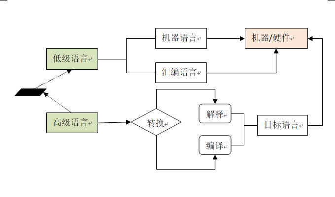
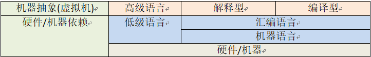
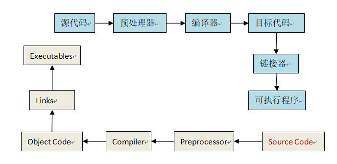
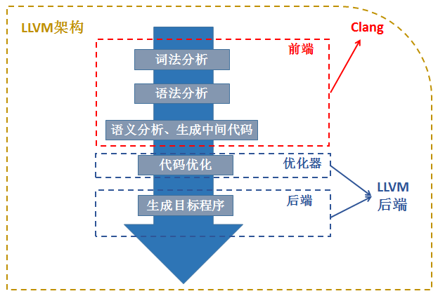
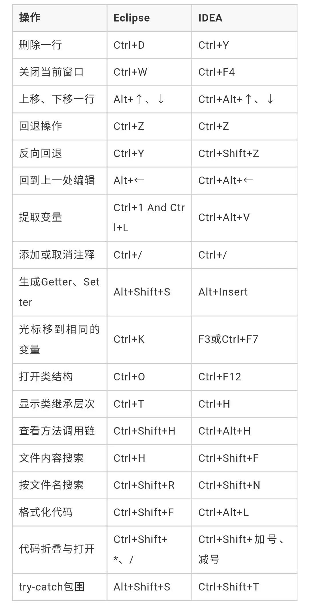
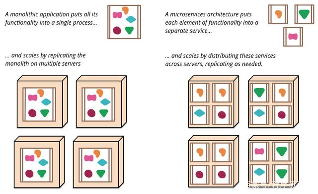

# lang

> 2018年8月25日 星期六
>
> 原 *word* 转 *markdown* 文件


[TOC]


## 摘要说明


**时间开始于：**2016年4月16日13:40:23@-

    软件行业是一个发展迅速的行业，也为全面的发展，加上长期以来工作上形成的困惑。


### 摘要内容：

计算机语言介绍，内容包括该语言的发展历史，应用场景，基本特点等。


### 编程语言范式

*程序设计范型( Programming paradigm)*

面向对象、面向过程、函数式、元编程、泛型编程、命令式和声明式、逻辑式、结构化和非结构化、消息传递、流程驱动和事件驱动、符号式、管道等

       面向对象，一些人总结了该设计模式，认为其：相左与当前流行的“模块化”、“并行性”特性(如今流行的函数式编程)。


#### *元编程* 

1994年，Erwin Unruh

       这类计算机程序编写或者操纵其他程序（或者自身）作为它们的数据，或者在运行时完成部分本应在编译时完成的工作。很多情况下与手工编写全部代码相比工作效率更高。编写元程序的语言称之为元语言，被操作的语言称之为目标语言。一门语言同时也是自身的元语言的能力称之为反射。反射是促进元编程的一种很有价值的语言特性。把编程语言自身作为头等对象（如Lisp或Rebol）也很有用。支持泛型编程的语言也使用元编程能力。
    
       元编程通常有两种方式起作用。一种方式是通过应用程序接口（API）来暴露运行时引擎的内部信息。另一种方法是动态执行包含编程命令的字符串。因此，“程序能编写程序”。虽然两种方法都能用，但大多数方法主要靠其中一种。
    
       编译期实现而非运行期


#### 函数式编程

采用一种基于函数的递归定义的计算模型。本质上，程序被看作是一种从输入到输出的函数，基于一些更简单的函数，通过一种逐步精化的过程定义。

函数式编程是一种编程范式，它有下面的一些特征：

1. 函数是一等公民，可以像数据一样传来传去
2. 高阶函数
3. 递归
4. pipeline
5. 惰性求值
6. 柯里化
7. 偏应用函数

C++新特效(C++11/14)可满足要求


#### 数据流

语言将计算看成在一些基本的功能结点之间流动的信息流。


#### 面向对象(OOP)

*Object Oriented Program*

由*`面向过程`(C语言)* 发展而来。


> 面向对象的特性

- 抽象
- 封装
- 继承
- 多态


**抽象** *数据抽象* `类的属性`， *方法抽象* `类的方法`

**封装**   把过程和数据封装起来

**继承**  体现不同抽象之间的父子关系，提高代码的复用性

**多态**   同一个行为具有多个不同表现形式或形态的能力


> 五大基本原则

- SRP(*Single Responsibility Principle*)    单一职责原则
  - 类的功能要单一，不能包罗万象
- OCP(*Open－Close Principle*)   开放封闭原则
  - 一个模块在扩展性方面应该是开放的,而在更改性方面应该是封闭的
- LSP(*the Liskov Substitution Principle*)   替换原则
  - 子类应当可以替换父类并出现在父类能够出现的任何地方
- DIP(*the Dependency Inversion Principle*)  依赖原则
  - 具体依赖抽象，上层依赖下层
- ISP(*the Interface Segregation Principle*) 接口分离原则
  - 模块间要通过抽象接口隔离开，而不是通过具体的类强耦合起来


#### 设计模式

>  **常见分类**

- 创建型模式
  - 工厂方法、抽象工厂、单例、创造者、原型
- 结构型模式
  - 适配器、装饰器、代理、外观、桥接、组合、享元
- 行为型模式
  - 策略、模板方法、观察者、迭代子、责任链、命令、备忘录、状态、访问者、中介者、解释器


> **六大原则**

- 单一责任原则    *一个类只负责一项职责*
- 里氏替换原则   *所有引用基类的地方必须能透明地使用其子类的对象。*
- 依赖倒置原则    *高层模块不应该依赖低层模块，二者都应该依赖其抽象；抽象不应该依赖细节；细节应该依赖抽象。*
- 接口隔离原则    *客户端不应该依赖它不需要的接口；一个类对另一个类的依赖应该建立在最小的接口上。*
- 迪米特法则        *一个对象应该对其他对象保持最少的了解 (低耦合)*
- 开闭原则            *一个软件实体如类、模块和函数应该对扩展开放，对修改关闭*


### 其他


> 图 计算语言结构



注: 目标语言包括机器语言，机器语言是计算机可识别的01二进制，汇编语言使用英文指令来代替二进制并通过汇编为二进制。


| 机器抽象(虚拟机) | 高级语言 | 解释型   | 编译型 |
| ---------------- | -------- | -------- | ------ |
| 硬件/机器依赖    | 低级语言 | 汇编语言 |        |
| 机器语言         |          |          |        |
| 硬件/机器        |          |          |        |


> 计算机语言层级




> 编译器



>  C# / VB    SourceCode → ByteCode(MSIL/CIL中间件) → NativeCode(CPU)

 

对于C#、VB等高级语言而言，此时编译器完成的功能是把源码（SourceCode）编译成通用中间语言（MSIL/CIL）的字节码（ByteCode）。最后运行的时候通过通用语言运行库的转换，编程最终可以被CPU直接计算的机器码（NativeCode）

 

- 编译                  高级语言 -> 低级语言
- 反编译                低级语言 -> 高级语言
- 级联                  高级语言1 ->高级语言2

 

本地编译器        编译器可以生成用来在与编译器本身所在的计算机和操作系统（平台）相同的环境下运行的目标代码
交叉编译器     编译器也可以生成用来在其它平台上运行的目标代码
语法分析器
语意分析器
抽象的语法树（abstract syntax tree，或 AST）


> C/C++ 编译器

- windows  ``VC``
- linux ``gcc``
- osx ``clang``


#### windows/工具

``Cygwin`` 、``WinGW`` 分别为 *中间转换工具/平台*


> Cygwin

*Get that Linux feeling - on Windows*


> WinGW

*a contraction of "Minimalist GNU for Windows", is a minimalist development environment for native Microsoft Windows applications.*


## 编程语言

*语言变种，重设计，迭代。各语言学习曲线不同，不同程序之间的运行成本各有差异。*


> C/C++ 和 JavaScript 语言类似： 语言实现以及标准为不同方(不同机构)

*C标准：*

- `ANSI C` 使用C的软件开发者被鼓励遵循ANSI C文档的要求，因为它鼓励使用跨平台的代码。
  - *ANSI C现在被几乎所有广泛使用的编译器支持。现在多数C代码是在ANSI C基础上写的。*
- `ISO C`
- `Standard C`


> 编译器通常相关于编译性语言，与解释器则是解释性语言。

- 解释器
  - *PHP Interpreter*
  - *Python Interpreter*


### 静态语言

#### C

>  **1972@Dennis MacAlistair Ritchie**


系统编程语言。被广泛用于操作系统和编译器的开发。

发明顺序 BCPL<-B<-C.B开发Unix,后用C重写

主要用于： 系统开发、引擎开发、高性能服务器、娱乐软件领域。(c++也适用)


#### Object-c

> **1980@Brad Cox  ,Stepstone公司**

通常写作ObjC或OC和较少用的Objective C或Obj-C，是扩充C的面向对象编程语言。它主要使用于Mac OS X和GNUstep这两个使用OpenStep标准的系统，而在NeXTSTEP和OpenStep中它更是基本语言。

       GCC与Clang含Objective-C的编译器，Objective-C可以在GCC以及Clang运作的系统上编译。
    
       iOS操作系统,iOS应用程序,Mac OS X操作系统,Mac OSX 上的应用程序
    
       Objective-C的流行归功于iPhone的成功。编写iPhone应用程序的主要编程语言是Objective-C。
    
       Objective-C它完全兼容标准C语言（C++对C语言的兼容仅在于大部分语法上，而在ABI（Application Binary Interface）上，还需要使用extern "C"这种显式声明来与C函数进行兼容），而在此基础上增加了面向对象编程语言的特性以及Smalltalk消息机制。


​    

#### C++

> **1983@Bjarne Stroustrup**

C++进一步扩充和完善了C语言，是一种面向对象的程序设计语言。C语言的超集

其编程领域众广，常用于系统开发，引擎开发等应用领域，是至今为止最受广大程序员受用的最强大编程语言之一,支持类：类、封装、重载等特性!

C/C++标准


#### Erlang

> **1987@Joe Armstrong /CS-Lab      /Ericsson**


_**Erlang**问世于**1987**年，经过十年的发展，于**1998**年发布开源版本。_

*特点：*

1. *运行与虚拟机的解释性语言，但自从**R11B-4**开始支持脚本式解释器**
2. **多重范型编程语言，涵盖函数式、并发式及分布式*
3. 结构化，动态类型编程语言，内建并行计算支持
4. 并发，分布式


*Joe Armstrong**创造语言经过：* *Smalltalk -> Prolog  ->* 
​        
*最初是由爱立信专门为通信应用设计的，比如控制交换机或者变换协议等，因此非常适* *合于构建分布式，实时软并行计算系统。使用**Erlang**编写出的应用运行时通常由成千上万个轻量级进程组成，并通过消息传递相互通讯。进程间上下文切换对于**Erlang**来说仅仅* *只是一两个环节，比起**C**程序的线程切换要高效得多得多了。*

*得名于丹麦数学家及统计学家**Agner Krarup Erlang**，同时**Erlang**还可以表示**Ericsson Language**。*
​	*参考网站：*  *http://www.erlang.org/*

 


*Erlang* *最初是由瑞典电信设备制造商爱立信为通信应用（电话交换机）设计的。爱立信的开发者鼓吹* *Erlang* *的**9**个**9**指标的性能，声称* *Erlang* *能够传输**99.9999999%**的数据。这时* *Erlang* *才开始引起人们的关注。*

*Erlang* *的秘密是它的函数式设计范例。大部分代码都被强制运行于它的虚拟机中，这很好的避免了其他系统的干扰。函数都在虚拟机内部运行，运行在小的“类似沙箱模式的轻量级进程中”，并且只能通过消息传递相互通讯。你不可能仅仅抓取一个指针就够快速该变指针在栈中的状态。你必须保持在调用层次内部来保证函数状态的一致性。设计上或许有些不妥，但是这样很好的保证了错误向外扩散。*

*这种模式简化了运行逻辑，让运行时代码决定同时能够运行什么任务。并发处理也很容易管理，运行调度程序能够减少上下文切换。**Erlang* *迷们喜欢吹嘘“在**Web**服务器上同时运行**2000**万”处理器“（轻量级进程）。假如你正在构架一个类似移动电话交换机的实时收费系统，但是并没有足够的空间存储数据，那么* *Erlang* *正好符合你的需求。*


#### Java

> **1995@James Gosling**, Sun Microsystems   现公司Oracle


Java平台

       是一种可以撰写跨平台应用程序的面向对象的程序设计语言。Java 技术具有卓越的通用性、高效性、平台移植性和安全性，广泛应用于PC、数据中心、游戏控制台、科学超级计算机、游戏、移动电话和互联网，同时拥有全球最大的开发者专业社群。

历程：

1. Java最初被称为Oak，是1991年为消费类电子产品的嵌入式芯片而设计的
2. 1995年更名为Java，并重新设计用于开发Internet应用程序

  ​     

组成部分： 语法，文件格式，**JVM****虚拟机**，java API

官网： http://java.com/ 

 

 **JVM**是Java Virtual Machine（Java虚拟机）的缩写，JVM是一种用于计算设备的规范，它是一个虚构出来的计算机，是通过在实际的计算机上仿真模拟各种计算机功能来实现的(款平台)。

Java最初由SUN公司推出，并将其定位在简单、开放、高性能的语言。Java是一个纯粹面向对象的程序设计语言


> jvm族语言：

- Groovy
- Scala
- Fantom
- Clojure
- Kotlin
- Ceylon
- Xtend
- X10
- JRuby
- Jython

    

> 参考

参考:

 1. [List_of_JVM_languages](https://en.wikipedia.org/wiki/List_of_JVM_languages)
 2. [JVM 语言](http://www.oracle.com/technetwork/articles/java/architect-languages-2266279.html)
 3. [next-jvm-language](https://www.infoq.com/research/next-jvm-language/)
 4. [基于 Java 的 PHP 框架 —— Quercus 简介](http://www.ibm.com/developerworks/cn/web/wa-quercus/)
 5. [JVM内幕：Java虚拟机详解](http://www.importnew.com/17770.html)


#### *Delphi*

> **1995@Anders Hejlsberg**    美国Borland（宝兰）公司 

是Windows平台下著名的快速应用程序开发工具(Rapid Application Development，简称RAD)

Delphi是一个集成开发环境（IDE），使用的核心是由传统Pascal语言发展而来的Object Pascal，以图形用户界面为开发环境，透过IDE、VCL工具与编译器，配合连结数据库的功能，构成一个以面向对象程序设计为中心的应用程序开发工具。


#### C#

> **2000@Anders Hejlsberg** 微软公司，用于同Java生态相竞争  C SHARP 


.NET Framework

C#是一种安全的、稳定的、简单的、优雅的，由C和C++衍生出来的面向对象的编程语言。它在继承C和C++强大功能的同时去掉了一些它们的复杂特性（例如没有宏以及不允许多重继承）。C#综合了VB简单的可视化操作和C++的高运行效率，以其强大的操作能力、优雅的语法风格、创新的语言特性和便捷的面向组件编程的支持成为.NET开发的首选语言。

C#语言取代了Visual J++，语言本身深受 Java、C 和 C++ 的影响。

借鉴了

- Delphi 的一个特点，与COM（组件对象模型）是直接集成的

- VB 综合了VB简单的可视化操作和C++的高运行效率

- 可调用由 C/C++ 编写的本机原生函数

- 同时它也是微软.NET windows网络框架的主角

#### Scala
> 2001@Martin Odersky

多范式的编程语言，一种类似java的编程语言

假如你想要让你的代码有面向对象的清晰层次结构又喜欢函数型编程模式，那你有很多选择。假如你熟悉 Java，Scala 会是你的一个选择。

Scala 运行在 JVM 上，并将所有的清晰的函数式编程的约束转变成 Java 支持的语法以及联接到具体的 JAR 文件。假如那些额外的 JAR 中有副作用和其他不可避免的令人讨厌的头痛代码，那么使用Scala 刚刚适合业务场景，你的代码会变得很清晰。

Scala 是静态类型的。编译器负责在编译时推断出具体类型，对象类型和原始类型没有区别，因为Scala 想让每一个对象都继承自 Any。Scala 的语法比 Java 更加简洁。Scala 程序员称之为“低礼节”。你可以把驼峰式命名方式遗留在 Java 世界了。

Scala 提供了很多函数型语言的特征，例如懒初始化，尾递归，常量。但是为了能在 JVM 中运行，做了适当的修改。基本的原类型或者列表变量（像lists和哈希表），可以是可变或者不可变的。尾递归通过简单的例子运行，而不是必须通过详细声 明的可变递归。以上是 Scala 的全部实现思想，但是因为需要运行在 JVM 上，具体实现会有所限制。Scala 能够所有 Java 平台上运行，能很好的与已存在的开源 Java 代码混用。这对于许多实践性问题是一种权衡。

假如你需要将数据放在一千个处理器的集群中处理，并且有一堆遗留的 Java 代码，那么 Scala 是一个很好的解决方案。


#### *Groovy*

> 2003@Guillaume Laforge

基于JVM（Java虚拟机）的敏捷开发语言，Groovy 代码能够与 Java 代码很好地结合，也能用于扩展现有代码。由于其运行在 JVM 上的特性，Groovy 可以使用其他 Java 语

Java 世界是异常的灵活。但是你需要仍忍受它”穿个背带裤又要系皮带”的方式，例如，声明，每个变量的类型，分行代表每行结束，类的访问只是返回一个值。但是 Go 语言瞄准了动态语言的吸引人之处并且将它自身紧紧的与 Java 相集成。

Groovy 弃置了 Java 乏味的引号和分号方式，提供一种简单的编程习惯，也能用于扩展现有的 Java代码。运行在 jvm 上。不仅仅如此，Groovy 紧紧的月 JavaJAR 相结合，所以你能和好的利用一有的Java 代码。Groovy 运行起来像一门动态类型语言，并且能够访问静态类型 Java 对象的数据。

Groovy 程序眼认为他们技术与 Java 程序员，同事也是 Groovy 程序员。基于 Java 代码，能够提供非常多的功能。充分使用 Java 拥有的闭包，操作符重载，多态性。不要忘了使用问号来做空指针的判断的简易性，这比使用 if-then 语句来判断要简单得多。因此，简洁的语法，使程序员敲击键盘次数减少了。谁会不喜欢呢？

最后，令所有 Java 程序员羡慕的动态语言的简单特点让他们能够减少工作量，有更多的娱乐时间，但是又不跳出 Java 圈。

类java
java-脚本化语言。


#### Go

> **2009@Google  Rob Pike**

Go语言是谷歌2009发布的第二款开源编程语言。Go语言专门针对多处理器系统应用程序的编程进行了优化，使用Go编译的程序可以媲美C或C++代码的速度，而且更加安全、支持并行进程。

       Go的目标是希望提升现有编程语言对程序库等依赖性(dependency)的管理，这些软件元素会被应用程序反复调用。由于存在并行编程模式，因此这一语言也被设计用来解决多处理器的任务。
    
       通过创建新的编程语言，谷歌将继续拓展计算领域的各个方面，从而促进这些领域的发展。这同样也是谷歌开发Android操作系统、Chrome浏览器和Chrome OS的动机所在。
    
       谷歌工程师2007年开始开发go语言，基本上属于语言家族，同时从pascal语系吸收大量的理念。
    
       设计理念：让程序员更有效率，让编程更有效率，至少是让我们更有效率并且使编程更有乐趣。
    
       Rob Pike语言开发者之一： 它是用来开发”大型软件“的。Go由计算机科学的三位大神Robert Griesemer、Rob Pike和Ken Thompson共同创建。Thompson也是Unix操作系统的联合开发者，同时也是C语言之父。Pike则是Thompson在贝尔实验室的同事。Griesemer因在Java编译器方面的工作而广为人知。Go的初衷是实现即能像古怪的电信语言Erlang或流行的服务器端javaScript平台Node.js那样处理大规模并发用户，同时又能像C++那样迅捷。一个很够处理大规模并发下载请求的分布式文件系统应当是最能发挥Go长处的应用。事实也是如此，新的用Go编写的dl.google.com软件代码上简洁不少，内存开销也更少，更重要的是，更加可靠。Fitzpatrick表示在开发过程中更加深入了解了Go，开发了一个新的开源缓存库，同时也发现了Go语言的一些不足。

我们发现Go的并发模型与Erlang、C和C++的几乎一样强大，而且是对开发者非常友好的一种系统。

	谷歌不是第一家调查集合语言的组织，最终发现语言杂乱，复杂并且效率不高。2009年，谷歌发布了它自己的解决方案：一门静态类型的语言，类似于 C 语言但是包含了其所不具备的特征，它让程序员避免了类型声明和被 malloc 调用锁迷惑。通过 Go 语言，程序员能够受益于塔的简洁、已编译的c语言的结构以及动态脚本语言的的易用性。
	
	同时，Sun 和 Apple 也以相同的方式创建了 Java 和 Swift 语言，相应的，Google 做出了一个重要的不同的决定：Go 语言的发明者希望它能足够简单以至于每个程序员都能轻松的掌握。Rob Pike，发明者之一，向 Ars Technica 豪言道：长远来说，通过将事件分开处理，你能够获得更多。因此，Go语言还有一些灵活的特性，泛型，类型继承，断言，只通过干净的简单代码块操作字符串、数字以及哈希表。
	
	据报道这门这门语言在巨大谷歌帝国内部被很好的接受，在其它方面也获得了认可，动态语言 Python 和 Ruby 的爱好者接受了编译已编译语言的严密性。假如你想要获得 Google 的青睐，并且需要建立服务器端的业务逻辑，那么 Go 会是一个好的选择。

> 未来的云计算语言？

> go与java对比：

- 部署简单，并发性好，在语言设计上确实优于java(诞生的时间与背景的原因)，
- 支持多种编程范式、提供了给力的程序构建和发布工具，以及在并发编程方面的极度简化；
- 与Java语言一样，Go语言的向后兼容做的很好；
- Java语言与Go语言在使用场景方面其实有很多相似之处。例如，它们都适用于服务端程序的构建，并且可以很容易地编写出页面模板文件。又例如，它们在桌面软件方面都比较捉襟见肘。

> 扩展

*新型语言对比：Golang,Rust,Dlang(Go,Rust,D)*

- go：   
  运用在**分布式后端**，目标慢慢取代在这方面上Java、Python的地位。很多基于Java的通讯密集型分布式框架，现在都在开始用Golang来重写。/网络通信，适合高并发网络服务程序(Golang适合Java、Python的领域)。更新迭代快,比Rust简洁

- Rust：  
  目标瞄准C/C++,未来的**单机系统**对于并行，安全和稳定性有着更高的需求，这是Rust应运而生的背景。更新迭代慢，系统级别(类 C,Java, Python, D, Go, Rust) ，学习曲线陡峭，适合UI、游戏等对性能要求高的程序(Rust适合C++的领域)。

- Dlang ：
	描述C/C++,更新迭代慢,学习曲线陡峭

> 操作系统，计算机体系，编程语言设计


#### Rust


关注： safety, speed, and concurrency(安全，速度，协同).

Rust”，由web语言的领军人物Brendan Eich（js之父），Dave Herman以及Mozilla公司的Graydon Hoare 合力开发。


创建这个新语言的目的是为了解决一个很顽疾的问题：软件的演进速度大大低于硬件的演进，软件在语言级别上无法真正利用多核计算带来的性能提升。Rust是针对多核体系提出的语言，并且吸收一些其他动态语言的重要特性，比如不需要管理内存，比如不会出现Null指针等等。


>  特点：

1)	零成本的抽象
2)	移动语义
3)	保证内存安全
4)	线程没有数据竞争
5)	trait-based泛型
6)	模式匹配
7)	类型推断
8)	最小运行时
9)	高效的C绑定


#### *Dlang*

> 2001@	Walter Bright，Andrei Alexandrescu

是一种通用的系统和应用编程语言

D语言是一种程式语言，具备多范型，例如物件导向、指令式。由沃尔特•布莱特和安德烈•亚历山德雷斯库所开发，起源自C++，深受C++的影响，然而其不是C++的变种，而是重新设计来自C++的部分特性，并受到其它程式语言观念的影响，如Java、C#以及Eiffel。2007年1月2日释出1.0稳定版本。版本2.0释出于2007年1月17日。

例如垃圾回收、手工内存操作、契约式设计、高级模板技术、内嵌汇编、内置单元测试、Mixin 风格多继承、类 Java 包管理机制、内置同步机制、内建基本运行时信息。

D 不是脚本语言，也不是一种解释型语言。它不需要虚拟机。它是给实际的编程者使用的实用的计算机程序语言，帮助程序员快速、可靠的完成易于维护、易于理解的代码。


#### swift

> 2014@			《=Object-C

	Swift，苹果于2014年WWDC（苹果开发者大会）发布的新开发语言，可与Objective-C*共同运行于Mac OS和iOS平台，用于搭建基于苹果平台的应用程序。
	
	Swift是一款易学易用的编程语言，而且它还是第一套具有与脚本语言同样的表现力和趣味性的系统编程语言。Swift的设计以安全为出发点，以避免各种常见的编程错误类别。
	
	2015年12月4日，苹果公司宣布其Swift编程语言现在开放源代码。长600多页的 The Swift Programming Language  可以在线免费下载。
	
	Swift 结合了 C 和 Objective-C 的优点并且不受C兼容性的限制。
	
	参考： C、JavaScript、Python、Java 


### 脚本语言

#### Perl

> 1987@Larry Wall

实际抽取与汇报语言Practical Extraction and Report Language

Perl借取了C、sed、awk、shell 脚本语言以及很多其他程序语言的特性，其中最重要的特性是它内部集成了正则表达式的功能，以及巨大的第三方代码库CPAN。Perl像C一样强大，像awk、sed等脚本描述语言一样方便，被Perl语言爱好者称之为“一种拥有各种语言功能的梦幻脚本语言”、“Unix 中的王牌工具”。

Unix 的脚本语言设计的，但是它早就移植到大多数其它操作系统里了

#### Python
> 1989@Guido van Rossum		《=ABC lang

Python是纯粹的自由软件， 源代码和解释器CPython遵循 GPL(GNU General Public License)协议  。

Python语法简洁清晰，特色之一是强制用空白符(white space)作为语句缩进。

Python具有丰富和强大的库。它常被昵称为胶水语言，能够把用其他语言制作的各种模块（尤其是C/C++）很轻松地联结在一起。常见的一种应用情形是，使用Python快速生成程序的原型（有时甚至是程序的最终界面），然后对其中有特别要求的部分，用更合适的语言改写，比如3D游戏中的图形渲染模块，性能要求特别高，就可以用C/C++重写，而后封装为Python可以调用的扩展类库。需要注意的是在您使用扩展类库时可能需要考虑平台问题，某些可能不提供跨平台的实现。Python最大的特点莫过于其强大的库，Python丰富的第三方库资源就是它的优势，Python库能够简化程序员的编程过程，节省时间。

>  设计哲学是“优雅”、“明确”、“简单”


> 应用场景

- 处理系统管理任务和Web编程。
- 国外用Python做科学计算的研究机构日益增多
- 系统编程，图形处理，数学处理，文本处理，数据库编程，网络编程，Web编程，多媒体应用，pymo引擎，黑客编程

>  启发语言：       C/Modula-3/ABC


> 与 R 对比

|          | Python                                                       | R                                                            |
| -------- | ------------------------------------------------------------ | ------------------------------------------------------------ |
| 创造者   | Guido van Rossum                                             | Ross Ihaka 和 Robert Gentleman                               |
| 时间     | 1991                                                         | 1995                                                         |
| 目的     | Python 强调生产力和代码可读性                                | R 专注于用户友好的数据分析、统计和图形模型                   |
| 可用性   | 漂亮的语法使得 Python 易于编码和调试。代码缩进可能会影响程序含义。同一功能只能用一种方式实现。 | 几行代码即可实现统计模型。R 样式表不是任何人都都有使用。同一功能可以用多种方式编写实现。 |
| 学习难度 | Python 的可读性和简单性使其学习曲线相对较低和平缓。Python 被认为是最适合初学者的编程语言 | R 在初学时有一个陡峭的学习曲线。但是，一旦掌握基础知识，就可以轻松学习复杂的东西。对于经验丰富的程序员来说，R 并不难。 |


#### *JavaScript*     

> 1992@Brendan Eich  ,Netscape公司	Netscape、Mozilla基金会 

> ECMAScript: 发展为ECMA 标准

Ecma 官网 ： http://www.ecma-international.org/

(ES标准)ES-Vn : <http://www.ecma-international.org/publications/standards/Ecma-262-arch.htm> 。

   

> 机密库

crypto-js：<https://www.npmjs.com/package/crypto-js>。

pidcrypt：

       <https://sourceforge.net/projects/pidcrypt/>  - 下载包
    
       <https://github.com/jas-/jQuery.pidCrypt> - Github
    
       Javascript + PHP Encryption with pidCrypt

Base64：

       <http://plugins.jquery.com/base64/> - jQuery base64

npm 库-nodeJs/浏览器。浏览器可借助**RequireJS** 、Client (**browser**)

#### *Lua*         

> 1993@Roberto Ierusalimschy、Waldemar Celes 和 Luiz Henrique de Figueiredo

是巴西里约热内卢天主教大学（Pontifical Catholic University of Rio de Janeiro）里的一个研究小组

Lua是作为嵌入式脚本的最佳选择

其设计目的是为了嵌入应用程序中，从而为应用程序提供灵活的扩展和定制功能。

Lua由标准C编写而成，几乎在所有操作系统和平台上都可以编译，运行。Lua并没有提供强大的库，这是由它的定位决定的。所以Lua不适合作为开发独立应用程序的语言。Lua 有一个同时进行的JIT项目，提供在特定平台上的即时编译功能。

应用场景
​	游戏开发
​	独立应用脚本
​	Web 应用脚本
​	扩展和数据库插件如：MySQL Proxy 和 MySQL WorkBench
​	安全系统，如入侵检测系统

#### php

> **1994@Rasmus Lerdorf**


1997@年，任职于 Technion IIT公司的两个以色列程序设计师：Zeev Suraski 和 Andi Gutmans，重写了 PHP 的剖析器，成为 PHP 3 的基础

2000@在2000年5月22日，以Zend Engine 1.0为基础的PHP 4正式发布

刚刚开始是Rasmus Lerdorf为了要维护个人网页而制作的一个简单的用Perl语言编写的程序。

原始为Personal Home Page的缩写，已经正式更名为 "PHP: Hypertext Preprocessor"

2010年，PHP语言发展枝Hack(语言)-HHVM，Facebook公开了PHP源对源编辑器，将PHP翻译为C++代码，并且编译一个单独的可执行二进制应用，HipHop->HHVM

PHP内核: Zend引擎，Composer 类似于node的NPM，Ruby的Bundle。

经历了框架的兴起，


> PHP 的执行过程

*PHP 实现了一个虚拟机 Zend VM，它会将其脚本编译成虚拟机理解的指令，也就是操作码，这个执行阶段就是“编译时（Compile Time）”。在“运行时（Runtime）”执行阶段，虚拟机 Zend VM 会执行这些编译好的操作码。*

1. `php script`    =(**Zend VM**)[编译]=>     `操作码`   	: 编译时/Compile Time
2. `操作码`    =(**Zend VM**)[执行]=>     `结果`   	              : 运行时/Compile Time

在 *php7以以前，编译/运行时是相互独立的*。


> JIT

*PHP JIT 对于使用 PHP 的网站来说提速可能并不明显，因为 JIT 在 CPU 密集型的代码上效果最好，而一般情况下，用 PHP 编写的程序都是 I/O 密集型的。简单来说就是，PHP 程序往往受限于 I/O 而不是 CPU，使 PHP 代码运行速度变慢的因素往往是它们正在执行的 I/O 操作，包括连接、读取和写入数据库、高速缓存、文件与套接字等。*


> **帮助链接**

PHP Windows安装包： <http://windows.php.net/downloads/releases/archives/>；

父文件目录- <http://windows.php.net/downloads/>


#### *Ruby*

> **1995@Yukihiro Matsumoto**    由日本人松本行弘开发


它的灵感与特性来自于 Perl、Smalltalk、Eiffel、Ada以及 Lisp 语言。由 Ruby 语言本身还发展出了JRuby（Java平台）、IronRuby（.NET平台）等其他平台的 Ruby 语言替代品。Ruby的作者于1993年2月24日开始编写Ruby，直至1995年12月才正式公开发布于fj（新闻组）。因为Perl发音与6月诞生石pearl（珍珠）相同，因此Ruby以7月诞生石ruby（红宝石）命名。

Ruby归根结底源于Perl和Python两类语言，与C，C++，C#，java是不同大类。

与JAVA不同，Ruby是一种动态的，侧重于简单高效的开源的语言。Ruby的设计者认为，减少编程时不必要的琐碎时间很有必要，所以简便、人性化成为Ruby的一大特性。


#### *TypeScript*

> 2012@Anders Hejlsberg

javascript预处理
JavaScript的一个超集
为大型应用之开发而设计，而编译时它产生 JavaScript 以确保兼容性。

#### *CoffeeScript*

javascript预处理/

技术角度来说，CoffeeScript 并不是一门语言。这是一个将你写的代码转换 Javascript 的预处理器。但是它看起来有所与众不同，因为它缺少大量的标点符号。你可以人为他是 Ruby 或者 Python，尽管内部表现像 Javascript。

当封号厌恶者被强制用浏览器支持的 Javascript 编程的时候，Coffeescript 开始流行了。改变浏览器工作的脚本语言是不切实际的，于是他们写了他们自己的预处理。结果是程序员们能够写干净的嗲吗并且让 CoffeeScript 将那些代码转译成各种符号的 Javascript 语言指令来操控浏览器。

少了分号紧紧支持开始。通过 CoffeeScript，你甚至不需要通过var来声明变量。声明函数也不需要function 关键字或者大括号。事实上，大括号在 CoffeeScript 中也不太被使用。代码是如此的简洁，以至于相比于哥特式教堂，它看起来像现代主义建筑物。这就是为什么很多新的 Javascript 框架通常是用 CoffeeScript 写的然后编译成 Javascript。

#### Dart

> 不像javascript的javascript

流行并不是被吹捧出来的。可能有越来越多领域使用到了 JavaScript，“事君数，斯辱矣；朋友数，斯疏矣”，有时候太过于亲近反而会导致疏远，疏远了然后就开始寻找替代。Dart 是 Google 出品的一门适用于 Web 浏览器端的新语言。

Dart 并没有从 JavaScript 基本概念中脱离出来。它工作在浏览器中，操作所有的 DIV 和我们所见的Web 对象。Dart 的作者仅仅只是为了清除 JavaScript 中所有恼人的部分，使之变得更简洁。底层结构并没有太大的变化。因为他们希望将 Dart 代码转成 Javascript 来提高运行速度。

高亮可能在许多 JavaScript 类库中提供的额外功能。你不需要通过 jQuery 或者其他通用类库来修改部分 HTML 页面。Dart 提供了默认的支持。也许一些熟悉的数据类型以及语法的速记技巧能够少敲几次键盘。Google 通过提供开源的支持大多数主流平台的开源工具来答题推广 Dart。

假如你正在建立一个动态的 Web 应用。并且已经对于 JavaScript 厌烦了，Dart 提供了清晰的语法结构来创建有多种 Web 资源数据的 Div 块。


#### *Julia*

科学计算领域有一群 Python 的爱好者，享受 Python 带来的简单语法以及能够避免陷入乱用指针和字节的细节中的自由自在。除了所有的优点，Python 通常在科学计算中处理大数据所表现的令人发狂的运行速度一值是一个诟病。为了提高运行速度，很多科学家转而使用c语言来编写核心的运行代码。但是这带来了新的问题，用两种语言写的程序很难修改或者扩展。

Julia 是这种复杂问题的一种解决方案。它的作者带来了零 Python 程序员欣赏的干净语法并且做了稍稍修改使之能够在后台编译代码。通过这种方式，你能够像 Python 那样打开个记事本或者命令行来编码，但是你写的任何代码都会被即时编译。

Julia 真是非常了不起的语言。它提供了非常强大的类型分析引擎能够帮助优化代码。假如你喜欢元编程，这门语言提供了足够的扩展接口。它最大的附加价值是通过集群发布并行算法的简单机制。其内置了大量的数学算法库用来做数据分析。

最好的消息应该是它的运行速度。它的许多基本标准的运行速度是 Python 的30倍，甚至比 C 语言还快一点，假如你需要处理大量数据并且喜欢 Python 的语法，那么你最好快去学学 Julia 吧。


#### *Haskell*


经过超过20年的时间，一直研究函数型编程的学术研究者开发了 Haskell 语言，一门用来表达他们对于副作用的坏处的想法的语言。这是一门更加存粹的表达式函数型语言，通过精细的机制来处理 I/O Channels 和其他不可避免的副作用。其余的代码应该是相当有用的。


Haskell 社区相当活跃，那里有很多 Haskell 的变体等着你去探究。有些是单机版的，其他的是通过与像 Java（Jaskell，Frege）或者 Python 那样的主流语言集成的。大多数的名字显示他们来自苏格兰，那里是 Haskell 研究，或者是哲学家/逻辑学家（他们是许多 Haskell 思想的启蒙者）的温床。假如你认为你的数据结构和类型太复杂了，你可以考虑用 Haskell。


#### OCaml

> 复杂数据层次把戏    

一些程序员不喜欢声明变量，于是他们创建了动态语言。其他人喜欢声明一个变量的特定类型，integer，string 或者是 object。对于他们来说，大多胡编译型语言都对类型声明提供了支持。

这是一些喜欢详细声明变量层次类型的，甚至谈到要创建“algebras”（代数）类型。他们想象列表和多种类型的表能用来表示复杂、多层次的数据。他们提到了多态，模式匹配原型以及数据封装。这只会他们期望的复杂的，高结构化类型、原型以及原原型世界的基础。

对于他们，OCaml，一门有多个编程社区为了让前述想法被广泛接受而共同努力的语言。OCaml 提供类对象的支持，自动内存管理以及跨平台。甚至苹果App商店也提供了 OCaml 的 App 支持。OCaml 的理想的工程可能是建立一个符号数学网站来教授代数。


## 编译器

> CC, C89, C99

*Unix诞生之后，很多公司都开发了自己的Unix系统并且使用了自己专门的编译器。这样就导致在不同的Unix系统上，想编译C语言代码就需要使用不同的命令。于是POSIX标准Commands and Utilities中就规定了将CC作为不同编译器的统一命令接口，并且也规定了CC命令需要提供哪些必须的参数。*

*随着后续ISO C标准的确定，POSIX标准又规定分别将C89、C99作为ISO C的接口，而CC则继续作为非标准C的接口。但实际上后续大多数C语言编译器都实现了ISO C标准，所以POSIX标准规定后续应将CC这一历史遗留的命令取消。*


> GCC, G++, CPP, GPP

*随着开源运动的兴起，自由软件基金会开发了自己的开源免费的C语言编译器GNU C Compiler，简称GCC。GCC中提供了C Preprocessor这个C语言的预处理器，简称CPP。后来GCC又加入了对C++等其它语言的支持，所以他的名字也改为GNU Compiler Collection。G++则是专门用来处理C++语言的。在GNU的官方手册中，有一个章节叫做G++ and GCC介绍了这二者的区别。G++是GCC编译器集合的一个前端。关于前端、后端的概念下面有更详细的介绍。而GPP呢，这个名字比较特殊，如果你用的是Linux系统，可能并没有这个命令。但是在某些特殊的系统下，例如DOS，是无法创建G++这样带有特殊符号的文件名的。所以按照DJGPP编译器的做法，GPP其实就是G++。*


### 编译器

*传统编译器：工作原理基本上都是三段式，`前端(Frontend)`、`优化器(Optimizer)`、`后端(Backend)`*.

前端：    *负责解析源代码，检查语法错误，并将其翻译为抽象的语法树（Abstract Syntax Tree）*

优化器:   *对中间代码进行优化，试图使代码更高效*

后端：   *将优化器优化后的中间代码转换为目标机器的代码*


如： *Java/JVM(Java Virtual Machine)*、*.NET虚拟机*、*GCC*


### GCC

> *`the GNU Compiler Collection`*

_初衷是提供一款免费的开源的编译器。提供包含**C**、**C++**、**Object-C**、**Fortran**、**Ada**、**D**以及(`libstdc++`)等；其最初是作为 `GUN 操作系统`的编译器。_

- 创始人： *Richard Stallman*


<!--[@TODO TDM-GCC http://tdm-gcc.tdragon.net/]-->


### LLVM

- 官网 https://llvm.org/；github https://github.com/llvm-mirror/llvm
- 主要开发者: *[Chris Lattner](https://github.com/lattner)*、
- 主要优势： 多功能性，灵活性和可重用性
- 开始日期：  2001


*构架编译器(compiler)的框架系统，以C++编写而成，用于优化以任意程序语言编写的程序的编译时间(compile-time)、链接时间(link-time)、运行时间(run-time)以及空闲时间(idle-time)，对开发者保持开放，并兼容已有脚本*


> *模块化和可重用的编译器和工具链。最初作为一个伊利诺伊大学的研究项目，目标是为提供一个现代的，基于 SSA编译器的同时支持任一静态和动态语言的编译器。*


> 主要子项目

`LLVM Core`  *库提供一个现代化的源代码与目标无关的 __优化器__ ,为其中间代码( __LLVM IR__ )*

`Clang`  *LLVM 原生的C/C++/Object-C 编译器。(对标 GCC)*

`LLDB`  *LLVM 和 Clang 提供的原生调试器 (对标 GDB)*

`libc++` *C++ 标准库，包括C++11、C++14*

`compiler-rt` *编译器运行时(run-time)库*

`OpenMP` *OpenMP 运行时(runtime)*

`polly` *LLVM的高级循环和数据局部优化器和优化基础架构*

`libclc`  *旨在实现 OpenCL 库*

`klee`  *实现了一个“象征性的虚拟机”，它采用一个定理证明，试图评估在努力发现问题和证明的功能性，通过程序中的所有动态路径。klee的一个主要特性是它可以在检测到错误时生成测试用例。*

`SAFECode` *C / C ++程序的存储器编译器的安全性*

`LLD`  *新的链接器，用于替代旧的链接器。*


> LLVM 架构




### JIT

> *Just-In-Time* 即时编译

*JIT 是一种编译器策略，它将代码表述为一种中间状态，在运行时将其转换为依赖于体系结构的机器码，并即时执行。*


## 接口/API

### FFI、ABI

- FFI      _Foreign Function Interface_
- ABI    _Application Binary Interface_

> FFI

_指的是：外部功能接口。用于不同语言的之间的交互，通常有两种方式：一种是将函数做成一个服务，通过进程间通信(IPC)或网络协议通信(RPC, RESTful等)；另一种就是直接通过 FFI 调用。前者需要至少两个独立的进程才能实现，而后者直接将其它语言的接口内嵌到本语言中，所以调用效率比前者高。_


> ABI

_ABI（Application Binary Interface）: 应用程序二进制接口 描述了应用程序和操作系统之间，一个应用和它的库之间，或者应用的组成部分之间的低接口。_


### RESTful

*Representational State Transfer*

*用于Web数据接口的设计规范。*

*RESTful 的核心思想就是，客户端发出的数据操作指令都是"动词 + 宾语"的结构。动词通常就是五种 HTTP 方法，对应 CRUD 操作。*

- GET      读取(Read)
- POST   新建(Create)
- PUT     更新(update)
- PATCH 更新(update),   补丁式更新


## 操作系统

### 操作系统概述
操作系统 = 内核+apps     操作系统只负责提供服务

内核负责管理底层硬件资源，包括CPU、内存、IO设备等，并向上为apps提供系统调用接口，上层
apps应用必须通过系统调用方式使用硬件资源，通常并不能直接访问资源。

apps指的是用户接口，比如shell、gui、services、包管理工具等（Linux的图形界面也是作为可选应用之一，而不像Windows是集成到内核中的），注意与我们手动安装的应用区别开来。同一个内核加上不同的apps，就构成了不同的操作系统发行版，比如Ubuntu、Red Hat、Android等。因此我们可以认为，不同的Linux发行版本其实就是由应用apps构成的环境的差别，比如默认安装的软件、链接库、软件包管理以及图形界面等。我们把所有这些apps环境打成一个包，就可以称之为镜像。

虚拟实体（虚拟机、容器等），用户+进程+网络+文件

虚拟机与容器，

容器特征：
​	镜像体积更小，只包括apps以及所依赖的环境，没有内核。
​	创建和启动快，不需要启动GuestOS，应用启动开销基本就是应用本身启动的时间开销。
​	无GuestOS，无Hypervisor，无额外资源开销，资源控制粒度更小，部署密度大。
​	使用的是真实物理资源，因此不存在性能损耗。
​	轻量级。

### *Windows*

#### WMI (Windows Management Instrumentation)

> 名称解释： 
> 
- WBEM  Web-Based Enterprise Management
- CIM 	Common Information Model 
- DMTF 	Distributed Management Task Force


范畴： systems, applications, networks, devices, and other managed components。

WMI 可远程控制

WMI 结构：	A management application communicates with WMI by using a variety of interfaces, such as Visual Basic, C++, ODBC, and ActiveX. All the WMI interfaces are based on the Component Object Model (COM)。 

> Operating System Classes   操作系统类

COM
Desktop 							桌面
Drivers							设备/驱动
Event log							日志
File system						文件系统
Job objects						任务对象
Memory and page files				内存
Multimedia audio or visual			媒体
Networking						网络
Operating system events				操作系统事件
Operating system settings			操作系统设置
Processes							过程
Registry							注册表
Scheduler jobs						任务管理
Security							安全
Services							设备
Shares							分享
Start menu						开始菜单
Storage							储存
Users							用户
Windows product activation			Windows相关

#### DLL

(Dynamic Link Library)文件为动态链接库文件，又称“应用程序拓展”，是软件文件类型。在Windows中，许多应用程序并不是一个完整的可执行文件，它们被分割成一些相对独立的动态链接库，即DLL文件，放置于系统中。当我们执行某一个程序时，相应的DLL文件就会被调用。一个应用程序可使用多个DLL文件，一个DLL文件也可能被不同的应用程序使用，这样的DLL文件被称为共享DLL文件。
​		
#### EXE

可执行程序（executable program，EXE File）是指一种可在操作系统存储空间中浮动定位的可执行程序。在MS-DOS和MS-WINDOWS下，此类文件扩展名为•exe。

WINDOWS操作系统中的二进制可执行文件，分两种：
- 一种后辍名为•com，另一种是•exe 。

DOS规定，有重名的exe和com，运行时优先执行com文件。如果只有A.exe，就可以直接输入A，而不用输入全名。但如果有A.com和A.exe，输入A则优先执行A.com，要运行A.exe只能输入A.exe而不能输入A。一般用于DOS，在WINDOWS系统中的执行文件一般都是.exe文件。在 MS-DOS 中，用以标识可执行文件的文件扩展名。用户在提示行输入不带 .exe 扩展名的文件名后按 Enter 键或者点双击就能运行可执行程序。


> **Linux**

文件的类型是不依赖于其后缀名的，
.o,是目标文件,相当于windows中的.obj文件
.so 为共享库,是shared object,用于动态连接的,和dll差不多
.a为静态库,是好多个.o合在一起,用于静态连接

运行时链接： 	
动态链接：		

C++ 调用 dll 两种方法： 静态调用，动态调用

#### CGI

(Common Gateway Interface) 是WWW技术中最重要的技术之一，有着不可替代的重要地位。CGI是外部应用程序（CGI程序）与Web服务器之间的接口标准，是在CGI程序和Web服务器之间传递信息的规程。CGI规范允许Web服务器执行外部程序，并将它们的输出发送给Web浏览器，CGI将Web的一组简单的静态超媒体文档变成一个完整的新的交互式媒体。

#### Microsoft Visual C++(MSVC)

> 版本号介绍

| 版本号 | 时间 | 介绍                                                         |
| ------ | ---- | ------------------------------------------------------------ |
| VC1.0  | 1992 | Microsoft C/C++ 7.0 更新版本，集成 MFC2.0。支持X32，X86      |
| VC9.0  | 2007 | MicrosoftVisual C++ 2008。支持 .NET 3.5                      |
| VC10.0 | 2009 | MicrosoftVisual C++ 2010。支持 C++11 标准                    |
| VC11.0 | 2012 | MicrosoftVisual C++ 2012。实现go live，支持.net4.5。 只支持win7+ |
| VC12.0 | 2013 | MicrosoftVisual C++ 2013。                                   |
| VC14.0 |      | MicrosoftVisual C++ 2015。                                   |


运行库： 
​	Visual C++ Redistributable Package 安装运行使用 Visual Studio 2015 生成的 C++ 应用程序所需的运行时组件
​	
Standalone Compiler(独立编译)
visual c++ 编译器

MSBuild (Visual C++)

#### 虚拟机

> VMware  据网友推荐使用此虚拟机比VirtureBox更有效，-- window下安装linux系统虚拟机方案

#### cygwin

GCC 编译器/ the GNU Compiler Collection
​	支持语言： C/C++, Object-C,Fortran,Ada,Go
GCC 官网

Mingw  .修改编译器,让window下的编译器把诸如fork的调用翻译成等价的形式--这就是mingw的做法.

Cygwin  .修改库,让window提供一个类似unix提供的库,他们对程序的接口如同unix一样,而这些库,当然是由win32的API实现的--这就是cygwin的做法。  Unix-like。


> 相关的配置

| 名称     | 描述                  | 其他             |
| -------- | --------------------- | ---------------- |
| 架构     | **i686** / **x86_64** |                  |
| 线程     | **posix**/**win32**   | posix 跨平台特性 |
| 异常模型 | **dwarf**/**sjlj**    | dwarf 调试模式   |


### 进程、线程、协程

( Process )进程： 
 	进程是线程(Thread)的容器
 	系统进行资源分配与调度的基本单位
 	操作系统结构的基础
 	程序使指令、数据以及组织形式的描述，进程是程序的实体
 	特征： 动态，独立，异步，并发
 	结构特征： 进程是由程序、数据和程序控制块三部分组成
 	是一个动态的概念，一个活动的实力


(Thread )线程:
 	有时被称为轻量级进程(Lightweight Process, LWP)， 是程序执行流的最小单位
 	一个标准的线程由： 线程ID，当前指令指针，寄存器集合和堆栈组成
 	具有就绪、阻塞和运行三种基本的状态组成
 	每个程序至少有一个线程，若程序只有一个线程，那就是其本身
 	属性： 轻型实体； 独立调度和分派的基本单位； 可并行执行； 共享进程资源


(Coroutine) 协程
 	协程与子例程(子程序，过程，方法和函数)一样，协程也是一种程序组件
 	协程更适合于用来实现彼此熟悉的程序组件，如合作式多任务，迭代器，无限列表和管道。 协程最初在1963年被提出
 	协程不是进程和线程，其执行过程更类似于子例程，或者不带返回值的函数调用
 	一个程序可以包含多个协程，可以对比与一个进程包含多个线程，因而下面我们来比较协程和线程。我们知道多个线程相对独立，有自己的上下文，切换受系统控制；而协程也相对独立，有自己的上下文，但是其切换由自己控制，由当前协程切换到其他协程由当前协程来控制


并发与并行；parallelise/ concurrency
并发的关键是你有处理多个任务的能力，不一定要同时
并行的关键是你有同时处理多个任务的能力
所以我认为它们最关键的点就是：是否是『同时』


### fork

*fork 系统调用方式在 20 世纪 70 年代被创造出来，它通常与 exec() 组合使用，非常简单却很强大，被认为是一种天才式的设计、Unix 的伟大思想，至今 50 余年一直作为 POSIX 操作系统的原语存在，同时几乎每个 Unix shell、主要 Web 和数据库服务器、Google Chrome、Redis 甚至 Node.js 都使用 fork。*


主要优点： _**简单与缓解并发性**_


_fork 的语义已经影响了每个创建进程状态的新 API 的设计，POSIX 规范现在列出了关于如何将父状态复制到子进度的 25 个特殊情况，包括文件锁定、定时器、异步 IO 操作与跟踪等。此外，许多系统调用标志控制 fork 关于内存映射（Linux madvise() 标记 MADV_DONTFORK/DOFORK/WIPEONFORK 等）、文件描述符（O_CLOEXEC、FD_CLOEXEC）和线程（pthread_atfork()）的行为。任何重要的操作系统工具都必须通过 fork 记录其行为，并且用户模式库必须做好准备，以便随时 fork 它们的状态。**fork 已经不再简单**。_


## 工具与环境

### 版本控制

#### Git

官网：  https://git-scm.com/

获取远程git库[3] (基本命令)：
1.	选择 Git Bash Here
2.	git clone url/地址>获取git库 - 选择 HTTPS 协议
3.	git status>状态详情
4.	git log>日志
5.	git tag>获取git标签列表
6.	git tag -d tagName> 删除tag名称
7.	git fetch origin tag <tagName> 拉取远程tag标签；再使用 git checkout <tagName> 转到分支
8.	git checkout tagName> 调整指定的tag
9.	git add dir/目录> 添加文件到git
10.	git reset <file> 将git add 新增的文件从缓存区移除， 比如误将git add 当做 git diff 命令式十分有效
11.	git help > 命令行帮助
12.	git pull > 从远程获取最新版本并merge到本地
13.	git fetch > 从远程获取最新版本到本地，不会自动merge
14.	git merge show [name]/origin		显示当前分支的远程地址情况
15.	git reset --hard HEAD>   移除当前正在合并
16.	git remove -v 查看远程地址信息

   git 分支管理(命令)：
1.	git branch -a >显示文件仓库分支
2.	git branch  > 显示当前分支
3.	git branch joshua > 新增joshua 分支
4.	git push origin --delete <branchName> 删除分支
5.	git push origin --delete tag <tagName> 删除标签
6.	git branch -m oldName newName 分支重命名
7.	git push origin joshua > 把分支推到远程分支。同步，也可以称之为拉取
8.	git checkout joshua > 切换当前的分支为 joshua(默认master)
9.	git checkout  app/common.php(file) > git 新增某个本地删除的文件
10.	git checkout .	> 恢复删除的多个文件(所有本地不存在的) ， 可有将 "." 换为指定的文件
11.	git checkout tag  > 检出 tag 分支
12.	git fetch origin tag <tagName> 获取远程tag
13.	git push --tags 本地推送tag到远程
14.	git remote -v 查看git仓库远程地址信息
15.	git remote rm origin 删除远程地址
16.	git remote add origin <url> 添加本地地址远程仓库

其他

git 新增文件/目录并提交：

git 忽略表：

git 远程获取分支代码并与本地合并

git 创建本地仓库：
​	$ git init		初始化git仓库

	  	 $ git config --global user.email "邮箱"				设置邮箱
		 $ git config --global user.name "JC"				设置姓名
检出
​		$ git clone git@ 119.29.239.37:/c/gittest/test.git


git 文件对比命令：
git diff  或 git diff .
git dff 文件名
git diff 版本号码1 版本号码2		对比两个版本的差异
git diff 版本号码1 版本号码2  <src>	对比两个版本指定文件的差异


$ git stash    合并失败时，可执行该命令。用于缓存当前的版本号

git 错误解决：  error: failed to push some refs to "" (fetch+merge)
​		$ git pull --rebase origin master
​		$ git push -u origin master

开源中国文档：
​	 

项目迁移(保持就git仓库log信息转移到新的仓库)
​	1.  git push --mirror <url>	采用镜像的方法就数据推入新的仓库
​	2.  git push -f origin master 将所在的分支代码强制更新master分支
​	

svn/git区别[4]:
​	GIT是分布式的，SVN不是
   GIT把内容按元数据方式存储，而SVN是按文件
​	GIT没有一个全局的版本号，而SVN有
​	GIT的内容完整性要优于SVN
就操作上而言： git主要依托命令式管理(GUI也行)，而SVN主要采用图形化客服端管理

##### config

> 保存全局 *https* 用户的密码

*git config --global credential.helper store*


#### Svn

TortoiseSVN，  官网：  https://tortoisesvn.net/。
获取到远程svn库资源： svn 检出(svn checkout) => 地址/url    即可

管理:
1.	svn >增加
2.	svn>提交	可写入备注信息
3.	svn>更新

创建本地库：
注：以上操作实在Windows下，未做特殊说明皆符合该说明。

svn 更新指定版本

TortoiseSVN 客服端：
​    1) 在文件件中右键选择下拉菜单
​    2) 选择 TortoiseSVN 图标
​    3) 选择 "更新至版本(U)"


### 数据库

> 关系数据库范式

- 1NF:   _**确保每一列的原子性**_
  - 如果每一列都是不可再分的最小数据单元，则满足第一范式
- 2NF:   _**非键字段必须依赖于键字段**_
  - 第二范式要求每个表只描述一件事
- 3NF:  **任何非主属性不依赖于其它非主属性**
  - 在1NF基础上，除了主键以外的其它列都不传递依赖于主键列，或者说： 任何非主属性不依赖于其它非主属性（在2NF基础上消除传递依赖）


#### NoSQL(数据库-非关系式)


#### Redis - 内存数据库

内存中的数据结构存储系统，可作为数据库，缓存和消息中间件。
​	类似 Memcached(内存数据库)

支持数据结构：
​    string 字符串
​    hash 散列
​    list 列表
​    set 集合
​    sorted set 有序集合/范围查询
​    bitmap
​    hyperloglogs
​    geospatial 地理空间索引半径查询

支持事务transaction，自动分区cluster，数据持久化。

> 与 memcached 对比

1.	memcached 是多线程，非阻塞IO复用的网络模型；redis 单线程的IO复用模型
2.	memcached使用预分配的内存池方式；redis使用现场申请内存的方式存储数据
3.	Memcached提供了cas命令，可以保证多个并发访问操作同一份数据的一致性问题。 Redis没有提供cas 命令，并不能保证这点，不过Redis提供了事务的功能，可以保证一串 命令的原子性，中间不会被任何操作打断
4.	memcached基本支持简单的key-value存储，不支持枚举，不支持持久化和复制等功能；Redis除key/value之外，还支持list,set,sorted set,hash等众多数据结构，提供了KEYS

### 使用帮助/教程
#### vim 退出命令

点击 Esc 键，进入命名模式，然后输入命令：

:q  ——退出（这是 :quit 的缩写）
:q! ——不保存退出（这是  :quit! 的缩写）
:wq ——写入文件并退出；（这是 :writequit 的缩写）
:wq! ——（如果文件只有读权限）写入并退出（如果文件没有写权限，强制写）
:x ——类似于 :wq，如果文件无变动，那就不写入
:qa ——退出全部（这是 :quitall 的缩写）
ZZ —— （大写的 Z）如果文件有变动，写入/保存，然后退出；
ZQ —— 如果不想保存文件，也可以这个命令退出；

其实 Vim 有很详细的帮助，进入命令模式后，输入 help 然后回车。

### IED

#### IDEA




## 计算机算法

> 介绍：
1.	遗传算法(Genetic Algorithm)   *模拟达尔文进化论的自然选择和遗传学机理的生物进化过程的计算模型是一种通过模拟自然进化过程搜索最优解的方法。  被人们广泛地应用于组合优化、机器学习、信号处理、自适应控制和人工生命等领域*
2.	神经网络
3.	模糊推理
4.	混沌理论


## 信息安全

包含 `密码学`、`数字签名`


### 密码学

> *Crypto*

*块密码常用工作模式：ECB (Electronic codebook), CBC (Cipher-block chaining), OFB, CFB, CTR, XTS等。*

*__初始化向量(IV)__  (Initialization Vector) 是许多工作模式中用于随机化加密的一块数据，因此可以由相同的明文，相同的密钥产生不同的密文，而无需重新产生密钥，避免了通常相当复杂的这一过程。*


**常用加密** 解释性名词

- **DES**  *Data Encryption Standard，即数据加密标准*
- **AES**   _**Advanced Encryption Standard**(高级加密标准)，在密码学中又称Rijndael加密法。2006年，高级加密标准已然成为对称密钥加密中最流行的算法之一_
  - 1998	
- **DSA** *Digital Signature Algorithm (DSA)是Schnorr和ElGamal签名算法的变种，被美国NIST作为DSS(DigitalSignature Standard)。基于整数有限域离散对数难题的*
- **ECDSA** *椭圆曲线数字签名算法(Elliptic Curve Digital Signature Algorithm)*
- **HMAC**  *哈希消息认证码 (Hash-based Message Authentication Code)*
- **MD5**  *MD5消息摘要算法（英语：MD5 Message-Digest Algorithm），一种被广泛使用的密码散列函数，可以产生出一个128位（16字节）的散列值（hash value），用于确保信息传输完整一致*
  - 1991
- **RC4**   *(Rivest Cipher 4)，属于对称加密算法*
- **RSA**  *RSA加密算法是一种非对称加密算法。在公开密钥加密和电子商业中RSA被广泛使用。RSA是1977年由罗纳德·李维斯特（Ron Rivest）、阿迪·萨莫尔（Adi Shamir）和伦纳德·阿德曼（Leonard Adleman）一起提出的。*
  - 1977
- **SHA1**   *安全哈希算法（Secure Hash Algorithm）主要适用于数字签名标准 （Digital Signature Standard DSS）里面定义的数字签名算法（Digital Signature Algorithm DSA）*
- **SHA256**  *哈希函数，又称散列算法*
- **SHA512**


> 参照库

1. [`Crypto++`](https://www.cryptopp.com/)


## 区块链

### 比特币

- [`BitCoin 官网 https://bitcoin.org`](https://bitcoin.org/)

*比特币是一个创新的支付网络，一种新的货币。*

_比特币基于P2P技术运作，无需中央管理机构或银行；交易管理和比特币发行由比特币网络统一进行。**比特币是开源的；其设计是公开的，任何人都无法拥有或控制比特币网络，人人都可参与其中**。基于其种种独有的特性，比特币使之前任何支付系统都无法实现的激动人心的用途成为可能。_


> **余额 - 区块链**

_比特币区块链是整个比特币网络所依赖的**公共共享总帐**。所有确认的交易均包含在区块链中。这样比特币钱包可以计算出可用余额，并核实新的交易中消费方花费的确实是自己的比特币。[密码学](https://bitcoin.org/zh_CN/vocabulary#cryptography)确保了区块链的完整性和时间顺序。_


> **交易 - 私钥**

_一笔交易是指包含在区块链里的**比特币钱包之间的价值转移**。 比特币钱包保存着一份称作[*私钥*](https://bitcoin.org/zh_CN/vocabulary#private-key)或种子的保密数据用来为交易签名，即提供数学证据证明这些交易来自钱包的拥有者。这个 [*签名*](https://bitcoin.org/zh_CN/vocabulary#signature)也确保交易发生后不会被任何人修改。所有的交易在用户之间广播，通常在接下来的10-20分钟内通过一个称作 [*挖矿*](https://bitcoin.org/zh_CN/vocabulary#mining)的处理过程开始被比特币网络所确认。_


> **处理 - 挖矿**

_挖矿是个将待确认的交易数据包含到区块链中，从而完成对这些交易进行[*确认*](https://bitcoin.org/zh_CN/vocabulary#confirmation)的**分布式共识系统**。通过挖矿，可以强制性保证块链中的数据按时间顺序存储，保持比特币网络的中立性，且允许比特币网络上不同的计算机对系统状态达成一致。交易要获得确认，必须要被打包到一个符合非常严格的密码学规则的[*区块*](https://bitcoin.org/zh_CN/vocabulary#block)中，并通过比特币网络进行验证。这些规则可以防止对已有块的修改，因为一旦有改动，之后所有的块都将失效。挖矿的难度和中彩票相当，没人可以轻易地、连续地将新块加入到块链中。因此，没有集体和个人可以控制块链中包含什么样的内容或者替换掉块链中的部分内容以达到撤销他们交易的目的。_


- 相关技术
  - *数字签名*
  - *密码学*

*互联网贸易已经几乎完全依赖金融机构作为可信任的第三方来处理电子支付。*


## 硬件


### 处理器

#### CPU

*Central Processing Unit 中央处理器*

*CPU主要包括运算器、控制单元、若干寄存器、高速缓存器和它们之间通讯的数据、控制及状态的总线。*

*它的工作思路是：存储程序，按顺序执行。它最擅长于逻辑控制。由于CPU需要大量的空间去放置存储单元和控制逻辑，计算能力就受限制，所以就有了GPU出场。*


##### Intel 处理器


> 英特尔公司(**Intel Corporation**)

- 首家推出 *`X86`* 架构处理器的公司
- 成立时间： 1968
  - 由罗伯特·诺伊斯、高登·摩尔、安迪·葛洛夫，以“**集成电子**”（**Int**egrated **El**ectronics）之名在1968年7月18日共同创办公司


_**生产芯片：**_

- *SRAM(Intel 4004)*
- X86
  - Intel 8086(*1978*)、Intel 8088
- 386处理器
- 486处理器(*1989*)
- Pentium
  - 	P5(*1993*)、P6
- Itanium 
- Celeron
- Core(酷睿)
  - i3/i5/i7/i9
  - ix 5xxxx  5th(五代)
  - ix 6xxxx  6th(六代)
  - ix 7xxxx  7th(七代)
  - ix 8xxxx  8th(八代)
  - ix 9xxxx  9th(九代)


### GPU

> *Graphics Processing Unit 图像处理器*

*GPU主要解决并行运算问题。但GPU不能独立工作，必须由CPU控制。*


### NPU

> *Neural network Processing Unit 神经网络处理器*

*在电路层模拟人类神经元和突触，并且用深度学习指令集直接处理，一条指令对应一组神经元的任务。由于实现存储和计算一体化，故计算效率大大提高。*


### TPU

> *Tensor Processing Unit 张量处理器*

*是一种为通过基于神经网络运算能力的一种ASIC，即专用集成电路。他把微处理器、模拟IP核、数字IP核和存储器集成在一个芯片上。这是解决运算速度的另外一个思路，就是专项任务，专项解决。它通常根据特定运算任务开发，指向特定用途。比如人机大战中的AlphaGo。*

*SOC全称是System on a Chip，其本质上就是上面说的ASIC。可以叫作系统级芯片,或者叫片上系统*


## 架构

*软件架构（software architecture）是一系列相关的抽象模式，用于指导大型软件系统各个方面的设计。 软件架构是一个系统的草图。软件架构描述的对象是直接构成系统的抽象组件。各个组件之间的连接则明确和相对细致地描述组件之间的通讯。在实现阶段，这些抽象组件被细化为实际的组件，比如具体某个类或者对象。在面向对象领域中，组件之间的连接通常用接口(计算机科学)来实现。 软件体系结构是构建计算机软件实践的基础。*


### 分布式

> 与**集群** 的联系和区别

- 集群是物理形态、分布式是工作方式
- 分布式将任务放在多个物理隔离的节点上进行
- 分布式中各子节点互不通信，由管控中心统一调度管理
- 分布式管控中心指定路由、负载均衡，发现并剔除故障节点，方便扩容


### 微服务

*它描述了一种将软件应用程序设计为可独立部署的服务套件的特定方式。*


*简而言之，微服务架构是一种将单应用程序作为一套小型服务开发的方法，每种应用程序都在其自己的进程中运行，并与轻量级机制（通常是HTTP资源的API）进行通信。这些服务是围绕业务功能构建的，可以通过全自动部署机制进行独立部署。这些服务的集中化管理已经是最少的，它们可以用不同的编程语言编写，并使用不同的数据存储技术。*


> 整体风格（monolithic style）

*一个完整应用程序（monolithic application）构建成一个单独的单元。企业应用程序通常建立在三个主要部分中：一个客户端用户界面（由用户计算机上的浏览器中运行的HTML页面和JavaScript组成）数据库（包括插入常见的通常是关系数据库管理的多个表系统）和一个服务器端应用程序。服务器端应用程序将处理HTTP请求，执行特定领域逻辑，通过数据库进行检索和更新数据，选择并填充要发送到浏览器的HTML视图。这个服务器端应用程序是一个庞然大物 - 一个逻辑可执行文件。系统的任何更改都涉及构建和部署新版本的服务器端应用程序。*


```
UI + 服务端程序 + 数据库
```




> 微服务的特性

- 通过服务(Service) 实现组件化： *组件是可单独更换和升级的软件单元*
- 根据服务能力进行管理


_**库**(**library**) 指的是链接到程序的组件，通过本地函数调用来使用库提供的功能；而**服务** (**service**) 是进程外的组件，通过网络服务请求 (web service request) 或者远程函数调用之类的机制来使用里面的功能。_


## 附录


### 命令解释

- `BLOB`   *binary large object，二进制大对象，是一个可以存储二进制文件的容器*
- `CLOB` *字符大对象 (Character Large Object) 存储为数据库表某一行中的一个列值*


### 康威定律（Conway's Law）

*Organizations which design systems are constrained to produce designs which are copies of the communication structures of these organizations. 任何设计系统（广义）的组织，必将创造出一个设计，其设计结构是组织的通信结构的副本。大致的意思是：系统的设计受限于设计系统的组织的人员架构形式。*

1. *Communication dictates design：沟通决定了设计*
2. *There is never enough time to do something right, but there is always enough time to do it over：再多的时间也不能把事情做完美，但能把事情做完。*
3. *There is a homomorphism from the linear graph of a system to the linear graph of its design organization：线型系统和线型组织架构间有潜在的异质同态特性。*
4. *The structures of large systems tend to disintegrate during development, qualitatively more so than with small systems：大型复杂的系统比小的系统更适合分解。*


### 墨菲定律

- 任何事物都没有表面看起来那么简单。
- 所有的事都会比你预计的时间长。
- 可能出错的事总会出错。
- 如果你担心某种情况发生，那么他就更有可能发生。


### 文件尺寸大小转换

*文件尺寸大小转换，`K-M-G-T-P-E-Z-Y-B-N-D`。*

```ini
1 Bytes = 8Bit					byte
1 B 	= 8Bit					byte			字节
1 KB    = 1024 Bytes			Kilobyte		千字节
1 MB	= 1024 KB				Megabyte		百万字节		  兆
1 GB    = 1024 MB				Gigabyte		千兆			   吉
1 TB	= 1024 GB				Terabyte		万亿字节		  太
1 PB	= 1024 TB				Petabyte		千万亿字节		 拍
1 EB	= 1024 PB				Exabyte			百亿亿字节		 艾
1 ZB	= 1024 EB				Zettabyte		十万亿亿字节		泽
1 YB	= 1024 ZB				Yottabyte		一亿亿亿字节		尧
1 BB	= 1024 YB				Brontobyte
1 NB	= 1024 BB				NonaByte
1 DB	= 1024 NB				DoggaByte
```

