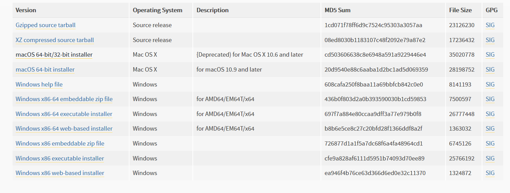

# Python(py)

> 2018年8月9日 星期四
>
> Joshua Conero


## Python 学习笔记

- 官网:  https://www.python.org/


### 概述

​	日期： 2017年2月23日 星期四

​	特点： “优雅”、“明确”、“简单”

*Python 是一门解释型语言，不像 C/C++, Go， Rust 那样需要编译和链接。*

诞生于1990年，因此其语言特性中包含一些古老的命名方式，以及与现代语言命名风格不经相同。但是其同时也吸收了部分现代语言特性，使该语言整体比较独特。


#### 安装



Windows下载包的区别如：*embeddable zip file*、*executeable installer*、*web-based installer* 分别对应为 zip压缩文件、exe压缩包、在线网络安装工具等，其最终安装的文件一样。安装 python 运行包以后，可以在安装的目录下查看语言的核心库等源码。


*python解析器作为 shell 指定的脚本时，会通过`sys.argv` 传递参数。*


安装包国内下载镜像：

- [阿里下载镜像](https://registry.npmmirror.com/binary.html?path=python/)
- [华为下载镜像](https://mirrors.huaweicloud.com/python/)


### 基础

```python
# -*- coding: encoding -*-
# 首行申明编码格式: utf-8
# 当行注释

# 如首行规定脚本编码格式，默认为 UTF-8 格式
# -*- coding: cp-1252 -*-
```


*在 Python 中，类似于 C，任何非零整数都是 true；0 是 false。*

**多重赋值**

```python
a, b = 0, 1			# 同时为两个变量赋值
```


#### numbers/数字

> 使用 python 解析作为计算器

- _支持简单运算符号: `+,-,*,/`(加减乘除)，以及括号运算_
- `//` 整数除法
- `%` 余运算
- `**` 平方(x^n)


*整数类型为`int`, 带小数点的数字为`float`。*

```powershell
# 进入 python 交互模式
python

>>> 7 // 3  # =2 ; 整数除法
>>> 7 % 3   # = 1; 余运算(x % y = (x - x/y))
>>> 5**3	# = 125; 5^3

```


#### strings/字符串

_单引号或双引号包裹的字符, 支持`\` 转移符；`print`函数，字符串默认解析转移字符。`+`_ 拼接字符串

```python
>>> "I'm Joshua Conero."		# I'm Joshua Conero
>>> 'I\'m Joshua Conero.'		# I'm Joshua Conero
>>> 'To learning "python".'		# To learning "python".

>>> print('C:\some\name')
C:\some
ame

# 使用 r'/r" 标识: raw
>>> print(r'C:\some\name')
>>> print(r"C:\some\name")
C:\some\name
    
# 使用 * 重复字符互串    
>>> 'g' + 3*'o' + 'd'		# goood

# 自动连接字符串
>>> 'go' 'od' ' new' 's'    # good news    
```


> 字符串

```
+---+---+---+---+---+---+
| P | y | t | h | o | n |
+---+---+---+---+---+---+
0   1   2   3   4   5   6
-6  -5  -4  -3  -2  -1
```


```powershell

py = 'Python'
py[0]		# =P; 获取第一个字符
py[:]		# =Python; 相当于整个字符串
py[0:2]		# =Py;
py[-4:]		# =thon;
```


##### 格式化

格式化字符串字面值（常简称为 f-字符串）能让你在字符串前加上 f 和 F 并将表达式写成 {expression}
来在字符串中包含 Python 表达式的值。

也可使用 `string.format()` 方法实现字符串的格式化

```python
# 格式化字符串字面值
name = 'Joshua Conero'
print(f'my name is {name}')

# string.format() 格式化
print('{0} and {1}'.format('spam', 'eggs'))
print('The story of {0}, {1}, and {other}.'.format('Bill', 'Manfred', other='Georg'))

table = {'Sjoerd': 4127, 'Jack': 4098, 'Dcab': 8637678}
print('Jack: {Jack:d}; Sjoerd: {Sjoerd:d}; Dcab: {Dcab:d}\r\n Jack: {Jack}; Sjoerd: {Sjoerd}; Dcab: {Dcab}'.format(**table))
```


#### Lists/列表

```python
squares = [1, 4, 9, 16, 25]
squares			# =[1, 4, 9, 16, 25]
squares[:]		# ; 同上
squares[-2:]	# ; [16, 25]
squares + [-25, -16]	# 数组append运算
squares.append(36)		# append 操作
squares[0]				# 访问索引值
squares
len(squares)
letters[:] = []			# 清空列表
```


### 流程控制

#### if

- `elif`     *`else if` 缩写。*
- `if ... elif` 与 `switch case` 等效


```python
x = int(input("Please enter an integer: "))
if x < 0:
    print('您输入一个负数')
elif x == 0:
    print('您输入零值')
elif x > 0:
    print('您输入一个正数')
else:
    print('位置您输入数的范围.')

# 函数中的 if-elif    
def ask_ok(prompt, retries=4, reminder='Please try again!'):
    while True:
        ok = input(prompt)
        if ok in ('y', 'ye', 'yes'):
            return True
        if ok in ('n', 'no', 'nop', 'nope'):
            return False
        retries = retries - 1
        if retries < 0:
            raise ValueError('invalid user response')
        print(reminder)   
```


#### for

```python
words = ['w', 'w1', 'w2', '...', 'wn']

# 循环
# for w in words[:]:
for w in words:
    # w,w1,w2
    print(w)
    
# 通过长度
# 索引遍历
for i in range(len(words)):
    # i 系统处理
    print(words[i])
    
# range 函数
range(n)    		# 0..n
range(n1, n2) 		# n1..n2
range(n1, n2, det)	# n1, n1+det, ...
```


*内置函数 range() 会生成一个等差级数链表:*

*`break`、`continue` 中断/跳过当前的步骤*


#### function

- *`pass` 为代码执行忽略语句，不做任何事情。*
- _函数体的第一行语句可以是可选的字符串文本，这个字符串是函数的文档字符串，或者称为 *docstring*。_
- 实参总是 *传值调用* （这里的 *值* 总是一个对象 引用 ，而不是该对象的值）


```python
# 申明函数
# 可使用默认值
def f(param, d=-1):
    # function body
    # 返回值
    return d

# 使用函数
t = f(..)
```


_函数默认值，在函数定义的作用域中有效。_

```python
i = 5

def f(arg=i):
    '''docstring(文档字符串)'''
    print(arg)

i = 6
f()
```


_默认值有限性仅仅单次，单可变对象如：`list, dictionary, or instances of most classes`多次有效。_

```python
def f(a, L=[]):
    L.append(a)
    return L

print(f(1))		# [1]
print(f(2))		# [1, 2]
print(f(3))		# [1, 2, 3]

# 或使用不同的函数写法避免
def f(a, L=None):
    if L is None:
        L = []
    L.append(a)
    return L
```


**Keyword Arguments/ 关键字参数**

_格式： `kwarg=value`_

```python
# 申明函数
def parrot(voltage, state='a stiff', action='voom', type='Norwegian Blue'):
    print("-- This parrot wouldn't", action, end=' ')
    print("if you put", voltage, "volts through it.")
    print("-- Lovely plumage, the", type)
    print("-- It's", state, "!")

# 使用函数    
parrot(1000)                                          # 1 positional argument
parrot(voltage=1000)                                  # 1 keyword argument
parrot(voltage=1000000, action='VOOOOOM')             # 2 keyword arguments
parrot(action='VOOOOOM', voltage=1000000)             # 2 keyword arguments
parrot('a million', 'bereft of life', 'jump')         # 3 positional arguments
parrot('a thousand', state='pushing up the daisies')  # 1 positional, 1 keyword
```


**形参**

```python
def cheeseshop(kind, *arguments, **keywords):
    print("-- Do you have any", kind, "?")
    print("-- I'm sorry, we're all out of", kind)
    for arg in arguments:
        print(arg)
    print("-" * 40)
    for kw in keywords:
        print(kw, ":", keywords[kw])
        
cheeseshop("Limburger", "It's very runny, sir.",
           "It's really very, VERY runny, sir.",
           shopkeeper="Michael Palin",
           client="John Cleese",
           sketch="Cheese Shop Sketch")

# 输出
'''
-- Do you have any Limburger ?
-- I'm sorry, we're all out of Limburger
It's very runny, sir.
It's really very, VERY runny, sir.
----------------------------------------
shopkeeper : Michael Palin
client : John Cleese
sketch : Cheese Shop Sketch
'''
```

*任意参数列表：*

```powershell
>>> def concat(*args, sep="/"):
...     return sep.join(args)
...
>>> concat("earth", "mars", "venus")
'earth/mars/venus'
>>> concat("earth", "mars", "venus", sep=".")
'earth.mars.venus'
```

*使用任意参数*

```python
# 集合
list(range(3, 6))  
args = [3, 6]
list(range(*args))

# 字典
def parrot(voltage, state='a stiff', action='voom'):
    print("-- This parrot wouldn't", action, end=' ')
    print("if you put", voltage, "volts through it.", end=' ')
    print("E's", state, "!")

d = {"voltage": "four million", "state": "bleedin' demised", "action": "VOOM"}
parrot(**d)
```


*`lambda` 表达式*

```python
def make_incrementor(n):
    return lambda x: x + n

f = make_incrementor(42)
f(0)
f(1)
```


**文档字符**

```python
def my_function():
    """Do nothing, but document it.

    No, really, it doesn't do anything.
    """
    pass

print(my_function.__doc__)
```


**函数注解 (Function Annotations)**

```python
# 注解符号:  ->
def f(ham: str, eggs: str = 'eggs') -> str:
    print("Annotations:", f.__annotations__)
    print("Arguments:", ham, eggs)
    return ham + ' and ' + eggs

f('spam')
```


### 数据结构

- `不可变的基本类型`(*immutable basic types*)
  - numbers
  - strings
  - tuples
- `可变对象`(*mutable objects*)
  - lists
  - dictionaries


#### list/列表对象

> `Built-In` 通过编辑器如“Ctrl + ” 追踪脚本

```python

class list(object):
    """
    list() -> new empty list
    list(iterable) -> new list initialized from iterable's items
    """

    def append(self, p_object):  # real signature unknown; restored from __doc__
        """ L.append(object) -> None -- append object to end """
        pass

    def clear(self):  # real signature unknown; restored from __doc__
        """ L.clear() -> None -- remove all items from L """
        pass

    def copy(self):  # real signature unknown; restored from __doc__
        """ L.copy() -> list -- a shallow copy of L """
        return []

    def count(self, value):  # real signature unknown; restored from __doc__
        """ L.count(value) -> integer -- return number of occurrences of value """
        return 0

    def extend(self, iterable):  # real signature unknown; restored from __doc__
        """ L.extend(iterable) -> None -- extend list by appending elements from the iterable """
        pass

    def index(self, value, start=None, stop=None):  # real signature unknown; restored from __doc__
        """
        L.index(value, [start, [stop]]) -> integer -- return first index of value.
        Raises ValueError if the value is not present.
        """
        return 0

    def insert(self, index, p_object):  # real signature unknown; restored from __doc__
        """ L.insert(index, object) -- insert object before index """
        pass

    def pop(self, index=None):  # real signature unknown; restored from __doc__
        """
        L.pop([index]) -> item -- remove and return item at index (default last).
        Raises IndexError if list is empty or index is out of range.
        """
        pass

    def remove(self, value):  # real signature unknown; restored from __doc__
        """
        L.remove(value) -> None -- remove first occurrence of value.
        Raises ValueError if the value is not present.
        """
        pass

    def reverse(self):  # real signature unknown; restored from __doc__
        """ L.reverse() -- reverse *IN PLACE* """
        pass

    def sort(self, key=None, reverse=False):  # real signature unknown; restored from __doc__
        """ L.sort(key=None, reverse=False) -> None -- stable sort *IN PLACE* """
        pass
```


*主要方法名*

| 方法名  | 功能描述           | 用法                                       |
| ------- | ------------------ | ------------------------------------------ |
| append  | 尾部追加元素       | L.append(object) -> None                   |
| clear   | 清空元素           | L.clear() -> None                          |
| copy    | 浅复制             | L.copy() -> list                           |
| count   | 统计元素次数       | L.count(value) -> integer                  |
| extend  | 迭代添加元素       | L.extend(iterable) -> None                 |
| index   | 首次出现的位置     | L.index(value, [start, [stop]]) -> integer |
| insert  | 在index前插入元素  | L.insert(index, object) -> None            |
| pop     | 移除元素(默认最后) | L.pop([index]) -> item                     |
| remove  | 移除指定的第一个值 | L.remove(value) -> None                    |
| reverse | 翻转元素           | L.reverse() -> None                        |
| sort    | 元素排序           | L.sort(key=None, reverse=False) -> None    |


> _**集合推导**_

```python
# 使用 for 添加元素
squares = []
for x in range(10):
    squares.append(x**2)
squares

# 等同
squares = list(map(lambda x: x**2, range(10)))

# 等同
squares = [x**2 for x in range(10)]
```

_使用 `for if` 组合_

```python
combs = [(x, y) for x in [1,2,3] for y in [3,1,4] if x != y]

# 等价于
combs = []
for x in [1,2,3]:
    for y in [3,1,4]:
        if x != y:
            combs.append((x, y))

combs
```


#### `del` 语句

*可删除 `list` 的元素，根据列表的索引。*

```powershell
>>> a = [-1, 1, 66.25, 333, 333, 1234.5]
>>> del a[0]
>>> a
[1, 66.25, 333, 333, 1234.5]
>>> del a[2:4]
>>> a
[1, 66.25, 1234.5]
>>> del a[:]
>>> a
[]

del a	# 删除整个变量
```


#### 元组和序列

> _Tuples and Sequences_

_元组是由逗号分隔的多个值组成的变量。它们可创建，但是不可对其赋值。元组和list类似，但是两者的运用场景不一致，前者不可变(元组就像字符串， 不可变的)，后者则反之（列表是 可变的 ，它们的元素通常是相同类型的并通过迭代访问）。_

```powershell
t = 12, 5.4, 'Joshua Conero'    # 创建元组
t[2]							# 'Joshua Conero'; 获取指定元组
# t[2] = 7.5	Error: 不可赋值
t								# (12, 5.4, 'Joshua Conero')

# 元组嵌套
u = t, (1, 2), (False, True)
u		# ((12, 5.4, 'Joshua Conero'), (1, 2), (False, True))

empty = ()			# 定义空元组
empty = 8,			# (8,)

# 解构元组
x, y , z = t
y					# 5.4
```


#### Sets/集合

*集合是一个无序不重复元素的集。基本功能包括关系测试和消除重复元素。集合对象还支持 union（联合），intersection（交），difference（差）和 sysmmetric difference（对称差集）等数学运算。*

*大括号或 [set()](https://docs.python.org/3/library/stdtypes.html#set) 函数可以用来创建集合。注意：想要创建空集合，你必须使用 `set()` 而不是 `{}`。*

```python
basket = {'apple', 'orange', 'apple', 'pear', 'orange', 'banana'}
print(basket)                      # show that duplicates have been removed
# -> {'orange', 'banana', 'pear', 'apple'}

'orange' in basket                 # fast membership testing
# -> True
'crabgrass' in basket
# -> False

# Demonstrate set operations on unique letters from two words

a = set('abracadabra')
b = set('alacazam')
a                                  # unique letters in a
# -> {'a', 'r', 'b', 'c', 'd'}
a - b                              # letters in a but not in b(a 与 b 的差集)
# -> {'r', 'd', 'b'}
a | b                              # letters in a or b or both(a 与 b 的并集)
# -> {'a', 'c', 'r', 'd', 'b', 'm', 'z', 'l'}
a & b                              # letters in both a and b(a 与 b 的交集)
# -> {'a', 'c'}
a ^ b                              # letters in a or b but not both(a 与 b 的余集)
# -> {'r', 'd', 'b', 'm', 'z', 'l'}
```


支持与 list 对应的运算符

```python
a = {x for x in 'abracadabra' if x not in 'abc'}
a		# {'r', 'd'}; 
```


#### 字典/dick

> `map 类型字典`(k-v 类型)

*键值(key)作为索引，由不可变类型充当，如：字符串、数字、仅仅包含字符串/数组的__元组__。*

```python
tel = {'jack': 4098, 'sape': 4139}
tel['guido'] = 4127
tel		# {'sape': 4139, 'guido': 4127, 'jack': 4098}

tel['jack']      # 4098; 获取值
del tel['jack']  # 删除 jack 键值
list(tel.keys()) # ['sape', 'guido']
'jack' in tel	 # False; 键值存在判断


# dick 构造字典
dict([('sape', 4139), ('guido', 4127), ('jack', 4098)])
# {'sape': 4139, 'jack': 4098, 'guido': 4127}

{x: x**2 for x in (2, 4, 6)}
# {2: 4, 4: 16, 6: 36}

# 使用函数参数
dict(sape=4139, guido=4127, jack=4098)
# {'sape': 4139, 'jack': 4098, 'guido': 4127}
```


> **遍历字典**

*使用 `items()` k-v 值；*

```python
knights = {'gallahad': 'the pure', 'robin': 'the brave'}
for k, v in knights.items():
    print(k, v)
```


*`enumerate()`函数变量 list， index-value*

```python
for i, v in enumerate(['tic', 'tac', 'toe']):
    print(i, v)
```


*同时`zip`遍历两个序列*

```python
>>> questions = ['name', 'quest', 'favorite color']
>>> answers = ['lancelot', 'the holy grail', 'blue']
>>> for q, a in zip(questions, answers):
...     print('What is your {0}?  It is {1}.'.format(q, a))
...
What is your name?  It is lancelot.
What is your quest?  It is the holy grail.
What is your favorite color?  It is blue.
```


> **条件判断**

- `in` 和 `not in` 比较操作符号， 判断是否在某一区间
- `is` 和 `not is`比较两个对象是否相同

- 比较操作可以传递: ` -100 < -10 == (0-10) < 1 < 5 <99`
- _比较操作可以通过逻辑操作符 `and` 和 `or` 组合，比较的结果可以用 `not` 来取反义。这些操作符的优先级又低于比较操作符，在它们之中，`not` 具有最高的优先级， `or` 优先级最低，所以 `A and not B or C` 等于 `(A and (notB)) or C`。当然，括号也可以用于比较表达式。_

- _逻辑操作符 `and` 和 `or` 也称作短路操作符：它们的参数从左向右解析，一旦结果可以确定就停止。_


> 序列对象可以与相同类型的其它对象比较

_比较操作按 *字典序* 进行：首先比较前两个元素，如果不同，就决定了比较的结果；如果相同，就比较后两个元素，依此类推，直到所有序列都完成比较。如果两个元素本身就是同样类 型的序列，就递归字典序比较。如果两个序列的所有子项都相等，就认为序列相等。如果一个序列是另一个序列的初始子序列，较短的一个序列就小于另一个。字符 串的字典序按照单字符的 ASCII 顺序。_

```python
(1, 2, 3)              < (1, 2, 4)
[1, 2, 3]              < [1, 2, 4]
'ABC' < 'C' < 'Pascal' < 'Python'
(1, 2, 3, 4)           < (1, 2, 4)
(1, 2)                 < (1, 2, -1)
(1, 2, 3)             == (1.0, 2.0, 3.0)
(1, 2, ('aa', 'ab'))   < (1, 2, ('abc', 'a'), 4)
```


### Modules/模块

_**模块** 是包括 Python 定义和声明的文件。文件名就是模块名加上 `.py` 后缀。模块的模块名（做为一个字符串）可以由全局变量 `__name__` 得到。_

模块通过`import` 引入到指定的模块中，各个模块之间的变量为其内部私有，但可通过`modname.itemname`访问。

```python
# 从 A模块中导出指定对象
from A from a1,a2
# 导出所有对象，除以“_”开头的变量
from B from *
# 别名导出
import A as Ax
from C import a1 as c1
```


*python 解析器执行的脚本，其内部的 `__name__="__main__"`*

```python
# python fibo.py <arguments>
if __name__ == "__main__":
    print(__name__ + "被设置为： __main__")
```


*导入模块是的目录搜索顺序，首先是built-in里面搜索，为找到时搜索对应的模块名字：`built-in`, `<name>.py`，再次失败时会搜索[sys.path](https://docs.python.org/3/library/sys.html#sys.path)下的目录文件。*


**python 编译文件**

为加快模块的加载速度，python 提供模块下`__pycache__`的缓存目录，缓存的文件格式`module.version.pyc`，如： python 3.6 缓存 suba模块的缓存文件 `suba.cpython-36.pyc`。python会自动根据编译的版本决定是否需要重新缓存，另外其缓存的文件是平台独立(跨平台)的。

两种情况下python不会检测/编译缓存文件；

1. 直接加载到命令行(python解析器直接读取的文件/入口文件)
2. 不存在源模块时，即非标准库。


#### 标准模块

> Standard Modules

标准库包括 *built-in* 和 语言核心库。


#### package/包

包为不同的模块，多模块集合提供“点操作规则”的命名空间。

包中必须包含`__init__.py` 文件，类似于go语言中包的`func init()` 函数，初始化时会调用包。

```python
from package import item
import item.subitem.subsubitem

# 与前面的模块导入不同
# 起导出的仅仅是 package/__init__.py 中 __all__ = ['mod1', 'mod2', 'mod3'] 定义的包
# 若 __all__ 未定义将不会导出如何模块
from package import *
```


使用“.”调用父级模块,如：

- A
  - ac
  - at
  - B
    - bb
    - b1
  - C
    - c1

```python
# bb -> b1
from . import bb
# ac -> b1
from .. import ac
# c1 -> b1
from ..C import c1
```


### io(输入输出)

字符串格式化，可自己根据字符串拼接实现或者`str.format()`，后者同于 **formatted string literals**(格式化的字字符串模板)

- *字符串拼接出固定的格式*
- *str.format() 字符串格式化函数*
- _`string.Template(template)`格式化_ 
- *操作符 `%` 也可以用于字符串格式化*


操作符 `%` 也可以用于字符串格式化。它以类似 `sprintf()`-style 的方式解析左参数，将右参数应用于此，得到格式化操作生成的字符串。

```python
>>> import math
>>> print('The value of PI is approximately %5.3f.' % math.pi)
The value of PI is approximately 3.142.
```


其他类型转字符串的方法: `str()` 和 `repr()`。str函数生成人类刻度的字符串，而后者则是解析器。

查看`string` 模块，学习方法`str.rjust`,`str.ljust`,`str.center`，`str.zfill`函数。

```python
print('12'.zfill(5)) #>>> 00012
```


`sprintf()`函数支持 C-like 的格式化。


#### 文件

*使用 `open()` 函数读取文件*


### json

使用`json`包处理数据。

```python
import json

# json 编码字符串
json.dumps(['foo', {'bar': ('baz', None, 1.0, 2)}])
# '["foo", {"bar": ["baz", null, 1.0, 2]}]'

# json 解码
json.loads('{"authot":"Joshua Conero", "descript": ["streaming API"]}')
```


// @TODO 前者血需要编写相关的实例脚本。


### 错误/异常

Python 中（至少）有两种错误：语法错误和异常（ *syntax errors* 和 *exceptions* ）。语法错误，也被称作解析错误。


> *Exceptions*

*`BaseException`* 所有异常的基类。 


```shell
BaseException
 +-- SystemExit
 +-- KeyboardInterrupt
 +-- GeneratorExit
 +-- Exception
      +-- StopIteration
      +-- StopAsyncIteration
      +-- ArithmeticError
      |    +-- FloatingPointError
      |    +-- OverflowError
      |    +-- ZeroDivisionError
      +-- AssertionError
      +-- AttributeError
      +-- BufferError
      +-- EOFError
      +-- ImportError
      |    +-- ModuleNotFoundError
      +-- LookupError
      |    +-- IndexError
      |    +-- KeyError
      +-- MemoryError
      +-- NameError
      |    +-- UnboundLocalError
      +-- OSError
      |    +-- BlockingIOError
      |    +-- ChildProcessError
      |    +-- ConnectionError
      |    |    +-- BrokenPipeError
      |    |    +-- ConnectionAbortedError
      |    |    +-- ConnectionRefusedError
      |    |    +-- ConnectionResetError
      |    +-- FileExistsError
      |    +-- FileNotFoundError
      |    +-- InterruptedError
      |    +-- IsADirectoryError
      |    +-- NotADirectoryError
      |    +-- PermissionError
      |    +-- ProcessLookupError
      |    +-- TimeoutError
      +-- ReferenceError
      +-- RuntimeError
      |    +-- NotImplementedError
      |    +-- RecursionError
      +-- SyntaxError
      |    +-- IndentationError
      |         +-- TabError
      +-- SystemError
      +-- TypeError
      +-- ValueError
      |    +-- UnicodeError
      |         +-- UnicodeDecodeError
      |         +-- UnicodeEncodeError
      |         +-- UnicodeTranslateError
      +-- Warning
           +-- DeprecationWarning
           +-- PendingDeprecationWarning
           +-- RuntimeWarning
           +-- SyntaxWarning
           +-- UserWarning
           +-- FutureWarning
           +-- ImportWarning
           +-- UnicodeWarning
           +-- BytesWarning
           +-- ResourceWarning
```


*try* 语法

```python
try:
    # 语句
    pass
except BaseException:
    pass
except BaseException2:
    pass
except:	# 任何异常，皆可抛出异常
    print("Unexpected error:", sys.exc_info()[0])
else:
    # 当未抛出异常时，执行
    pass
# run this anyway
finally:
    pass
```


*捕捉任何错误的方法，与像其他语言那样：*

```python
try:
    # 运行语言
    any_cts = ''
    pass
except Exception as e:
    # 任何异常
    print(e)
finally:
    # 最终执行
    pass
	
```


*[raise](https://docs.python.org/3/reference/simple_stmts.html#raise) 语句允许程序员强制抛出一个指定的异常*

```python
raise Exception("foo occurred").with_traceback(tracebackobj)
```


*异常类通常应该直接或间接的从 [Exception](https://docs.python.org/3/library/exceptions.html#Exception) 类派生，其可以用于自定义异常的实现。*


### class

> python 具有面向对象特性，混合了 C++ 和 Modula-3 的面向的机制。

- *类继承机制允许多重继承*
- *派生类可以覆盖（override）基类中的任何方法或类*
- *可以使用相同的方法名称调用基类的方法*
- *对象可以包含任意数量的私有数据*


_Python 中任何一个“.”之后的命名为 *属性*。模块的属性和模块中的全局命名有直接的映射关系：它们共享同一命名空间。属性可以是只读过或写的，读写可以赋值，也可以`del`删除属性值。_


_[global](https://docs.python.org/3/reference/simple_stmts.html#global) 语句用以指明某个特定的变量为全局作用域，并重新绑定它。[nonlocal](https://docs.python.org/3/reference/simple_stmts.html#nonlocal) 语句用以指明某个特定的变量为封闭作用域，并重新绑定它。_


*类定义语法*

```python
# 类定义
class ClassName:
    <statement-1>
    .
    .
    .
    <statement-N>
    
    
# 继承语法
# BaseClassName -> DerivedClassName
class DerivedClassName(BaseClassName):
    <statement-1>
    .
    .
    .
    <statement-N>
    
# 多继承
class DerivedClassName(Base1, Base2, Base3):
    <statement-1>
    .
    .
    .
    <statement-N>
```


*类的基本属性。与PHP/Java等语言不同，实例化类无需`new`关键字。*

```python
class ClassName:
    # 类的构造函数
	def __init__(self):
        pass
class CN1:
    # 使用变量
    __privateV1 = 2
    pub_v1 = 'public variable'		# 公共变量
    def __init__(self, args1, args2):
        """ x = CN1(args1, args2) 实例化类 """
        pass
```


> **私有变量**

大多数 Python 代码：以一个下划线开头的命名（例如 `_spam` ）会被处理为 API 的非公开部分（无论它是一个函数、方法或数据成员）。它会被视为一个实现细节，无需公开。


*用户自定义异常也可以是类。利用这个机制可以创建可扩展的异常体系。*


> **迭代器**

_定义一个 [__iter__()](https://docs.python.org/3/reference/datamodel.html#object.__iter__) 方法，使其返回一个带有 [__next__()](https://docs.python.org/3/library/stdtypes.html#iterator.__next__) 方法的对象。如果这个类已经定义了 [__next__()](https://docs.python.org/3/library/stdtypes.html#iterator.__next__) ，那么 [__iter__()](https://docs.python.org/3/reference/datamodel.html#object.__iter__) 只需要返回 `self`:_

```python
class Reverse:
    """Iterator for looping over a sequence backwards."""
    def __init__(self, data):
        self.data = data
        self.index = len(data)
    def __iter__(self):
        return self
    def __next__(self):
        if self.index == 0:
            raise StopIteration
        self.index = self.index - 1
        return self.data[self.index]
```


```powershell
>>> rev = Reverse('spam')
>>> iter(rev)
<__main__.Reverse object at 0x00A1DB50>
>>> for char in rev:
...     print(char)
...
m
a
p
s
```


> **生成器**

*[Generator](https://docs.python.org/3/glossary.html#term-generator) 是创建迭代器的简单而强大的工具。它们写起来就像是正规的函数，需要返回数据的时候使用 [yield](https://docs.python.org/3/reference/simple_stmts.html#yield) 语句。每次 [next()](https://docs.python.org/3/library/functions.html#next) 被调用时，生成器回复它脱离的位置*


```python
def reverse(data):
    for index in range(len(data)-1, -1, -1):
        yield data[index]
```


```powershell
>>> for char in reverse('golf'):
...     print(char)
...
f
l
o
g
```


### 标准库

本地 python doc 文档（本地在线文档）打开。

```shell
# 以 web 形式的文件打开 pydoc 文件
# 在指定目录下存在python代码时，其也会加入文档服务器中
python -m pydoc -p 7777
```


> 主要标准库介绍

- `os`  操作系统接口
- `shutil` *高水平文件操作，针对日常的文件和目录管理任务*
- `glob`  *文件/目录通配符搜索*
- `sys`  命令行参数解析
- `re` *字符串正则表达式*
- 数字运算
  - `math` 数学计算包
  - `random` 随机数包
  - `statistics` 统计运算包
- 网络处理
  - `urllib.request`    网络请求
  - `smtplib`   邮件处理库
- 时间

  - `datetime`  时间处理库
- 数据压缩
  - zlib
  - gzip
  - bz2
  - lzma
  - zipfile
  - tarfile
- 输出格式化

  - `reprlib`   

  - `pprint`


*标准库与python解析器一起发布，包括python 类型，以及 built-in(内置) 函数/异常。built-in通常有__C__写成，其他的由python写成，并由源代码形式提供。*


- **文本处理服务** _<span style="color:blue;font-size:0.84em;">Text Processing Services</span>_
  - `string`  通用字符串操作
  - `re`           正在表达式
  - `difflib`  差(增量)计算协助
  - `textwarp`  文本封装和填充
- **二进制服务** _<span style="color:blue;font-size:0.84em;">Binary Data Services</span>_
- **数据类型**  _<span style="color:blue;font-size:0.84em;">Data Types</span>_
- **数值运算**  _<span style="color:blue;font-size:0.84em;">Numeric and Mathematical Modules</span>_
- **函数式编程** _<span style="color:blue;font-size:0.84em;">Functional Programming Modules</span>_
- **文件和目录系统** _<span style="color:blue;font-size:0.84em;">File and Directory Access</span>_
- **数据持久层** _<span style="color:blue;font-size:0.84em;">Data Persistence</span>_
- **数据压缩和归档**  _<span style="color:blue;font-size:0.84em;">Data Compression and Archiving</span>_
- **文件格式** _<span style="color:blue;font-size:0.84em;">File Formats</span>_
- **加密**   _<span style="color:blue;font-size:0.84em;">Cryptographic Services</span>_
- **通用操作系统服务**  _<span style="color:blue;font-size:0.84em;">Generic Operating System Services</span>_
- **并行**  _<span style="color:blue;font-size:0.84em;">Concurrent Exexution</span>_
- **进程间通信和网络** _<span style="color:blue;font-size:0.84em;">Interprocess Communication and Networking</span>_
- **互联网(网络)数据处理**   _<span style="color:blue;font-size:0.84em;">Internet Data Handling</span>_
- **标记语言处理**   _<span style="color:blue;font-size:0.84em;">Structured Markup Processing Tools</span>_
- **网络协议和支持**   _<span style="color:blue;font-size:0.84em;">Internet Protocols and Support</span>_
- **多媒体服务**  _<span style="color:blue;font-size:0.84em;">Multimedia Services</span>_
- **国际化** _<span style="color:blue;font-size:0.84em;">Internationalization</span>_
- **框架** _<span style="color:blue;font-size:0.84em;">Program Frameworks</span>_
- **TK UI图形化**  _<span style="color:blue;font-size:0.84em;">Graphical User Interface with TK</span>_
- **开发工具**  _<span style="color:blue;font-size:0.84em;">Development Tools</span>_
- **调试和剖析**  _<span style="color:blue;font-size:0.84em;">Debugging and Profiling</span>_
- **打包与分发** _<span style="color:blue;font-size:0.84em;">Software Packaging and Distribution</span>_
- **python 运行时处理** _<span style="color:blue;font-size:0.84em;">Python Runtime Services</span>_
- **自定义Python解释器** _<span style="color:blue;font-size:0.84em;">Custom Python Interpreters</span>_
- **导入模块** _<span style="color:blue;font-size:0.84em;">Importimg Modules</span>_
- **python 语言服务**  _<span style="color:blue;font-size:0.84em;">Python Language Services</span>_
- **混合合服务** _<span style="color:blue;font-size:0.84em;">Miscellaneous Services</span>_
- **微软Windows 操作特定服务** _<span style="color:blue;font-size:0.84em;">MS Windows Specific Services</span>_
- **Unix操心系统支持**  _<span style="color:blue;font-size:0.84em;">Unix Specific Services</span>_
- **超级模块** _<span style="color:blue;font-size:0.84em;">Superseded Modules</span>_


#### built-in 函数


|                                                              | Built-in Functions                                           |                                                              |                                                              |                                                              |
| ------------------------------------------------------------ | ------------------------------------------------------------ | ------------------------------------------------------------ | ------------------------------------------------------------ | ------------------------------------------------------------ |
| [`abs()`](https://docs.python.org/3.6/library/functions.html#abs) | [`dict()`](https://docs.python.org/3.6/library/functions.html#func-dict) | [`help()`](https://docs.python.org/3.6/library/functions.html#help) | [`min()`](https://docs.python.org/3.6/library/functions.html#min) | [`setattr()`](https://docs.python.org/3.6/library/functions.html#setattr) |
| [`all()`](https://docs.python.org/3.6/library/functions.html#all) | [`dir()`](https://docs.python.org/3.6/library/functions.html#dir) | [`hex()`](https://docs.python.org/3.6/library/functions.html#hex) | [`next()`](https://docs.python.org/3.6/library/functions.html#next) | [`slice()`](https://docs.python.org/3.6/library/functions.html#slice) |
| [`any()`](https://docs.python.org/3.6/library/functions.html#any) | [`divmod()`](https://docs.python.org/3.6/library/functions.html#divmod) | [`id()`](https://docs.python.org/3.6/library/functions.html#id) | [`object()`](https://docs.python.org/3.6/library/functions.html#object) | [`sorted()`](https://docs.python.org/3.6/library/functions.html#sorted) |
| [`ascii()`](https://docs.python.org/3.6/library/functions.html#ascii) | [`enumerate()`](https://docs.python.org/3.6/library/functions.html#enumerate) | [`input()`](https://docs.python.org/3.6/library/functions.html#input) | [`oct()`](https://docs.python.org/3.6/library/functions.html#oct) | [`staticmethod()`](https://docs.python.org/3.6/library/functions.html#staticmethod) |
| [`bin()`](https://docs.python.org/3.6/library/functions.html#bin) | [`eval()`](https://docs.python.org/3.6/library/functions.html#eval) | [`int()`](https://docs.python.org/3.6/library/functions.html#int) | [`open()`](https://docs.python.org/3.6/library/functions.html#open) | [`str()`](https://docs.python.org/3.6/library/functions.html#func-str) |
| [`bool()`](https://docs.python.org/3.6/library/functions.html#bool) | [`exec()`](https://docs.python.org/3.6/library/functions.html#exec) | [`isinstance()`](https://docs.python.org/3.6/library/functions.html#isinstance) | [`ord()`](https://docs.python.org/3.6/library/functions.html#ord) | [`sum()`](https://docs.python.org/3.6/library/functions.html#sum) |
| [`bytearray()`](https://docs.python.org/3.6/library/functions.html#func-bytearray) | [`filter()`](https://docs.python.org/3.6/library/functions.html#filter) | [`issubclass()`](https://docs.python.org/3.6/library/functions.html#issubclass) | [`pow()`](https://docs.python.org/3.6/library/functions.html#pow) | [`super()`](https://docs.python.org/3.6/library/functions.html#super) |
| [`bytes()`](https://docs.python.org/3.6/library/functions.html#func-bytes) | [`float()`](https://docs.python.org/3.6/library/functions.html#float) | [`iter()`](https://docs.python.org/3.6/library/functions.html#iter) | [`print()`](https://docs.python.org/3.6/library/functions.html#print) | [`tuple()`](https://docs.python.org/3.6/library/functions.html#func-tuple) |
| [`callable()`](https://docs.python.org/3.6/library/functions.html#callable) | [`format()`](https://docs.python.org/3.6/library/functions.html#format) | [`len()`](https://docs.python.org/3.6/library/functions.html#len) | [`property()`](https://docs.python.org/3.6/library/functions.html#property) | [`type()`](https://docs.python.org/3.6/library/functions.html#type) |
| [`chr()`](https://docs.python.org/3.6/library/functions.html#chr) | [`frozenset()`](https://docs.python.org/3.6/library/functions.html#func-frozenset) | [`list()`](https://docs.python.org/3.6/library/functions.html#func-list) | [`range()`](https://docs.python.org/3.6/library/functions.html#func-range) | [`vars()`](https://docs.python.org/3.6/library/functions.html#vars) |
| [`classmethod()`](https://docs.python.org/3.6/library/functions.html#classmethod) | [`getattr()`](https://docs.python.org/3.6/library/functions.html#getattr) | [`locals()`](https://docs.python.org/3.6/library/functions.html#locals) | [`repr()`](https://docs.python.org/3.6/library/functions.html#repr) | [`zip()`](https://docs.python.org/3.6/library/functions.html#zip) |
| [`compile()`](https://docs.python.org/3.6/library/functions.html#compile) | [`globals()`](https://docs.python.org/3.6/library/functions.html#globals) | [`map()`](https://docs.python.org/3.6/library/functions.html#map) | [`reversed()`](https://docs.python.org/3.6/library/functions.html#reversed) | [`__import__()`](https://docs.python.org/3.6/library/functions.html#__import__) |
| [`complex()`](https://docs.python.org/3.6/library/functions.html#complex) | [`hasattr()`](https://docs.python.org/3.6/library/functions.html#hasattr) | [`max()`](https://docs.python.org/3.6/library/functions.html#max) | [`round()`](https://docs.python.org/3.6/library/functions.html#round) |                                                              |
| [`delattr()`](https://docs.python.org/3.6/library/functions.html#delattr) | [`hash()`](https://docs.python.org/3.6/library/functions.html#hash) | [`memoryview()`](https://docs.python.org/3.6/library/functions.html#func-memoryview) | [`set()`](https://docs.python.org/3.6/library/functions.html#func-set) |                                                              |

- 数值运算
  - `abs(s)`    数值的绝对值
  - `bin(x)`   整形数字转换为以“0B”开头的二进制
- 类型处理
  - `bool([x])`  x 转化为 **布尔**类型值
  - `callable`(*object*) 判断是否为可调用的函数/方法
  - `dir`([*object*])    无参数时返回当前作用域的命名列表，或者是提供参数的参数列表
- 字符串处理
  - `chr(i)`   整形转 **Unicode** 编码

1. _内置函数 [dir()](https://docs.python.org/3/library/functions.html#dir) 用于按模块名搜索模块定义，它返回一个字符串类型的存储列表:_


##### divmod

>  `divmod(a, b)` 求 a 和 b 的整数除法和余数。

- 整数   `(a // b, a % b) = divmod(a, b)`
- 浮点数  `(math.floor(a / b), a % b) = divmod(a, b)`


##### eval 执行代码

##### id(object)  获取对象ID

> 相同的值，当前什么周期内一致


##### `input`([*prompt*]) 从命令行中输入数据


### 虚拟环境和包

> Virtual Environments and Packages

- `venv`   虚拟环境

*使用 `venv` 创建虚拟环境，有效的摆脱了系统全局的 `Lib/site-packages` 依赖的安装和管理。*


#### windows

*python 3.6 >*


1. **创建虚拟环境以及基本的使用**

```powershell
# <venv-name> 环境搭建
python -m venv <venv-name>

# 启动虚拟环境
# powershell
<venv-name>/Scripts/Activate.ps1

# 进入虚拟环境
# 此时可以进行相关操作
(<venv-name>)/~/> pip list
```


#### linux


1. **创建虚拟环境以及基本的使用**

```powershell
# <venv-name> 环境搭建
python -m venv <venv-name>

# 启动虚拟环境
source ./<venv-name>/Scripts/Activate.ps1
# 进入虚拟环境
# 此时可以进行相关操作
(<venv-name>)/~/> python -m pip -V
```


### 扩展

#### pip

> python 包管理工具， 包仓库 [`pypi`](https://pypi.org/)

```powershell
# 查看详情
pip --help

# 安装
pip install <package-name>
pip install requests
# 按照版本安装
pip install <package-name>==<package-version>
pip install requests==2.6.0
# 指定版本号
python -m pip install -i https://pypi.tuna.tsinghua.edu.cn/simple 'lmdb==1.4.1'
# 不安装依赖/强制安装·
python -m pip install --no-deps -i https://pypi.tuna.tsinghua.edu.cn/simple 'paddleocr==2.7.0.0'

# 更新安装包
pip install --upgrade requests
# -U,--upgrade 升级包等
# --timeout <sec> 设置 socket 超时时长，因国内网站网络的问题可以设置超时时间
python -m pip install -U --timeout 1000 --user numpy scipy matplotlib ipython jupyter pandas sympy nose
# https://mirrors.tuna.tsinghua.edu.cn/help/pypi/
# 或者使用国内镜像安装，如：清华镜像
pip install -i https://pypi.tuna.tsinghua.edu.cn/simple matplotlib
# 阿里镜像 https://mirrors.aliyun.com/pypi/simple/

# 卸载
pip uninstall <package-name>
pip unistall requests

# 显示包信息
pip show <package-name>
pip show requests

# 显示已经安装的包列表
pip list
# 查看可更新的包（）
pip list --outdated

# 当前Python环境的包依赖清单
# 其生产的是全局项目依赖清单，与npm package.json, php composer.json, go go.mod 等不一致
pip freeze > requirements.txt

# 使用 requirements.txt 安装依赖
pip install -r requirements.txt -i https://pypi.tuna.tsinghua.edu.cn/simple

# 安装包而忽略其依赖，强制安装
pip install --no-deps paddleocr --upgrade -i https://mirror.baidu.com/pypi/simple

# 通过名称网络搜索网络包 
pip search requests

# 检查依赖
pip check
```


##### wheel 包

本质是一个zip文件，可用干压缩软件如 7zip等进行解压。包含了Python安装的py文件和元数据。主要格式 `{dist)-{version}(-(build})-(python}-(abil-(platform).whl`。主要优点：安装包更小、免除了setup.py的执行等。

如:

- *`uymaspy-0.0.1-py3-none-any.whl`*


```shell
# 安装 wheel 包，与普
pip install uymaspy-0.0.1-py3-none-any.whl
```


##### python -m srcipt

*`python -m srcipt` 以模块运行 “script.py” 脚本，且 `sys.path` 新增了当前的目录；`python script.py` 以脚本直接运行。如脚本：*

- temp
  - tx.py
  - jc
    - \__init__.py
    - tx.py

```python
#-- python 3.7
import sys

print(__name__)
print(sys.path)
```

**运行命令：**

```shell
cd ~/temp
python tx.py
# 输出 
# __main__
# ['~\temps', '~\\Python\\Python37\\python37.zip', '~\\Python\\Python37\\DLLs', '~\\Python\\Python37\\lib', '~\\Python\\Python37', '~\\Python\\Python37\\site-packages', '~\\Python\\Python37\\site-packages\\win32', '~\\Python\\Python37\\site-packages\\win32\\lib', '~\\Python\\Python37\\site-packages\\Pythonwin', '~\\Python\\Python37\\lib\\site-packages']

python -m tx.py
# 运行并报错
#	__name__ = tx
# 其他一样

python -m tx
python -m jc.tx
#　正常运行，无报错，与第一次一样
```


#### 打包工具

常见的如

- pyinstaller
- [Nuitka ](https://github.com/Nuitka/Nuitka)          据说打包更小
- py2exe


> 使用`pyinstaller`打包python源代码

- 官网： [http://www.pyinstaller.org/](http://www.pyinstaller.org/)
- github: [https://github.com/pyinstaller/pyinstaller](https://github.com/pyinstaller/pyinstaller)

- 特性
  - 支持主流系统


```powershell
# 安装 pyinstaller 包
pip install pyinstaller
# 使用包
pyinstaller myscript.py

# -F,--onefile 打包为单一文件
# -w, --windowed, --noconsole 不提供标准I / O的控制台窗口
# 该方法打包的软件可能被杀毒软件拦截，方法
# 此时需要方法,加上图表等
pyinstaller -i demo.ico -w -F yourprogram.py


# 软件版本信息
# windows 下可以 pyi-grab_version 获取软件标识如
pyi-grab_version <path>.exe
# 生成：file_version_info.txt 文件，根据其信息加载到编译中
# 编译如下命令即可
pyinstaller --version-file=file_version_info.txt ...
```


> 使用 `py2exe` 打包exe文件

- 官网[http://www.py2exe.org/](http://www.py2exe.org/)

- 特性
  - 仅仅支持： *windows* (windows 下 exe 打包工具)


#### 爬虫

- **beautifulsoup**    HTML、XML数据提取器，[官网](https://www.crummy.com/software/BeautifulSoup/)，[文档](https://www.crummy.com/software/BeautifulSoup/bs4/doc/)。类似jquery DOM选择器
- **selenium**    浏览器自动测试工具，提供Java，python，nodejs等多语言环境。https://www.seleniumhq.org/；使用案例如爬虫复杂校验难以破解时，采用基于它的数据爬虫。
- **playwright**  微软开发网络测试工具可用于爬虫 https://github.com/microsoft/playwright。
- **Requests**  HTTP 网络处理库，用于优雅地网络请求。通常在爬虫中作为页面获取

 

#### GUI


**PySide2**     *[Qt for python](https://wiki.qt.io/Qt_for_Python), qt 官方提供版本*

```shell
pip install PySide2
```


####  Matplotlib 

*python 库替代 MATLAB 的组合:*

- [NumPy](https://github.com/numpy/numpy)    		数学科学运算库( 数组计算 )
- [SciPy](https://github.com/scipy/scipy)                科学运算包， 为数学、科学、工程领域的常用软件包 
- [Matplotlib](https://github.com/matplotlib/matplotlib)       绘图库 


```shell
# matplotlib 安装
python -m pip install -U matplotlib
python -m pip install -U --timeout 1000 --user numpy scipy matplotlib ipython jupyter pandas sympy nose
```


#### anaconda

*R/Python 科学数据开发平台工具包，包含Python，可续依赖包等上百个工具集合*


#### 多版本共存

##### Windows

下载（国内可使用python的[镜像地址](https://registry.npmmirror.com/binary.html?path=python/)）的对应的`exe`安装包，安装完成后修改可执行文件的名称！如下: 

- ~/python
  - *python.exe*     更改为唯一名称，如: *python36.exe*  


```shell
# 运行 pip
# 其他查看名称
python36 -m pip -V
```


##### Linux

*Linux 通过源码安装python，需要 make 工具*


*以 python3.7.6 为例：*

```bash
# make 若不存在则安装， wget 等一样
# -y 表示默认运行下载
sudo yum -y install make

# 下载源码，用于淘宝镜像
wget https://npm.taobao.org/mirrors/python/3.7.6/Python-3.7.6.tgz
# 解压
tar -zxvf Python-3.7.6.tgz

# 执行并编译
cd Python-3.7.6
./configure --prefix=/usr/local/python37
make && make install
# 若错误需要安装部分依赖如: zlib
sudo yum -y install zlib*

# 建立软连接，权限被拒接时需要使用 sudo
ln -s /usr/local/python37/bin/python3.7 /usr/bin/python37
sudo ln -s /usr/local/python37/bin/python3.7 /usr/bin/python37
```


### 附录

#### 参考

-  [Pyinstaller生成exe文件免杀](https://blog.csdn.net/Clannad_niu/article/details/83819872)