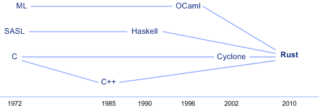

# Rust

> A safe, concurrent, practical language(安全、并行、实用)

> 主要开发者

- _Brian Anderson (Mozilla 2011-2017)_
- _Niko Matsakis_
- _Brendan Eich(js 之父)_
- _Dave Herman_
- _Graydon Hoare_
- _Wesley Moore_


*参考地址*：

- [https://github.com/rust-lang/rust](https://github.com/rust-lang/rust)
- [[https://www.rust-lang.org](https://www.rust-lang.org/)]
- 中文文档： 
  - [github](https://github.com/KaiserY/trpl-zh-cn)
  - [Rust 程序设计语言-简体中文](https://kaisery.github.io/trpl-zh-cn/)


> **Rust** 是一种系统编程语言。 它有着惊人的运行速度，能够防止段错误，并保证线程安全。 


> 特点

- 零开销抽象
- 转移语义
- 保证内存安全
- 线程无数据竞争
- 基于 trait 的泛型
- 模式匹配
- 类型推断
- 极小运行时
- 高效 C 绑定 


*在 Rust 中引入并行是相对低风险的操作：编译器会为你捕获经典的错误。*

*在 Rust 中，变量默认是不可变的*


> rustc uses LLVM as its back end. 使用 **LLVM** 作为后端


> 家谱图




> 方向

- *底层系统编程*
- *CLI Application*
- *Web Server*


> Rust 工具

- *cargo*                 依赖管理器和构建工具
- *rustfmt*              代码格式化
- *Rust Language Server*
- *rustup*               rust 安装工具


> window 使用 **rustup/rust**

```powershell
# 更新 rust
$ rustup update 
# 卸载 rust/rustup
$ rust self uninstall

# 查看版本
$ rustc --version
$ cargo --version
```


> 复杂/重要的概念

- 所有权
- 生命周期
- 范类
- trait
- 并发


## 基础学习

- __不能在相同作用域中同时存在可变和不可变引用的规则。__
- __Rust 倾向于确保暴露出可能的错误__
- __字符串字面值不可变__
  - 字符串值(str)被硬编码进程序里。字符串字面值是很方便的，不过他们并不适合使用文本的每一种场景。原因之一就是他们是不可变的
- __Rust 永远也不会自动创建数据的 “深拷贝”。因此，任何 **自动** 的复制可以被认为对运行时性能影响较小。__
- **Rust 没有反射的能力，因此其无法在运行时获取类型名。**
- **通过所有权系统管理内存，编译器在编译时会根据一系列的规则进行检查。(内存管理)**
- **变量默认为不可变。**


*实现变量时：注意自始到终的顺序*


> HelloWorld

```rust
// main.rs
// Rust 的缩进风格使用 4 个空格，而不是 1 个制表符（tab）
// 运行: >rustc main.rs
fn main(){
    println!("Hello, world!");
}
```


> 变量/常量

*变量默认是不可改变的（immutable）; 常量（constants）不光默认不能变，它总是不能变。*

*常量可以在任何作用域中声明，包括全局作用域*

*定义一个与之前变量同名的新变量，而新变量会 **隐藏** 之前的变量。Rustacean 们称之为第一个变量被第二个 **隐藏** 了，这意味着使用这个变量时会看到第二个值。*

*`mut` 与隐藏的一个区别是，当再次使用 `let` 时，实际上创建了一个新变量，我们可以改变值的类型，但复用这个名字。*

```rust
// immutable
let x = 5;
// mutable
let mut y = 8;
// constant
const MAX_POINTS: u32 = 100_000;

//  隐藏/ shadowing; x = 25
let x = x * x;
```


### 数据类型

> date type

- 数据类型
  - 标量（scalar）
    - 整型 (int)
      - i32      *默认*
    - 浮点型 (float)
      - f32
      - f64      *默认*
    - 布尔类型(bool)
      - `bool: true/false`
    - 字符类型(char)
  - 复合（compound)
    - 元组 (tuple)
    - 数组 (array)


*字符类型: `char` 由单引号指定，不同于字符串使用双引号。*

*元组是一个将多个其他类型的值组合进一个复合类型的主要方式。使用 `.` 访问对应的索引、模式匹配解构元组值*

*Rust 中的数组是固定长度的：一旦声明，它们的长度不能增长或缩小。与元组不同，数组中的每个元素的类型必须相同。*

```rust
// 元组
let tup: (i32, f64, u8) = (500, 6.4, 1);

// 代码解构
let tup = (500, 6.4, 1);
let (x, y, z) = tup;


let x: (i32, f64, u8) = (500, 6.4, 1);
let five_hundred = x.0;
let six_point_four = x.1;
let one = x.2;
```


不带任何值的元组有个特殊的名称，叫做 单元（unit）元组。这种值以及对应的类型都写作 `()`，表示**空**
**值或空的返回类型**。如果表达式不返回任何其他值，则会隐式返回单元值。


数组

```rust
fn main(){
    let t_array = [1, 9, 4, 9];
    // 指定长度
    let t_array2: [i32; 4] = [1, 9, 4, 9];
    let v2 = t_array2[2];
}
```


> 整型 （8,16,32,64）

| 长度   | 有符号  | 无符号  |
| ------ | ------- | ------- |
| 8-bit  | `i8`    | `u8`    |
| 16-bit | `i16`   | `u16`   |
| 32-bit | `i32`   | `u32`   |
| 64-bit | `i64`   | `u64`   |
| arch   | `isize` | `usize` |


> 数字字面值

| 数字字面值       | 例子          |
| ---------------- | ------------- |
| Decimal          | `98_222`      |
| Hex              | `0xff`        |
| Octal            | `0o77`        |
| Binary           | `0b1111_0000` |
| Byte (`u8` only) | `b'A'`        |


> 数值运算

`+ 加, - 减, * 乘, / 除, % 取余`


### 注释

- 普通注释

- *documentation comments/文档注释*


`// 单行注释 ` 单行注释

`/// 文档注释 `    *它们会生成 HTML文档，支持 Markdown 注解来格式化文本。`$ cargo doc` 可生成文档， `$ cargo doc --open` 会构建当前 crate 文档（同时还有所有 crate 依赖的文档）的 HTML 并在浏览器中打开*


### 函数(fn)

*`main` 函数，它是很多程序的入口点。你也见过 `fn` 关键字，它用来声明新函数。*

*Rust 代码中的函数和变量名使用 __snake case__ 规范风格。在 __snake case__ 中，所有字母都是小写并使用下划线分隔单词。*

*Rust 是一门基于表达式（expression-based）的语言，这是一个需要理解的（不同于其他语言）重要区别。*

_**语句**（*Statements*）是执行一些操作但不返回值的指令。表达式（*Expressions*）计算并产生一个值。_

*我们用来创建新作用域的大括号（代码块），`{}`，也是一个表达式*

表达式的结尾没有分号。如果在表达式的结尾加上分号，它就变成了语句，而语句不会返回值。


> 参数

*参数是特殊变量，是函数签名的一部分。当函数拥有参数（形参）时，可以为这些参数提供具体的值（实参）*


> 使用元组来返回多个值

```rust
fn calculate_length(s: String) -> (String, usize) {
    let length = s.len(); // len() 返回字符串的长度

    (s, length)
}
```


### 控制流

*Rust 代码中最常见的用来控制执行流的结构是 `if` 表达式和循环。*

_代码中的条件 **必须** 是 `bool` 值。如果条件不是 `bool` 值，我们将得到一个错误。_


**条件控制**

> `if - else if - else`    多重条件

```rust
// if-else 语句
fn if_test(){
    if expr1 {
    }else if expr2 {
    }else if exprn {
    }else{
    }
    
    // if let
    let number = if condition { 5 } else { 6 };
}
```


**循环控制**

*Rust 有三种循环：`loop`、`while` 和 `for`。*

- `loop` 重复执行
- `while` 条件循环
- `for` 遍历循环


```rust
fn main(){
    loop{
        println!('无限循环');
    }
    
    // loop let
    let mut counter = 0;
    let result = loop {
    	counter += 1;
    if counter == 10 {
    	break counter * 2; }
    };
    
    
    // while 循环
    while exp1{
        // 语句...
    }
    
    // for
    let ais = [1, 9, 9, 2, 0, 2, 0];
    for ai in ais{
        println!("ai: {ai}");
    }
    
    // HashMap
    use std::collections::HashMap;
    let mut scores = HashMap::new();
    scores.insert(String::from("Blue"), 10);
    scores.insert(String::from("Yellow"), 50);
    for (key, value) in &scores {
	    println!("{}: {}", key, value);
    }
}
```


### 所有权


> 要点

- Rust 永远也不会自动创建数据的 “深拷贝”，因此自动的复制可认作运行性能影响最小
- 变量与数据交互的方式
  - 移动（自动）
  - 克隆（clone）   *堆上的变量*
- 变量在作用域前自动执行 `drop` 函数（堆上的变量）
- 任何简单标量值的组合可以是 Copy 的，任何需要分配内存，或者本身就是某种形式资源的类型不会是 Copy 的
- 返回值也可以转移作用域
- 变量的所有权总是遵循相同的模式：将值赋值给另一个变量时移动它。当持有堆中数据值的变量离开作用域时，其值将通过 drop 被清理掉，除非数据被移动为另一个变量所有。 
- 引用(`&`) : 允许使用值但不获取其所有权（解引用 `*`），【借用】


*所有权（系统）是 Rust 最独特的功能，其令 Rust 无需垃圾回收（garbage collector）即可保障内存安全。Rust 的核心功能（之一）是 **所有权**（*ownership*）*


*所有运行的程序都必须管理其使用计算机内存的方式。*

- *`垃圾回收机制`       在程序运行时不断地寻找不再使用的内存: Java/Go等*
- *`程序员必须亲自分配和释放内存`:  C/C++等*
- *`通过所有权系统管理内存，编译器在编译时会根据一系列的规则进行检查`:  Rust等*


*内存与分配： Rust 采取了一个不同的策略：内存在拥有它的变量离开作用域后就被自动释放（drop方法）。*

```rust
// 创建可变字符串
let mut s = String::from("Joshua Conero is");

s.push_str(" learning Rust.");

// Joshua Conero is learning Rust.
println!("{}", s);

```


> 所有权规则

1. Rust 中的每一个值都有一个被称为其 **所有者**（*owner*）的变量。
2. 值有且只有一个所有者。
3. 当所有者（变量）离开作用域，这个值将被丢弃。


```rust
{
    let s = String::from("hello"); // 从此处起，s 是有效的
    // 使用 s
}                                  // 此作用域已结束，
                                   // s 不再有效
// 说明：
//  这是一个将 String 需要的内存返回给操作系统的很自然的位置：当 s 离开作用域的时候。当变量离开作用域，Rust 为我们调用一个特殊的函数。这个函数叫做 drop，在这里 String 的作者可以放置释放内存的代码。Rust 在结尾的 } 处自动调用 drop。
```


> 变量与数据交互的方式:

- 移动
- 克隆

```rust
let x = 5;
let y = x;

//  s1 被 移动 到了 s2 中
let s1 = String::from("hello");
let s2 = s1;

println!("{}, world!", s1);		// error[E0382]: use of moved value: `s1`

// 当我们将 s1 赋值给 s2，String 的数据被复制了，这意味着我们从栈上拷贝了它的指针、长度和容量。我们并没有复制指针指向的堆上数据。
// 这就有了一个问题：当 s2 和 s1 离开作用域，他们都会尝试释放相同的内存。这是一个叫做 二次释放（double free）的错误，也是之前提到过的内存安全性 bug 之一。两次释放（相同）内存会导致内存污染，它可能会导致潜在的安全漏洞。
// 与其尝试拷贝被分配的内存，Rust 则认为 s1 不再有效，因此 Rust 不需要在 s1 离开作用域后清理任何东西
```

> String 克隆

```rust
let s1 = String::from("hello");
let s2 = s1.clone();

println!("s1 = {}, s2 = {}", s1, s2);
```

> 只在栈上的数据： 拷贝

如类型:  整形、布尔、浮点型、字符型(char)、元组


> 所有权与函数

*将值传递给函数在语义上与给变量赋值相似。向函数传递值可能会移动或者复制，就像赋值语句一样。*

```rust
fn main() {
    let s = String::from("hello");  // s 进入作用域

    takes_ownership(s);             // s 的值移动到函数里...
                                    // ... 所以到这里不再有效

    let x = 5;                      // x 进入作用域

    makes_copy(x);                  // x 应该移动函数里，
                                    // 但 i32 是 Copy 的，所以在后面可继续使用 x

} // 这里, x 先移出了作用域，然后是 s。但因为 s 的值已被移走，
  // 所以不会有特殊操作

fn takes_ownership(some_string: String) { // some_string 进入作用域
    println!("{}", some_string);
} // 这里，some_string 移出作用域并调用 `drop` 方法。占用的内存被释放

fn makes_copy(some_integer: i32) { // some_integer 进入作用域
    println!("{}", some_integer);
} // 这里，some_integer 移出作用域。不会有特殊操作
```


> 返回值与作用域

*返回值也可以转移所有权。*

```rust
fn main() {
    let s1 = gives_ownership();         // gives_ownership 将返回值
                                        // 移给 s1

    let s2 = String::from("hello");     // s2 进入作用域

    let s3 = takes_and_gives_back(s2);  // s2 被移动到
                                        // takes_and_gives_back 中, 
                                        // 它也将返回值移给 s3
} // 这里, s3 移出作用域并被丢弃。s2 也移出作用域，但已被移走，
  // 所以什么也不会发生。s1 移出作用域并被丢弃

fn gives_ownership() -> String {             // gives_ownership 将返回值移动给
                                             // 调用它的函数

    let some_string = String::from("hello"); // some_string 进入作用域.

    some_string                              // 返回 some_string 并移出给调用的函数
}

// takes_and_gives_back 将传入字符串并返回该值
fn takes_and_gives_back(a_string: String) -> String { // a_string 进入作用域

    a_string  // 返回 a_string 并移出给调用的函数
}
```


*__变量的所有权总是遵循相同的模式：将值赋给另一个变量时移动它。当持有堆中数据值的变量离开作用域时，其值将通过 `drop` 被清理掉，除非数据被移动为另一个变量所有。__*

Rust 不允许自身或其任何部分实现了 Drop trait 的类型使用 Copy trait。


#### 引用与借用

_`&` 符号就是 **引用**，它们允许你使用值但不获取其所有权。与使用 `&` 引用相反的操作是 **解引用**（*dereferencing*），它使用解引用运算符，`*`。_


_函数签名使用 `&` 来表明参数 `s` 的类型是一个引用。让我们增加一些解释性的注释：_

```rust
fn calculate_length(s: &String) -> usize { // s 是对 String 的引用
    s.len()
} // 这里，s 离开了作用域。但因为它并不拥有引用值的所有权，
  // 所以什么也不会发生
```

_变量 `s` 有效的作用域与函数参数的作用域一样，不过当引用离开作用域后并不丢弃它指向的数据，因为我们没有所有权。当函数使用引用而不是实际值作为参数，无需返回值来交还所有权，因为就不曾拥有所有权。_

_我们将获取引用作为函数参数称为 **借用**（*borrowing*）。正如现实生活中，如果一个人拥有某样东西，你可以从他那里借来。当你使用完毕，必须还回去。_


> 可变引用

*可变引用有一个很大的限制：在特定作用域中的特定数据有且只有一个可变引用。*

正如变量默认是不可变的，引用也一样。（默认）不允许修改引用的值。可使用：`&mut v;`

如果你有一个对该变量的可变引用，你就不能再创建对该变量的引用；也不能在拥有不可变引用的同时拥有可变引用。


> 引用的规则

- 在任意给定时间，**要么** 只能有一个可变引用，**要么** 只能有多个不可变引用。
- 引用必须总是有效


#### slice

_另一个没有所有权的数据类型是 *slice*。slice 允许你引用集合中一段连续的元素序列，而不用引用整个集合。_


> `slice 字符串`

```rust
let s = String::from("hello world");

let hello = &s[0..5];
// 如果想要从第一个索引（0）开始，可以不写两个点号之前的值。
let hello = &s[..5];
let world = &s[6..11];

let len = s.len();
// 如果 slice 包含 String 的最后一个字节，也可以舍弃尾部的数字。
let slice = &s[3..len];
let slice = &s[3..];

// 也可以同时舍弃这两个值来获取整个字符串的 slice。
let slice = &s[..];
```

_`start..end` 语法代表一个以 `start` 开头并一直持续到但不包含 `end` 的 range。_


*字符串字面值就是 slice*

```rust
let s = "Joshua Conero";
```

这里 `s` 的类型是 `&str`：它是一个指向二进制程序特定位置的 slice。这也就是为什么字符串字面值是不可变的；`&str` 是一个不可变引用。


> 其他类型的 slice

```rust
let a = [1, 2, 3, 4, 5];
let slice = &a[1..3];
```


#### 堆 stack/栈 heap

*栈和堆都是代码在运行时可供使用的内存，但是它们的结构不同。*


*栈 __后进先出__(last in, first out), 有 __进栈__ 和 __出栈__ 操作（出入栈操作）；大小固定，处理速度快。*

_栈的操作是十分快速的，这主要是得益于它存取数据的方式：因为数据存取的位置总是在栈顶而不需要寻找一个位置存放或读取数据。另一个让操作栈快速的属性是，栈中的所有数据都必须占用已知且固定的大小。_


堆：大小未知，需要动态分配和内存回收；分配和回收。

_`堆` 在编译时大小未知或大小可能变化的数据，要改为存储在堆上。堆是缺乏组织的：当向堆放入数据时，你要请求一定大小的空间。操作系统在堆的某处找到一块足够大的空位，把它标记为已使用，并返回一个表示该位置地址的 **指针**（*pointer*）。这个过程称作 **在堆上分配内存**（*allocating on the heap*），有时简称为 “分配”（allocating）。将数据推入栈中并不被认为是分配。因为指针的大小是已知并且固定的，你可以将指针存储在栈上，不过当需要实际数据时，必须访问指针。_


### 结构体

*struct*，或者 *structure*，是一个自定义数据类型，允许你命名和包装多个相关的值，从而形成一个有意义的组合。

*和元组一样，结构体的每一部分可以是不同类型。但不同于元组，结构体需要命名各部分数据以便能清楚的表明其值的意义。由于有了这些名字，结构体比元组更灵活：不需要依赖顺序来指定或访问实例中的值。*

```rust
// 创建结构体（样板）
struct User{
    name: String,    
    sex: String,
    age: i32,
    logined: bool,
};

// 定义 User 结构体
let jc = User {
    name: String::from("Joshua Conero")，
    sex: String::from("M"),
    age: 22,
    logined: true,
};

println!("age: {}", jc.age);


// 定义 User 结构体
let jc = User {
    name: String::from("Joshua Conero")，
    sex: String::from("M"),
    age: 22,
    logined: true,
};

// 变量与字段同名时的字段初始化简写语法
fn build_user(name: String, sex: String) -> User {
    User {
        name,
        sex,
        age: 0,
    	logined: true,
    }
}

// 使用结构体更新语法从其他实例创建实例
let mut sr = User {
    name: String::from("Susanna Jahn"),
    sex: "F",
    age: jc.age,
    ..jc
}
// 打印 sr 变量
println!("sr is {:?}", sr);
```


> 元组结构体

_也可以定义与元组类似的结构体，称为 **元组结构体**（*tuple structs*）。元组结构体有着结构体名称提供的含义，但没有具体的字段名，只有字段的类型。当你想给整个元组取一个名字，并使元组成为与其他元组不同的类型时，元组结构体是很有用的，这时像常规结构体那样为每个字段命名就显得多余和形式化了。_

```rust
struct Color(i32, i32, i32);
struct Point(i32, i32, i32);

let black = Color(0, 0, 0);
let origin = Point(0, 0, 0);
```


无任何字段的类单元结构体：类似于空元组即单元元组参数 `()`

```rust
struct UnitStruct;	//类单元结构体

fn main(){
    let us = UnitStruct;
    let empty_em = ();
}
```


> 方法

_**方法** 与函数类似：它们使用 `fn` 关键字和名称声明，可以拥有参数和返回值，同时包含在某处调用该方法时会执行的代码。不过方法与函数是不同的，因为它们在结构体的上下文中被定义（或者是枚举或 trait 对象的上下文），并且它们第一个参数总是 `self`，它代表调用该方法的结构体实例。_


_**关联函数**             `impl` 块的另一个有用的功能是：允许在 `impl` 块中定义 **不** 以 `self` 作为参数的函数。这被称为 **关联函数**（*associated functions*），因为它们与结构体相关联。它们仍是函数而不是方法，因为它们并不作用于一个结构体的实例。_


```rust
// 创建结构体
struct User{
    name: String,    
    sex: String,
    age: i32,
    logined: bool,
};

//  impl 块（impl 是 implementation 的缩写）
impl User{
    // 定义方法
    // 第一个参数为 self， 与 python 相似
    fn toString(self){
        println!("The guy, {}. sex: {}, age {}. logined status like {}", 
        	self.name, self.sex, self.age. self.logined
        );
    }
    // &self 方法可以选择获取 self 的所有权
    fn addAge(&self, age i32){
        self.age = age;
    }
    // 关联函数经
    // 关联函数经常被用作返回一个结构体新实例的构造函数
    fn male(name: String) -> User{
        User {
            name,
            sex: String::from("M"),
            age: 0,
            logined: false,
        }
    }
}

// 每个结构体都允许拥有多个 impl 块。
impl User{
    fn is_login(&self) -> bool {
        return self.logined
    }
}

fn main(){
    let jc = User {
        name: String::from("Joshua Conero")，
        sex: String::from("M"),
        age: 22,
        logined: true,
    };
    // 调用方法
    jc.addAge(1);
    jc.toString();
    
    // 调用关联函数
    let mut jc2 = User::male(String::from("Joshua Conero"));
    jc2.age = 22;
    jc2.toString();
}
```

`dbg!` 宏接收一个表达式的所有权（与 `println!`宏相反，后者接收的是引用），打印出代码中调用 dbg! 宏时所在的文件和行号，以及该表达式的结果值，并返回该值的所有权。


### 枚举

**枚举**（*enumerations*），也被称作 *enums*。枚举允许你通过列举可能的值来定义一个类型。

枚举是一个很多语言都有的功能，不过不同语言中其功能各不相同。Rust 的枚举与 F#、OCaml 和 Haskell 这样的函数式编程语言中的 **代数数据类型**（*algebraic data types*）最为相似。


```rust
// 方向
// top 等称为枚举的成员
enum Direction{
    top, bottom,right,left,
}

// 访问其成员
Direction::top;
// 标题栏
struct titleBar{
    dct: Direction,
    text: String,
}

let topTitleBar = titleBar {
    dct: Direction::top,
    text: String::from("welcome to the Rust World."),
}


// 性别
enum Gender{
    M(String),
    F(String)
}
let man = Gender::M(String::from("man"));
let woman = Gender::F(String::from("woman"));

// 枚举其他
enum IpAddr {
    //name(type)
    V4(u8, u8, u8, u8),
    V6(String),
}

let home = IpAddr::V4(127, 0, 0, 1);
let loopback = IpAddr::V6(String::from("::1"));
```


#### option-枚举

_`Option` 是标准库定义的另一个枚举。`Option` 类型应用广泛因为它编码了一个非常普遍的场景，即一个值要么有值要么没值。_


_关于**空值 / null**。 问题不在于概念而在于具体的实现。为此，Rust 并没有空值，不过它确实拥有一个可以编码存在或不存在概念的枚举。这个枚举是 `Option<T>`，而且它[定义于标准库中](https://doc.rust-lang.org/std/option/enum.Option.html)，如下:_

```rust
enum Option<T> {
    Some(T),
    None,
}
```


#### match-控制流运算符

_Rust 有一个叫做 `match` 的极为强大的控制流运算符，它允许我们将一个值与一系列的模式相比较并根据相匹配的模式执行相应代码。模式可由字面值、变量、通配符和许多其他内容构成。_

```rust
// 使用 枚举 做模式匹配
enum Coin {
    Penny,
    Nickel,
    Dime,
    Quarter,
}

fn value_in_cents(coin: Coin) -> u32 {
    match coin {
        Coin::Penny => {
            println!("Lucky penny!");
            1
        },
        Coin::Nickel => 5,
        Coin::Dime => 10,
        Coin::Quarter => 25,
    }
}
```


> 绑定值的模式

*匹配分支的另一个有用的功能是可以绑定匹配的模式的部分值。这也就是如何从枚举成员中提取值的。*

```rust
enum UsState {
    Alabama,
    Alaska,
    // ... etc
}

enum Coin {
    Penny,
    Nickel,
    Dime,
    Quarter(UsState),
}

fn value_in_cents(coin: Coin) -> u32 {
    match coin {
        Coin::Penny => 1,
        Coin::Nickel => 5,
        Coin::Dime => 10,
        Coin::Quarter(state) => {
            println!("State quarter from {:?}!", state);
            25
        },
    }
}
```


> 匹配 Option<T>

**匹配是穷尽的**

```rust
// 空值配置
fn plus_one(x: Option<i32>) -> Option<i32> {
    match x {
        // 匹配空
        None => None,
        // 非空
        Some(i) => Some(i + 1),
    }
}

let five = Some(5);
let six = plus_one(five);
let none = plus_one(None);


// _通配符
let some_u8_value = 0u8;
match some_u8_value {
    1 => println!("one"),
    3 => println!("three"),
    5 => println!("five"),
    7 => println!("seven"),
    // 通配符
    _ => (),
}
```


#### if-let-简单控制流

_`if let` 获取通过 `=` 分隔的一个模式和一个表达式。它的工作方式与 `match` 相同，这里的表达式对应 `match` 而模式则对应第一个分支。换句话说，可以认为 `if let` 是 `match` 的一个语法糖，它当值匹配某一模式时执行代码而忽略所有其他值。_

```rust
let some_u8_value = Some(0u8);
match some_u8_value {
    Some(3) => println!("three"),
    _ => (),
}

// 前后等价
if let Some(3) = some_u8_value {
    println!("three");
}
```


### 模块/module

**模块**（*module*）是一个包含函数或类型定义的命名空间，你可以选择这些定义能（公有）或不能（私有）在其模块外可见。下面是一个模块如何工作的梗概：

- 使用 `mod` 关键字声明新模块。此模块中的代码要么直接位于声明之后的大括号中，要么位于另一个文件。
- 函数、类型、常量和模块默认都是私有的。可以使用 `pub` 关键字将其变成公有并在其命名空间之外可见。
- `use` 关键字将模块或模块中的定义引入到作用域中以便于引用它们。


_因为枚举也像模块一样组成了某种命名空间，也可以使用 `use` 来导入枚举的成员。对于任何类型的 `use`语句，如果从一个命名空间导入多个项，可以在最后使用大括号和逗号来列举它们_

_为了一次将某个命名空间下的所有名称都引入作用域，可以使用 `*` 语法，这称为 **glob 运算符**（*glob operator*）。_

_使用-super-访问父模块_

```rust
pub mod A{
    pub fn test(){}    
    
    pub mod B{
        pub fn test(){
            // 访问父模块
            super::test();
        }
    }
    
    // 私有模式
    mod inner{}
    
    // 外部可访问的方法
    pub fn name(){}
    pub mod F{
        pub mod FF{
            //
        }
    }
    pub mod I{}
}

use A::B;
use A::test;
use A::{F, I};  // 如果从一个命名空间导入多个项，可以在最后使用大括号和逗号来列举它们
use A::F::*;    // 为了一次将某个命名空间下的所有名称都引入作用域，可以使用 * 语法，这称为 glob 运算符（glob operator）。
fn main(){
    A::test();
    A::B::test();
    B::test();
    test();
}
```


> mod-和文件系统

__Rust 默认只知道 *src/lib.rs* 中的内容。如果想要对项目加入更多文件，我们需要在 *src/lib.rs* 中告诉 Rust 去寻找其他文件。__


**模块文件系统规则：**

- 如果一个叫做 `foo` 的模块没有子模块，应该将 `foo` 的声明放入叫做 *foo.rs* 的文件中。
- 如果一个叫做 `foo` 的模块有子模块，应该将 `foo` 的声明放入叫做 *foo/mod.rs* 的文件中。


*读取模块信息： `Rust -> src/lib.rs -> ~/mod.rs`*


**私有性规则**

1. 如果一个项是公有的，它能被任何父模块访问
2. 如果一个项是私有的，它能被其直接父模块及其任何子模块访问


### 通用集合类型

> 查看      `std::collections`

_Rust 标准库中包含一系列被称为 **集合**（*collections*）的非常有用的数据结构。大部分其他数据类型都代表一个特定的值，不过集合可以包含多个值。不同于内建的数组和元组类型，这些集合指向的数据是储存在堆上的，这意味着数据的数量不必在编译时就已知并且可以随着程序的运行增长或缩小。_

*集合存于__堆(heap)__上*


*常用的集合类型：*

- Vector                                     *允许我们一个挨着一个地储存一系列数量可变的值*
- 字符串 (string)                        *是字符的集合*
- 哈希 Map (hash map)           *k-v 数据键值对*


*其地址为一直长度的变量，包含： 指针、长度和容量(ptr,len,capacity)。*


#### Vector

`Vec<T>`   *vector 允许我们在一个单独的数据结构中储存多于一个的值，它在内存中彼此相邻地排列所有的值。vector 只能储存相同类型的值。vector 是用泛型实现的。*


```rust
// 新建 Vector
// 注意这里我们增加了一个类型注解。因为没有向这个 vector 中插入任何值，Rust 并不知道我们想要储存什么类型的元素。这是一个非常重要的点。
let x: Vec<i32> = Vec::new();

// 使用宏定义 Vector；使用初始值创建宏
let y = vec![1, 2, 3];


// 更新 Vector
// 1. 使用 push 方法向 vector 增加值
x.push(5);
x.push(6);
y.push(99);

// 读取值
let x1: &i32 = &x[0];
let y1: Option<&i32> = y.get(0);

// 遍历
for i in &y{
    println!("{}", i);
}
```


#### 字符串

- `str` 字符串字面值，硬编码的方式，不可变。

- _`String` 类型，为了支持一个可变，可增长的文本片段，需要在堆上分配一块在编译时未知大小的内存来存放内容。_

_Rust 的核心语言中只有一种字符串类型：`str`，字符串 slice，它通常以被借用的形式出现，`&str`。_


```rust
// 新建字符串(空字符)
let mut s = String::new();

// 带初始值字符串
let data = "initial contents";
let s = data.to_string();
let s = String::from("initial contents");

// the method also works on a literal directly:
let s = "initial contents".to_string();
```


> 更新字符串

- 使用-push-附加字符串
- 使用--运算符或-format-宏连接字符串


_`String` 的大小可以增长其内容也可以改变，就像可以放入更多数据来改变 `Vec` 的内容一样。另外，`String` 实现了 `+` 运算符作为连接运算符以便于使用。_

```rust
let mut s = String::from("foo");
s.push_str("bar");
// s => "foo bar"

let mut s1 = String::from("Joshu");
s1.push('a');
// s1 -> "Joshua"
```


使用`+` 符号更新字符串

```rust
let s1 = String::from("Hello");
let s2 = String::from("world!");

let s3 = s1 + " " + &s2; // note s1 has been moved here and can no longer be used
let s3 = format!("{} {}", s1, s2);

// 遍历字符串
for b in s1.bytes(){
    println!("{}", b);
}
```


#### 哈希 map

_`HashMap<K, V>` 类型储存了一个键类型 `K` 对应一个值类型 `V` 的映射。它通过一个 **哈希函数**（*hashing function*）来实现映射，决定如何将键和值放入内存中。_

_同样类似于 vector，哈希 map 是同质的：所有的键必须是相同类型，值也必须都是相同类型。_


*新建哈希 map,通过 insert 更新值。可以通过 `get` 方法并提供对应的键来从哈希 map 中获取值。*

```rust
use std::collections::HashMap;
// method 1
let mut scores = HashMap::new();

scores.insert(String::from("Blue"), 10);
scores.insert(String::from("Yellow"), 50);
// 读取值
let key = "Blue".to_string();
println!("{}", scores.get(&key));	// => 10
// 循环, map
for (k, v) in &scores {
    println!("{}: {}", k, v);
}
println!("{:?}", scores);
// 检测 scores 是否存在 "Red" 键值，不存在就新增子 => Red ~ 50
scores.entry(String::from("Red")).or_insert(50);


// method 2
let teams  = vec![String::from("Blue"), String::from("Yellow")];
let initial_scores = vec![10, 50];

let scores: HashMap<_, _> = teams.iter().zip(initial_scores.iter()).collect();
```


### 错误处理

_Rust 将错误组合成两个主要类别：**可恢复错误**（*recoverable*）和 **不可恢复错误**（*unrecoverable*）。可恢复错误通常代表向用户报告错误和重试操作是合理的情况，比如未找到文件。不可恢复错误通常是 bug 的同义词，比如尝试访问超过数组结尾的位置。_


>  **Panic 中的栈展开与终止**

当出现 `panic!` 时，程序默认会开始 **展开**（*unwinding*），这意味着 Rust 会回溯栈并清理它遇到的每一个函数的数据，不过这个回溯并清理的过程有很多工作。另一种选择是直接 **终止**（*abort*），这会不清理数据就退出程序。那么程序所使用的内存需要由操作系统来清理。如果你需要项目的最终二进制文件越小越好，panic 时通过在 *Cargo.toml* 的 `[profile]` 部分增加 `panic = 'abort'`，可以由展开切换为终止。例如，如果你想要在release模式中 panic 时直接终止：

```toml
[profile.release]
panic = 'abort'
```


> result-与可恢复的错误

```rust
enum Result<T, E> {
    Ok(T),
    Err(E),
}
```


> **Result 例子**

```rust
use std::fs::File;

fn main() {
    let f = File::open("hello.txt");
	// 使用 match 处理 Result
    let f = match f {
        Ok(file) => file,
        Err(error) => {
            panic!("There was a problem opening the file: {:?}", error)
        },
    };
}
```


*匹配不同的错误*

```rust
use std::fs::File;
use std::io::ErrorKind;

fn main() {
    let f = File::open("hello.txt");

    let f = match f {
        Ok(file) => file,
        Err(ref error) if error.kind() == ErrorKind::NotFound => {
            match File::create("hello.txt") {
                Ok(fc) => fc,
                Err(e) => {
                    panic!(
                        "Tried to create file but there was a problem: {:?}",
                        e
                    )
                },
            }
        },
        Err(error) => {
            panic!(
                "There was a problem opening the file: {:?}",
                error
            )
        },
    };
}
```


*失败时-panic-的简写unwrap-和-expect*

- 如果 `Result` 值是成员 `Ok`，`unwrap` 会返回 `Ok` 中的值。如果 `Result` 是成员 `Err`，`unwrap` 会为我们调用 `panic!`。
- 另一个类似于 `unwrap` 的方法它还允许我们选择 `panic!` 的错误信息：`expect`。使用 `expect` 而不是 `unwrap` 并提供一个好的错误信息可以表明你的意图并更易于追踪 panic 的根源。

`expect` 与 `unwrap` 的使用方式一样：返回文件句柄或调用 `panic!` 宏。`expect` 用来调用 `panic!` 的错误信息将会作为参数传递给 `expect` ，而不像`unwrap` 那样使用默认的 `panic!` 信息。


*回调处理 Result*

```rust
use std::io;
use std::io::Read;
use std::fs::File;

fn read_username_from_file() -> Result<String, io::Error> {
    let f = File::open("hello.txt");

    let mut f = match f {
        Ok(file) => file,
        Err(e) => return Err(e),
    };

    let mut s = String::new();

    match f.read_to_string(&mut s) {
        Ok(_) => Ok(s),
        Err(e) => Err(e),
    }
}
```


*传播错误的简写 `?`*

```rust
use std::io;
use std::io::Read;
use std::fs::File;

fn read_username_from_file() -> Result<String, io::Error> {
    let mut f = File::open("hello.txt")?;
    let mut s = String::new();
    f.read_to_string(&mut s)?;
    Ok(s)
}
```


*错误处理指导原则*

- 有害状态并不包含 **预期** 会偶尔发生的错误
- 之后的代码的运行依赖于处于这种有害状态
- 当没有可行的手段来将有害状态信息编码进所使用的类型中的情况


### 泛型trait-和生命周期

*泛型是具体类型或其他属性的抽象替代。泛型用于为函数签名或结构体等创建定义，允许我们创建许多不同的具体数据类型。*

*定义函数时可以在函数签名的参数数据类型和返回值中使用泛型。以这种方式编写的代码将更灵活并能向函数调用者提供更多功能，同时不引入重复代码。*


> *函数使用范类*

```rust
fn largest<T>(list: &[T]) -> T {
    let mut largest = list[0];

    for &item in list.iter() {
        if item > largest {
            largest = item;
        }
    }

    largest
}

fn main() {
    let number_list = vec![34, 50, 25, 100, 65];

    let result = largest(&number_list);
    println!("The largest number is {}", result);

    let char_list = vec!['y', 'm', 'a', 'q'];

    let result = largest(&char_list);
    println!("The largest char is {}", result);
}
```


> 结构体定义中的泛型

```rust
struct Area<T, U>{
    w: T,
    h: T,
    a: T,
    s: U,
}
```


#### trait定义共享的行为(接口)

> **默认实现**

_有时为 trait 中的某些或全部方法提供默认的行为，而不是在每个类型的每个实现中都定义自己的行为是很有用的。这样当为某个特定类型实现 trait 时，可以选择保留或重载每个方法的默认行为。_


*定义 trait*

```rust
// 定义 trait
trait A{
    // 定义方法，但是不具体实现它
    fn name(&self) -> String;
    fn name2(&self);    
    
    // 默认实现
    fn about(&self) -> String {
        String::from("Joshua Conero. Use A.")
    }
}

// AStr 结构体
struct AStr{
    _name: String,
}

// AStr 实现 A trait
impl A for AStr{
    // 必须实现 name 相关方法
}
```


> **trait-bounds**

_我们可以限制泛型不再适用于任何类型，编译器会确保其被限制为那些实现了特定 trait 的类型，由此泛型就会拥有我们希望其类型所拥有的功能。这被称为指定泛型的 *trait bounds*。_


#### 生命周期与引用有效性

显式、隐式生命周期。

_Rust 中的每一个引用都有其 **生命周期**（*lifetime*），也就是引用保持有效的作用域。大部分时候生命周期是隐含并可以推断的，正如大部分时候类型也是可以推断的一样。类似于当因为有多种可能类型的时候必须注明类型，也会出现引用的生命周期以一些不同方式相关联的情况，<span style="color:blue;">所以 Rust 需要我们使用泛型生命周期参数来注明他们的关系，这样就能确保运行时实际使用的引用绝对是有效的</span>。_


<span style="color:blue;">生命周期的主要目标是避免悬垂引用，它会导致程序引用了非预期引用的数据。</span>


>  **生命周期注解语法**

```rust
&i32        // a reference
// 后两者存在的生命周期一样长
&'a i32     // a reference with an explicit lifetime
&'a mut i32 // a mutable reference with an explicit lifetime
```


*限制函数参数具有相同的生命周期*

```rust
fn longest<'a>(x: &'a str, y: &'a str) -> &'a str {
    if x.len() > y.len() {
        x
    } else {
        y
    }
}

fn main() {
    let string1 = String::from("abcd");
    let string2 = "xyz";

    let result = longest(string1.as_str(), string2);
    println!("The longest string is {}", result);
}
```


_当在函数中使用生命周期注解时，这些注解出现在函数签名中，而不存在于函数体中的任何代码中。这是因为 Rust 能够分析函数中代码而不需要任何协助，不过当函数引用或被函数之外的代码引用时，参数或返回值的生命周期可能在每次函数被调用时都不同。这可能会产生惊人的消耗并且对于 Rust 来说通常是不可能分析的。在这种情况下，我们需要自己标注生命周期。_


*生命周期注解并不改变任何引用的生命周期的长短。与当函数签名中指定了泛型类型参数后就可以接受任何类型一样，当指定了泛型生命周期后函数也能接受任何生命周期的引用。生命周期注解描述了多个引用生命周期相互的关系，而不影响其生命周期。*


```rust
// 如下可编译， y 与函数体无任何关联
fn longest<'a>(x: &'a str, y: &str) -> &'a str {
    x
}
```


*结构体*

```rust
struct ImportantExcerpt<'a> {
    part: &'a str,
}

fn main() {
    let novel = String::from("Call me Ishmael. Some years ago...");
    let first_sentence = novel.split('.')
        .next()
        .expect("Could not find a '.'");
    let i = ImportantExcerpt { part: first_sentence };
}
```


>  **生命周期省略规则**

_被编码进 Rust 引用分析的模式被称为 **生命周期省略规则**（*lifetime elision rules*）。这并不是需要程序员遵守的规则；这些规则是一系列特定的场景，此时编译器会考虑，如果代码符合这些场景，就无需明确指定生命周期。_

_函数或方法的参数的生命周期被称为 **输入生命周期**（*input lifetimes*），而返回值的生命周期被称为 **输出生命周期**（*output lifetimes*）。_


_生命周期省略规则。第一条规则适用于输入生命周期，后两条规则适用于输出生命周期。_

1. 每一个是引用的参数都有它自己的生命周期参数。换句话说就是，有一个引用参数的函数有一个生命周期参数：`fn foo<'a>(x: &'a i32)`，有两个引用参数的函数有两个不同的生命周期参数，`fn foo<'a, 'b>(x: &'a i32, y: &'b i32)`，依此类推。
2. 如果只有一个输入生命周期参数，那么它被赋予所有输出生命周期参数：`fn foo<'a>(x: &'a i32) -> &'a i32`。
3. 如果方法有多个输入生命周期参数，不过其中之一因为方法的缘故为 `&self` 或 `&mut self`，那么 `self` 的生命周期被赋给所有输出生命周期参数。这使得方法编写起来更简洁。


> **静态生命周期**

_`'static` 生命周期存活于整个程序期间。所有的字符串字面值都拥有 `'static` 生命周期_

```rust
let s: &'static str = "I have a static lifetime.";
```


### 测试


Rust 中的测试函数是用来验证非测试代码是否按照期望的方式运行的。测试函数体通常执行如下三种操作：

1. 设置任何所需的数据或状态
2. 运行需要测试的代码
3. 断言其结果是我们所期望的


_Rust 中的测试就是一个带有 `test` 属性注解的函数。属性（attribute）是关于 Rust 代码片段的元数据。为了将一个函数变成测试函数，需要在 `fn` 行之前加上 `#[test]`。当使用 `cargo test` 命令运行测试时，Rust 会构建一个测试执行程序用来调用标记了 `test` 属性的函数，并报告每一个测试是通过还是失败。_

```rust
#[cfg(test)]
mod tests {
    // 申明为测试函数
    #[test]
    fn it_works() {
        // 断言
        assert_eq!(2 + 2, 4);
    }
}
// 运行： $ cargo test
```

> **使用-assert-宏来检查结果**: _在希望确保测试中一些条件为 `true` 时非常有用。需要向 `assert!` 宏提供一个求值为布尔值的参数。如果值是 `true`，`assert!` 什么也不做，同时测试会通过。如果值为 `false`，`assert!` 调用 `panic!` 宏，这会导致测试失败。_


> **使用-assert_eq-和-assert_ne-宏来测试相等**: _测试功能的一个常用方法是将需要测试代码的值与期望值做比较，并检查是否相等。可以通过向 `assert!`宏传递一个使用 `==` 运算符的表达式来做到。不过这个操作实在是太常见了，以至于标准库提供了一对宏来更方便的处理这些操作：`assert_eq!` 和 `assert_ne!`。这两个宏分别比较两个值是相等还是不相等。当断言失败时他们也会打印出这两个值具体是什么，以便于观察测试 **为什么** 失败，而 `assert!` 只会打印出它从 `==` 表达式中得到了 `false` 值，而不是导致 `false` 的两个值。_


> **使用-should_panic-检查-panic** _除了检查代码是否返回期望的正确的值之外，检查代码是否按照期望处理错误也是很重要的。可以通过对函数增加另一个属性 `should_panic` 来实现这些。这个属性在函数中的代码 panic 时会通过，而在其中的代码没有 panic 时失败。_

```rust
pub struct Guess {
    value: u32,
}

impl Guess {
    pub fn new(value: u32) -> Guess {
        if value < 1 || value > 100 {
            panic!("Guess value must be between 1 and 100, got {}.", value);
        }

        Guess {
            value
        }
    }
}

#[cfg(test)]
mod tests {
    use super::*;

    #[test]
    #[should_panic]
    fn greater_than_100() {
        Guess::new(200);
    }
}
```


> **运行测试**

_默认情况下，当测试通过时，Rust 的测试库会截获打印到标准输出的所有内容。比如在测试中调用了 `println!` 而测试通过了，我们将不会在终端看到 `println!` 的输出：只会看到说明测试通过的提示行。如果测试失败了，则会看到所有标准输出和其他错误信息。_

```shell
$ crago test

# 查看参数/帮助
$ cargo test --help
$ cargo help test


# [options]
# $ cargo test [options]
# 传递 --test-threads 参数和希望使用线程的数量给测试二进制文件
--test-threads=1      
# 禁止 println! 的输出
--nocapture
# 排除指定的测试
--ignored

# 指定单个测试，通过名称。有多个函数时
$ cargo test <testName>

# 测试某个模块时
$ cargo test --test test_ip_address
```


*忽略指定的测试*

```rust
#[test]
fn it_works() {
    assert_eq!(2 + 2, 4);
}

#[test]
#[ignore]
fn expensive_test() {
    // code that takes an hour to run
}
```


> **单元测试**

_单元测试的目的是在与其他部分隔离的环境中测试每一个单元的代码，以便于快速而准确的某个单元的代码功能是否符合预期。单元测试与他们要测试的代码共同存放在位于 *src* 目录下相同的文件中。规范是在每个文件中创建包含测试函数的 `tests` 模块，并使用 `cfg(test)` 标注模块。_


_测试模块的 `#[cfg(test)]` 注解告诉 Rust 只在执行 `cargo test` 时才编译和运行测试代码，而在运行 `cargo build` 时不这么做。这在只希望构建库的时候可以节省编译时间，并且因为它们并没有包含测试，所以能减少编译产生的文件的大小。与之对应的集成测试因为位于另一个文件夹，所以它们并不需要 `#[cfg(test)]` 注解。然而单元测试位于与源码相同的文件中，所以你需要使用 `#[cfg(test)]` 来指定他们不应该被包含进编译结果中。_

```powershell
# 单元测试，在包内部
- src
	- 在包内测试(单元测试)


# 集成测试
- src
# 集成测试所需要放置的代码位置
- tests
```


> **集成测试**

_在 Rust 中，集成测试对于你需要测试的库来说完全是外部的。同其他使用库的代码一样使用库文件，也就是说它们只能调用一部分库中的公有 API 。集成测试的目的是测试库的多个部分能否一起正常工作。一些单独能正确运行的代码单元集成在一起也可能会出现问题，所以集成测试的覆盖率也是很重要的。为了创建集成测试，你需要先创建一个 *tests* 目录。_


```rust
// 引入需要测试的包
extern crate adder;

#[test]
fn it_adds_two() {
    assert_eq!(4, adder::add_two(2));
}
```


### 迭代器与闭包

> rust-中的函数式语言功能迭代器与闭包

- **闭包**（*Closures*），一个可以储存在变量里的类似函数的结构
- **迭代器**（*Iterators*），一种处理元素序列的方式


#### 闭包/Closures

_不同于函数，闭包允许捕获调用者作用域中的值。参数之后是存放闭包体的大括号 ———— 如果闭包体只有一行则大括号是可以省略的。_

```rust
fn main(){
    // 申明闭包
    let closures1 = |n1, n2| {
        println!("params of the closure: {}， {} ", n1, n2);
    }
    let closure2 = |n1, n2| n1*n2;
    
    // 调用闭包
    closures1(74, 85);        
}
```


_闭包的定义以一对竖线（`|`）开始，在竖线中指定闭包的参数；之所以选择这个语法是因为它与 Smalltalk 和 Ruby 的闭包定义类似。_

_闭包不要求像 `fn` 函数那样在参数和返回值上注明类型。函数中需要类型注解是因为他们是暴露给用户的显式接口的一部分。严格的定义这些接口对于保证所有人都认同函数使用和返回值的类型来说是很重要的。但是闭包并不用于这样暴露在外的接口：他们储存在变量中并被使用，不用命名他们或暴露给库的用户调用。_


```rust
fn  add_one_v1   (x: u32) -> u32 { x + 1 }
let add_one_v2 = |x: u32| -> u32 { x + 1 };
let add_one_v3 = |x|             { x + 1 };
let add_one_v4 = |x|               x + 1  ;
```

_可以创建一个存放闭包和调用闭包结果的结构体。该结构体只会在需要结果时执行闭包，并会缓存结果值，这样余下的代码就不必再负责保存结果并可以复用该值。你可能见过这种模式被称 *memoization* 或 *lazy evaluation*。_


#### 迭代器/iterator

_迭代器模式允许你对一个项的序列进行某些处理。**迭代器**（*iterator*）负责遍历序列中的每一项和决定序列何时结束的逻辑。当使用迭代器时，我们无需重新实现这些逻辑。_

_在 Rust 中，迭代器是 **惰性的**（*lazy*），这意味着直到调用方法消费迭代器之前它都不会有效果。_


_迭代器都实现了一个叫做 `Iterator` 的定义于标准库的 trait。`type Item` 和 `Self::Item`，他们定义了 trait 的 **关联类型**（*associated type*）。_

```rust
trait Iterator {
    type Item;

    fn next(&mut self) -> Option<Self::Item>;
    // methods with default implementations elided
}
```


_调用 `next` 方法的方法被称为 **消费适配器**（*consuming adaptors*），因为调用他们会消耗迭代器。_


> **实现-iterator-trait-来创建自定义迭代器**

```rust
struct Counter {
    count: u32,
}

impl Counter {
    fn new() -> Counter {
        Counter { count: 0 }
    }
}

// 实现实现迭代器
impl Iterator for Counter {
    type Item = u32;

    fn next(&mut self) -> Option<Self::Item> {
        self.count += 1;

        if self.count < 6 {
            Some(self.count)
        } else {
            None
        }
    }
}

// 使用 next 方法
#[test]
fn calling_next_directly() {
    let mut counter = Counter::new();

    assert_eq!(counter.next(), Some(1));
    assert_eq!(counter.next(), Some(2));
    assert_eq!(counter.next(), Some(3));
    assert_eq!(counter.next(), Some(4));
    assert_eq!(counter.next(), Some(5));
    assert_eq!(counter.next(), None);
}
```


**迭代器要快于 for 循环，相同情况下。**

_迭代器，作为一个高级的抽象，被编译成了与手写的底层代码大体一致性能代码。迭代器是 Rust 的 **零成本抽象**（*zero-cost abstractions*）之一，它意味着抽象并不会强加运行时开销，它与本贾尼·斯特劳斯特卢普，C++ 的设计和实现者所定义的 **零开销**（*zero-overhead*）如出一辙：_


### 智能指针

_**指针** （*pointer*）是一个包含内存地址的变量的通用概念。这个地址引用，或 “指向”（points at）一些其他数据。Rust 中最常见的指针是第四章介绍的 **引用**（*reference*）。引用以 `&` 符号为标志并借用了他们所指向的值。除了引用数据它们没有任何其他特殊功能。它们也没有任何额外开销，所以应用的最多。_

_**智能指针**（*smart pointers*）是一类数据结构，他们的表现类似指针，但是也拥有额外的元数据和功能。在 Rust 中，普通引用和智能指针的一个额外的区别是引用是一类只借用数据的指针；相反大部分情况，智能指针 **拥有** 他们指向的数据。_

_智能指针通常使用结构体实现。智能指针区别于常规结构体的显著特性在于其实现了 `Deref` 和 `Drop`trait。`Deref` trait 允许智能指针结构体实例表现的像引用一样，这样就可以编写既用于引用又用于智能指针的代码。`Drop` trait 允许我们自定义当智能指针离开作用域时运行的代码。_


`Deref trait` 引用 trait 调用; `Drop trait` 释放空间。


#### `Box<T>`

> 在堆上存储数据并且可确定大小

_最简单直接的智能指针是 *box*，其类型是 `Box<T>`。 box 允许你将一个值放在堆上而不是栈上。留在栈上的则是指向堆数据的指针。_


```rust
fn main() {
    // 使用 box 在堆上储存一个 i32 值
    let b = Box::new(5);
    println!("b = {}", b);
}
```


_Rust 需要在编译时知道类型占用多少空间。一种无法在编译时知道大小的类型是 **递归类型**（*recursive type*），其值的一部分可以是相同类型的另一个值。这种值的嵌套理论上可以无限的进行下去，所以 Rust 不知道递归类型需要多少空间。不过 box 有一个已知的大小，所以通过在循环类型定义中插入 box，就可以创建递归类型了。_


#### `Deref tarit`

**通过-deref-trait-将智能指针当作常规引用处理**

_实现 `Deref` trait 允许我们重载 **解引用运算符**（*dereference operator*）`*`（与乘法运算符或 glob 运算符相区别）。通过这种方式实现 `Deref` trait 可以被当作常规引用来对待，可以编写操作引用的代码并用于智能指针。_


**函数和方法的隐式解引用强制多态**

_**解引用强制多态**（*deref coercions*）是 Rust 表现在函数或方法传参上的一种便利。其将实现了 `Deref` 的类型的引用转换为原始类型通过 `Deref` 所能够转换的类型的引用。当这种特定类型的引用作为实参传递给和形参类型不同的函数或方法时，解引用强制多态将自动发生。这时会有一系列的 `deref` 方法被调用，把我们提供的类型转换成了参数所需的类型。_


#### `Drop trait`

**使用-drop-trait-运行清理代码**

_`Drop` 允许我们在值要离开作用域时执行一些代码。可以为任何类型提供 `Drop` trait 的实现，同时所指定的代码被用于释放类似于文件或网络连接的资源。。Rust 并不允许我们主动调用 `Drop` trait 的 `drop` 方法；当我们希望在作用域结束之前就释放变量的话，我们应该使用的是由标准库提供的 `std::mem::drop`。_


#### `Rc<T>` 引用计数智能指针

_为了启用多所有权，Rust 有一个叫做 `Rc<T>` 的类型。其名称为 **引用计数**（*reference counting*）的缩写。引用计数意味着记录一个值引用的数量来知晓这个值是否仍在被使用。如果某个值有零个引用，就代表没有任何有效引用并可以被清理。_

_注意 `Rc<T>` 只能用于单线程场景。_


#### `RefCell<T>`-和内部可变性模式

_**内部可变性**（*Interior mutability*）是 Rust 中的一个设计模式，它允许你即使在有不可变引用时改变数据，这通常是借用规则所不允许的。_

`!!! //TODO 未细看，感觉十分灰暗`

_相反在运行时检查借用规则的好处是特定内存安全的场景是允许的，而它们在编译时检查中是不允许的。静态分析，正如 Rust 编译器，是天生保守的。_


#### 引用循环与内存泄漏

_Rust 的内存安全保证使其 **难以** 意外的制造永远也不会被清理的内存（被称为 **内存泄露**（*memory leak*）），但并不是不可能。完全的避免内存泄露并不是同在编译时拒绝数据竞争一样为 Rust 的保证之一，这意味着内存泄露在 Rust 被认为是内存安全的。这一点可以通过 `Rc<T>` 和 `RefCell<T>` 看出：有可能会创建个个项之间相互引用的引用。这会造成内存泄露，因为每一项的引用计数将永远也到不了 0，其值也永远也不会被丢弃。_


### 并发

_安全并高效的处理并发编程是 Rust 的另一个主要目标。**并发编程**（*Concurrent programming*），代表程序的不同部分相互独立的执行，而 **并行编程**（*parallel programming*）代表程序不同部分于同时执行，这两个概念随着计算机越来越多的利用多处理器的优势时显得愈发重要。_


_在大部分现代操作系统中，执行中程序的代码运行于一个 **进程**（*process*）中，操作系统则负责管理多个进程。在程序内部，也可以拥有多个同时运行的独立部分。这个运行这些独立部分的功能被称为 **线程**（*threads*）。_


使用线程的后果：

- 竞争状态（Race conditions），多个线程以不一致的顺序访问数据或资源
- 死锁（Deadlocks），两个线程相互等待对方停止使用其所拥有的资源，这会阻止它们继续运行
- 只会发生在特定情况且难以稳定重现和修复的 bug


_很多编程语言提供了自己特殊的线程实现。编程语言提供的线程被称为 **绿色**（*green*）线程，使用绿色线程的语言会在不同数量的 OS 线程中执行它们。为此，绿色线程模式被称为 *M:N* 模型：`M` 个绿色线程对应 `N`个 OS 线程，这里 `M` 和 `N` 不必相同。_


_在当前上下文中，**运行时** 代表二进制文件中包含的由语言自身提供的代码。这些代码根据语言的不同可大可小，不过任何非汇编语言都会有一定数量的运行时代码。为此，通常人们说一个语言 “没有运行时”，一般意味着 “小运行时”。更小的运行时拥有更少的功能不过其优势在于更小的二进制输出，这使其易于在更多上下文中与其他语言相结合。虽然很多语言觉得增加运行时来换取更多功能没有什么问题，但是 Rust 需要做到几乎没有运行时，同时为了保持高性能必需能够调用 C 语言，这点也是不能妥协的。_

_绿色线程的 M:N 模型更大的语言运行时来管理这些线程。为此，Rust 标准库只提供了 1:1 线程模型实现。Rust 是足够底层的语言，所以有相应的 crate 实现了 M:N 线程模型，如果你宁愿牺牲性能来换取例如更好的线程运行控制和更低的上下文切换成本。_


**线程与`move`闭包**

_`move` 闭包，其经常与 `thread::spawn` 一起使用，因为它允许我们在一个线程中使用另一个线程的数据。_

```rust
use std::thread;

fn main() {
    let v = vec![1, 2, 3];
	// v 从 main 线程移动到 新的线程中
    let handle = thread::spawn(move || {
        println!("Here's a vector: {:?}", v);
    });

    handle.join().unwrap();
}
```


#### 通道(_channel_)

_Rust 中一个实现消息传递并发的主要工具是 **通道**（*channel*），一个 Rust 标准库提供了其实现的编程概念（类似 go 并发模型/actor）。你可以将其想象为一个水流的通道，比如河流或小溪。_

_编程中的通道有两部分组成，一个发送者（transmitter）和一个接收者（receiver）。发送者一端位于上游位置，在这里可以将橡皮鸭放入河中，接收者部分则位于下游，橡皮鸭最终会漂流至此。代码中的一部分调用发送者的方法以及希望发送的数据，另一部分则检查接收端收到到达的消息。当发送者或接收者任一被丢弃时可以认为通道被 **关闭**（*closed*）了_


```rust
use std::thread;
use std::sync::mpsc;

fn main() {
    // 创建新的通道；
    // mpsc 是 多个生产者，单个消费者（multiple producer, single consumer）的缩写。
    // 简而言之，Rust 标准库实现通道的方式意味着一个通道可以有多个产生值的 发送（sending）端，
    //   但只能有一个消费这些值的 接收（receiving）端。
    let (tx, rx) = mpsc::channel();

    thread::spawn(move || {
        let val = String::from("hi");
        // 发送数据
        tx.send(val).unwrap();
    });
	
    // 接收数据
    let received = rx.recv().unwrap();
    println!("Got: {}", received);
}
```

_`tx`和 `rx` 通常作为 **发送者**（*transmitter*）和 **接收者**（*receiver*）的缩写。_


_通道的接收端有两个有用的方法：`recv` 和 `try_recv`。 `recv`，它是 *receive* 的缩写。这个方法会阻塞主线程执行直到从通道中接收一个值。一旦发送了一个值，`recv` 会在一个 `Result<T, E>` 中返回它。当通道发送端关闭，`recv` 会返回一个错误表明不会再有新的值到来了。_


_`try_recv` 不会阻塞，相反它立刻返回一个 `Result<T, E>`：`Ok` 值包含可用的信息，而 `Err` 值代表此时没有任何消息。如果线程在等待消息过程中还有其他工作时使用 `try_recv` 很有用：可以编写一个循环来频繁调用 `try_recv`，再有可用消息时进行处理，其余时候则处理一会其他工作直到再次检查。_


> *发送多个消息*

```rust
use std::thread;
use std::sync::mpsc;
use std::time::Duration;

fn main() {
    let (tx, rx) = mpsc::channel();

    thread::spawn(move || {
        let vals = vec![
            String::from("hi"),
            String::from("from"),
            String::from("the"),
            String::from("thread"),
        ];

        for val in vals {
            tx.send(val).unwrap();
            thread::sleep(Duration::from_secs(1));
        }
    });

    for received in rx {
        println!("Got: {}", received);
    }
}
```

> 通道与所有权转移

_所有权规则在消息传递中扮演了重要角色，其有助于我们编写安全的并发代码。在并发编程中避免错误是在整个 Rust 程序中必须思考所有权所换来的一大优势。_


> *通过克隆发送者来创建多个生产者*

```rust
use std::thread;
use std::sync::mpsc;
use std::time::Duration;

fn main() {
    let (tx, rx) = mpsc::channel();
    
    let tx1 = mpsc::Sender::clone(&tx);
    thread::spawn(move || {
        let vals = vec![
            String::from("hi"),
            String::from("from"),
            String::from("the"),
            String::from("thread"),
        ];

        for val in vals {
            tx1.send(val).unwrap();
            thread::sleep(Duration::from_secs(1));
        }
    });

    thread::spawn(move || {
        let vals = vec![
            String::from("more"),
            String::from("messages"),
            String::from("for"),
            String::from("you"),
        ];

        for val in vals {
            tx.send(val).unwrap();
            thread::sleep(Duration::from_secs(1));
        }
    });

    for received in rx {
        println!("Got: {}", received);
    }

}
```


#### 共享状态并发

智能指针：

- `Mutex<T>`                      互斥器，方式线程间数据竞争（死锁）
- `Rc<T>`                            引用计数器（reference counted）
- `Arc<T>`                         原子引用计数（atomically reference counted）。使用 Arc<T> 包装一个 Mutex<T> 能够实现在多线程之间共享所有权

线程使用 trait。**手动实现 Send 和 Sync 是不安全的**。

- `Send`                          允许线程间转移所有权
- `Sync`                          允许多线程访问


> **互斥器一次只允许一个线程访问数据**

_**互斥器**（*mutex*）是 “mutual exclusion” 的缩写，也就是说，任意时刻，其只允许一个线程访问某些数据。为了访问互斥器中的数据，线程首先需要通过获取互斥器的 **锁**（*lock*）来表明其希望访问数据。锁是一个作为互斥器一部分的数据结构，它记录谁有数据的排他访问权。因此，我们描述互斥器为通过锁系统 **保护**（*guarding*）其数据。_


> **使用互斥锁**

```rust
use std::sync::Mutex;

fn main() {
    let m = Mutex::new(5);

    {
        let mut num = m.lock().unwrap();
        *num = 6;
    }

    println!("m = {:?}", m);
}
```


> **原子引用计数器 `Arc<T>`**

```rust
use std::sync::{Mutex, Arc};
use std::thread;

fn main() {
    let counter = Arc::new(Mutex::new(0));
    let mut handles = vec![];

    for _ in 0..10 {
        let counter = Arc::clone(&counter);
        let handle = thread::spawn(move || {
            let mut num = counter.lock().unwrap();

            *num += 1;
        });
        handles.push(handle);
    }

    for handle in handles {
        handle.join().unwrap();
    }

    println!("Result: {}", *counter.lock().unwrap());
}
```


#### 可扩展并发

> `syn` 与 `send`

_Rust 的并发模型中一个有趣的方面是：语言本身对并发知之 **甚少**。我们之前讨论的几乎所有内容，都属于标准库，而不是语言本身的内容。由于不需要语言提供并发相关的基础设施，并发方案不受标准库或语言所限：我们可以编写自己的或使用别人编写的并发功能。_

_然而有两个并发概念是内嵌于语言中的：`std::marker` 中的 `Sync` 和 `Send` trait。_


> **`send` 允许在线程中转移所有权**

_`Send` 标记 trait 表明类型的所有权可以在线程间传递。几乎所有的 Rust 类型都是`Send` 的，不过有一些例外，包括 `Rc<T>`：这是不能 `Send` 的，因为如果克隆了 `Rc<T>` 的值并尝试将克隆的所有权转移到另一个线程，这两个线程都可能同时更新引用计数。为此，`Rc<T>` 被实现为用于单线程场景，这时不需要为拥有线程安全的引用计数而付出性能代价。_


> **`sync`允许多线程访问**

_`Sync` 标记 trait 表明一个实现了 `Sync` 的类型可以安全的在多个线程中拥有其值的引用。换一种方式来说，对于任意类型 `T`，如果 `&T`（`T` 的引用）是 `Send` 的话 `T` 就是 `Sync` 的，这意味着其引用就可以安全的发送到另一个线程。类似于 `Send` 的情况，基本类型是 `Sync` 的，完全由 `Sync` 的类型组成的类型也是 `Sync` 的。_

_智能指针 `Rc<T>` 也不是 `Sync` 的，出于其不是 `Send` 相同的原因。`RefCell<T>`（第十五章讨论过）和 `Cell<T>` 系列类型不是 `Sync` 的。`RefCell<T>` 在运行时所进行的借用检查也不是线程安全的。`Mutex<T>` 是 `Sync` 的，正如 “在线程间共享 `Mutex<T>`” 部分所讲的它可以被用来在多线程中共享访问。_


_**手动实现`send`和`sync`是不安全的**_


### rust-的面向对象特性

> OOP(*Object-Oriented Programming*)

_面向对象的程序是由对象组成的。一个 **对象** 包含数据和操作这些数据的过程。这些过程通常被称为 **方法** 或 **操作**_

_Rust 是面向对象的：结构体和枚举包含数据而 impl 块提供了在结构体和枚举之上的方法。虽然带有方法的结构体和枚举并不被 **称为** 对象，但是他们提供了与对象相同的功能_


_Rust 的结构体自身被标记为 `pub`，这样其他代码就可以使用这个结构体，但是在结构体内部的字段仍然是私有的。_

```rust
// 对象
pub struct A{}
// 接口
pub trait A2A{
    pub mode(&self){
    }
}

// 方法等
// A 实现 A2A； 类似 A 继承于 A2A
impl A2A for A{
    // 公有方法 - n1
    pub fn n1(&self){}
    // 私有方法
    fn priv_n1(self){}
}

```


_继承： Rust 代码可以使用默认 trait 方法实现来进行共享。_


### 模式用来匹配值的结构

_模式是 Rust 中特殊的语法，它用来匹配类型中的结构，无论类型是简单还是复杂。结合使用模式和 `match` 表达式以及其他结构可以提供更多对程序控制流的支配权。模式由如下一些内容组合而成：_

- 字面量
- 解构的数组、枚举、结构体或者元组
- 变量
- 通配符
- 占位符


> **`match` 分支**

_`match` 表达式必须是 **穷尽**（*exhaustive*）的，意为 `match` 表达式所有可能的值都必须被考虑到。_

*有一个特定的模式 `_` 可以匹配所有情况，不过它从不绑定任何变量。*


```rust
match VALUE {
    PATTERN => EXPRESSION,
    PATTERN => EXPRESSION,
    PATTERN => EXPRESSION,
    // 任意参数
    _ => ,
}
```


_可以使用 `if-else if` 实现match的功能_

```rust
fn main() {
    let favorite_color: Option<&str> = None;
    let is_tuesday = false;
    let age: Result<u8, _> = "34".parse();

    if let Some(color) = favorite_color {
        println!("Using your favorite color, {}, as the background", color);
    } else if is_tuesday {
        println!("Tuesday is green day!");
    } else if let Ok(age) = age {
        if age > 30 {
            println!("Using purple as the background color");
        } else {
            println!("Using orange as the background color");
        }
    } else {
        println!("Using blue as the background color");
    }
}
```


> *`while let`条件循环*

```rust
let mut stack = Vec::new();

stack.push(1);
stack.push(2);
stack.push(3);

// 循环 Vec
while let Some(top) = stack.pop() {
    println!("{}", top);
}
```


> *`for` 循环*

```rust
let v = vec!['a', 'b', 'c'];

// 循环值 Vec
for (index, value) in v.iter().enumerate() {
    println!("{} is at index {}", value, index);
}
```


> *`let`语句*

```rust
let a = 'Joshua Conero';
// 格式
let PATTERN = EXPRESSION;

// 使用模式解构元组并一次创建三个变量
let (x, y, z) = (1, 2, 3);
// 如果模式中元素的数量不匹配元组中元素的数量，则整个类型不匹配，并会得到一个编译时错误。
let (x, y) = (1, 2, 3);		// ERROR: 错误
```


#### `Refutability`可反驳性

> 模式是否会匹配失效

_模式有两种形式：refutable（可反驳的）和 irrefutable（不可反驳的）。能匹配任何传递的可能值的模式被称为是 **不可反驳的**（*irrefutable*）。一个例子就是 `let x = 5;` 语句中的 `x`，因为 `x` 可以匹配任何值所以不可能会失败。对某些可能的值进行匹配会失败的模式被称为是 **可反驳的**（*refutable*）。一个这样的例子便是 `if let Some(x) = a_value` 表达式中的 `Some(x)`；如果变量 `a_value` 中的值是 `None` 而不是 `Some`，那么 `Some(x)` 模式不能匹配。_


_`let` 语句、 函数参数和 `for` 循环只能接受不可反驳的模式，因为通过不匹配的值程序无法进行有意义的工作。`if let` 和 `while let` 表达式被限制为只能接受可反驳的模式，因为根据定义他们意在处理可能的失败 ———— 条件表达式的功能就是根据成功或失败执行不同的操作。_


#### 模式语法

> 匹配字面值

```rust
let x = 1;

match x {
    1 => println!("one"),
    2 => println!("two"),
    3 => println!("three"),
    _ => println!("anything"),
}
```


> 匹配命名变量

```rust
fn main() {
    let x = Some(5);
    let y = 10;

    match x {
        Some(50) => println!("Got 50"),
        Some(y) => println!("Matched, y = {:?}", y),
        _ => println!("Default case, x = {:?}", x),
    }

    println!("at the end: x = {:?}, y = {:?}", x, y);
}
```


> 多个模式

_在 `match` 表达式中，可以使用 `|` 语法匹配多个模式，它代表 **或**（*or*）的意思_

```rust
let x = 1;

match x {
    1 | 2 => println!("one or two"),
    3 => println!("three"),
    _ => println!("anything"),
}
```


> 通过`...`匹配值的范围

_`...` 语法允许你匹配一个闭区间范围内的值。范围只允许用于数字或 `char` 值，因为编译器会在编译时检查范围不为空。`char` 和 数字值是 Rust 唯一知道范围是否为空的类型。_

```rust
// 数字值
let x = 5;

match x {
    1 ... 5 => println!("one through five"),
    _ => println!("something else"),
}

// char 类型
let y = 'c';

match y {
    'a' ... 'j' => println!("early ASCII letter"),
    'k' ... 'z' => println!("late ASCII letter"),
    _ => println!("something else"),
}
```


> _解构结构体_

_`let Point { x: x, y: y } = p;` 包含了很多重复，所以对于匹配结构体字段的模式存在简写：只需列出结构体字段的名称，则模式创建的变量会有相同的名称。_

```rust
struct Point {
    x: i32,
    y: i32,
}
// 带有两个字段 x 和 y 的结构体 Point，可以通过带有模式的 let 语句将其分解
fn main() {
    let p = Point { x: 0, y: 7 };

    let Point { x: a, y: b } = p;
    assert_eq!(0, a);
    assert_eq!(7, b);
    
    // 变量名一样
    let Point { x, y } = p;
    assert_eq!(0, x);
    assert_eq!(7, y);
}

```


*结构体模式匹配*

```rust
fn main() {
    let p = Point { x: 0, y: 7 };

    match p {
        Point { x, y: 0 } => println!("On the x axis at {}", x),
        Point { x: 0, y } => println!("On the y axis at {}", y),
        Point { x, y } => println!("On neither axis: ({}, {})", x, y),
    }
}
```


> *解构枚举*

```rust
enum Message {
    Quit,
    Move { x: i32, y: i32 },
    Write(String),
    ChangeColor(i32, i32, i32),
}

fn main() {
    let msg = Message::ChangeColor(0, 160, 255);

    match msg {
        Message::Quit => {
            println!("The Quit variant has no data to destructure.")
        },
        Message::Move { x, y } => {
            println!(
                "Move in the x direction {} and in the y direction {}",
                x,
                y
            );
        }
        Message::Write(text) => println!("Text message: {}", text),
        Message::ChangeColor(r, g, b) => {
            println!(
                "Change the color to red {}, green {}, and blue {}",
                r,
                g,
                b
            )
        }
    }
}
```


> 解构结构体和元组

```rust
let ((feet, inches), Point {x, y}) = ((3, 10), Point { x: 3, y: -10 });
```


**忽略模式中的值**

> *使用`_`忽略整个值*

```rust
// 在函数签名中使用 _
fn foo(_: i32, y: i32) {
    println!("This code only uses the y parameter: {}", y);
}

fn main() {
    foo(3, 4);
}
```

> *使用嵌套`_`忽律部分值*

```rust
let mut setting_value = Some(5);
let new_setting_value = Some(10);

match (setting_value, new_setting_value) {
    (Some(_), Some(_)) => {
        println!("Can't overwrite an existing customized value");
    }
    _ => {
        setting_value = new_setting_value;
    }
}

println!("setting is {:?}", setting_value);


// 将忽略掉一个五元元组中的第二和第四个值
let numbers = (2, 4, 8, 16, 32);

match numbers {
    (first, _, third, _, fifth) => {
        println!("Some numbers: {}, {}, {}", first, third, fifth)
    },
}
```


> 通过在名字前以一个下划线开头来忽略未使用的变量

```rust
fn main() {
    let _x = 5;	// 编译忽略，且不警告
    let y = 10;	// 未使用，编译器给警告
}
```


> 使`..` 忽律剩余值

```rust
struct Point {
    x: i32,
    y: i32,
    z: i32,
}

let origin = Point { x: 0, y: 0, z: 0 };

match origin {
    Point { x, .. } => println!("x is {}", x),
}


// .. 会扩展为所需要的值的数量
let numbers = (2, 4, 8, 16, 32);

match numbers {
    (first, .., last) => {
        println!("Some numbers: {}, {}", first, last);
    },
}
```


**匹配守卫提供的额外条件**

_**匹配守卫**（*match guard*）是一个指定与 `match` 分支模式之后的额外 `if` 条件，它也必须被满足才能选择此分支。匹配守卫用于表达比单独的模式所能允许的更为复杂的情况。_

> *在模式中加入匹配守卫*

```rust
let num = Some(4);
let y = 10;

match num {
    Some(x) if x < 5 => println!("less than five: {}", x),
    // 使用匹配守卫来测试与外部变量的相等性
    Some(n) if n == y => println!("Matched, n = {:?}", n),
    Some(x) => println!("{}", x),
    None => (),
}
```


> 使用 `|` 运算符号

_也可以在匹配守卫中使用或运算符 `|` 来指定多个模式，同时匹配守卫的条件会作用域所有的模式。_

```rust
let x = 4;
let y = false;

match x {
    // (4 | 5 | 6) if y => ... 优先级
    4 | 5 | 6 if y => println!("yes"),
    _ => println!("no"),
}
```


> `@` 绑定

_at 运算符 `@` 允许我们在创建一个存放值的变量的同时测试其值是否匹配模式。_

_这里我们希望测试 `Message::Hello` 的 `id` 字段是否位于 `3...7` 范围内，同时也希望能其值绑定到 `id_variable` 变量中以便此分支相关联的代码可以使用它。_

```rust
enum Message {
    Hello { id: i32 },
}

let msg = Message::Hello { id: 5 };

match msg {
    Message::Hello { id: id_variable @ 3...7 } => {
        println!("Found an id in range: {}", id_variable)
    },
    Message::Hello { id: 10...12 } => {
        println!("Found an id in another range")
    },
    Message::Hello { id } => {
        println!("Found some other id: {}", id)
    },
}
```


### 高级特征

#### unsafe-rust

*不安全的__rust__*

_目前为止讨论过的代码都有 Rust 在编译时会强制执行的内存安全保证。然而，Rust 还隐藏有第二种语言，它不会强制执行这类内存安全保证：这被称为 **不安全 Rust**（*unsafe Rust*）。它与常规 Rust 代码无异，但是会提供额外的超级力量。_

_一个 Rust 存在不安全一面的原因是：是因为静态分析本质上是保守的。当编译器尝试确定一段代码是否支持某个保证时，拒绝一些有效的程序比接受无效程序要好一些。_

_另一原因是：底层计算机硬件固有的不安全性。如果 Rust 不允许进行不安全操作，那么有些任务则根本完成不了。_


**不安全的超级力量**

_可以通过 `unsafe` 关键字来切换到不安全 Rust，接着可以开启一个新的存放不安全代码的块。这里有四类可以在不安全 Rust 中进行而不能用于安全 Rust 的操作，它们称之为 “不安全的超级力量。” _

- 解引用裸指针
- 调用不安全的函数或方法
- 访问或修改可变静态变量
- 实现不安全 trait


**解引用裸指针**

_不安全 Rust 有两个被称为 **裸指针**（*raw pointers*）的类似于引用的新类型。和引用一样，裸指针是可变或不可变的，分别写作 `*const T` 和 `*mut T`。这里的星号不是解引用运算符；它是类型名称的一部分。在裸指针的上下文中，**不可变** 意味着指针解引用之后不能直接赋值。_


*与引用和智能指针的区别在于，记住裸指针*

- 允许忽略借用规则，可以同时拥有不可变和可变的指针，或多个指向相同位置的可变指针
- 不保证指向有效的内存
- 允许为空
- 不能实现任何自动清理功能


_从引用同时创建不可变和可变裸指针_

```rust
// 通过引用创建裸指针
let mut num = 5;

//  as 将不可变和可变引用强转为对应的裸指针类型
let r1 = &num as *const i32;
let r2 = &mut num as *mut i32;

// 创建指向任意内存地址的裸指针
let address = 0x012345usize;
let r = address as *const i32;
```


_可以在安全代码中 **创建** 裸指针，只是不能在不安全块之外 **解引用** 裸指针。既然存在这么多的危险，为何还要使用裸指针呢？一个主要的应用场景便是调用 C 代码接口。_

使用裸指针使用解因引用运算符`*`，_创建一个指针不会造成任何危险；只有当访问其指向的值时才有可能遇到无效的值。_

```rust

#![allow(unused_variables)]
fn main() {
    let mut num = 5;

    let r1 = &num as *const i32;
    let r2 = &mut num as *mut i32;
    
	// 使用 unsafe 块
    unsafe {
        println!("r1 is: {}", *r1);
        println!("r2 is: {}", *r2);
    }
}
```


**调用不安全函数或方法**

```rust
#![allow(unused_variables)]
fn main() {
    unsafe fn dangerous() {}
	
    // 调用不函数或方法
    unsafe {
        dangerous();
    }
}
```


**创建不安全代码的安全抽象**

_仅仅因为函数包含不安全代码并不意味着整个函数都需要标记为不安全的。事实上，将不安全代码封装进安全函数是一个常见的抽象。_

```rust
use std::slice;

fn split_at_mut(slice: &mut [i32], mid: usize) -> (&mut [i32], &mut [i32]) {
    let len = slice.len();
    let ptr = slice.as_mut_ptr();

    assert!(mid <= len);

    unsafe {
        (slice::from_raw_parts_mut(ptr, mid),
         slice::from_raw_parts_mut(ptr.offset(mid as isize), len - mid))
    }
}

#![allow(unused_variables)]
fn main() {
    let mut v = vec![1, 2, 3, 4, 5, 6];

    let r = &mut v[..];

    let (a, b) = r.split_at_mut(3);

    assert_eq!(a, &mut [1, 2, 3]);
    assert_eq!(b, &mut [4, 5, 6]);
}
```


**使用`extern`函数调用外部代码**

_有时你的 Rust 代码可能需要与其他语言编写的代码交互。为此 Rust 有一个关键字，`extern`，有助于创建和使用 **外部函数接口**（*Foreign Function Interface*， FFI）。外部函数接口是一个编程语言用以定义函数的方式，其允许不同（外部）编程语言调用这些函数。_

_`"C"` 部分定义了外部函数所使用的 **应用程序接口**（*application binary interface*，ABI） —— ABI 定义了如何在汇编语言层面调用此函数。`"C"` ABI 是最常见的，并遵循 C 编程语言的 ABI。_

```rust
// 在 extern "C" 块中，列出了我们希望能够调用的另一个语言中的外部函数的签名和名称。
extern "C" {
    fn abs(input: i32) -> i32;
}

fn main() {
    unsafe {
        println!("Absolute value of -3 according to C: {}", abs(-3));
    }
}
```

*调用Rust 函数。 一旦其编译为动态库并从 C 语言中链接，`call_from_c` 函数就能够在 C 代码中访*

```rust
#![allow(unused_variables)]
fn main() {
    // extern 的使用无需 unsafe。
    #[no_mangle]
    pub extern "C" fn call_from_c() {
        println!("Just called a Rust function from C!");
    }
}
```


**访问或修改可变静态变量**

_如果有两个线程访问相同的可变全局变量，则可能会造成数据竞争。全局变量在 Rust 中被称为 **静态**（*static*）变量。静态变量只能储存拥有 `'static` 生命周期的引用，这意味着 Rust 编译器可以自己计算出其生命周期而无需显式标注。访问不可变静态变量是安全的。_

_常量与不可变静态变量可能看起来很类似，不过一个微妙的区别是静态变量中的值有一个固定的内存地址。使用这个值总是会访问相同的地址。另一方面，常量则允许在任何被用到的时候复制其数据。_

_常量与静态变量的另一个区别在于静态变量可以是可变的。访问和修改可变静态变量都是 **不安全** 的。_


```rust
// 读取或修改一个可变静态变量是不安全的
static mut COUNTER: u32 = 0;

fn add_to_count(inc: u32) {
    unsafe {
        COUNTER += inc;
    }
}

fn main() {
    add_to_count(3);

    unsafe {
        println!("COUNTER: {}", COUNTER);
    }
}
```


**实现不安全-trait**

_最后一个只能用在 `unsafe` 中的操作是实现不安全 trait。当至少有一个方法中包含编译器不能验证的不变量时 trait 是不安全的。可以在 `trait` 之前增加 `unsafe` 关键字将 trait 声明为 `unsafe`，同时 trait 的实现也必须标记为 `unsafe`。_

```rust
unsafe trait Foo {
    // methods go here
}

unsafe impl Foo for i32 {
    // method implementations go here
}
```


**何时使用不安全代码**

_使用 `unsafe` 来进行这四个操作（超级力量）之一是没有问题的，甚至是不需要深思熟虑的，不过使得 `unsafe` 代码正确也实属不易因为编译器不能帮助保证内存安全。当有理由使用 `unsafe` 代码时，是可以这么做的，通过使用显式的 `unsafe` 标注使得在出现错误时易于追踪问题的源头。_


#### 高级生命周期

- 生命周期高级特征
  - 生命周期子类型（lifetime subtyping），一个确保某个生命周期长于另一个生命周期的方式
  - 生命周期 bound（lifetime bounds），用于指定泛型引用的生命周期
  - trait 对象生命周期（trait object lifetimes），以及他们是如何推断的，以及何时需要指定
  - 匿名生命周期：使（生命周期）省略更为明显


#### 高级 `trait`

**关联类型在 `trait`定义中指定占位符类型**

_**关联类型**（*associated types*）是一个将类型占位符与 trait 相关联的方式，这样 trait 的方法签名中就可以使用这些占位符类型。trait 的实现者会针对特定的实现在这个类型的位置指定相应的具体类型。如此可以定义一个使用多种类型的 trait，直到实现此 trait 时都无需知道这些类型具体是什么。_


```rust
pub trait Iterator {
    // Item 是一个占位类型
    type Item;

    fn next(&mut self) -> Option<Self::Item>;
}
```


_通过关联类型，则无需标注类型因为不能多次实现这个 trait。_


**默认泛型类型参数和运算符重载**

_**运算符重载**（*Operator overloading*）是指在特定情况下自定义运算符（比如 `+`）行为的操作。_

> _实现 `Add` trait 重载 `Point` 实例的 `+` 运算符_

```rust
use std::ops::Add;

#[derive(Debug, PartialEq)]
struct Point {
    x: i32,
    y: i32,
}

impl Add for Point {
    type Output = Point;

    fn add(self, other: Point) -> Point {
        Point {
            x: self.x + other.x,
            y: self.y + other.y,
        }
    }
}

fn main() {
    assert_eq!(Point { x: 1, y: 0 } + Point { x: 2, y: 3 },
               Point { x: 3, y: 3 });
}

```


```rust
trait Add<RHS=Self> {
    type Output;

    fn add(self, rhs: RHS) -> Self::Output;
}
```

_`RHS=Self`：这个语法叫做 **默认类型参数**（*default type parameters*）。`RHS` 是一个泛型类型参数（“right hand side” 的缩写），它用于定义 `add` 方法中的 `rhs` 参数。如果实现 `Add` trait 时不指定 `RHS` 的具体类型，`RHS` 的类型将是默认的 `Self` 类型，也就是在其上实现 `Add` 的类型。_


默认参数类型主要用于如下两个方面：
- 扩展类型而不破坏现有代码。
- 在大部分用户都不需要的特定情况进行自定义。


**完全限定语法与消歧义：调用相同名称的方法**

```rust

trait Pilot {
    fn fly(&self);
}

trait Wizard {
    fn fly(&self);
}

struct Human;

impl Pilot for Human {
    fn fly(&self) {
        println!("This is your captain speaking.");
    }
}

impl Wizard for Human {
    fn fly(&self) {
        println!("Up!");
    }
}

impl Human {
    fn fly(&self) {
        println!("*waving arms furiously*");
    }
}

// 指定需要访问的类型(多类型的时候)
fn main() {
    let person = Human;
    Pilot::fly(&person);
    Wizard::fly(&person);
    person.fly();
}

/*
// 输出：
This is your captain speaking.
Up!
*waving arms furiously*
*/
```


**完全限定语法**

_这是调用函数时最为明确的方式。_

> 通常，完全限定语法定义为：

```rust
<Type as Trait>::function(receiver_if_method, next_arg, ...);
```

```rust
trait Animal {
    fn baby_name() -> String;
}

struct Dog;

impl Dog {
    fn baby_name() -> String {
        String::from("Spot")
    }
}

impl Animal for Dog {
    fn baby_name() -> String {
        String::from("puppy")
    }
}

fn main() {
    println!("A baby dog is called a {}", Dog::baby_name());
    // => A baby dog is called a Spot
    
    //完全限定语法
    println!("A baby dog is called a {}", <Dog as Animal>::baby_name());
    // => A baby dog is called a puppy
}
```


**父`trait` 用于在另一个 `trait` 中使用某 `trait` 的功能**

_有时我们可能会需要某个 trait 使用另一个 trait 的功能。在这种情况下，需要能够依赖相关的 trait 也被实现。这个所需的 trait 是我们实现的 trait 的 **父（超） trait**（*supertrait*）。_


#### 高级类型

**为了类型安全和抽象而使用 newtype 模式**

_连同 newtype 模式，Rust 还提供了声明 **类型别名**（*type alias*）的能力，使用 `type` 关键字来给予现有类型另一个名字。<font color="blue">类型别名的主要用途是减少重复</font>。_

```rust
// 类型别名
// Kilometers 不是一个新的、单独的类型。Kilometers 类型的值将被完全当作 i32 类型值来对待：
type Kilometers = i32;


type Kilometers = i32;

let x: i32 = 5;
let y: Kilometers = 5;

println!("x + y = {}", x + y);
// => x + y = 10
```


**从不返回的 `never type`**

_Rust 有一个叫做 `!` 的特殊类型。在类型理论术语中，它被称为 *empty type*，因为它没有值。我们更倾向于称之为 *never type*。这个名字描述了它的作用：在函数从不返回的时候充当返回值。_

```rust
fn bar() -> ! {
    // --snip--
}
```


**动态大小类型和`sized` trait**

_因为 Rust 需要知道例如应该为特定类型的值分配多少空间这样的信息其类型系统的一个特定的角落可能令人迷惑：这就是 **动态大小类型**（*dynamically sized types*）的概念。这有时被称为 “DST” 或 “unsized types”，这些类型允许我们处理只有在运行时才知道大小的类型。_


impl trait 和 dyn trait 在Rust分别被称为静态分发和动态分发，即当代码涉及多态时，需要某种机制决定实际调动类型。


#### 宏

_计算机科学里的宏（Macro)，是一种批量处理的称谓。一般说来，宏是一种规则或模式，或称语法替换 ，用于说明某一特定输入（通常是字符串）如何根据预定义的规则转换成对应的输出（通常也是字符串)。这种替换在预编译时进行，称作宏展开。_


_从根本上来说，宏是一种为写其他代码而写代码的方式，即所谓的*元编程*。_

_元编程对于减少大量编写和维护的代码是非常有用的，它也扮演了函数的角色。但宏有一些函数所没有的附加能力。_


**宏**（*Macro*）指的是 Rust 中一系列的功能：

- **声明**（*Declarative*）宏，使用 `macro_rules!`
- **过程**（Procedural），其有三种类型：
  - 自定义 `#[derive]` 宏
  - 类属性（Attribute）宏
  - 类函数宏


> 与函数的区别

- 一个函数标签必须声明函数参数个数和类型。而宏只接受一个可变参数
- 宏可以在编译器翻译代码前展开，例如，宏可以在一个给定类型上实现 trait 。因为函数是在运行时被调用，同时 trait 需要在运行时实现，所以函数无法像宏这样。
- 实现一个宏而不是函数的消极面是宏定义要比函数定义更复杂，因为你正在为写 Rust 代码而写代码。由于这样的间接性，宏定义通常要比函数定义更难阅读、理解以及维护。
- 宏和函数的另一个区别是：宏定义无法像函数定义那样出现在模块命名空间中
- 宏和函数最重要的区别是：在一个文件中，必须在调用宏`之前`定义或导入宏，然而却可以在任意地方定义或调用函数。


> 宏分类

- 通用元编程的申明式宏 `macro_rule!`
- 自定义`drive`的过程宏(_`procedural macros`_)


**使用`macro_rules`的声明宏用于通用元编程**

_Rust 最常用的宏形式是 **声明宏**（*declarative macros*）。它们有时也被称为 “macros by example”、“`macro_rules!` 宏” 或者就是 “macros”。其核心概念是，声明宏允许我们编写一些类似 Rust `match` 表达式的代码。_

```rust
// 使用宏
let v: Vec<u32> = vec![1, 2, 3];
```

_无论何时导入定义了宏的包，`#[macro_export]` 注解说明宏应该是可用的。 如果没有该注解，这个宏不能被引入作用域。_

```rust
#![allow(unused_variables)]
fn main() {
    #[macro_export]
    macro_rules! vec {
        ( $( $x:expr ),* ) => {
            {
                let mut temp_vec = Vec::new();
                $(
                    temp_vec.push($x);
                )*
                temp_vec
            }
        };
    }
}
```


> *`designator`* 指示器

*在 `macro_rules!`匹配符中：使用`$ name:designator `的语法匹配在 Rust 称之为__指示器__。可用的匹配有：*

- `item`:  _[*Item*](https://doc.rust-lang.org/reference/items.html)类型_
- `block`:  _[*BlockExpression*](https://doc.rust-lang.org/reference/expressions/block-expr.html)_
- `stmt`:  _无分号的语句([*Statement*](https://doc.rust-lang.org/reference/statements.html) )_
- `pat`: _[*Pattern*](https://doc.rust-lang.org/reference/patterns.html)_
- `expr`: _[*Expression*](https://doc.rust-lang.org/reference/expressions.html)_
- `ty`: _[*Type*](https://doc.rust-lang.org/reference/types.html#type-expressions)_
- `ident`: _标识符([IDENTIFIER_OR_KEYWORD](https://doc.rust-lang.org/reference/identifiers.html))_
- `path`: _[*TypePath*](https://doc.rust-lang.org/reference/paths.html#paths-in-types) style path。如：`::`_
- `tt`: _[*TokenTree*](https://doc.rust-lang.org/reference/macros.html#macro-invocation) (a single [token](https://doc.rust-lang.org/reference/tokens.html) or tokens in matching delimiters `()`, `[]`, or `{}`)_
- `meta`: _[*MetaItem*](https://doc.rust-lang.org/reference/attributes.html), 属性的内容(注解)_
- `lifetime`: _[LIFETIME_TOKEN](https://doc.rust-lang.org/reference/tokens.html#lifetimes-and-loop-labels)生命周期符`'static`_
- `vis`: _[*Visibility*](https://doc.rust-lang.org/reference/visibility-and-privacy.html) 可见符号，`pub`_


**类属性宏**

_类属性宏与自定义派生宏相似，不同于为 `derive` 属性生成代码，它们允许你创建新的属性。它们也更为灵活；`derive` 只能用于结构体和枚举；属性还可以用于其它的项，比如函数。_

```rust
#[route(GET, "/")]
fn index() {
}
```


_`#[route]` 属性将由框架本身定义为一个过程宏。其宏定义的函数签名看起来像这样：_

```rust
#[proc_macro_attribute]
pub fn route(attr: TokenStream, item: TokenStream) -> TokenStream {
}
```


>  *类函数宏*

_类函数宏定义看起来像函数调用的宏_

```rust
// 定义 sql 宏
#[proc_macro]
pub fn sql(input: TokenStream) -> TokenStream {
}

// 使用宏
let sql = sql!(SELECT * FROM posts WHERE id=1);
```


### 编译器

rust编译前作为前端，再由 LLVM编译为机器码。


编辑器，以及交叉编辑操作，支持[平台列表](https://doc.rust-lang.org/rustc/platform-support.html)。

```shell
# 查看 rust 的只支持编译端
rustc --print target-list
rustup target list
# 查看已安装的端口
rustup target list --installed

# 或其是用-show命令查看详情
rustup show

# 使用 rustup 添加支持编译端
rustup target add $target
# 支持linux编译
rustup target add x86_64-unknown-linux-gnu

# 使用 cargo 执行程序进行交叉编译
cargo build --target x86_64-unknown-linux-musl
```


**MUSL** 是一个用于 Linux 系统上的 C standard library。和 GNU 上的 glibc 以及 Android 上的 bionic 类似，采用 MIT license. 所以对于商业应用来说，相较于 glibc 要宽松。

类似的有：

- musl                  linux
- glibc                  gnu
- bionic               android


### 其他

#### prelude

`std::prelude`  包表示，内嵌的包，类似于go的builtin。


#### std 或 no_std

Rust语言的语法由核心库和标准库共同提供。 其中Rust核心库是标准库的基础。核心库中定义的是Rust语言的核心，不依赖于操作系统和网络等相关的库，甚至不知道堆分配，也不提供并发和I/O可以通过在模块顶部引入`#![no_std]`来使用核心库。

no_std 库编写体积小，可用于嵌入式程序编写。


```rust
#![no_std]
extern crate alloc;


# 使用 no_std 库
```


## 文档/代码库学习

- [语言参考文档](https://doc.rust-lang.org/reference/index.html)

-  [`Crate std` 标准版包](https://doc.rust-lang.org/std/index.html)

_标准库使用了 `extern crate std;`，rust 脚本中的默认导入。_

// @TODO


离线文档：

```shell
# 打开 rustup 手册书本（离线）
rustup doc --book
# 打开 rust 文档
rustup doc
```


主要库：

- core           核心库，其为硬件架构和操作系统无关的可移植库
- alloc           库主要实现需要进行动态堆内存申请的智能指针类型
- std              标准库，操作系统支撑下运行的只适用于用户态程序的库
- proc_macro


### github 源代码

[https://github.com/rust-lang/rust](https://github.com/rust-lang/rust)

- *src*
  - `liballoc`  *Rust Core 分配与收集器*
  - `libstd` *Rust 标准库*


> `liballoc` _The Rust core allocation and collections library_

Rust 分配和收集器

> `libstd` _The Rust Standard Library_

Rust 标准库


###  readrust

- [https://readrust.net/](https://readrust.net/)

`read rust` 收集了与`rust`相关的有趣邮件。


### 依赖库/包介绍

- [tokio](https://github.com/tokio-rs/tokio)      Rust 最优秀的异步运行时框架，它提供了写异步网络服务所需的几乎所有功能，不仅仅适用于大型服务器，还适用于小型嵌入式设备。


## cargo/ 包管理器 

> *Rust 的构建系统和包管理器。 采用 Toml 格式的配置文件*

`cargo.toml` 为cargo的**manifest**元清单。

指定更新包命令 `cargo update`，仅仅会改变 Cargo.lock 文件，如需改变 Cargo.toml 文件需安装 [cargo-edit](https://github.com/killercup/cargo-edit)


```shell
$ cargo --version
# 利用 cargo 创建项目
$ cargo new <project>
# 创建一个（依赖）库项目，默认为(--bin) 生成二进制
$ cargo new <project> --lib


# 构建项目
$ cargo build
# 优化编译项目/发布时
$ cargo build --release

# 编译并运行生成的可执行文件
$ cargo run

# 快速检查代码确保其可以编译， 比 build 快
$ cargo check

# 更新 cargo lock 的版本依赖
$ cargo update

# 安装 https://github.com/killercup/cargo-edit
# 同步更新 Cargo.toml
cargo upgrade

# 更新检测并不真正执行更新
cargo update --dry-run
# 更新指定库
cargo update -p tokio
# 指定版本号
cargo update -p tokio --precise 1.23.0
```


通过编译实践：v2021 hello world 代码默认大小为 **4.53MB**，编译优化后大小为 **232KB**。

https://github.com/johnthagen/min-sized-rust  rust 编译尺寸大小。

```toml
[profile.release]
# https://github.com/johnthagen/min-sized-rust 参照仓库优化打包尺寸
strip = true  # Automatically strip symbols from the binary.

# Optimize for size.
opt-level='z'

lto = true
panic = 'abort'

codegen-units = 1
#strip = "debuginfo"
```


**v2021 版本，panic启动trace信息显示**

```powershell
# 设置运行时显示trace
$env:RUST_BACKTRACE=1;

# 设置运行时显示完整trace
$env:RUST_BACKTRACE=full;
```


### 安装

rust 支持多系统：如 window，linux，mac等

- windows
  - [x86_64-pc-windows-gnu](https://static.rust-lang.org/rustup/dist/x86_64-pc-windows-gnu/rustup-init.exe)       基于 GNU 组件编译
  - [x86_64-pc-windows-msvc](https://static.rust-lang.org/rustup/dist/x86_64-pc-windows-msvc/rustup-init.exe)     基于微软C编译器


### dependencies 依赖库

```toml
[dependencies]
time = "0.1.12"

# 安装来源git仓库的
rand = { git = "https://github.com/rust-lang-nursery/rand.git" }

# 安装来源与git的包，并指定git sha
rand = { git = "https://github.com/rust-lang-nursery/rand.git", rev = "9f35b8e" }

# 安装来源与git仓库的，且指定分支为 try和包命令。以及使用别名引入
cli = { git = "https://github.com/conero/uymas-rs", branch = "try", package="uymas_cli" }
# 引入路径的为依赖包
cli = { version="2.0.0", path = "../../uymas/cli", package = "uymas_cli"}
```


## rustdoc/ 文档生成器


## rustup 工具链

> 升级 rust命令

``rustup update``


### rustfmt

> rust 代码格式化工具

```powershell
# 安装工具栏
cargo install rustfmt

# 代码运行
# 在工作目录中执行一个格式化代码
cargo fmt
```


## 历史/Version

- 2006      *Graydon Hoare*     ``personal project``
  - The language grew out of a personal project started in 2006 by Mozilla employee Graydon Hoare
- 2009    **Mozilla** *began sponsoring the project* 
- 2010    **Mozilla** announced it
  - *work shifted from the initial compiler (written in ``OCaml``) to the self-hosting compiler written in Rust. Named rustc, it successfully compiled itself in 2011*
- *2012.01.21  release v0.1*
- 2015.05.16   release **v1.0**

*三/两年一大版本。[rust 版本 说明](https://doc.rust-lang.org/stable/edition-guide/)*

- 参照 [https://doc.rust-lang.org/stable/edition-guide/rust-2018](https://doc.rust-lang.org/stable/edition-guide/rust-2018/index.html)


### Rust 2015(1.0)

**主题：<font color="red">Stability</font>**


### Rust 2018(1.31) 

**主题：<font color="red">Productivity</font>**


#### 模块系统

*__原始标识符(Raw Identifiers)__*       `r#`       *用防止函数等于关键字冲突*

```rust
fn r#match(needle: &str, haystack: &str) -> bool {
    haystack.contains(needle)
}

fn main() {
    assert!(r#match("foo", "foobar"));
}
```


**新关键字** 

- `async` 和 `await`
- `try`


`do catch { .. }` 重命名为 `try {}` 


**模块系统**

- *`extern crate`大部分环境将不再需要*
- `crate` 关键字参照当前的包
- 绝对路径以包名开始，其中`crate` 代指当前的包
- `foo.rs`和`foo/` 二级目录可共存，`mod.rs`不再必须当二级目录在二级包时


*`extern crate`*

```rust
// Rust 2015
extern crate futures;

mod submodule {
    use futures::Future;
}

// Rust 2018
mod submodule {
    use futures::Future;
}
```


*路径改变*

```rust
// Rust 2018
// no more `extern crate futures;`

mod submodule {
    // 'futures' is the name of a crate, so this works
    use futures::Future;

    // 'futures' is the name of a crate, so this works
    fn my_poll<T, E>() -> futures::Poll {
        unimplemented!()
    }

    fn function() {
        // 'std' is the name of a crate, so this works
        let five = std::sync::Arc::new(5);
    }
}

fn main() {
    // 'std' is the name of a crate, so this works
    let five = std::sync::Arc::new(5);
}

```


*`mod.rs`不再需要*

```rust
///  foo.rs 
///  foo/bar.rs
mod foo;

/// in foo.rs
mod bar;

```


*其他，在指定的模块中为公共接口*

```rust
pub(crate) struct Foo;

// 指定为 a::b::c 中为公共
pub(in a::b::c) struct Bar;
```


*`import`嵌套 `use` 导入*

```rust
// on one line
use std::{fs::File, io::Read, path::{Path, PathBuf}};

// with some more breathing room
use std::{
    fs::File,
    io::Read,
    path::{
        Path,
        PathBuf
    }
};
```


#### 异常处理

`?`   *用于异常处理`match`的简称版，其应用于`Result`变量，若结果为`OK`，其忽略，反正由当期语句处理。与 `try!`宏功能类似*


//@TODO  https://doc.rust-lang.org/edition-guide/rust-2018/error-handling-and-panics/index.html


> 较大的改变

**NLL**： Non-lexical lifetimes

**模块系统**：

- `extern crate` 所有环境几乎不再需要
- 使用`use`导入**宏**(macros)
- 绝对路径以*crate* 开始，关键字`crate`参照当前包
- `foo.rs` 和 `foo/`可共存，`mod.rs` 不再需要在子目录放置子模块时。

> 新工具

- **clippy** 
- **rustfmt**  _Rust 代码格式化工具_


## 其他语言

### GoLang

**golang**

>  定位: 位解决分布式系统、服务器应用开发
>
> vs: Java/Python/Ruby


**rust**

>  定位: 解决单机安全问题、高性能场景偏系统底层开发
>
> vs: C/C++


## 方案/issue


### cargo 编译出错

> WINDOWS 环境下

*<span style="color: red;">error: linking with `link.exe` failed</span> 环境配置无效*

解决方案： *需要下载 `Visual Studio` 并利用该工具安装依赖，如下:*


安装即可。


## 附录

### 参考

- [Rust 程序设计语言-简体中文](https://kaisery.github.io/trpl-zh-cn/)
- [cargo-doc](https://doc.rust-lang.org/cargo/)
- [Rust 官方文档中文翻译 ](https://rustwiki.org/zh-CN/)   github地址 https://github.com/rust-lang-cn
- [图解 Rust 编译器与语言设计 | Part1：Rust 编译过程与宏展开](https://cloud.tencent.com/developer/article/1792684)
- [Rust no-std 工程实践](https://zhuanlan.zhihu.com/p/395670603)
- [rust通过代码实际学习知识以及概念](https://github.com/rust-lang/rustlings)


### rust 语言附录

> Primitive Types（原始类型）

```rust
array,
bool,
char,
float: f32, f64			// 浮点型
function: fn, 
int: i8, i16, i32, i64, i128, isize
pointer: 	*T			// 指针
reference： &T		   // 引用
slice:  [T]			    // 切片
str：					// 字符串切片
tuple:					// *元组
uint: u8, u16, u32, u128, unit, usize
never: !
```


> 操作符号

```rust
&expr, &mut expr    							// 借用
&type, &mut type, &'a type, &'a mut type		// 借用指针类型
*expr											// 解引用
*const type, *mut type							// 原生指针
```


表 B-2：独立语法

| 符号                                        | 解释                                           |
| ------------------------------------------- | ---------------------------------------------- |
| `'ident`                                    | 命名生命周期或循环标签                         |
| `...u8`, `...i32`, `...f64`, `...usize`, 等 | 指定类型的数值常量                             |
| `"..."`                                     | 字符串常量                                     |
| `r"..."`, `r#"..."#`, `r##"..."##`, etc.    | 原生字符串常量, 未处理的遗漏字符               |
| `b"..."`                                    | 字节字符串; 构造一个 `[u8]` 类型而非字符串     |
| `br"..."`, `br#"..."#`, `br##"..."##`, 等   | 原生字节字符串常量，原生字节和字节结合的字符串 |
| `'...'`                                     | 字符常量                                       |
| `b'...'`                                    | ASCII码字节常量                                |
| `|...| expr`                                | 结束                                           |
| `!`                                         | 对一个离散函数来说最后总是空类型               |
| `_`                                         | “忽略”模式绑定， 也用于整数常量的可读性        |

