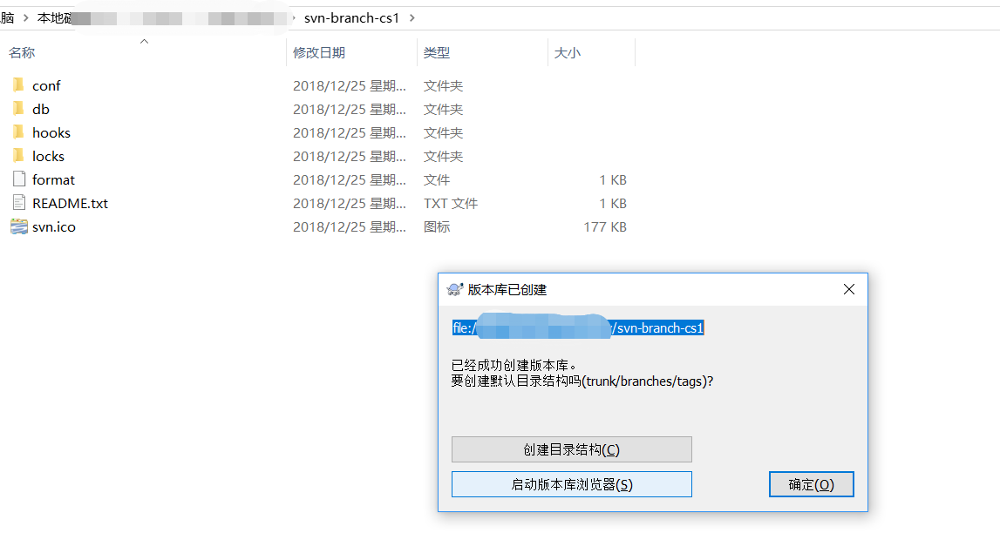
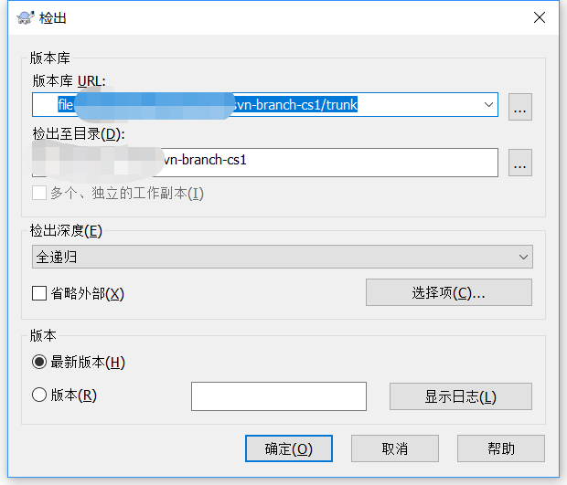
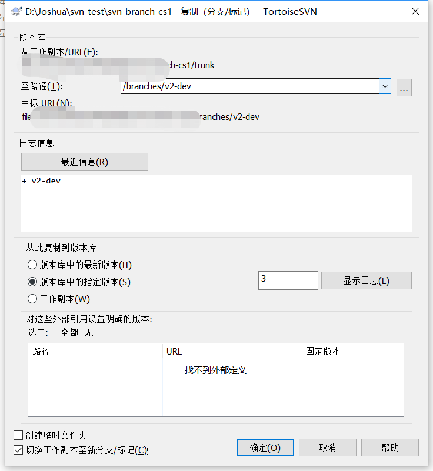

# 版本控制

> Joshua Conero
>
> 2018年8月16日 星期四


*版本控制软件*

# git

> 时间： *2005*

*windows 通过命令更新git*

```bash
git update-git-for-windows
```


> Staging Area(暂存区)


*分布式版本控制系统（Distributed Version Control System，简称 DVCS） 在这类系统中，像 Git、Mercurial、Bazaar 以及 Darcs 等，客户端并不只提取最新版本的文件快照，而是把代码仓库完整地镜像下来。 这么一来，任何一处协同工作用的服务器发生故障，事后都可以用任何一个镜像出来的本地仓库恢复。 因为每一次的克隆操作，实际上都是一次对代码仓库的完整备份。*


> 部分目标

- 速度
- 简单的设计
- 对非线性开发模式的强力支持（允许成千上万个并行开发的分支）
- 完全分布式
- 有能力高效管理类似 Linux 内核一样的超大规模项目（速度和数据量）


> 基本的 Git 工作流程如下：

1. 在工作目录中修改文件。
2. 暂存文件，将文件的快照放入暂存区域。
3. 提交更新，找到暂存区域的文件，将快照永久性存储到 Git 仓库目录。


*Git 保存的不是文件的变化或者差异，而是一系列不同时刻的文件快照。*

## 教程

获取命令行帮助

```console
$ git help config
```

### config

> `git config [options]`  命令行


> 文件位置

1. `/etc/gitconfig` 文件: 包含系统上每一个用户及他们仓库的通用配置。 如果使用带有 `--system` 选项的 `git config` 时，它会从此文件读写配置变量。
2. `~/.gitconfig` 或 `~/.config/git/config` 文件：只针对当前用户。 可以传递 `--global` 选项让 Git 读写此文件。
3. 当前使用仓库的 Git 目录中的 `config` 文件（就是 `.git/config`）：针对该仓库。


> 用户信息

```console
$ git config --global user.name "John Doe"
$ git config --global user.email johndoe@example.com
```


> *保存用户密码*

*credential cache* 

`git config --global credential.helper cache`


**https认证**

> 保存全局 *https* 用户的密码

*git config --global credential.helper store*

> 密码输入错误时，第二次无法输入密码

*git config --system --unset credential.helper*


### Git 基础

#### 获取git仓库

- `git init`			初始化git仓库
- `git clone <url>`	从远程仓库中获取git代码仓库


#### 记录每次更新到仓库

> **已跟踪或未跟踪**


*你工作目录下的每一个文件都不外乎这两种状态：已跟踪或未跟踪。 已跟踪的文件是指那些被纳入了版本控制的文件，在上一次快照中有它们的记录，在工作一段时间后，它们的状态可能处于未修改，已修改或已放入暂存区。 工作目录中除已跟踪文件以外的所有其它文件都属于未跟踪文件，它们既不存在于上次快照的记录中，也没有放入暂存区。 初次克隆某个仓库的时候，工作目录中的所有文件都属于已跟踪文件，并处于未修改状态。*


> **文件的状态变化周期**


> **`$ git status` 查看本次仓库的状态**

*状态简览* `# git status -s|--short`


> **`$ git add <file>` 跟踪文件，即添加文件到暂存区**


>  **忽略文件 `.gitignore` 可共享策略**

文件 `.gitignore` 的格式规范如下：

- 所有空行或者以 `＃` 开头的行都会被 Git 忽略。
- 可以使用标准的 glob 模式匹配。
- 匹配模式可以以（`/`）开头防止递归。
- 匹配模式可以以（`/`）结尾指定目录。
- 要忽略指定模式以外的文件或目录，可以在模式前加上惊叹号（`!`）取反。


> **`$ git diff`   此命令比较的是工作目录中当前文件和暂存区域快照之间的差异， 也就是修改之后还没有暂存起来的变化内容。**


*`$ git diff --check`  找到可能的空白错误并将它们为你列出来*


`$ git diff --cached`   或 `$ git diff --staged`	*查看已暂存的将要添加到下次提交里的内容 (--staged 和 --cached 是同义词）*


`$ git diff HEAD`     *比较当前，已经执行的 `$ git add .` 之后的差别。*


> **`$ git commit` 提交更新**

提交之前可以`git status` 查看状态

`$ git commit -m "massage"`   *将提交信息与命令放在同一行。 原则:  一般情况下，信息应当以少于 50 个字符（25个汉字）的单行开始且简要地描述变更，接着是一个空白行，再接着是一个更详细的解释. Git 项目要求一个更详细的解释，包括做改动的动机和它的实现与之前行为的对比 - 这是一个值得遵循的好规则。*


```bash
$ git commit -am "添加并提交内容"

# 相同与同时执行了
$ git add .
$ git commit -m "<msg>"
```


**跳过使用暂存区域**

`$ git commit -a`   *Git 就会自动把所有已经跟踪过的文件暂存起来一并提交，从而跳过 `git add` 步骤*


> **`$ git rm <file>`  移除文件, <file>  可以为`glob` 模式**

*从暂存区移除文件*


- `git rm -f`   *使用强制(强制删除)删除*
- `git rm --cached`  *从暂存区删除文件，但是保持在工作目录中*


> **`$ git mv <source-file> <target-file>` *移动文件***


```console
$ git mv README.md README
$ git status
On branch master
Changes to be committed:
  (use "git reset HEAD <file>..." to unstage)

    renamed:    README.md -> README
```

运行 `git mv` 就相当于运行了下面三条命令：

```console
$ mv README.md README
$ git rm README.md
$ git add README
```


#### 查看提交历史

> `$ git log`

- `git log -p -2` *一个常用的选项是 `-p`，用来显示每次提交的内容差异。 你也可以加上 `-2` 来仅显示最近两次提交*

- `git log --stat`  *如果你想看到每次提交的简略的统计信息，你可以使用 `--stat` 选项*


*另外一个常用的选项是 `--pretty`。 这个选项可以指定使用不同于默认格式的方式展示提交历史。 这个选项有一些内建的子选项供你使用。 比如用 `oneline` 将每个提交放在一行显示，查看的提交数很大时非常有用。 另外还有 `short`，`full` 和 `fuller` 可以用，展示的信息或多或少有些不同，请自己动手实践一下看看效果如何。*


#### 撤消操作

- `$ git commit --amend`    *提交有问题是时，重新提交*


> **`$ git reset HEAD <file>` *取消暂存的文件***

*在调用时加上 `--hard` 选项**可以**令 `git reset` 成为一个危险的命令*


> **`$ git checkout -- <file>...` *撤消对文件的修改***

*你需要知道 `git checkout -- [file]` 是一个危险的命令，这很重要。*


> git 回滚到任意版本

```shell
# 查看 git 仓库的 <commit_id>
$ git log

# 回滚到任意指定版本
$ git reset --hard <commit_id>

# 强制提交
$ git push -f origin <branch>
```


#### 远程仓库

> **`$ git remote -v` *查看远程仓库*** 


> **`$ git remote add <shortname> <url>` *添加远程仓库*** 


> **`$ git fetch [remote-name]` *从远程仓库中抓取与拉取***


> **`$ git remote show origin` *查看远程仓库***


> **`$ git remote rename <old-name> <new-name>` *远程仓库的移除与重命名***


#### 打标签

> `$ git tag `


> **`$ git tag` *列出标签时***

`$ git tag -l v1.8.5*` 使用 *glob* 模式筛选


> **创建标签**

*Git 使用两种主要类型的标签：轻量标签（lightweight）与附注标签（annotated）。*

`$ git tag <tag-name> `

`$ git tag -a v1.4 -m 'my version 1.4'`   *附注标签, 创建标签时添加标签*


> **共享标签**

`$ git push origin <tag-name>` *推送标签到远程仓库*

`$ git push origin --tags`  *一次性推送很多标签*


> 删除标签

```bash
# 删除本地标签
$ git tag -d <tagName>

# 删除远程标签
$ git push origin :<tagName>

# 本地删除远程已经不存在的分支
# 同时将远程，tag 同步到本地
$ git fetch --prune
$ git fetch -p

# 
$ git pull -p
```


### 分支

> Git 鼓励在工作流程中频繁地使用分支与合并


`提交对象(commit object)` *包含信息 :*

- 指向暂存内容快照的指针
- 作者的姓名和邮箱
- 提交时输入的信息
- 指向它的父对象的指针

*首次提交产生的提交对象没有父对象，普通提交操作产生的提交对象有一个父对象，而由多个分支合并产生的提交对象有多个父对象*


*暂存操作会为每一个文件计算校验和（使用 SHA-1 哈希算法），然后会把当前版本的文件快照保存到 Git 仓库中（Git 使用 blob 对象来保存它们），最终将校验和加入到暂存区域等待提交*


*Git 的分支，其实本质上仅仅是指向提交对象的可变指针。 Git 的默认分支名字是 `master`。 在多次提交操作之后，你其实已经有一个指向最后那个提交对象的 `master` 分支。 它会在每次的提交操作中自动向前移动。*


*Git 的 “master” 分支并不是一个特殊分支。 它就跟其它分支完全没有区别。 之所以几乎每一个仓库都有 master 分支，是因为 `git init` 命令默认创建它，并且大多数人都懒得去改动它。*


`分支创建`    *创建了一个可以移动的新的指针*

`HEAD` 	    *是一个指针，指向当前所在的本地分支（译注：将 `HEAD` 想象为当前分支的别名）。 HEAD 分支随着提交操作自动向前移动*


> 分支比较

```shell
$ git diff <branch1> <branch2>
# 仅仅查看文件概略
$ git diff <branch1> <branch2> --stat
```


#### 新增分支

```ini
# 拉取分支，若不存在就新建分支
# Method 1
$ git checkout -b <branchName>
$ git checkout -b <branchName> remotes/origin/<branchName>
$ git checkout -b trys-190329/krpano remotes/origin/trys-190329/krpano 

# 分支简写
# Method 2
$ git branch <branchName>
$ git checkout <branchName> 
```


#### 切换分支

```ini
# 切换分支，回到主线分支
git checkout <branchName>
```


#### 分支合并

```ini
# 转到需要合并的分支(目标分支)
$ git checkout <targetBN>

# 与源分支合并
$ git merge <srcBN>

# 撤销分支合并
$ git reset --hard


# 重命名本地/远程分支
# 本地分支重命名
git branch -m old_branch new_branch
# 删除旧的远程分支
git push origin :old_branch 
# 本地分支推送
git push --set-upstream origin new_branch
```


*合并提交，它的特别之处在于他有不止一个父提交。*


#### 删除分支

```ini
$ git branch -d <branchName>

# 删除远程标签
$ git push origin :<tagName>
```


> *长期分支*, *平行分支*， *特性分支*

*平行分支*     `master <->  develop/next`


#### 推送远程

`$ git push origin <remoteBranchName>`  推送到远程仓库

`$ git push origin local:remote`	推送:   本地 -> 远程


#### 跟踪分支

*从一个远程跟踪分支检出一个本地分支会自动创建一个叫做 “跟踪分支”（有时候也叫做 “上游分支”）。跟踪分支是与远程分支有直接关系的本地分支。 如果在一个跟踪分支上输入 `git pull`，Git 能自动地识别去哪个服务器上抓取、合并到哪个分支。*


`$ git checkout -b [branch] [remotename]/[branch]`

`$ git checkout --track origin/serverfix`


```ini
# 查看所有跟踪的远程分支
$ git branch -vv

# 查看所有分支
$ git fetch --all; git branch -vv
```


#### 变基

*在 Git 中整合来自不同分支的修改主要有两种方法：`merge` 以及 `rebase`。*


###  Git 服务器

**裸仓库**  *一个远程仓库通常只是一个裸仓库（*bare repository*）— 即一个没有当前工作目录的仓库。 因为该仓库仅仅作为合作媒介，不需要从磁碟检查快照；存放的只有 Git 的资料。 简单的说，裸仓库就是你工程目录内的 `.git` 子目录内容，不包含其他资料。*

`$ git clone --bare <urlName>`     获取裸仓库(以裸仓库克隆服务器)


> 协议

*本地协议（Local），HTTP 协议，SSH（Secure Shell）协议及 Git 协议*


- `ssh`   *授权访问*

- `git`    *无授权访问*

- `Smart HTTP`   访问上同时支持 *授权/无授权* 协议

​	*主要原理是使用一个 Git 附带的，名为 `git-http-backend` 的 CGI。它被引用来处理协商通过 HTTP 发送和接收的数据。 它本身并不包含任何授权功能，但是授权功能可以在 Web 服务器层引用它时被轻松实现。*


*Git 提供了一个叫做 GitWeb 的 CGI 脚本来实现基于网页的简易查看器*


### 分布式 Git 

> 分布式工作流

*集中式工作流、集成管理者工作流、司令官与副官工作流*


### github

> fork

*派生（Fork）项目:  GitHub 将在你的空间中创建一个完全属于你的项目副本，且你对其具有推送权限*


> 合并请求（Pull Request）


### Git 工具

#### 选择修订版本

> 简短的 SHA-1(bit>=4)

*使用sha-1大于等于4位字符可代替其对应的 commit_id*


> 引用日志

*当你在工作时， Git 会在后台保存一个引用日志(reflog)，引用日志记录了最近几个月你的 HEAD 和分支引用所指向的历史。*


**引用日志只存在于本地仓库，一个记录你在你自己的仓库里做过什么的日志。 其他人拷贝的仓库里的引用日志不会和你的相同；而你新克隆一个仓库的时候，引用日志是空的，因为你在仓库里还没有操作。**


> 祖先引用

*祖先引用是另一种指明一个提交的方式。 如果你在引用的尾部加上一个 `^`， Git 会将其解析为该引用的上一个提交。另一种指明祖先提交的方法是 `~`。 同样是指向第一父提交，因此 `HEAD~` 和 `HEAD^` 是等价的*


```ini
# 查看 sha-1 全部
$ git log


# Git 可以为 SHA-1 值生成出简短且唯一的缩写
$ git log --abbrev-commit


# 分支引用
$ git rev-parse <branchName>


# 引用日志
$ git reflog
$ git show HEAD@{n}
# 查看类似于 git log 输出格式的引用日志信息
$ git log -g
```


>  提交区间

*Git 允许你在任意引用前加上 `^` 字符或者 `--not` 来指明你不希望提交被包含其中的分支*


```ini
# 在 【b2】 中而不在 【b1】
$ git log <branch1>..<branch2>
# 当前分支跟随最新的进度以及查看你即将合并的内容
$ git log origin/master..HEAD

# 查看所有被 refA 或 refB 包含的但是不被 refC 包含的提交
$ git log refA refB ^refC
$ git log refA refB --not refC

# 选择出被两个引用中的一个包含但又不被两者同时包含的提交
$ git log <branch1>...<branch2>

```


#### 交互式暂存

```ini
# Git 将会进入一个交互式终端模式(--interactive)
$ git add -i

```


#### 储藏与清理


> **stash**

*修改的跟踪文件与暂存改动 - 然后将未完成的修改保存到一个栈上*

*默认情况下，`git stash` 只会储藏已经在索引中的文件*


```ini
# 将当前的改动推送到【储藏栈】上
$ git stash
$ git stash save

# 查看储藏的列表
$  git stash list

# 使用当前的储藏
$ git stash apply
# 指定的储藏序列
$ git stash apply stash@{n}


# 删除储藏器
$ git stash drop stash@{n}

# 它告诉 Git 不要储藏任何你通过 git add 命令已暂存的东西
$ git stash save
# Git 会储藏任何创建的未跟踪文件。
$ git stash -u
# 不会储藏所有修改过的任何东西，但是会交互式地提示哪些改动想要储藏、哪些改动需要保存在工作目录中。
$ git stash --patch

# 创建一个新分支，检出储藏工作时所在的提交
$ git stash branch <branchName>

# 移除每一样东西并存放在栈中
$ git stash --all
```


> 清理工作目录

*默认情况下，`git clean` 命令只会移除没有忽略的未跟踪文件。*

```ini
# 清理工作目录
$ git clean

# 移除工作目录中所有未追踪的文件以及空的子目录; -f 意味着 强制 或 “确定移除”
$ git clean -f -d

# 做一次演习然后告诉你 将要 移除什么
$ git clean -d -n
```


#### 搜索

> `git grep`

*可从提交历史或者工作目录中查找一个字符串或者正则表达式*


```ini
# 查询 含<text>的文件，当前工作目录
$ git grep <text>

# 输出 Git 所找到的匹配行行号
$ git grep -n <text>

# 统计文本出现的次数
$ git grep --count <text>

# 想看匹配的行是属于哪一个方法或者函数
$ git grep -p <text>
```


> Git 日志搜索

```ini
# 使用 -S 选项来显示新增和删除该字符串的提交。
$ git log -S<str> --oneline
$ git log -Sgit --oneline

# 正则查询
$ git log -G<pregexp>
```


#### 重写历史

```ini
# 修改最近一次提交的提交信息
$ git commit --amend

# 从整个提交历史中移除一个叫做 passwords.txt 的文件
$ git filter-branch --tree-filter 'rm -f passwords.txt' HEAD
```


#### 重置

`checkout` 和 `reset`


> 三棵树

| 树                | 用途                                 |
| ----------------- | ------------------------------------ |
| HEAD              | 上一次提交的快照，下一次提交的父结点 |
| Index             | 预期的下一次提交的快照               |
| Working Directory | 沙盒                                 |

`HEAD` *当前分支引用的指针，它总是指向该分支上的最后一次提交。*

```ini
# 查看 HEAD 快照
$ git cat-file -p HEAD
$ git ls-tree -r HEAD

# 查看暂缓区相关信息
$ git ls-files -s
```


`reset` 		*做的第一件事是移动 HEAD 的指向；用 HEAD 指向的当前快照的内容来更新索引。`--hard` 标记是 `reset` 命令唯一的危险用法。*

```ini
# master -> {commitId}  
$ git reset {commitId}
```


> **reset** 和 **checkout** 的区别

*不同于 `reset --hard`，`checkout` 对工作目录是安全的，它会通过检查来确保不会将已更改的文件弄丢。*

*`reset` 会移动 HEAD 分支的指向，而 `checkout` 只会移动 HEAD 自身来指向另一个分支。*


#### 高级合并

*Git 的哲学是聪明地决定无歧义的合并方案，但是如果有冲突，它不会尝试智能地自动解决它。 因此，如果很久之后才合并两个分叉的分支，你可能会撞上一些问题。*


*代码发生冲突时，可以查看冲突，并进行编辑后提交即可。*


> 合并冲突

*首先，在做一次可能有冲突的合并前尽可能保证工作目录是干净的。*

*`git merge --abort` 选项会尝试恢复到你运行合并前的状态。 但当运行命令前，在工作目录中有未储藏、未提交的修改时它不能完美处理，除此之外它都工作地很好。*


```ini
# 简单地退出合并（尝试恢复到你运行合并前的状态）
$ git merge --abort

# 忽略空白合并；使用 -Xignore-all-space 或 -Xignore-space-change
$ git merge -Xignore-space-change <branchName>

# 会重新检出文件并替换合并冲突标记
$ git checkout --conflict
```


#### 使用 Git 调试

```ini
# 追踪文件
$ git blame <filename>
```


#### 子模块

*子模块允许你将一个 Git 仓库作为另一个 Git 仓库的子目录。 它能让你将另一个仓库克隆到自己的项目中，同时还保持提交的独立。*


`.gitmodules` 	*该配置文件保存了项目 URL 与已经拉取的本地目录之间的映射。该文件也像 `.gitignore` 文件一样受到（通过）版本控制。 它会和该项目的其他部分一同被拉取推送。 这就是克隆该项目的人知道去哪获得子模块的原因。*


```ini
# 当前仓库下创建一个子模块
$ git submodule add <URL>  [<dirName>]

# 查看文件
$ cat .gitmodules

# 子模块差异
$ git diff --cached --submodule
$ git diff --cached <submoduleName>

# 初始化本地配置文件
$ git submodule init
# 从该项目中抓取所有数据并检出父项目中列出的合适的提交
$ git submodule update
# 自动初始化并更新仓库中的每一个子模块
$ git clone --recursive <URL>

# Git 将会进入子模块然后抓取并更新
$ git submodule update --remote
# 指定子模块的分支
$ git config -f .gitmodules submodule.<submoduleName>.branch <branchName>


```


#### 打包


```ini
# ~~ 打包所有整个仓库
# 该文件包含了所有重建该仓库 master 分支所需的数据
# $ git bundle create <name>.bundle [提交区间]
$ git bundle create <name>.bundle HEAD master
# 回复打包文件
$ git clone <name>.bundle [<dirName>]

# 验证 bundleNamePath 是否合法
$ git bundle verify <bundleNamePath>

# 查看这边包里可以导入哪些分支
$ git bundle list-heads <bundleNamePath>

# 所以你可以使用 fetch 或者 pull 命令从包中导入提交
$ git fetch <bundleNamePath> master:other-master
```


### Git 与其他系统

#### Subversion


*Git 中最棒的特性就是有一个与 Subversion 的双向桥接，它被称作 `git svn`*

```ini
# 它会将整个 Subversion 仓库导入到一个本地 Git 仓库
# -T trunk -b branches -t tags 部分告诉 Git Subversion 仓库遵循基本的分支与标签惯例。
$ git svn clone file:///tmp/test-svn -T trunk -b branches -t tags

# git 克隆
$ git svn clone file:///tmp/test-svn -s


# 与两者前者接口一样
$ git svn init
$ git svn fetch <URL>

# 提交
$ git commit -am 'Adding git-svn instructions to the README'

# 拉取新改动
# 推送项目
$ git svn dcommit

# 显示参照
$ git show-ref
```


### Git 内部原理


*<git-v1.5  更侧重于作为一个文件系统，而不是一个打磨过的版本控制系统*


#### 底层命令和高层命令

 *Git 最初是一套面向版本控制系统的工具集，而不是一个完整的、用户友好的版本控制系统，所以它还包含了一部分用于完成底层工作的命令。 这些命令被设计成能以 UNIX 命令行的风格连接在一起，抑或藉由脚本调用，来完成工作。 这部分命令一般被称作“底层（plumbing）”命令，而那些更友好的命令则被称作“高层（porcelain）”命令。*


`$ git init`  *初始化git版本仓库*

```console
index				保存暂存区信息
HEAD				指示目前被检出的分支
config*				项目特有的配置选项
description			文件仅供 GitWeb 程序使用
hooks/				客户端或服务端的钩子脚本
info/				包含一个全局性排除（global exclude）文件，用以
		放置那些不希望被记录在 .gitignore 文件中的忽略模式（ignored patterns）
objects/			目录存储所有数据内容
refs/				目录存储指向数据（分支）的提交对象的指针
```


#### Git 对象

*Git 是一个内容寻址文件系统。Git 的核心部分是一个简单的键值对数据库（key-value data store）。*

> 文本对象(blob object)

```ini
## ~~ 文本
# 往 Git 数据库存入一些文本
$ echo 'test content' | git hash-object -w --stdin

# 查看 Git 是如何存储数据的
$ find .git/objects -type f

# 从 Git {.git/objects/b2/87ae1788ad5896de1f27414f38aa3c0cff155} 取回数据
$ git cat-file -p b287ae1788ad5896de1f27414f38aa3c0cff155


## ~~ 文件
# 创建文件以及编写内容
$ echo 'Emma. and Beth.' > content.md
# 获取 SHA-1 码
$ git hash-object -w content.md
# 再次写入内容到文件
$ echo 'It\'s  name of Lady. yet' > content.md
# 获取 SHA-1 码； 与前面不一样
$ git hash-object -w content.md
# 从数据库恢复内容到文件
$ git cat-file -p 31e09252a668f7dbf6034af3a50fb86178d8d9 > content.md
```


`.git/objects/b2/87ae1788ad5896de1f27414f38aa3c0cff1555`

*这就是开始时 Git 存储内容的方式——一个文件对应一条内容，以该内容加上特定头部信息一起的 SHA-1 校验和为文件命名。 校验和的前两个字符用于命名子目录，余下的 38 个字符则用作文件名。*


*上述类型的对象我们称之为数据对象（blob object）。 利用 `cat-file -t` 命令，可以让 Git 告诉我们其内部存储的任何对象类型，只要给定该对象的 SHA-1 值：*


>  树对象(tree object)

```ini
# 查看 master 分支上最新的提交所指向的树对象
$ git cat-file -p master^{tree}
```


> 提交对象(commit object)

```ini
# 查看 commit_id
$ git log

# 选择一个 commit_id 查看类型
$ git cat-file -t <commit_id>
```


#### Git 引用

```ini
# 查看 refs 文件下目录
$ find .git/refs -type f
```


///@TODO  [10.3 Git 内部原理 - Git 引用](https://git-scm.com/book/zh/v2/Git-%E5%86%85%E9%83%A8%E5%8E%9F%E7%90%86-Git-%E5%BC%95%E7%94%A8)


### 文件管理

#### git 删除未跟踪文件

```ini
#删除 untracked files
git clean -f

# 连 untracked 的目录也一起删掉
git clean -fd

# 连 gitignore 的untrack 文件/目录也一起删掉 （慎用，一般这个是用来删掉编译出来的 .o之类的文件用的）
git clean -xfd

# 在用上述 git clean 前，墙裂建议加上 -n 参数来先看看会删掉哪些文件，防止重要文件被误删
git clean -nxfd
git clean -nf
git clean -nfd

#恢复某个已修改的文件（撤销未提交的修改）
git checkout file-name
git checkout --
git checkout *.php

```

## 主题
### 本地仓库推送多个远程仓库(remote)


1. git remote -v   查看远程仓库
2. git add <name> <url>   添加默认远程仓库，可以新增多个，默认 *origin*
3. git push <name> / <branch> 单个仓库推送
4. git push --all 所有仓库推送数据


> **修改本地配置推送对个分支**

- `.git/config`

```ini
[core]
	repositoryformatversion = 0
	filemode = false
	bare = false
	logallrefupdates = true
	symlinks = false
	ignorecase = true
[remote "origin"]
	url = <url1>
	url = <url1>
	fetch = +refs/heads/*:refs/remotes/origin/*
```

- *也可多次 `$ git remote set-url <name> <url>`*

  ```shell
  # 设置多个
  $ git remote set-url add all u.1
  $ git remote set-url add all u.2
  
  # 查看
  $ git remote -v
  # 移除远程地址
  $ git remote rm <name>
  ```


## 附录

### 中英文对照

| 英文          | 中文                      | 说明 |
| :------------ | :------------------------ | :--- |
| track/untrack | 跟踪(文件)/未跟踪的(文件) |      |
| stage         | 暂存                      |      |
| commit        | 提交                      |      |
| repository    | 仓库                      |      |
|               |                           |      |
|               |                           |      |
|               |                           |      |
|               |                           |      |
|               |                           |      |


> 其他词汇

- `commit object`  提交对象
- `decorate`      

### 参考

#### git-scm

> https://git-scm.com/book/zh/v2


# svn

> 非分布式版本控制应用

- 官网：http://subversion.apache.org/
- 文档：http://svnbook.red-bean.com/


## 教程

### 分支控制

> 其版本控制，采用目录式的；通常情况下没有默认分支，不指定目录的情况下为全部

- 顶级目录
  - branches		分支
  - tags			        标签
  - trunk			主干线


> _基于 **Tortise SVN** 的版本分支管理_

1. 创建本地测试库: `右键菜单 >> 在此创建版本库(Y) >> 创建目录结构(C)`。 默认生成: *trunk/branches/tags* 目录

   


2. 检测svn库主线： `$url/trunk`。 默认只检出 trunk  




3. 创建分支 : *TortoiseSVN>>分支/标记(T)*， 如创建 **V2-dev** 分支，并且切换当前的分支。 类似的创建*标签*也类似，记住两者的目录为区别： **branches/tags**

   ​	


4.  切换分支： `TortoiseSVN >> 切换(W)`
5. 分支合并: `TortoiseSVN >> 合并(M)`。选择合并类型，并执行即可；亦可选择版本


## 基本命令

> 版本大于 `v1.8.3 `


### `snv list(ls)`

> 获取 svn 库中的文件/目录 列表

```powershell
# 数据
svn list [options]

# 以xml格式输出信息
--xml			
# 递归输入所有文件
--recursive (-R)
# 输出版本信息
--verbose (-v)
```


### `svn export`

> 导出到空目录

```powershell
svn export [options]
# 导出源代码到目标文件
svn export . ../targetDir

# 导出指定的版本
--revision(-r) REV
# 强制导出
--force
```


### `svn log`

> 查看项目日志

- `--limt(-l) NUM` 展示限定的数量
- `--revision (-r) REV` 显示指定的版本，或版本范围


```powershell
# 指定版本范围
svn log -r 10:100
```


### `svn info`

_本地仓库与远程仓库信息_

```powershell
# 输出 xml 格式文档
svn info --xml
```


# ISSUE


## git 用户认证

> 出现错误 git -- Authentication failed for

*windows 系统中借助 【控制面板/用户账号/凭据管理器/管理window凭据】可更改密码。*

