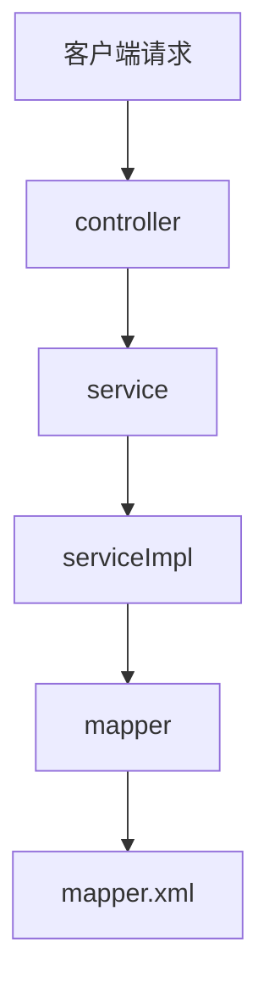

# Spring

> 2021年11月12日 星期五
>
> Joshua Conero

## 简介

诞生于：2003年，Spring 在起源可追溯到 Rod Johnson 于2002年出版的《Expert One-to-One J2EE Design and Development》一书。前身 interface21 框架，为框架的基础。首个正式版本 v1.0 发布于 2004-03-24，Spring 是指一个用于构造 Java 应用程序的**轻量级框架**。

- 首先，你可以采用 Spring 来构造任何程序，这和Apache Struts 这样的框架不同，仅仅被限定于WEB 应用
- 其次，“轻量级”并不意味着类的数量很少，或者发行包尺寸很小。实际上，指的是Spring哲学原则——最少的侵入。

Spring 项目主要子项目。

- [spring boot](https://github.com/spring-projects/spring-boot)
- [spring framework](https://github.com/spring-projects/spring-framework)(springMvc)

> 关系

- Spring 是一个“引擎”

- SpringMVC 是基于Spring的一个 MVC 框架 

- SpringBoot 是基于Spring4的条件注册的一套快速开发整合包。实现了自动配置，降低了项目搭建的复杂度，开箱即用

包含关系 `spring mvc  < spring <springboot`

> 主要特性

- 开源框架
- 简化企业级开发而生
- 一个IOC(DI)和AOP容器框架
- 优良特性
  - 非侵入式
  - 控制反转
  - 依赖注入（DI）
  - 面向切面编程（AOP）
  - 容器：组件化、一站式

### spring boot

框架中的分层概念

- model(entity)            **模型** 类似命名：domain、pojo. 存放实体类与并数据库表字段保持一致，一般一张表对应一个类。提供get/set/toString方法。
- dao(mapper)             **持久层 **  dao层的作用为访问数据库，向数据库发送sql语句，完成数据的增删改查任务。 数据持久化操作就是指，把数据放到持久化的介质中，同时提供增删改查操作，比如数据通过hibernate插入到数据库中。
- service                        **业务逻辑层**   完成功能的设计 和dao层一样都是先设计接口，再创建要实现的类，然后在配置文件中进行配置其实现的关联。接下来就可以在service层调用dao层的接口进行业务逻辑应用的处理。 service的impl是把mapper和service进行整合的文件 封装Service层的业务逻辑有利于业务逻辑的独立性和重复利用性。
- controller                   **控制层**  业务逻辑控制层，直接与客户端请求交互。通过调用 service层实现具体的业务。

> 处理流程

#### 映射层

常见的映射层有

- JPA                         Spring-data-jpa
- mybatis

## 附录

### 参考

- [SpringBoot项目中model层、Dao层、Mapper层、controller层、service层、entity层作用](https://www.cnblogs.com/bronya0/p/14671139.html)
- [spring boot与spring mvc的区别是什么？](https://www.zhihu.com/question/64671972)
- [Spring简介及历史](https://blog.csdn.net/weixin_38910645/article/details/109209901)
- [浅谈Spring发展史](https://www.cnblogs.com/shenhaha520/articles/10991958.html)
- [spring  （一 ）   概述与介绍](https://blog.csdn.net/weixin_42405670/article/details/83048002)
- [springboot与spring比较区别](https://www.cnblogs.com/cuiqq/p/11818932.html)
- [Spring 入门及历史演变之路](https://zhuanlan.zhihu.com/p/115404132)

