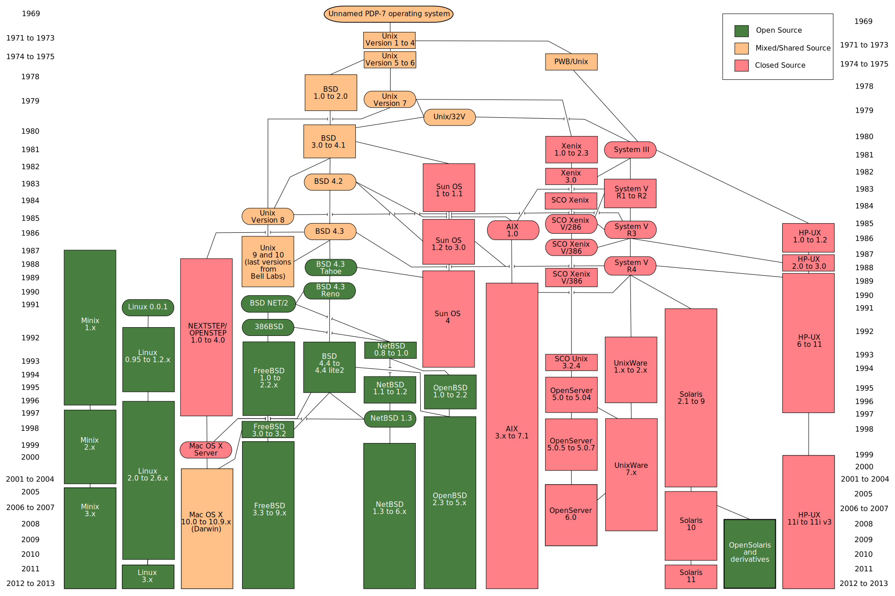
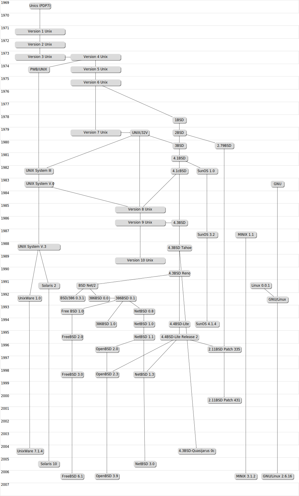
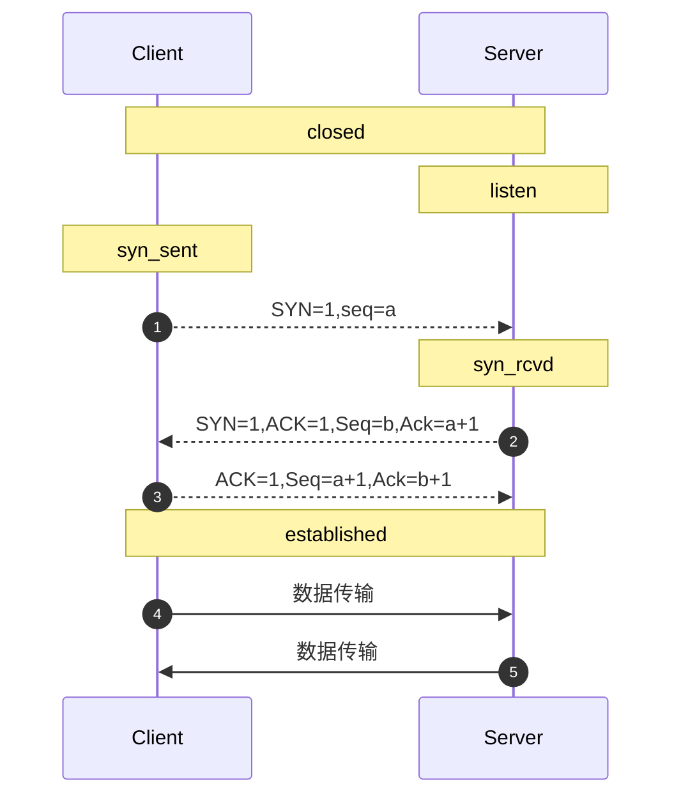

# 操作系统(OS/Operating System)
>  基本信息
    作者： Joshua Conero
    日期： 2017年6月20日 星期二


## 目录

1. [简介](#menu_overview)
2. [UNIX 1970](#menu_unix)
2. [Windows 1985](#menu_windows)
2. [Linux 1991](#menu_linux)


# <span id="menu_overview">操作系统通论</span>

## 基本概念

任何计算机系统都包含一个名为操作系统的基本程序集合。该集合内，最重要的程序称为**内核**（kernel）；当操作系统启动时，内核被转入RAM中，内核中包含了系统运行所必不可少的很多核心过程（procedure）。内核也为系统中所有事情提供了主要功能，并决定高层软件的很多特性。因此我们可以将术语“操作系统”等同于“内核”。


操作系统必须完成两个主要目标：

- 与硬件部分交互，为包含在硬件平台上的所有底层可编程部件提供服务
- 未运行在计算机系统上的应用程序（用户程序）提供执行环境


硬件为CPU引入至少两种不同的执行模式：用户程序的非特权模式和内核特权模式，Unix分别将其称为用户态（user mode）和内核态（kernel mode）。


### 进程

所有操作系统都是用一个种基本抽象：进程（process）。一个进程可定义为：“程序执行的一个实例”，或者一个运行程序的“执行上下文”。

操作系统中叫调度程序（scheduler）的部分决定哪个进程能执行。多用户系统中的进程必须是抢占式的（preemptable）；操作系统记录下每个进程占有的CPU时间，并周期性地激活调度程序。


### 内核体系结构

大部分Unix内核都是单块结构：每个内核层都被集成到整个内核程序中，并代表当前进程在内核态下运行。相反，微内核（microkernel）操作系统只需要内核有一个很小的函数集，通常包含几个同步原语、一个简单的调度程序和进程通信机制。


## 启动过程

相关操作文献：**计算机原理**。


启动过程：`Hardware --> BIOS --> BootLoader --> Kernel`。

- （BIOS自检、系统引导）BIOS 检测硬件以及初始化中间表并将BootLoader加载到内存，且控制权移交到BootLoader。
- （启动内核、初始化系统）BootLoader把Kernel写入内存，并执行kernel的 entry point（入口点/初始化程序） 和设置 virtual memory的映射关系。

 


# <span id="menu_unix">UNIX</span> 1970


## 简介


> 特征
>
> > 多任务、多用户

> 日期 / 作者
> > 1969 / 美国AT&T公司的贝尔实验室
> >
> > > 主要作者：Ken Thompson,Dennis Ritchie,Douglas McIlroy

- 
- 
- 只有符合单一UNIX规范的UNIX系统才能使用UNIX这个名称，否则只能称为类UNIX（UNIX-like）
- UNIX-like 类UNIX
- “一切皆是文件”是 Unix/Linux 的基本哲学之一
- 以网络为核心的设计思想
- 1970-01-01 00:00:00  (unix 元年-1970)


# <span id="menu_windows">Windows</span> 1985
- 创始人: Bill Gates
- Microsoft-DOS -> windows
- 特征
    - 图形化模式 GUI
    - 内核： Windows NT kernel (ntoskrnl.exe)


> 个人使用过的操作系统版本

    Windows XP
    Windows 7.0
    Windows 8.0
    Windows 10.0
    Windows 11.0


> *项目文档*

- *[官方文档](https://docs.microsoft.com/zh-cn/windows/)*
- [参考文档](https://msdn.microsoft.com/zh-cn/library/)


**UAC**  用户账号控制。


## 注册表 

>  _**Registry**_

- `regedit`       *注册表（register edit）*
- `reg`               *windows 自带的注册表编辑器*


*是Microsoft Windows中的一个重要的数据库，用于存储系统和应用程序的设置信息*

*HKEY_CLASSES_ROOT和HKEY_CURRENT_CONFIG中存放的信息都是HKEY_LOCAL_MACHINE中存放的信息的一部分，而HKEY_CURRENT_USER中存放的信息只是HKEY_USERS存放的信息的一部分*


> 集合包含关系

- HKEY_LOCAL_MACHINE
  - HKEY_CLASSES_ROOT
  - HKEY_CURRENT_CONFIG
- HKEY_USERS
  - HKEY_CURRENT_USER


> **根键的作用** 

- HKEY_USERS
  - *保存了存放在本地计算机口令列表中的用户标识和密码列表,每个用户的预配置信息都存储在HKEY_USERS根键中。HKEY_USERS是远程计算机中访问的根键之一*
- HKEY_CURRENT_USER 
  - *当前登录的用户信息*
- HKEY_CURRENT_CONFIG 
  - *前用户桌面配置(如显示器等)的数据,最后使用的文档列表（MRU）和其他有关当前用户的Windows 98中文版的安装的信息*
- HKEY_CLASSES_ROOT
  - *其文件类型的名称*
  - *存储Windows可识别的文件类型的详细列表，以及相关联的程序。*
- HKEY_LOCAL_MACHINE 
  - *本地计算机硬件数据*


> \HKEY_CURRENT_USER\Software\Microsoft\Windows\CurrentVersion\Explorer\FileExts

更改文件后缀名的默认软件打开方式


> *注册表类型分类*

- `REG_SZ`    *字符串文本*
- *`REG_BINARY`*   *二进制文本*
- `REG_MULTI_SZ`    *多字符串值：含有多个文本值的字符串*
- `REG_DWORD`     *双字值；一个32位的二进制值，显示为8位的十六进制值。*


*URL Protocol： 使用`URL`地址打开应用如：`tencent://`。如在web浏览器中使用 URL 协议打开应用: ` window.open("tencent://message/?uin=346915968")`*


## 应用自动启动

> 查看方式 1

- *`设置>应用>启动`*  可查看/设置启动的应用


## windows 快捷键

> win+

| 快捷键            | 助记                      | 说明                         |
| ----------------- | ------------------------- | ---------------------------- |
| win               | windows                   | 打开或关闭“开始”屏幕         |
| win+A             | windows Action            | 打开操作中心                 |
| win+B             | windows Blur Notification | 将焦点设置到通知区域         |
| win+D             | windows Display           | 显示和隐藏桌面               |
| win+Alt+D         | windows display date      | 显示和隐藏桌面上的日期和时间 |
| win+E             | windows Explorer          | 打开文件资源管理器           |
| win+I             | windows Items             | 打开“设置”                   |
| win+K             |                           | 打开“连接”快速操作(蓝牙)     |
| win+L             | windows Lock              | 锁定你的电脑或切换帐户       |
| win+M/win+Shift+M |                           | 最小化所有窗口(和 win+D 像)  |
| win+P             | windows Play              | 选择演示显示模式             |
| win+R             | windows Run               | 打开“运行”对话框             |
| win+S             | windows Search            | 打开搜索                     |
| win+T             | windows Tabbar            | 循环浏览任务栏上的应用       |
| win+X             |                           | 打开“快速链接”菜单           |
| win+,(逗号)       |                           | 临时速览桌面                 |
| win+Tab           |                           | 打开任务视图                 |
| Fn+ESC            | function esc              | fn 功能键切换                |


> 其他

| 快捷键            | 助记                      | 说明                         |
| ---- | ---- | ---- |
| *__复制、粘贴及其他常规的键盘快捷方式__* |      |      |
| Ctrl+C/ Ctrl+Insert | Copy | 复制选定文本 |
| Ctrl+V/ Shift+Insert | Paste | 粘贴选定文本 |
| Ctrl+X | Cut | 剪切选定项 |
| Ctrl+Z | Undo | 撤消操作 |
| Alt + Tab | | 在打开的应用之间切换 |
| Ctrl + A | All | 选择文档或窗口中的所有项目 |
| Ctrl + D（或删除键） | Delete | 删除所选的项目，将其移至回收站 |
| Ctrl + R（或 F5） | Refresh | 刷新活动窗口 |
| Ctrl + Y | Redo | 恢复操作 |
| Ctrl + Shift（及箭头键） | | 选择文本块 |
|  | |  |
| *__文件资源管理器键盘快捷方式__* | |  |
| Alt+D | | 选中地址栏 |
| Ctrl+F/Ctrl+E | Find | 选择搜索框 |
| Ctrl+N | New | 打开新窗口 |
| Ctrl+W | | 关闭活动窗口 |
| Ctrl+Shift+N | | 创建新文件夹 |
| Alt + P |  | 显示预览面板 |
| Alt + Enter | | 打开选定项目的“属性”对话框 |


**文件/目录复制地址方法**

```powershell
# 选择【复制为路劲(A)】
shift+右键
```


## windows命令行程序

*Windows 命令工具有 `cmd.exe`、`powershell(ps)` 等，其可通过外壳程序调用系统内核相关的程序。*

也即是bat 脚本，批处理（batch）。

- cmd
- pwsh


程序调用命令行，并执行：

```shell
# cmd 执行命令与 ($cmd)
cmd /c $cmd


# 启动 pwsh 并执行命令
pwsh -c $cmd
# 执行 ps1 脚本
pwsh -f "$file.ps1"
```


cmd 置于目录`C:\Windows\System32`下。


### CMD

**基本语法：**

大小写不敏感，扩展名为“.bat”或“.cmd”

*使用 powershell 的语法来介绍 `cmd.exe`*

```powershell
help 显示当前系统的帮助信息
command /?   查看帮助信息

# 注释行
::这是一个注释。
@echo off的意思是此命令后的命令在执行的时候，不显示命令本身。


#变量
set var=32
# 输出变量
echo %var%
echo 贵   阳
# 输出环境变量/系统参数
echo %Path%
echo %AppData%
#设置当前的环境变量（附加），当前环境下
set PATH=%PATH%;d:\xxx

#路劲
# %~dp0 d 表 driver 的缩写，几位驱动、磁盘的缩写。p 为path缩写表路径、目录
cd %~dp0   # 进入批处理所在目录
cd %~dp0runtime\  # 进入所在目录的下的 runtime 目录


Pause  # 暂停执行
```

常见命令：

- `echo [mesage]`           输出数据内容
- `@[command]`                 不显示命令（command）
- `goto [label]`              跳转到（标签处）
- pause                              按任意键结束
- call                                  批处理调用batch脚本
- start                                启动一个单独的窗口以运行指定的程序或命令
- if/for                                条件或循环


```shell
# 使用，shell 高亮演示 bat 语法。
goto start

# start 标签
:start

# 在 cmd 下输出，寻求帮助
help
# [cmd] /? 查看命令的帮助信息
find /?
```


常见的系统参数：环境变量、系统常量等，如下变量在cmd环境可通过`echo %$%` 访问。

- SystemRoot                    系统root目录,跟目录
- ProgramFiles                  应用所在目录
- UserProfile                     当前用户的系统目录（用户目录）
- AppData                         当前应用数据目录
- Temp或Tmp                  系统临时文件
- Path                                环境变量
- PathExt                          环境变量可执行文件（“默认后缀”）
- AllUsersProfile              所有用户的配置信息
- ComputerName           系统名称
- Date                               当前的时间
- number_of_processors     处理器数量
- processor_architecture     处理架构
- processor_identifier          处理器说明信息
- processor_revision            处理器型号
- random                               获取随机数[1-32767]
- UserDomain                       用户域名称
- UserName                          用户名称


如通过bat脚本设置composer全局安装

```shell
# 即输入，composer即可运行到此脚本
@php "/path/composer.phar" %*

# "%*"   表示所有参数（%1..%9）
```


## 系统


### WinRT

Windows 运行时（Runtime）。

C++/WinRT 是 Windows 运行时 (WinRT) API 的完全标准新式 C++17 语言投影，以基于标头文件的库的形式实现，旨在为你提供对新式 Windows API 的一流访问。 


### 快速路径

- 事件查看器：*用于查看系统级别的日志*


### 主要配置/命令

用户命令查看

```shell
# 显示当前用户的信息以及安全标识符 (SID)。
whoami /user
```


#### ipconfig

```powershell
# 清除 DNS 解析程序缓存。
ipconfig /flushdns
```


##### dns

*domain name system*， 它作为将域名和IP地址相互映射的一个分布式数据库，能够使人更方便地访问互联网。DNS使用UDP端口53。当前，对于每一级域名长度的限制是63个字符，域名总长度则不能超过253个字符。


#### 网络

- netstat     网络状态查看
- route      路由信息查看
- ping        网络测试
- nslookup     (name server lookup)  网络域名查询


```shell
# 查询对应域名的 dns 情况
nslookup cn.vitejs.dev

nslookup -qt=ns cn.vitejs.dev

# 反向查询
nslookup -ty=ptr 8.8.8.8

#通过ipconfig 查询当前计算机已缓存的DNS
ipconfig /displaydns

# powershell
Get-DnsClientCache
```


ping

```shell
# 不间断地发送数据测试包
ping -t www.bigdata-expo.cn

#ping-a 解析计算机名与 NetBios 名。就是可以通过 ping 它的 ip 地址，可以解析出主机名。
ping -a www.bigdata-expo.cn

# 指定 ping 发包次数
ping -n 10 baidu.com

# -l 配置发起 ping 的数据包大小
# [32byt, 65500byt] => [0.03125KB, 63.964KB]
ping -l 1024 baidu.com
```


##### netstat

网络状态查看。提供TCP连接，TCP和UDP监听，进程内存管理的相关报告。netstat命令的功能是显示网络连接、路由表和网络接口信息，可以让用户得知有哪些网络连接正在运作。

状态：established(tcp 三次握手完成), time_wait(等待响应时间), close_wait(等待关闭链接), fin_wait_1, fin_wait_2, syn_sent(请求链接-三次握手第一次链接请求), closed(链接关闭)，listen(作为服务器启动监听), syn-recevied (三次握手确认链接)

```powershell
# 查看本机所有端口号使用情况，包括 pid
netstat -ano

# 查看指定的端口号，9108 为端口号
netstat -ano|findstr 9108

# 通过 tasklist 查看，pid 对应的进行
tasklist|findstr "2016"

#杀死进程
taskkill /T /F /PID 9088 
```


参照tcp协议过程：




##### 防火墙

```powershell
# 允许外部（路由器）访问本地的 7423
New-NetFirewallRule -DisplayName "Allow Inbound TCP Port 7423" -Direction Inbound -Action Allow -Protocol TCP -LocalPort 7423


# 根据名字删除防火墙
Remove-NetFirewallRule -DisplayName "Allow Inbound TCP Port 7423"
```


#### 硬件

```powershell
# 1) 使用 getmac 命令获取地址
# 数据本地 mac 地址
getmac

# 指定输出模式
getmac /fo csv

# 输出详细地址
getmac -v

# 2) 使用 ipconfig 查看
ipconfig /all
```


##### bcdboost

用于在电脑或设备上配置启动文件以运行 [Windows 操作系统](https://learn.microsoft.com/zh-cn/windows-hardware/manufacture/desktop/bcdboot-command-line-options-techref-di?view=windows-11)。[异常解决](https://blog.csdn.net/weixin_38705903/article/details/116617385)参考如下：

```shell
# windows 重启后出现“选择一个选项”修复界面
bcdboot c:\windows /l zh-cn
```


## wsl

> Windows Subsystem for Linux(wsl)，windows liunx子系统。

```shell
# 查查看系统 wsl子系统列表
wsl --list --verbose
# 简写
wsl -l -v

# 升级 wsl1 --> wsl2, 其中 Ubuntu-20.04为实例名称
# wsl --set-version <distro name> 2
wsl --set-version Ubuntu-20.04 2
# 可能需呀执行ps -> 
#         dism.exe /online /enable-feature /featurename:VirtualMachinePlatform /all /norestart
# 设置 wsl默认为2版本
wsl --set-default-version 2

# 关闭 wsl 系统
wsl --shutdown

# 导出 wsl 系统到指定目录
wsl --export openEuler-22.03 D:/WSL/openEuler-22.03.tar

# 卸载 - openEuler-22.03
wsl --unregister openEuler-22.03

# 导入已导出 wsl 包
wsl --import openEuler-22.03 D:\WSL\openEuler-22.03 D:\WSL\openEuler-22.03.tar --version 2
# 已安装的 wsl 路径目录。虚拟文件系统路径
# ~/ext4.vhdx

```


wsl2 访问其文件系统：`\\wsl$`。wsl2 内部映射ip地址执行 `grep -m 1 nameserver /etc/resolv.conf | awk '{print $2}'`.

windows 访问 WSL 的目录使用： `/mnt/` 作为前置，如请问 `D:` 盘  ，使用 `/mnt/d`。


服务查看WSL的内部网络地址，windows 系统使用改地址即可。如：

```shell
# 查看wsl内部的服务
ip addr | grep eth0
```


windows 服务对应的地址。如：

```powershell
#查看，以太网适配器 vEthernet (WSL) 项地址:
ipconfig
```


windows 局域网访问windows内部的WSL。

```powershell
# 配置局域网7423到WSL的80映射，及       ip:7423  -> 172.27.57.98:80(WSL)
netsh interface portproxy add v4tov4 listenport=7423 connectaddress=172.27.57.98 connectport=80

# 查看端口映射列表
netsh interface portproxy show v4tov4
# 删除映射
netsh interface portproxy delete v4tov4 listenport=7423
```


### wsl-Ubuntu

> Ubuntu子系统


启动 ssh 服务

```shell
# 启动服务
sudo service ssh start
# 提示错误信息：sshd: no hostkeys available -- exiting 时，生成对应的秘钥即可
sudo ssh-keygen -A

# 调用地址非 127.0.0.1, 可根据 ifconfig 查看项：[eth0]
```


# wmic

WMI   为 *Windows Management Instrumentation (WMI)* 的缩写。Windows管理规范 (WMI) 使用通用信息模型 (CIM) 来表示新式企业的系统、应用程序、网络、设备和其他可管理组件。

WMI command-line (WMIC)，即 WMI 命令行工具。其在 Win10/21H1已遗弃，可使用 powershell 替代。 

```shell
# 获取 bios 的 SN 码（序列号）
wmic bios get serialnumber

# powershell 版本（查询SQL）
Get-CimInstance -Query 'Select * from Win32_BIOS'

# 获取硬盘序列号
wmic diskdrive get serialnumber
wmic path win32_physicalmedia get SerialNumber
wmic path Win32_DiskDrive get SerialNumber

# 获取硬盘其他信息
wmic diskdrive get Name, Manufacturer, Model, InterfaceType, MediaType, SerialNumber
```

注：

- BIOS             *Basic Input Output System*,基本输入输出系统。


# <span id="menu_linux">Linux</span> 1991

- 作者：Linus Benedict Torvalds
- 发布日期： 1991-10-05
- 特征
    - UNIX-like
    - 基于POSIX和UNIX的多用户、多任务、支持多线程和多CPU的操作系统
    - Linux继承了Unix以网络为核心的设计思想，是一个性能稳定的多用户网络操作系统
    - Linux 操作系统的诞生、发展和成长过程始终依赖着五个重要支柱：
        - UNIX 操作系统、
        - MINIX 操作系统、
        - GNU计划、
        - POSIX 标准
        - Internet 网络
    - Linux的基本思想: 
        - 一切都是文件
        - 每个软件都有确定的用途
    - Linux kernel: Freeminix-like kernel sources for 386-AT


> 发布： 1991.10.05

> 类 *Unix* 系统

- *基于POSIX和UNIX的多用户、多任务、支持多线程和多CPU的操作系统*
- *继承了Unix以网络为核心的设计思想，是一个性能稳定的多用户网络操作系统*
  - *一切都是文件*
  - *每个软件都有确定的用途*
- 重要支柱
  - *Unix 操作系统*
  - *Minix* 操作系统
  - *GUN* 计划
  - *POSIX* 标准
  - *Internet 网络*


## 目录结构

**/：**根目录，所有的目录、文件、设备都在/之下，/就是Linux文件系统的组织者，也是最上级的领导者。

**/bin：**bin 就是二进制（[binary](https://baike.baidu.com/item/binary)）英文缩写。在一般的系统当中，都可以在这个目录下找到linux常用的命令。系统所需要的那些命令位于此目录。

**/boot：**Linux的内核及引导系统程序所需要的文件目录，比如 vmlinuz initrd.img 文件都位于这个目录中。在一般情况下，[GRUB](https://baike.baidu.com/item/GRUB)或[LILO](https://baike.baidu.com/item/LILO)系统引导管理器也位于这个目录。

**/cdrom：**这个目录在刚刚安装系统的时候是空的。可以将光驱文件系统挂在这个目录下。例如：mount /dev/cdrom /cdrom

**/dev：**dev 是设备（[device](https://baike.baidu.com/item/device))的英文缩写。这个目录对所有的用户都十分重要。因为在这个目录中包含了所有linux系统中使用的外部设备。但是这里并不是放的外部设备的驱动程序。这一点和常用的windows,dos操作系统不一样。它实际上是一个访问这些外部设备的端口。可以非常方便地去访问这些外部设备，和访问一个文件，一个目录没有任何区别。（被内核维护的设备列表）

**/etc：**etc这个目录是linux系统中最重要的目录之一。在这个目录下存放了系统管理时要用到的各种配置文件和子目录。要用到的网络配置文件，文件系统，x系统配置文件，设备配置信息，设置用户信息等都在这个目录下。

**/home：**如果建立一个用户，用户名是"xx",那么在/home目录下就有一个对应的/home/xx路径，用来存放用户的主目录。

**/lib：**lib是库（[library](https://baike.baidu.com/item/library)）英文缩写。这个目录是用来存放系统动态连接共享库的。几乎所有的应用程序都会用到这个目录下的共享库。因此，千万不要轻易对这个目录进行什么操作，一旦发生问题，系统就不能工作了。

**/lost+found：**在ext2或ext3文件系统中，当系统意外崩溃或机器意外关机，而产生一些文件碎片放在这里。当系统启动的过程中fsck工具会检查这里，并修复已经损坏的文件系统。有时系统发生问题，有很多的文件被移到这个目录中，可能会用手工的方式来修复，或移到文件到原来的位置上。

**/mnt：**这个目录一般是用于存放挂载储存设备的挂载目录的，比如有[cdrom](https://baike.baidu.com/item/cdrom)等目录。可以参看/etc/fstab的定义。

**/media：**有些linux的发行版使用这个目录来挂载那些[usb](https://baike.baidu.com/item/usb)接口的移动硬盘（包括U盘）、CD/DVD[驱动器](https://baike.baidu.com/item/%E9%A9%B1%E5%8A%A8%E5%99%A8)等等。

**/opt：**这里主要存放那些可选的程序。

**/proc：**可以在这个目录下获取系统信息。这些信息是在内存中，由系统自己产生的。

**/root：**Linux超级权限用户[root](https://baike.baidu.com/item/root)的家目录。

**/sbin：**这个目录是用来存放系统管理员的系统管理程序。大多是涉及系统管理的命令的存放，是超级权限用户root的可执行命令存放地，普通用户无权限执行这个目录下的命令，这个目录和/usr/sbin; /usr/X11R6/sbin或/usr/local/sbin目录是相似的，凡是目录sbin中包含的都是root权限才能执行的。

**/selinux** ：对[SElinux](https://baike.baidu.com/item/SElinux)的一些配置文件目录，SElinux可以让linux更加安全。

**/srv** 服务启动后，所需访问的数据目录，举个例子来说，www服务启动读取的网页数据就可以放在/srv/www中

**/tmp：**临时文件目录，用来存放不同程序执行时产生的临时文件。有时用户运行程序的时候，会产生临时文件。/tmp就用来存放临时文件的。/var/tmp目录和这个目录相似。

**/usr**

这是[linux系统](https://baike.baidu.com/item/linux%E7%B3%BB%E7%BB%9F)中占用硬盘空间最大的目录。用户的很多应用程序和文件都存放在这个目录下。在这个目录下，可以找到那些不适合放在/bin或/etc目录下的额外的工具

**/usr/local：**这里主要存放那些手动安装的软件，即不是通过“新立得”或apt-get安装的软件。它和/usr目录具有相类似的目录结构。让软件包管理器来管理/usr目录，而把自定义的脚本（scripts)放到/usr/local目录下面、。

**/usr/share ：**系统共用的东西存放地，比如 /usr/share/fonts 是字体目录，/usr/share/doc和/usr/share/man帮助文件。

**/var：**这个目录的内容是经常变动的，看名字就知道，可以理解为vary的缩写，/var下有/var/log 这是用来存放系统日志的目录。/var/ www目录是定义[Apache](https://baike.baidu.com/item/Apache)服务器站点存放目录；/var/lib 用来存放一些库文件，比如MySQL的，以及[MySQL](https://baike.baidu.com/item/MySQL)数据库的的存放地。

- */*    更目录
  - *bin*    二进制命令，系统中所有命令都在此可见
  - *boot*   系统内核以及引导系统安装程序
  - *dev*     外设目录
  - *etc*       系统配置文件
  - *home*   用户主目录
  - *lib*        程序依赖的库目录，如 so
  - *mnt*      存放挂载储存设备的挂载目录
  - *proc*     系统的版本信息
  - *var*       变量信息目录
  - *tmp*      临时目录
  - *media*  设备挂载信息
  - *srv*        服务相关目录，无服务器程序包等
  - *usr*       用户部分安装的程序
    - *local*    用户本地相关程序
    - *share*   系统公用资源


## 常用命令

```shell
# 操作系统相关的版本信息
cat /proc/version

# 操作系统相关信息
uname -a

# 查看本机的ip地址
curl ifconfig.me

# 查看本机账号
ifconfig -a

# && 用户两个命令的链接
mkdir jc-hellowpy && cd jc-hellowpy

# 环境变量
env

# 设置环境变量
export env_key=value

# 输出 path 变量
echo $PATH


# 权限设置
# 可用于如，屏幕提示数据显示不足够的时的操作
chmod 777 <file_path>
# 权限授权给指定的用户
# 将当前目录所有文件与子目录拥有者设置给nginx、群体使用者设置给 nginxgroup
chown -R nginx:nginxgroup *

# 内容/文本查找
# 查看当前目录下所有 html 内容<h3>标签
grep "<h3>Joshua Conero<h3/>" *.html


# 查看命令行类型，hashed/builtin/alias
# type $command
type python3

locate *
```


### ls 文件/目录列表(list)

- `ll`  命令同 `ls -l`


```shell
# 下者等效
# 查看文件的读写能力
ll
ls -l

# 显示所有文件列表，包括隐藏的文件
ls -a

# 用户目录
ls ~

# 根据文件夹大小排名
ls -S

# 安装时间排序
# 时间顺序
ll -rt
# 时间倒序(修改时间)
ll -t
# 多路径
ll /path1/ /path2/ ...
# 人可读格式显示，如文件大小的人性化处理
ll -h
# drwxr-xr-x  8 conero conero 4.0K Mar 20 19:36 .git/
# -rw-r--r--  1 conero conero   84 Mar 19 16:55 .gitignore
# 首字符含义: - 普通文件，d 为目录，l为链接符号（表软链接等）。
```


通配符使用

- `*`    任意匹配规则
- `?`    自匹配一次
- `[]`  类似规则，`[rv]` 支持含“r”或“v”的字符串，`[0-9a-z]` 范围匹配


### clear	清除命令行/输出台

### 目录管理

1. `cd` 			目录

2. `mkdir`                   新增目录

3. `rmdir`                   删除目录

4. `mv`                         目录移动，实现重命名

5. `cp`                         文件/目录复制

6. `dirs`                     显示目录

7. `pwd`                       以绝对路径的方式显示用户当前工作目录

8. `cat <file>`                       读取整个文件(*tac* 反序读取文件)
   
   1. `cat --help  查看命名帮助`
   
9. `less <file>`      读取部分文件内容

10. `head <file>`       读取头部部分行到屏幕中

11. `tail <file>`       与*head*反之，尾部

12. `rm`                          删除文件/目录(可删除非空目录)

    ```shell
    # 删除非空文件夹
    # -r 表示递归清除
    rm -rf <dir>
    rm -r <dir>
    
    # 强制删除文件
    rm -f <file>
    
    rm -rf *.py runtime many values
    ```

13. `find`                      文件或目录查找工具

14. `df`                          *查看磁盘信息*

15. `du`                          *查看当前目录的磁盘信息*

16. `rename`                  *项目重命名*


cd 改变当前的目录

```shell
# 跳转至用户目录
cd 

# 跳转值先前的目录中
cd -
```


file 命令

```shell
# 显示 composer.json 的文件类型
file composer.json
# composer.json: JSON data
```


其他命令

```shell
# 查看磁盘信息的命令

df -hl 查看磁盘剩余空间
df -h 查看每个根路径的分区大小
df -hT 显示
du -sh [目录名] 返回该目录的大小
du -sm [文件夹] 返回该文件夹总M数
du -h [目录名] 查看指定文件夹下的所有文件大小（包含子文件夹）

# 文件、目录查找
# 文件名查找
# -iname 忽略大小写
# -regex 正则表达式
find -name <name>
# 查看 [/] 目录下的 py 文件
find / -name "*.py"
# 查找当前目录下不以 "py" 为后缀的文件
find . ! -name "*.sh"
# 查看包含【modules】的名称
find / -path "*modules*"

# 查找目录下的“m3u8”文件并删除目录
find D:/conero/phpapps/website/iCloud/uc/uploads/ -name "*.m3u8" | xargs rm -fr

# 目录重命名
# <source_dir_name> => <target_dir_name>
rename <source_dir_name> <target_dir_name> <source_dir_name>
# 使用 mv 亦可来重命名
mv <old-name> <new-name>

# 查看文件信息
stat <file_path>

# 文件覆盖
cp -rf ./svn-173/* ./
cp -r ./dir-all/. ./new-dirall
# 复制文件 fl1 --> fl2. fl2 不存在是创建否则覆盖。
cp fl1 fl2
# 复制当前目录下所有的html文件
cp -u *.html ../copt-html
# 重新提醒，输入: y  才行

# 相对地址转绝对地址
readlink -f ./

# 多个目录同时创建
mkdir -p /opt/new/test/01

# 用户实时加载日志尾部行（默认10行，-n 10）
tail -f /home/logs/nginx/error.log
```


替代命令 [fd](https://github.com/sharkdp/fd) 其也可快速查找文件

```shell
# 默认显示文件列表，所有（自己）
fd
```


#### 内容查看或管理

```shell
# 读取文件
# 打开数据文件
cat Readme.md

# 只能向前翻页
# 从前向后分页显示文件内容。
more Readme.md

# less 是对早期more的改进
less Readme.md
```


### 服务(进程)管理

linux  服务管理一般由 **service** 和 **systemd** 两个命令管理，后者出现晚于前置，因此其基本上后向兼容与它。


服务目录

- service 对应的init.d目录： `/etc/init.d/`

- system 脚本目录：`/lib/systemd/system/`


service，`unit.service` 语法，如配置nginx服务

```toml
[Unit]
# 服务基本信息
#

# 服务名称
Description=nginx

#服务启动先决条件
After=networks.target

[Service]
# 服务启动脚本
#

Type=forking

# 服务启动脚本
ExecStart=/usr/local/nginx/sbin/nginx

# 服务停止
ExecStop=/usr/local/nginx/sbin/nginx -s stop

# 服务重启
ExecReload=/usr/local/nginx/sbin/nginx -s reload

ExecStartPre=/usr/local/nginx/sbin/nginx -t

PrivateTmp=true

[Install]
# 服务安装信息
#

#服务启动方式
# multi-user.target 多用户方式启动，服务自动启动服务。
WantedBy=multi-user.target

#RequiredBy=

#Also=

#Alias=
```


相公控制命令：

```shell
# 查看服务列表
systemctl list-units

# 已启动的服务列表
systemctl list-units --type=service

# 启动服务
systemctl start nginx

# 停止服务
systemctl stop nginx

# 服务详情
systemctl status nginx

# 服务开启重启（enable）
# 其他 
#    disable 服务未运行
#    masked  服务不可运行
#    disable 服务未运行
#    static  只有在别的单元启动时才被使用
systemctl enable nginx
```


**nohup** 挂起应用

```sh
# nohup(no-hangup) 后台执行，并挂起
# 通过php，开启内部服务器
# & 表示后台挂起运行
nohup /usr/bin/php -S 0.0.0.0:9200 &

# 查找进程，是否运行或者杀死进程
ps -aux|grep <name>
# root      5445  0.0  0.5 115052  9424 ?        Sl   Nov15   0:02 ./wedding
# 进程号如： 5445
# 查看所有的进程
ps -A

kill -9 <进程号>
# 关闭所有的 php-fpm 进程
killall php-fpm

#查询进程炳杀掉它，如进程: yangsu
ps -ef|grep yangsu | grep -v grep | awk '{print $2}' | xargs kill -9
```


Linux 服务端端口号占用情况查询：

```shell
# 1) 查询进程，并获取 pid
# xxx 为二进制名称
ps -ef|grep xxx
# 2) 使用pid查询的程序
netstat -anp|grep <pid>


# 方法二
# 1) 查看端口号的占用 pid，第二部同上所示
lsof -i:<port>

# 其他
netstat -lnt|grep 9000

netstat -tunpl | grep 9000

# 当前的端口开发情况
# udp 协议
netstat -nupl
# tcp 协议
netstat -ntpl
```


**service**

```shell
#系统所在目录
#/etc/init.d/
# 可直接编写服务脚本。

# 常见的对应服务名称: `service 服务名 [start | stop | restart | reload | status]`
# service命令启动redis脚本
service redis start
# 直接启动redis脚本
/etc/init.d/redis start

# 开机自启动
update-rc.d redis defaults
```


> `ps` (process)

*ps [options]*

- `$ ps-eo pid,comm,cmd  `  *(-e表示列出全部进程，-o pid,comm,cmd表示我们需要PID，COMMAND，CMD信息)*


#### top

top 命令是Linux下常用的性能分析工具，能够实时显示系统中各个进程的资源占用状况，类似于Windows的任务管理器。


#### Systemd

system daemon，linux下一种init软件。致力于取代 `initd` 

参考：[systemd](http://www.ruanyifeng.com/blog/2016/03/systemd-tutorial-commands.html)   

主要命令如：

- systemctl                          systemd 主命令
- systemd-analyze             查看启动耗时
- hostnamectl                    查看当前主机的信息
- localectl                            查看本地化配置信息
- timedatectl                      查看当前时区信息
- loginctl                             查看当前用户登录信息
- journalctl                         日志信息查看


```shell
# 查看服务启动时间
systemd-analyze

# 查看各应用启动时间
systemd-analyze blame

# 查看当前主机信息
hostnamectl

# 查看系统当前本地化配置
localectl

# 查看系统的当前时区信息
timedatectl

# 查看当前用户登录信息
loginctl
```


##### systemctl

*systemctl是 Systemd 的主命令，用于管理系统。*

```shell
# 重启系统
sudo systemctl reboot

# 关闭系统，切断电源
sudo systemctl poweroff

# CPU停止工作
sudo systemctl halt

# 暂停系统
sudo systemctl suspend

# 让系统进入冬眠状态
sudo systemctl hibernate

# 让系统进入交互式休眠状态
sudo systemctl hybrid-sleep

# 启动进入救援状态（单用户状态）
sudo systemctl rescue

# 列出所有可用的Unit
systemctl list-unit-files
# 列出所有正在运行的Unit
systemctl list-units
# 列出所有失败单元
systemctl --failed

# 使用 systemctl 启动服务
systemctl restart nginx

# 打印系统状态
systemctl status

#打印显示的全部进程
systemctl

# 查看 systemd 的日志
journalctl -xe
```


### 压缩建档

```shell
$ tar
# 主要类别
-c Create  -r Add/Replace  -t List  -u Update  -x Extract
# 解压
# 创建压缩包
tar.exe -c [options] [<file> | <dir> | @<archive> | -C <dir> ]
# 列出详情
tar.exe -t [options] [<patterns>]
# 解压
tar.exe -x [options] [<patterns>]

tar -xvf <tar_file> -C <tgt_dir>

#
# 创建 tar.gz 压缩文件
# ./dist 为顶级目录
tar -czvf path-dist.tar.gz ./dist
# ./dist 不做顶级，加上参数`-C` 和 `.`
tar -czvf path-dist.tar.gz -C ./dist .

# zip 压缩
$ zip
# zip 解压
$ unzip
# 如，解压 zip 包到当前目录
unzip -v ./upgrade-list/blockd_ow-zzt-211020-02-failure.zip
# 其他选项：
# 	-d <dir> 压缩到指定的目录
# 	-l 查看压缩的文件
# 	-t 检查文件
#	-o 默认覆盖所有文件（保存安全前提下请备份文件）
# 帮助文: info unzip

# 解压并默认覆盖已经存在的文件
unzip -o file_name.zip
```


### 内存以及存储管理

#### 内存

- free               系统内存使用情况显示

```shell
# 系统的可用内存情况
# 以 “MB” 为单位查询内存使用情况
free -m
# 以人们可读的方式显示数据
free -h

# 进程使用内存（CPU/磁盘）情况
top
# 进入界面后
# 键入"1"可切换查看多CPU模式。
# 键入"z"可切换高亮显示。

# 通过 sar 查看CPU使用率
# 每3秒刷新一次
sar 3
# 每3秒刷新一次，并显示10条
sar 3 10
```


#### 存储

```shell
# 查看当前目录中文件存储占用情况
# [disk usage] 文件或目录
du --block-size=K
# 查看制定文件大小
du --block-size=K beffq Release.md
# 当前
du -sh *

# 磁盘使用情况
# 以“MB”单位查看磁盘占用情况
df --block-size=M
# 前者更简单的方式
df -h
# 查看磁盘剩余空间
df -hl 
```


### 网络

- netstat            监控网络数据包统计数据
- tcpdump        用于网络监控和数据获取的工具


```shell
# 查看linux本地开放端口情况
netstat -luntp
```


#### iptables

ip 访问策略

```shell
# 显示当前配置
iptables -L -n

# 显示行号
iptables -nL --line-number
iptables -t nat -nL --line

# 删除第二行
iptables -D INPUT 2

#规则全部清除
iptables -F
```


> 常用策略配置示例

```shell
# 关闭端口[9960]的出入站
iptables -I OUTPUT -ptcp --dport 9960 -j DROP
iptables -I INPUT -ptcp --dport 9960 -j DROP
# 开放80端口外部访问
iptables -I INPUT -p tcp --dport 80 -j ACCEPT

# 运行本地访问
iptables -I INPUT -s 127.0.0.1 -ptcp --dport 9960 -j ACCEPT
iptables -I OUTPUT -s 127.0.0.1 -ptcp --dport 9960 -j ACCEPT
```


#### ip

> 类似于Windows 的 `ipconfig 命令`

```shell
# 查看当前的网络设备

# 等同于 ipcofnig
ip link

# 等同于 ipconfig
ip addr show

# 显示核心路由表
ip route list
ip route show

# 显示邻居路由表
ip neigh list
ip neigh show
```


#### ssh

ssh 客户端

```shell
# 如使用 ssh 登录 120.63.23.13 服务器
ssh root@120.63.23.13 -p 65222

# 登录成功后查看当前的ip
ifconfig -a

# 退出ssh
exit
```


### 其他

#### 日期

主要命令

- date   时间显示
- cal      日历


```shell
# 数据日期
date
# 获取日期并设置格式
date +%Y%m%d-%H%M%S

# 日历显示
cal
```


#### 命令

- type       用于显示命令的类型
- which    显示可执行命令的位置
- whereis   与 which 类似
- man/info  查看命令行的相关帮助信息

```shell
# 显示 cd 命令类型
type cd
# out> type is a shell builtin

type less
# out> less is hashed (/usr/bin/less)

# witch
witch vim
# out> /usr/bin/vim

# 查看命令帮助信息
man vim
vim --help
info vim
```

项目命令的文档信息所在目录：`/usr/share/doc`


##### alias

创建别名(alias)命令，在shell中运行的 alias 仅对当前的session连接有效

```shell
# 创建别名命令
alias a1='cd ~;ll'

# 显示别名命令列表
alias

# 删除命令
unalias a1

# 如创建nginx别名
alias nginx='/usr/local/nginx/sbin/nginx'
whereis nginx
type nginx
```


alias 永久性设置如下：

- 在 `~/.bashrc` 加入 alias命令列表，~表"用户所在目录"
- 运行 `source ~/.bashrc `即可

```shell
# 编辑脚本
vi ~/.bashrc

# 添加 alias 命令列表
source ~/.bashrc
```


**原理**   linux每次启动新的会话，会自动执行~/.bash_profile文件，而这个文件会初始化bashrc。

> source      用于从当前shell会话中的文件读取和执行命令。source命令通常用于保留、更改当前shell中的环境变量。


#### strip 

Removes symbols and sections from files 从文件中删除符号和节。可以建设二进制文件的大小，而不影响其的正常使用。

strip 命令从 XCOFF 对象文件里有选择地除去行号信息、重定位信息、调试段、typchk 段、凝视段、文件头以及全部或部分符号表。 一旦您使用该命令，则非常难调试文件的符号；因此，通常应该仅仅在已经调试和測试过的生成模块上使用 strip 命令。使用 strip 命令降低对象文件所需的存储量开销。

```shell
# 如使用 mingw64 工具删除二进制的全部符号和结
strip -s .\target\release\learning22.exe
```


#### io重定向

将命令行输出到控制台的内容输入指定文件。shell 内部分别将作标准输入、输出和错误称为文件描述符 0、1 和 2。

```shell
# 将 'ls -l ~' 结果输出到文件中
# 使用 '>' 覆盖每次输出的结果到指定的文本中
ls -l ~ > ls-home.txt

# 尾部追加文件内容到文件中
ls -l ~ >> ls-home.txt

# 将错误的结构输出到文件中
ls -1 /dir-not-exist 2> ls-error.txt


# 将标准输出以及错误输出等全部输出到文件中。
# 将标准的文件输出到 ls-output.txt，错误时保持输出一致。
ls -l /bin/usr > ls-output.txt 2>&1
ls -l /bin/usr &> ls-output.txt


# 将错误的输出丢弃掉，'/dev/null' 称 -> 位存储桶
ls -l /bin/usr 2> /dev/null
```


*cat* 命令将多个文件复制到标准输出(stdout)中。

```shell
cat err-*.txt > err-merge.txt

# 改用文件内容输出到控制台。默认为键盘输入
cat < ls-output.txt
```


wc 计子器们，用于统计文件的：行数，字数和字节数。

```shell
# wc 显示：行，字数，字节
ws ls-output.txt

# 统计，bin /usr/bin 中的数量
ls /bin /usr/bin | sort | uniq | wc -l

# 输出含 zip 的列表
ls /bin /usr/bin | sort | uniq | grep zip

# tee 输出 stdin 的数据同时写入到 stdout 和 文件中。
ls /usr/bin | tee ls.txt | grep zip
```


##### 管道线(|)

格式 `commnd1 | command2`  即命令2的输入是命令1的输出。

常用过滤器：sort, uniq

```shell
# 分页显示输出的内容
ll /usr/bin/ | less

# 使用过滤器来先对类别进行排序
ls /usr/bin | sort | less
ls /usr/bin | sort | uniq | less
```


### sudo

> `sudo apt-get install`


> **chmod**  改变目录读写权限 

*777*   为最高权限

```shell
sudo chmod -R 777 <file/direction>
```


> **wget**    web http 下载文件 

```shell
# 下载程序包
wget http://nginx.org/download/nginx-1.16.0.tar.gz

# 安装 make 工具
sudo apt install make
# 安装 gcc 编译器
sudo apt install gcc

```


> **whereis** 查看应用所安装的路径/信息

```shell
whereis gcc
```


> root 用户

```shell
# 设置用户账号
sudo passwd root

# 用户登录
su root
```


### grep 内容搜索


```shell
# 搜索全局文件中的文本
grep -nr "10.35.1.223" *

# 顶级目录下含该文本的所有的
grep -nr "10.35.1.223" /*

# 查找字符串
grep -e str log.txt
# 查找字符串，忽略大小写
grep -i str log.txt
# 查找字符串且显示行
grep -ni str log.txt
```


### 用户与权限

> 用户相关配置

```shell
# 查看系统当前的用户
cat /etc/passwd

# 查看用户的加密形式展示
cat /etc/whadow

# 查看用户分组信息
cat /etc/group
```


### 硬件

```bash
# 查看当前系统的架构
arch

# 查看系统信息
uname --all

# 内存信息
cat /proc/meminfo

# 获取CPU型号信息
cat /proc/cpuinfo
cat /proc/cpuinfo | grep name | cut -f2 -d: |uniq -c

#linux 版本
cat /proc/version

# 查看liunx发新版的信息
cat /etc/*-release
# 如
cat /etc/system-release
cat /etc/os-release
cat /etc/redhat-release
cat /etc/centos-release
```


### 网络协议

liunx系统支持的协议主要有：telnet, ssh, ftp, sftp, rdp, vnc。


- telnet	    是TCP/IP协议族中的一员，是Internet远程登录服务的标准协议和主要方式	
- ssh			安全外壳协议(secure shell)，最初由 Tatu Ylonen 于 1995 年开发，以取代 Telnet，这是一种允许用户连接到远程计算机的网络协议，通常用于测试连接或远程管理服务器。
- ftp			文件传输协议(file transfer protocol)，用于Internet上的控制文件的双向传输。
- sftp			SSH文件传输协议(SSH File Transfer Protocol/Secret File Transfer Protocol)，安全文件传送协议。
- rdp			远程桌面协议(RDP)是一个多通道(multi-channel)的协议。
- vnc			(Virtual Network Computing)。是基于RFB（Remote Frame Buffer）协议进行通信，是一个基于平台无关的简单显示协议的超级瘦客户系统。


### 应用介绍

#### PuTTY

*Windows 下远程连接 Linux 系统，命令行工具。*

*SSH、telnet 客户端，开源项目。*


*开发创始人： Simon Tatham。*


> *终端快捷键（shell/bash等）*

```shell
Ctrl + l(L)   	清屏快捷键，同于 clear 命令
ctrl + w —往回删除一个单词，光标放在最末尾
ctrl + k —往前删除到末尾，光标放在最前面（可以使用ctrl+a）
ctrl + u 删除光标以前的字符
ctrl + k 删除光标以后的字符
ctrl + a 移动光标至的字符头（移动行首）
ctrl + e 移动光标至的字符尾（移动行尾）
ctrl + y 粘贴至光标处
ctrl + r 逆向搜索命令历史（ctrl + g    退出搜索命令）

reset			完全刷新终端屏幕

# 粘贴/复制
点击右键		  粘贴文本
左键选中		  复制文本

# 命令模糊查看
# 键入命令前缀，两个连续的tab键可查询相关的命令
```


> Windows 文件传输到 Linux 系统

*使用自带的命令工具： `pscp`*

```shell
# pscp 文件名称 Linux用户@IP:目标地址
# pscp <filename> linux-user@ip:targetDir
pscp php-7.3.5.tar.gz root@ip:targetDir

# -v 显示进展信息
# 认证错误时，需要执行 ppk 秘钥文件
# <filename> 位置在 -i 选项之后
pscp -i <ppk_file> <filename> user@host:targetDir
# 实例
pscp -i ~\16.13-Linux.ppk ~\python3-3.6.8-10.el7.x86_64.rpm root@y.x.16.13:/usr/local/cro1911 -v
```


#### WinSCP

_*WinSCP*是一个Windows环境下使用SSH的开源图形化SFTP客户端。同时支持SCP协议。它的主要功能就是在本地与远程计算机间安全的复制文件。_

**Linux <=> Windows 之间的文件传输工具(图形化工具)**


软件提供 `PuTTY` 工具集成，通过`ctrl+P`快捷键快速打开；可通过软件保存密码，并且将密码传递给putty，但是软件默认是不开启的。相关配置如下(*版本 5.15.3*)：

- **保存密码** *【新建会话】-> 【保存】中勾选保存密码*
- **传递密码给putty**  *【选项】 -> 【选项】-> 【集成】-> 【应用程序】-> 【记住会话密码并传递给PuTTY(SSH)(R)】*


## 操作系统

### Ubuntu

>`dpkg ` 查看安装的软件

```shell
# Ubuntu 分发系统
# 更新系统依赖
sudo apt-get update

# 包搜索
sudo apt search <name>

# 查看系统所有服务列表
service --status-all

# 显示已安装软件列表
dpkg -l
# 添加搜索值
dpkg -l | grep openssl
```


### CentOS

*Community Enterprise Operating System，中文意思是社区企业操作系统*


> 软件 安装/卸载

```shell
# 更新 yum
$ yum update

# yum 软件安装与卸载
$ yum instal <name>
$ yum remove <name>

# 查看 yum 相关的信息
$ yum info <name>
```


> 用户目录

```shell
$ /username/
```


> 版本信息查看

```shell
# 查看系统信息
$ uname -a

# 查看版本信息
$ cat /etc/redhat-release
```


> LNMP

```shell
# 安装编译环境
$ yum -y install make zlib zlib-devel gcc-c++ libtool  openssl openssl-devel

# ----------------------【nginx】------------------------
# 安装 nginx
$ wget <loaddown.net.url>
$ tar zxvf nginx-1.6.2.tar.gz	解压
$ cd nginx-1.6.2				目录转移
$ ./configure					编译安装
$ make							安装/ make install

# 启动 nginx
$ /usr/local/nginx/sbin/nginx
# 停止服务器
$ /usr/local/nginx/sbin/nginx -s stop 或 /usr/local/nginx/sbin/nginx -s quick

# 启动 php-fpm
/mnt/tool/php/php/sbin/php-fpm
```


> *其他软件安装*

```shell
# yum 安装/卸载 git 软件
$ yum install git
$ yum remove git 

# 通过源码安装
# 错误  http.h:6:23: fatal error: curl/curl.h: No such file or directory
$ yum install -y libcurl*
$ yum install -y expat*
$ wget https://github.com/git/git/archive/v2.21.0.tar.gz
$ tar -zxvf v2.21.0.tar.gz
$ cd v2.21.0
$ make && make install
```


> _**用户/用户组**_

- *用户列表文件：/etc/passwd/*
- *用户组列表文件：/etc/group*

```shell
# 查看可以登录系统的用户
$ cat /etc/passwd | grep -v /sbin/nologin | cut -d : -f 1

# 新增分组 ancient
$ groupadd ancient

# 添加用户
$ useradd -g ancient chiyou 		# 将 chiyou 添加到 ancient 分组中
$ useradd chiyou 

# 查看当前用户分组
$ group
# 查看 kuafu 用户的所属分组
$ groups kuafu
# id 用户(查看用户所属组）
$ id root
```


#### rpm

*`Red-Hat Package manager`(same like `RPM Package Manager`)*   RPM软件包管理器，由于其的开放式理念已经使用于许多的Linux发行版。

```shell
# i=> install; v = verbose; h = hash
$ rpm -ivh your-package.rpm
# 更新软件
$ rpm -Uvh soft.version.rpm

# 查看表信息
$ rpm -ql <package>
# 下载软件
# erase (uninstall) package
$ rpm -e <package>
# --nodeps 前置
$ rpm -e mariadb-libs-5.5.68-1.el7.x86_64 --nodeps

# 更新软件
# upgrade package(s)
$ rpm -U <package>

# 查看应用(libxml2)是否已经安装
$ rpm -qa | grep libxml2
```


- *[rpm 软件下载地址](http://www.rpmfind.net/linux/RPM/)*
- 地址2 https://pkgs.org/


## 工具包及套件

### vim

旧版命令 *`vi`*，*`vim`全部兼容前者。`Insert` 或者`i/a`插入文本命令, 推荐使用 `vim`命令。*


> 常用命令

- `:help`			帮助
- `:q`			        退出(quit)
  - `:q!`		取消并退出，不保存
  - `:wq`                退出且保存
  - `ZZ`                  退出且保存
- `:e!`                       丢弃修改并打开原文件


*常用命令*

```shell
# vi/vim 命令
#
#
# 文本查找，向光标之下寻找一个名称为word的字符串
:/search_string
# 向光标之上寻找一个字符串名称为word的字符串
:?search_string
# n 跳的下一个搜索内容（重复前一个搜寻的动作）/next

# windows 与 linux 换行符号不一致的处理方法
:set ff=unix

:显示行号
:set number 
:set nu

# tab 移动
:m,n>  # m到n行右移一个tab
:m,n<  # m到n行左移一个tab
# 多行的话类似，如右移2个tab
:m,n>> 


#
# 跳转至行号
:n
# vi/vim      使用 vi/vim 打开到指定的页面
vi +n filename

# 输出/选择
gg           光标跳转到文件页头   
G            光标跳转到文件页末
ggvG或ggVG   全选高亮
ggyG         全部复制

v 			 进入可视化模式

#选中文本后的执行命令
y			 复制到内容到0寄存器
yy		     复制光标所在的那一行
nyy			 复制光标所在的向下n行
p			 粘贴内容（粘贴至光标后（下））
P			 粘贴至光标前（上）
cc           替换整行，即删除游标所在行并进入插入模式

d			 删除内容
dd			 删除所在行（剪切）
ddp			 交换上下行
x			 上传光标处字符（删除当前字符）
nx			 删除n个连续字符
X			 上传光标处字符（删除前一个字符）
dw/daw       删除单词
d$/D         删除至行尾
d^           删除至行首
dG			 全部删除（删除到文档末尾）
d1G			 删除至文档首部
ndd          删除n行


~			 将光标所在位置字母变成大写或小写
u{n}		 撤销一次或n次操作
U			 撤销当前行的所有修改

>>			 整行将向右缩进
<<			 整行将向左退回

#
# 撤回操作
:u
# 恢复撤销
ctrl+r

# 其他操作
:e			内容重载
:e!			抛弃当前的内容重载

# 文件保存
:w				不退出保存文件。（写入文件）
:w filename 	另保存为其他文件
:w! filename	保存文件并覆盖其他文件

# 设计值行显示
:set nu
# 取消行显示
:set nonu

#对齐操作
:ce			#center/居中
:ri			#right/局右
:le			#left/局左
```


永久显示行数的方法，打开 `vim ~/.vimrc` 输入 `set nu` 保存即可：

```shell
# 打开配置文件
vim ~/.vimrc
# 添加如下内容
set nu
```


> 方位移动

```shell
  k
h   l
  j  
  
  
# 行操作
w,nw	#下一个单词处(word), 也可以实现  nw  多个单词调整
b,nb	#上一个单词处(before word)，支持（nb）
gg      #首行
nG      #跳转值指定的n行
G		#末行
```

- `0`   *行首(数字)*
- `$`   *行尾*
- `w`   *下一个单词起始处*
- `nw`  *n个单词以后*
- `e`   *单词末尾，与`w`类似*
- `gg` *文件起始处*
- `G`  *文件结尾处*


> 翻页

- `ctrl + e`    *向下滚动一行*
- `ctrl + y`    *向上滚动一行*
- `Ctrl + f`    上一页
- `Ctrl + b`    下一页
- `ctrl + u`    上半页 (up)
- `ctrl + d`    下半页 (down)
- `Ctrl + o`     快速回到上一次光标所在位置
- `ctrl + v`     代码块（文本块）操作
- `shift + i`   进入编辑模式


代码块批操作，如下：*使用 `ctrl + v` 按上下键选择代码块，`shift + i` 进入编辑模式，删除或tab实现批量操作*。


> *搜索与替换*

*在命令模式下，输入 `/` 用于文本查找. 从一般模式进编辑模式，只需按i、I、a、A、o、O、r和R中某个键即可。命令模式：输入：或者/即可进入命令模式。*

*`u`       撤销代码， `Ctrl + R`  恢复撤销*


```shell
# 内容替换
# 进行全局替换
:%s/#/;/g			# 将全部的 "#" 替换为 ";", g 表全部
:1,$s/word1/word2/g或 :%s/word1/word2/g           从第一行到最后一行寻找word1字符串，并将该字符串取代为word2
```


#### 编码

```shell
# vim 字符串乱码的问题

# 查看当前编码格式
echo $LANG

#临时修改编码
LANG="zh_CN.utf8"

# 编码查看
locale -a|grep zh
```


### pacman

可在 [msys2](https://www.msys2.org/) 内使用工具进行包安装，相关命令如下：

```shell
# 对整个系统进行更新
pacman -Syu
# 强制系统更新
pacman -Syy 

# $pkg 包搜索
pacman -Ss <pkg>
# 搜索已安装的包
pacman -Qs <pkg>

# 包安装
pacman -S <pkg>
```


国内安装包镜像：[清华大学](https://mirror.tuna.tsinghua.edu.cn/help/msys2/)


## issue

### setgid: Operation not permitted

> root 用户切换无效

```shell
su root
```


## shell

> Bourne Shell 变量，`$<NAME>`  内部命令

- `HOME`   *当前用户所在主页*
- `PATH`    *环境变量*


*Linux shell 加载脚本如:*

```bash
# shell 脚本加载并执行
source ./real/executable/sellscript.sh
. ./real/executable/sellscript.sh
```


shell脚本开头前缀

```bash
#!/bin/bash
...
...
```


echo 相关语法

```bash
# 输出环境变量
echo $PATH
```


### [bash](http://www.gnu.org/software/bash/manual/)

是 GUN 操作系统的shell 外壳程序，命令行语言解析器。是 *`Bourne-Again SHell`* 的简称，`Bourne shell` 是传统的GUN shell，由 *Stephen Bourne* 编写，前者完全兼容后者。


> 内部变量

- `BASH`    *当前正在执行的 bash 实例*
- `BASHPID`   *当前 bash 的进程 ID*
- `BASH_VERSION`    *bash 版本信息*
- `LANG`         *语言信息*


>*常用 Builtin 内建命令*

- `cd`     *改变当前的工作目录(current directory.)*
- `pwd`   *输出当前的工作目录，`$PWD` 对应常量*
- `exit`  *关闭当前的 shell 终端，同`logout`*
- `times`  *输出时间*
- `echo`    *输出到终端*
- `help`    *用于查看内建命令*
- `source <filename>`    *执行指定的，shell 文件*


> 流

主要流操作，输出文件 `> file`，输入文件流 `< file`。默认的流是，键盘为输入，显示器(终端)为输出。

```bash
# 输出环境变量到 path.log 文件
echo $PATH > path.log
# 输出到文件，并在文件尾部追加。
echo $PATH >> path.log

# 读取文件
# 用于查看内容较少的纯文本文件。
cat < path.log
# 内容清空
cat /dev/null > test.txt
```


#### 语法

- `#`  为注释符号
- `\`  换行符号
- `''`   单引号，字符串不会执行字符串模板替换，为原始字符串。`'`单引号为原义字符，`"` 转移字符。
- `&&` , `||`  与或运算符号
- `name=[value]` 变量定义，使用`$name` 读取


```bash
# `#` 为注释符号
year=2020

echo '$year is raw string.'
# $year is raw string.
echo "$year is raw string."
# 2020 is raw string.

# 命令
echo "今年是 $(date +%Y) 年，copyright @2018~$(date +%Y)"
```


##### 管道 pipelines

主要使用符号如 `|` 或 `|&`

```shell
# 显示 11 中的第一行
ll | tail -n1
```


##### 语句


> 循环

```bash
#
# 循环
until test-commands;  do consequent-commands; done

while test-commands; do consequent-commands; done

for name [ [in [words ...] ] ; ] do commands; done

for (( expr1 ; expr2 ; expr3 )) ; do commands ; done
# 如
for((i=0;i<100;i++)); do echo $i; done

# break, continue 可提前退出循环
```


> 条件

条件类型或等式比较，https://man7.org/linux/man-pages/man1/test.1.html 。

- string 判别
  - `-n string`          nonzore ，字符串长度非零
  - `-z string`          zore, 字符串长度为零
  - `str = str`          字符串相等
  - `str != str`        字符串不等
- integer 判别
  - `int -eq int`         equal, 整形相等
  - `int -gt int`         greater, 整形大于
  - 其他（水平对比）
    - `-ge`           greater or equal
    - `-le`           less or equal
    - `-lt`           litter (less)
    - `-ne`           not equal
- file 判别
  - 水平对比 `file expor file`
    - `-ef`             equal file，判断两个文件是否相同 是以i节点作为判断的
    - `-nt`             newer than，更新时间新于
    - `-ot`             older than, 更新时间晚于
  - 单判别，`-d file`
    - `-e`               exist，文件存在
    - `-d`               directory，是目录

```shell
# 执行判别并显示结果! 0-成功;1-失败
[ -n '' ] ; echo $?
# 整形比较
[ 1 -eq 1 ] ; echo $?

# 文件比较
[ test.log -ef test.html ]; echo $?
test test.log -ef test.html; echo $?
```


条件语法以及示例如：

```bash
#
# if
if test-commands; then
	consequent-commands;
[elif more-test-commands; then
	more-consequents;]
[else alternate-consequents;]
fi

# 单行 if-elese
if [ 1 -eq 2 ]; then { echo 90;echo true; } else { echo false; } fi


#
# case
case word in
	[ [(] pattern [| pattern]...) command-list ;;]...
esac

#
# 示例；命令直接运行错误，使用脚本则正常
echo -n "Enter the name of an animal: "
# `read` 键盘读取
read ANIMAL
echo -n "The $ANIMAL has "
case $ANIMAL in
    horse | dog | cat) echo -n "four";;
    man | kangaroo ) echo -n "two";;
    *) echo -n "an unknown number of";;
esac
echo " legs."

# select
select name [in words ...]; do commands; done
```


判断应用是否已安装，直接在`shell` 对话框中输出错误。

```shell
#!/bin/bash
echo "请输入软件的名称，如npm："
read name
if ! type ${name} >/dev/null 2>&1;then
        echo "${name} 未安装"
else
        echo "${name} 已安装"
fi
```


#### 快捷键

| 命令   | 描述                     | 其他                                        |
| ------ | ------------------------ | ------------------------------------------- |
| ctrl+A | 把光标移动到命令行开头   |                                             |
| ctrl+E | 把光标移动到命令行结尾。 | 助记：ctrl end                              |
| ctrl+C | 强制终止当前的命令       |                                             |
| ctrl+L | 清屏(clear)              |                                             |
| ctrl+U | 删除或剪切光标之前的命令 |                                             |
| ctrl+K | 删除或剪切光标之后的内容 |                                             |
| ctrl+R | 在历史命令中搜索         | ctrl+research，继续（ctrl+R）转至下一个结果 |
| ctrl+D | 退出当前终端             |                                             |
| ctrl+Z | 暂停，并放入后台         |                                             |
| ctrl+S | 暂停屏幕输出             |                                             |
| ctrl+Q | 恢复屏幕输出             |                                             |


### linux 系统python 版本切换

```shell
# 使用linux系统中版本共享工具（分别定义不同的版本）
sudo update-alternatives --install /usr/bin/python python /usr/bin/python2 100
sudo update-alternatives --install /usr/bin/python python /usr/bin/python3 150

# 进行版本切换
sudo update-alternatives --config python
```


# 工具

## 命令行工具

### curl

```shell
# -v,--verbose   显示详细信息
# curl <url>
# 读取 GitHub 主页信息
curl http://www.httpbin.org/

# 显示头部信息
curl -I http://www.httpbin.org/

# -X <request-method>
# post 数据信息
curl https://www.httpbin.org/post -X POST -d 'name=Joshua-Conero&age=21' -d 'try=so-many-times'
# 上传数据
curl https://www.httpbin.org/post -F 'imgs=@./qrcode.png' -F 'post_key=12' -F 'k1=s'

# 设置头部
curl -X POST -d 'Username=186******20&Password=L982222' -H 'Content-Type: application/json; charset=utf-8' 'https://www.bignbiot.com/api/account/login'
```


curl 配置 `-d` 默认下会默认添加头部，以及配置请求方式为`POST`。需要json可修改头部 `-H 'Content-Type: application/json'`


# 附录

### RTOS

*Real-time operating system , 实时操作系统。是管理系统硬件和软件资源的系统软件，以方便开发者使用，操作系统管理的资源包括处理器、存储器、外设、甚至包括文件系统等等。*


实时操作系统最大的特色就是其“实时性”。也就是说，如果有任务需要执行，实时操作系统会立即（在较短时间内）执行该任务，保证了任务在指定时间内完成。

实时操作系统根据任务执行的实时性，分为“硬实时”操作系统和“软实时”操作系统，“硬实时”操作系统比“软实时”操作系统响应更快、实时性更高，“硬实时”操作系统大多应用于工业领域。

- “硬实时”操作系统必须使任务在确定的时间内完成。
- “软实时”操作系统能让绝大多数任务在确定时间内完成。


## 键盘

*keyboard*


*作为计算机系统的一种 `输入` 设备.*


*`QWERTY` “打字机之父”——美国人克里斯托夫·拉森·肖尔斯（Christopher Latham Sholes）发明.* 


> 基准建， 指法分工实现盲打

- 左手手指 ：`A` `S` `D` `F`    右手手指：  `J` `K` `L` `;`

*键盘背记规则 (顺口溜):*

```
QWERTY 	    七碗鹅肉汤					YUIOP 已无一，阿婆
ASDFG	    爱死豆腐羹    				HJKL 回家快乐
ZXCVBNM		自行车未帮你买
```


## 差异性

### LF/CRLF

- LF:  *Line Feed (`\n`)* 换行，Unix 句末使用换行
- CRLF:  *Carriage Return Line Feed (`\r\n`)*  回车换行，Windows 下表示句尾使用回车换行两个字符
- CR:  *Carriage Return (`\r`)*  回车换行，Mac 下表示句尾使用回车字符


## 参考

1. [Windows 中的键盘快捷方式](https://support.microsoft.com/zh-cn/help/12445/windows-keyboard-shortcuts)
1. [试试Linux下的ip命令，ifconfig已经过时了 ](https://linux.cn/article-3144-1.html)


