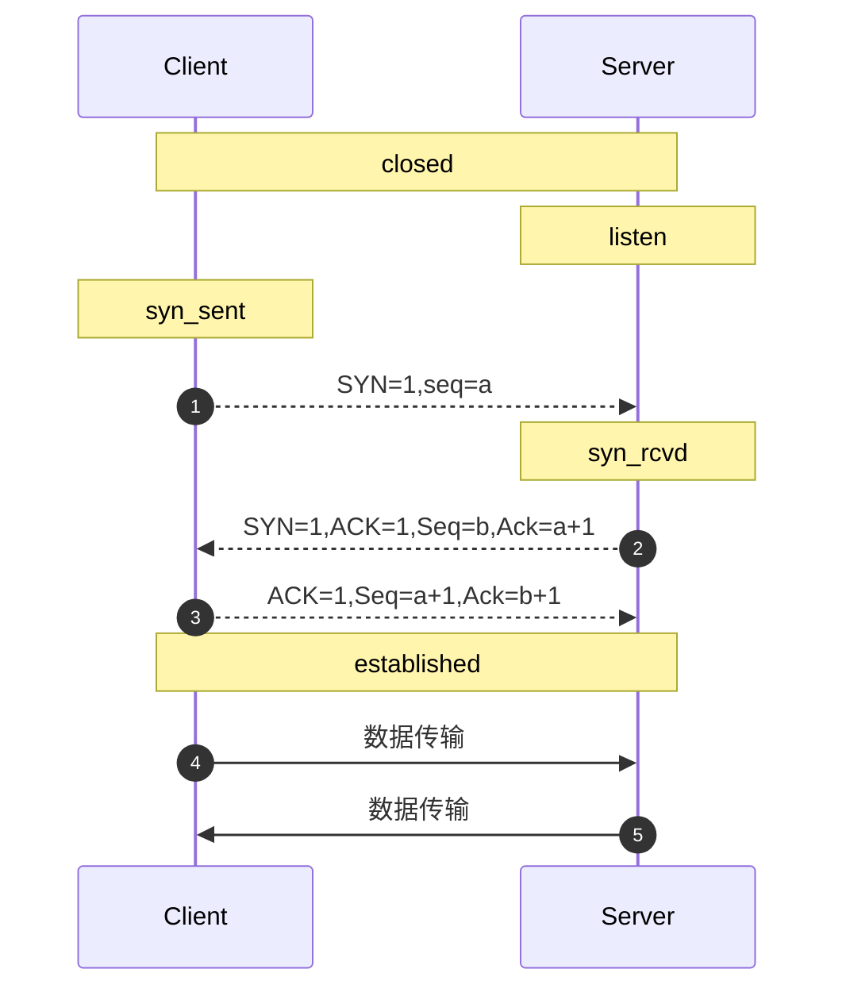

# 操作系统(OS/Operating System)
>  基本信息
    作者： Joshua Conero
    日期： 2017年6月20日 星期二

 

# <span id="menu_windows">Windows</span> 1985
- 创始人: Bill Gates
- Microsoft-DOS -> windows
- 特征
    - 图形化模式 GUI
    - 内核： Windows NT kernel (ntoskrnl.exe)


windows 普及较广版本发布年月

    2001年10月25日  Windows XP
    2009年10月22日  Windows 7.0
    2012年10月26日  Windows 8.0
    2015年7月29日   Windows 10.0
    2021年10月5日   Windows 11.0, win10后继版本


> *项目文档*

- *[官方文档](https://docs.microsoft.com/zh-cn/windows/)*
- [参考文档](https://msdn.microsoft.com/zh-cn/library/)


**UAC**  用户账号控制。


## 注册表 

>  _**Registry**_

- `regedit`       *注册表（register edit）*
- `reg`               *windows 自带的注册表编辑器*


*是Microsoft Windows中的一个重要的数据库，用于存储系统和应用程序的设置信息*

*HKEY_CLASSES_ROOT和HKEY_CURRENT_CONFIG中存放的信息都是HKEY_LOCAL_MACHINE中存放的信息的一部分，而HKEY_CURRENT_USER中存放的信息只是HKEY_USERS存放的信息的一部分*


> 集合包含关系

- HKEY_LOCAL_MACHINE
  - HKEY_CLASSES_ROOT
  - HKEY_CURRENT_CONFIG
- HKEY_USERS
  - HKEY_CURRENT_USER


> **根键的作用** 

- HKEY_USERS
  - *保存了存放在本地计算机口令列表中的用户标识和密码列表,每个用户的预配置信息都存储在HKEY_USERS根键中。HKEY_USERS是远程计算机中访问的根键之一*
- HKEY_CURRENT_USER 
  - *当前登录的用户信息*
- HKEY_CURRENT_CONFIG 
  - *前用户桌面配置(如显示器等)的数据,最后使用的文档列表（MRU）和其他有关当前用户的Windows 98中文版的安装的信息*
- HKEY_CLASSES_ROOT
  - *其文件类型的名称*
  - *存储Windows可识别的文件类型的详细列表，以及相关联的程序。*
- HKEY_LOCAL_MACHINE 
  - *本地计算机硬件数据*


> \HKEY_CURRENT_USER\Software\Microsoft\Windows\CurrentVersion\Explorer\FileExts

更改文件后缀名的默认软件打开方式


> *注册表类型分类*

- `REG_SZ`    *字符串文本*
- *`REG_BINARY`*   *二进制文本*
- `REG_MULTI_SZ`    *多字符串值：含有多个文本值的字符串*
- `REG_DWORD`     *双字值；一个32位的二进制值，显示为8位的十六进制值。*


*URL Protocol： 使用`URL`地址打开应用如：`tencent://`。如在web浏览器中使用 URL 协议打开应用: ` window.open("tencent://message/?uin=346915968")`*


## 应用自动启动

> 查看方式 1

- *`设置>应用>启动`*  可查看/设置启动的应用


## windows 快捷键

> win+

| 快捷键            | 助记                      | 说明                         |
| ----------------- | ------------------------- | ---------------------------- |
| win               | windows                   | 打开或关闭“开始”屏幕         |
| win+A             | windows Action            | 打开操作中心                 |
| win+B             | windows Blur Notification | 将焦点设置到通知区域         |
| win+D             | windows Display           | 显示和隐藏桌面               |
| win+Alt+D         | windows display date      | 显示和隐藏桌面上的日期和时间 |
| win+E             | windows Explorer          | 打开文件资源管理器           |
| win+I             | windows Items             | 打开“设置”                   |
| win+K             |                           | 打开“连接”快速操作(蓝牙)     |
| win+L             | windows Lock              | 锁定你的电脑或切换帐户       |
| win+M/win+Shift+M |                           | 最小化所有窗口(和 win+D 像)  |
| win+P             | windows Play              | 选择演示显示模式             |
| win+R             | windows Run               | 打开“运行”对话框             |
| win+S             | windows Search            | 打开搜索                     |
| win+T             | windows Tabbar            | 循环浏览任务栏上的应用       |
| win+X             |                           | 打开“快速链接”菜单           |
| win+,(逗号)       |                           | 临时速览桌面                 |
| win+Tab           |                           | 打开任务视图                 |
| Fn+ESC            | function esc              | fn 功能键切换                |
| win+V             | windows clipboard record  | 剪切板记录                   |


> 其他

| 快捷键            | 助记                      | 说明                         |
| ---- | ---- | ---- |
| *__复制、粘贴及其他常规的键盘快捷方式__* |      |      |
| Ctrl+C/ Ctrl+Insert | Copy | 复制选定文本 |
| Ctrl+V/ Shift+Insert | Paste | 粘贴选定文本 |
| Ctrl+X | Cut | 剪切选定项 |
| Ctrl+Z | Undo | 撤消操作 |
| Alt + Tab | | 在打开的应用之间切换 |
| Ctrl + A | All | 选择文档或窗口中的所有项目 |
| Ctrl + D（或删除键） | Delete | 删除所选的项目，将其移至回收站 |
| Ctrl + R（或 F5） | Refresh | 刷新活动窗口 |
| Ctrl + Y | Redo | 恢复操作 |
| Ctrl + Shift（及箭头键） | | 选择文本块 |
|  | |  |
| *__文件资源管理器键盘快捷方式__* | |  |
| Alt+D | | 选中地址栏 |
| Ctrl+F/Ctrl+E | Find | 选择搜索框 |
| Ctrl+N | New | 打开新窗口 |
| Ctrl+W | | 关闭活动窗口 |
| Ctrl+Shift+N | | 创建新文件夹 |
| Alt + P |  | 显示预览面板 |
| Alt + Enter | | 打开选定项目的“属性”对话框 |


**文件/目录复制地址方法**

```powershell
# 选择【复制为路劲(A)】
shift+右键
```


## windows命令行程序

*Windows 命令工具有 `cmd.exe`、`powershell(ps)` 等，其可通过外壳程序调用系统内核相关的程序。*

也即是bat 脚本，批处理（batch）。

- cmd
- pwsh


程序调用命令行，并执行：

```shell
# cmd 执行命令与 ($cmd)
cmd /c $cmd


# 启动 pwsh 并执行命令
pwsh -c $cmd
# 执行 ps1 脚本
pwsh -f "$file.ps1"
```


cmd 置于目录`C:\Windows\System32`下。


### CMD

**基本语法：**

大小写不敏感，扩展名为“.bat”或“.cmd”

*使用 powershell 的语法来介绍 `cmd.exe`*

```powershell
help 显示当前系统的帮助信息
command /?   查看帮助信息

# 注释行
::这是一个注释。
@echo off的意思是此命令后的命令在执行的时候，不显示命令本身。


#变量
set var=32
# 输出变量
echo %var%
echo 贵   阳
# 输出环境变量/系统参数
echo %Path%
echo %AppData%
#设置当前的环境变量（附加），当前环境下
set PATH=%PATH%;d:\xxx

#路劲
# %~dp0 d 表 driver 的缩写，几位驱动、磁盘的缩写。p 为path缩写表路径、目录
cd %~dp0   # 进入批处理所在目录
cd %~dp0runtime\  # 进入所在目录的下的 runtime 目录


Pause  # 暂停执行
```

常见命令：

- `echo [mesage]`           输出数据内容
- `@[command]`                 不显示命令（command）
- `goto [label]`              跳转到（标签处）
- pause                              按任意键结束
- call                                  批处理调用batch脚本
- start                                启动一个单独的窗口以运行指定的程序或命令
- if/for                                条件或循环


```shell
# 使用，shell 高亮演示 bat 语法。
goto start

# start 标签
:start

# 在 cmd 下输出，寻求帮助
help
# [cmd] /? 查看命令的帮助信息
find /?
```


常见的系统参数：环境变量、系统常量等，如下变量在cmd环境可通过`echo %$%` 访问。

- SystemRoot                    系统root目录,跟目录
- ProgramFiles                  应用所在目录
- UserProfile                     当前用户的系统目录（用户目录）
- AppData                         当前应用数据目录
- Temp或Tmp                  系统临时文件
- Path                                环境变量
- PathExt                          环境变量可执行文件（“默认后缀”）
- AllUsersProfile              所有用户的配置信息
- ComputerName           系统名称
- Date                               当前的时间
- number_of_processors     处理器数量
- processor_architecture     处理架构
- processor_identifier          处理器说明信息
- processor_revision            处理器型号
- random                               获取随机数[1-32767]
- UserDomain                       用户域名称
- UserName                          用户名称


如通过bat脚本设置composer全局安装

```shell
# 即输入，composer即可运行到此脚本
@php "/path/composer.phar" %*

# "%*"   表示所有参数（%1..%9）
```


## 系统


### WinRT

Windows 运行时（Runtime）。

C++/WinRT 是 Windows 运行时 (WinRT) API 的完全标准新式 C++17 语言投影，以基于标头文件的库的形式实现，旨在为你提供对新式 Windows API 的一流访问。 


### 菜单及命令行

Windows 菜单路径地址：`C:\ProgramData\Microsoft\Windows\Start Menu`


使用 fd 工具搜索并打开文件，但搜索框无法工作时：

```powershell
fd -i -g '*xshell*' C:\ProgramData\

# 打开快捷键
&"C:\ProgramData\Microsoft\Windows\Start Menu\Programs\Xshell 8\Xshell.lnk"
```


### 控制面板(contrl.exe)

使用 `win+R` 输入 contrl 并执行，即打开（搜索无法打开时）。

control.exe 控制面板所在目录 `C:\Windows\System32\control.exe`

控制面板启动程序有：


- 使用控制面板启动应用，格式如：`control.exe /name <className>`    
    - `microsoft.folderoptions`		            启动资源管理器的 文件夹属性 选项卡
    - `Microsoft.AddHardware`			        控制面板\所有控制面板项\设备和打印机
    - `Microsoft.AdministrativeTools`		    控制面板\所有控制面板项\管理工具
    - `Microsoft.PeopleNearMe`		            网络邻居
    - `Microsoft.AudioDevicesAndSoundThemes`	声音
    - `Microsoft.AutoPlay`			            控制面板\所有控制面板项\自动播放
    - `Microsoft.Personalization`		        控制面板\所有控制面板项\个性化
    - `Microsoft.BackupAndRestoreCenter`	    控制面板\所有控制面板项\备份和还原
    - `Microsoft.PhoneAndModemOptions`	        设置电话和调制调解器的连接向导：位置信息
    - `Microsoft.BitLockerDriveEncryption`	    控制面板\所有控制面板项\BitLocker 驱动器加密
    - `Microsoft.Printers`			            控制面板\所有控制面板项\设备和打印机
    - `Microsoft.ColorManagement`		        颜色管理
    - `Microsoft.ProgramsAndFeatures`		    控制面板\所有控制面板项\程序和功能：添加/删除程序
    - `Microsoft.DateAndTime`			        日期和时间
    - `Microsoft.DefaultPrograms`		        控制面板\所有控制面板项\默认程序
    - `Microsoft.DeviceManager`		            设备管理器
    - `Microsoft.SecurityCenter`		        安全中心：控制面板\所有控制面板项\操作中心
    - `Microsoft.SyncCenter`			        控制面板\所有控制面板项\同步中心
    - `Microsoft.Fonts`			                控制面板\所有控制面板项\字体
    - `Microsoft.System`			            控制面板\所有控制面板项\系统：查看Windows版本等
    - `Microsoft.GameControllers`		        游戏控制器
    - `Microsoft.GetPrograms`			        控制面板\程序\获得程序
    - `Microsoft.TaskbarAndStartMenu`		    任务栏和“开始”菜单属性
    - `Microsoft.UserAccounts`		            控制面板\所有控制面板项\用户帐户
    - `Microsoft.WelcomeCenter`		            控制面板\所有控制面板项\入门
    - `Microsoft.iSCSIInitiator`		        iSCSI 发起程序 属性
    - `Microsoft.WindowsDefender`		        启动Windows Defender
    - `Microsoft.Keyboard`			            启动 键盘 属性 对话框
    - `Microsoft.WindowsFirewall`		        控制面板\所有控制面板项\Windows 防火墙
    - `Microsoft.MobilityCenter`		        Windows 移动中心
    - `Microsoft.Mouse`			                鼠标 属性
    - `Microsoft.NetworkAndSharingCenter`	    控制面板\所有控制面板项\网络和共享中心
    - `Microsoft.WindowsUpdate`		            控制面板\所有控制面板项\Windows Update
    - `Microsoft.OfflineFiles`		            脱机文件
    - `Microsoft.ParentalControls`		        控制面板\所有控制面板项\家长控制
- `.msc` 嵌入式管理单元文件（Microsoft Snap-In Control），微软管理控制台MMC(Microsoft Management Console)用来添加/删除的嵌入式管理单元文件，通常通过MMC来管理。
    - compmgmt.msc	计算机管理
    - devmgmt.msc	设备管理器
    - diskmgmt.msc	磁盘管理实用程序(可以进行有损分区)
    - wmimgmt.msc	打开windows管理体系结构(WMI)：Wmimgmt-[控制台根节点\WMI控件(本地)]
    - certmgr.msc	证书管理实用程序
    - secpol.msc	本地安全策略
    - services.msc	本地服务设置（系统服务管理）
    - gpedit.msc	组策略（Home Basic受限）
    - lusrmgr.msc	本地用户和组(本地)
    - perfmon.msc	计算机性能监测程序
    - fsmgmt.msc	共享文件夹管理器
    - rsop.msc	组策略结果集
- `.cpl` CPL文件(Control Panel Item)
    - sysdm.cpl	系统属性：类似WinXP等右击“我的电脑”后选择的“属性”
    - telephon.cpl	设置电话和调制调解器的连接向导：位置信息
    - wscui.cpl	安全中心：控制面板\所有控制面板项\操作中心
    - timedate.cpl	时间/日期 属性
    - appwiz.cpl	控制面板\所有控制面板项\程序和功能：安装、反安装程序 添加/删除程序
    - inetcpl.cpl	Internet属性
    - intl.cpl	区域和语言选项（输入法选项）：控制属性：常规文字种类、数字、货币、时间、日期、输入法区域设置
    - joy.cpl		游戏选项
    - mmsys.cpl	声音和音频设备：声音/多媒体属性
    - ncpa.cpl	控制面板\所有控制面板项\网络连接
    - powercfg.cpl	控制面板\所有控制面板项\电源选项
    - desk.cpl	控制面板\所有控制面板项\显示\屏幕分辨率
    - main.cpl	鼠标选项
    - firewall.cpl	WINDOWS防火墙：控制面板\所有控制面板项\Windows 防火墙
    - odbccp32.cpl	ODBC数据源管理器
- 其他
    - winver		检查Windows版本
    - wiaacmgr	扫描仪和照相机向导
    - cmd		CMD命令提示符
    - command		CMD命令提示符
    - nslookup	IP地址侦测器
    - osk		打开屏幕键盘
    - calc		启动计算器
    - charmap		启动字符映射表
    - cliconfg	SQLSERVER客户端网络实用程序
    - control		打开控制面板：控制面板\所有控制面板项
    - msconfig	系统配置实用程序
    - mplayer2	简易widnows media player 媒体播放机
    - mspaint		画图板
    - shutdown	关机命令（详细请在cmd中输入shutdown/?）
    - mobsync		控制面板\所有控制面板项\同步中心
    - dxdiag		检查directx信息，还可以查看系统基本配置信息
    - dcomcnfg	打开系统组件服务
    - sysedit		系统配置编辑器
    - sigverif	文件签名验证程序
    - SoundRecorder	系统自带录音机
    - SnippingTool	系统自带截图工具
    - odbcad32	ODBC数据源管理器
    - syskey		系统加密，一旦加密就不能解开，保护windows 7系统的双重密码
    - sfc.exe		系统文件检查器，需要管理员权限启动cmd，并在命令行中输入命令及参数扫描所有受保护的系统文件的完整性，并用正确的 Microsoft 版本替换不正确的版本。
    - cleanmgr	垃圾整理（磁盘清理）
    - dvdplay		DVD播放器(Windows Media Player)
    - eventvwr	一个事情查看器
    - eudcedit	造字程序：专用字符编辑程序
    - explorer	打开资源管理器
    - shrpubw		共享文件夹设置工具：创建共享文件向导
    - mmc		打开控制台
    - iexpress	系统自带安装程序制作工具
    - logoff		注销命令
    - mem.exe		显示内存使用情况(先要运行cmd，进入DOS命令窗口)
    - migwiz		文件转移向导
    - mstsc		远程桌面连接
    - magnify		放大镜实用程序
    - notepad		打开记事本
    - wordpad		写字板
    - write.exe		写字板
    - wuapp		控制面板\所有控制面板项\Windows Update
    - regedit		注册表编辑器
    - regedt32	注册表编辑器
    - narrator	屏幕“讲述人”
    - regsvr32	调用、卸载DLL文件运行（详细请在cmd中输入regsvr32/?）
    - taskmgr		任务管理器
    - wscript 	windows脚本宿主设置


```powershell
# 查看所在路径/windows
where.exe control
# powershell 使用 get-command
(get-command php80).Path
# linux 使用 whereis 查看
whereis pythons

# 使用 control 启动设备管理
control.exe /name Microsoft.DeviceManager

# regsvr32 用于重新安装dll
regsvr32 /i shell32.dll
```


### 快速路径

- 事件查看器：*用于查看系统级别的日志*


### 主要配置/命令

用户命令查看

```shell
# 显示当前用户的信息以及安全标识符 (SID)。
whoami /user
```


#### ipconfig

```powershell
# 清除 DNS 解析程序缓存。
ipconfig /flushdns
```


##### dns

*domain name system*， 它作为将域名和IP地址相互映射的一个分布式数据库，能够使人更方便地访问互联网。DNS使用UDP端口53。当前，对于每一级域名长度的限制是63个字符，域名总长度则不能超过253个字符。


#### 网络

- netstat     网络状态查看
- route      路由信息查看
- ping        网络测试
- nslookup     (name server lookup)  网络域名查询


```shell
# 查询对应域名的 dns 情况
nslookup cn.vitejs.dev

nslookup -qt=ns cn.vitejs.dev

# 反向查询
nslookup -ty=ptr 8.8.8.8

#通过ipconfig 查询当前计算机已缓存的DNS
ipconfig /displaydns

# powershell
Get-DnsClientCache
```


ping

```shell
# 不间断地发送数据测试包
ping -t www.bigdata-expo.cn

#ping-a 解析计算机名与 NetBios 名。就是可以通过 ping 它的 ip 地址，可以解析出主机名。
ping -a www.bigdata-expo.cn

# 指定 ping 发包次数
ping -n 10 baidu.com

# -l 配置发起 ping 的数据包大小
# [32byt, 65500byt] => [0.03125KB, 63.964KB]
ping -l 1024 baidu.com
```


##### netstat

网络状态查看。提供TCP连接，TCP和UDP监听，进程内存管理的相关报告。netstat命令的功能是显示网络连接、路由表和网络接口信息，可以让用户得知有哪些网络连接正在运作。

状态：established(tcp 三次握手完成), time_wait(等待响应时间), close_wait(等待关闭链接), fin_wait_1, fin_wait_2, syn_sent(请求链接-三次握手第一次链接请求), closed(链接关闭)，listen(作为服务器启动监听), syn-recevied (三次握手确认链接)

```powershell
# 查看本机所有端口号使用情况，包括 pid
netstat -ano

# 查看指定的端口号，9108 为端口号
netstat -ano|findstr 9108

# 通过 tasklist 查看，pid 对应的进行
tasklist|findstr "2016"

#杀死进程
taskkill /T /F /PID 9088 
```


linux 系统上运行。当发现监听地址为“`127.0.0.1`” 时外网可能无法访问，需转换为“`0.0.0.0`”。

```bash
# 查看 8023 端口的访问情况
netstat -tunlp | grep 8023

# 查看 9002 端口的访问情况
netstat -anp | grep 9002
```


参照tcp协议过程：




##### 防火墙

```powershell
# 允许外部（路由器）访问本地的 7423
New-NetFirewallRule -DisplayName "Allow Inbound TCP Port 7423" -Direction Inbound -Action Allow -Protocol TCP -LocalPort 7423


# 根据名字删除防火墙
Remove-NetFirewallRule -DisplayName "Allow Inbound TCP Port 7423"
```


### 硬件

```powershell
# 1) 使用 getmac 命令获取地址
# 数据本地 mac 地址
getmac

# 指定输出模式
getmac /fo csv

# 输出详细地址
getmac -v

# 2) 使用 ipconfig 查看
ipconfig /all
```


#### bcdboost

用于在电脑或设备上配置启动文件以运行 [Windows 操作系统](https://learn.microsoft.com/zh-cn/windows-hardware/manufacture/desktop/bcdboot-command-line-options-techref-di?view=windows-11)。[异常解决](https://blog.csdn.net/weixin_38705903/article/details/116617385)参考如下：

```shell
# windows 重启后出现“选择一个选项”修复界面
bcdboot c:\windows /l zh-cn
```


#### 存储

- 移动磁盘
- U盘


文件系统

- NTFS
- FAT32
- exFAT


##### 磁盘

开启方式

- `win+X`，选择**磁盘管理**。即进入管理界面。
- 在桌面选择**此电脑**，选择**管理**，再选中“**存储/磁盘管理**”。


文件扫描


## wsl

> Windows Subsystem for Linux(wsl)，windows liunx子系统。

```shell
# 查查看系统 wsl子系统列表
wsl --list --verbose
# 简写
wsl -l -v

# 升级 wsl1 --> wsl2, 其中 Ubuntu-20.04为实例名称
# wsl --set-version <distro name> 2
wsl --set-version Ubuntu-20.04 2
# 可能需呀执行ps -> 
#         dism.exe /online /enable-feature /featurename:VirtualMachinePlatform /all /norestart
# 设置 wsl默认为2版本
wsl --set-default-version 2

# 关闭 wsl 系统
wsl --shutdown

# 导出 wsl 系统到指定目录
wsl --export openEuler-22.03 D:/WSL/openEuler-22.03.tar

# 卸载 - openEuler-22.03
wsl --unregister openEuler-22.03

# 导入已导出 wsl 包
wsl --import openEuler-22.03 D:\WSL\openEuler-22.03 D:\WSL\openEuler-22.03.tar --version 2
# 已安装的 wsl 路径目录。虚拟文件系统路径
# ~/ext4.vhdx
```


登录linux服务器（指定），podman及 pod manage 缩写，

```shell
# 如登录 podman 指定的 linux
wsl -d podman-machine-default
```


wsl2 访问其文件系统：`\\wsl$`。wsl2 内部映射ip地址执行 `grep -m 1 nameserver /etc/resolv.conf | awk '{print $2}'`.

windows 访问 WSL 的目录使用： `/mnt/` 作为前置，如请问 `D:` 盘  ，使用 `/mnt/d`。


服务查看WSL的内部网络地址，windows 系统使用该地址即可。如：

```shell
# 查看wsl内部的服务
ip addr | grep eth0
```


windows 服务对应的地址。如：

```powershell
#查看，以太网适配器 vEthernet (WSL) 项地址:
ipconfig
```


windows 局域网访问windows内部的WSL。

```powershell
# 配置局域网7423到WSL的80映射，及       ip:7423  -> 172.27.57.98:80(WSL)
netsh interface portproxy add v4tov4 listenport=7423 connectaddress=172.27.57.98 connectport=80

# 查看端口映射列表
netsh interface portproxy show v4tov4
# 删除映射
netsh interface portproxy delete v4tov4 listenport=7423
```


### wsl-Ubuntu

> Ubuntu子系统


启动 ssh 服务

```shell
# 启动服务
sudo service ssh start
# 提示错误信息：sshd: no hostkeys available -- exiting 时，生成对应的秘钥即可
sudo ssh-keygen -A

# 调用地址非 127.0.0.1, 可根据 ifconfig 查看项：[eth0]
```


# wmic

WMI   为 *Windows Management Instrumentation (WMI)* 的缩写。Windows管理规范 (WMI) 使用通用信息模型 (CIM) 来表示新式企业的系统、应用程序、网络、设备和其他可管理组件。

WMI command-line (WMIC)，即 WMI 命令行工具。其在 Win10/21H1已遗弃，可使用 powershell 替代。 

```shell
# 获取 bios 的 SN 码（序列号）
wmic bios get serialnumber

# powershell 版本（查询SQL）
Get-CimInstance -Query 'Select * from Win32_BIOS'

# 获取硬盘序列号
wmic diskdrive get serialnumber
wmic path win32_physicalmedia get SerialNumber
wmic path Win32_DiskDrive get SerialNumber

# 获取硬盘其他信息
wmic diskdrive get Name, Manufacturer, Model, InterfaceType, MediaType, SerialNumber
```

注：

- BIOS             *Basic Input Output System*,基本输入输出系统。
